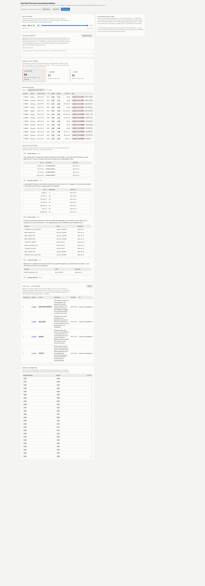
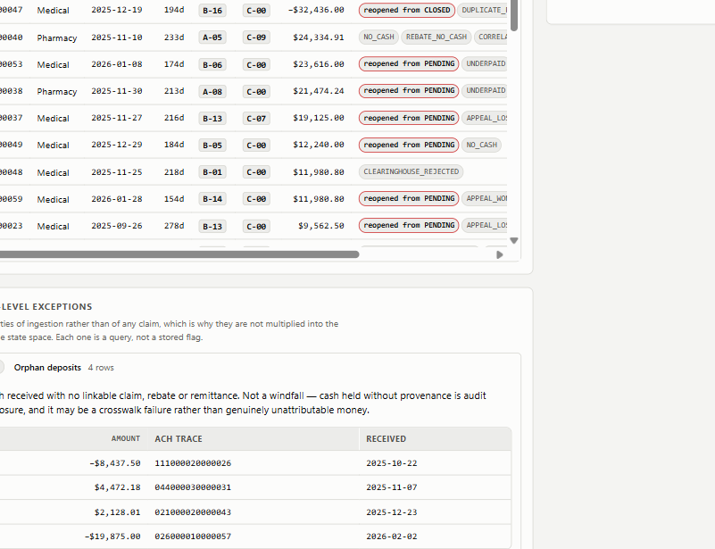
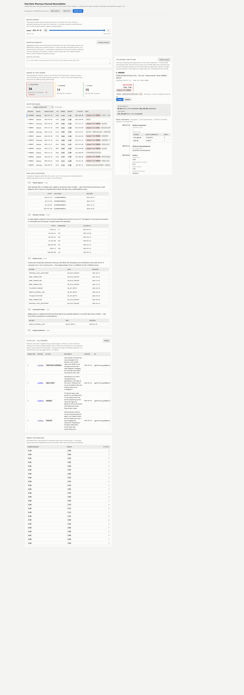
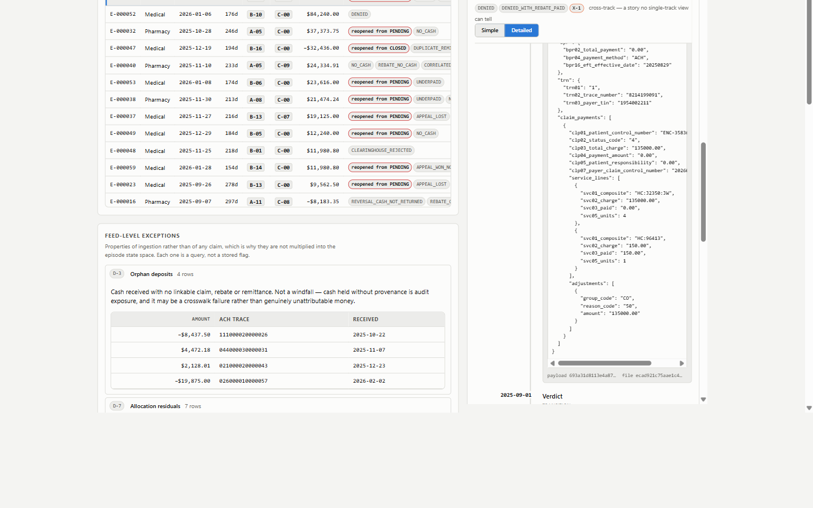
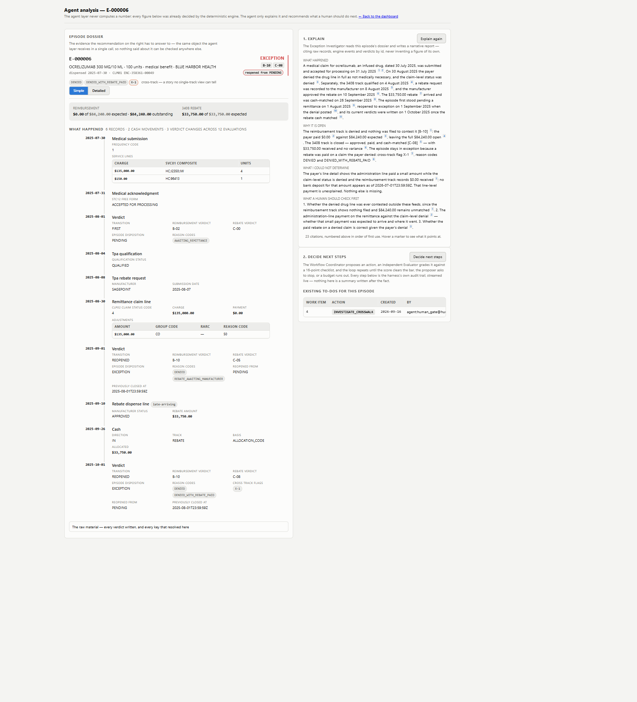
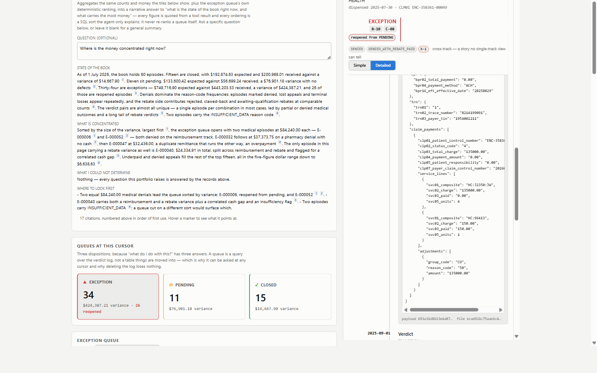
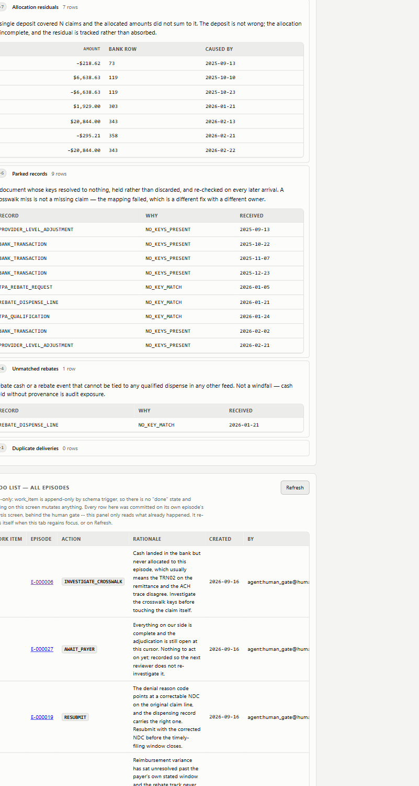

# Demo Script

The pitch, the running order, the exact thing to click, and what each click proves. `DESIGN_NOTE.md` is the document you hand them; this is the thing you hold while you talk.

Every screenshot below is the real app on the committed demo dataset: **profile `demo`, seed `20250701`, 60 episodes — 34 EXCEPTION, 15 CLOSED, 11 PENDING.** The episode IDs in the cheat sheet are real rows.

---

## 0. The pitch, in three sentences

> A specialty pharmacy files a claim, and then money moves — or doesn't — down three independent pathways at once: the PBM, the medical payer, and a 340B manufacturer rebate. None of the four source feeds share a claim identifier, so the hard part is not the arithmetic, it's the joins. This system ingests all four, crosswalks them back into one episode, reconciles deterministically in Python, and puts an LLM on top that is structurally incapable of computing a number — it explains figures the engine already wrote, and recommends what a human should do.

If you only get one line: **every number is born in Python; the model only explains numbers it was handed.**

---

## 1. Pre-flight — before the call, not on the clock

### 1.1 Fix the agent models. Highest-value single action.

`.env` currently overrides all three roles to the thinking model:

```
RECON_AGENT_PROPOSER_MODEL=deepseek-v4-pro
RECON_AGENT_EVALUATOR_MODEL=deepseek-v4-pro
RECON_AGENT_INVESTIGATOR_MODEL=deepseek-v4-pro
```

Measured from the journals in `data/agent_runs/` under exactly that config:

| Role                   | Model               | Wall clock | Outcome                                                           |
| ---------------------- | ------------------- | ---------- | ----------------------------------------------------------------- |
| Portfolio Analyst      | `deepseek-chat`   | 7s, 8s     | fine                                                              |
| Exception Investigator | `deepseek-v4-pro` | 154s, 176s | fine, but ~3 minutes                                              |
| Workflow Coordinator   | `deepseek-v4-pro` | 614s, 836s | **both failed** — `evaluator_unavailable`, `llm_error` |

A ten-minute Decide that then fails is not a demo. Those three lines were added on a day the provider's fast tier was down. **Delete them** — the code defaults to `deepseek-chat` for all three — then confirm the fast tier answers:

```bash
python scripts/agent_smoke.py --episode E-000006 --role investigator
```

No `--record`. If that returns in under a minute the live demo is safe. If it hangs, switch to the fallback in §6 and say so on the call. "The provider's fast tier is down today, so I'll show you the recorded run instead" is a fine sentence and reviewers respect it.

### 1.2 Start both servers

```bash
uvicorn recon.api.app:create_app --factory --port 8000
cd web && npm run dev
```

`--factory` is mandatory; the default invocation fails outright. Read the port Vite prints rather than assuming 5173 — it falls back if the port is taken.

`data/recon_demo.sqlite` already exists on seed `20250701`. **Do not regenerate.** If you ever must, pass no `seed` parameter, which replays the published seed and keeps every episode ID below valid.

### 1.3 Two tabs, and pre-warm the agent

**Tab A** is the dashboard — check the masthead reads `Profile demo, seed 20250701`. **Tab B** is `/analyse/E-000006` — click **Explain** and let it finish *before the call starts*. The result lives in component state, so it stays on screen as long as you don't reload the tab.

That pre-warm is what buys you the five minutes. You still run **Decide** live, because the streamed propose → evaluate → score log is the single most persuasive thing in the build.

### 1.4 Landmines

**Never press "Rebuild demo" or "Rebuild full" during the demo.** Both mint a fresh seed on purpose. Your episode IDs die instantly and the queue mix changes. "Repeat seed" is the safe one — it replays the seed in the masthead byte for byte, which is the reproducibility proof.

**Decide stays disabled until Explain has run** on that episode. It will say "Run Explain first."

---

## 2. The five-minute run

### 0:00–0:30 — The masthead



Read the sub-line out loud. **"Every figure on this screen was computed in Python and is shown verbatim — nothing on this screen calculates."** Profile, seed and engine version are all on screen, so the run is identifiable and reproducible.

### 0:30–1:15 — The replay cursor

Drag it back a few months, then forward again. Watch the tiles and the queue repopulate.

**Say:** the cursor lives at *read time* — `process(records where received_at <= cursor)`. Backwards and forwards are the same code path, so "what did we believe on 31 March?" is a parameter, not a feature. `received_at` is the only field the pipeline adds to any record; every other date is native to its format and points backward.

### 1:15–2:00 — The queues



Land on **EXCEPTION** (34 of 60). Change the sort to "Largest variance first."

**Say:** three dispositions, because "what do I do with this?" has three answers — nothing, wait, work it. There is no queue table in the schema; a queue is a `SELECT` over the latest verdict per episode, and the sort is a closed whitelist on the server rather than a free-form `ORDER BY`. Aging is computed at read time and never stored, which is what makes "a verdict cannot change without a new inbound record" true by construction.

### 2:00–3:00 — The hero episode



Click **E-000006** and walk the dossier on the right.

**Say:** `B-10 DENIED` on the medical track, `C-08` on the rebate track, reasons `DENIED` plus `DENIED_WITH_REBATE_PAID`, and **$84,240.00** of variance. The payer denied the claim — and the manufacturer paid the 340B rebate anyway. Two counterparties, two independent verdicts, and a cross-track compliance flag that only exists because the tracks are modelled separately. Your net position on that dispense is negative: you are holding money you may owe back on a claim that paid you nothing. A single-track system cannot represent this at all.

Episode status is worst-wins, so the track that needs a human is the one that surfaces.

If they want the lineage, switch the timeline to **Detailed** and expand a source link:



**Say:** that's the verbatim source line with both SHA-256 hashes — the record's own, and the file it came from. Every number traces back to an immutable row by one join, because lineage runs downward on purpose.

### 3:00–3:15 — Hand off to the agent

Click **Inspect using AI**, switch to Tab B.

**Say:** the agent gets the *same dossier object* the screen just showed. One call, no privileged access, nothing the UI can't also see.

### 3:15–3:45 — Explain



Scroll the pre-warmed output. Hover a citation marker.

**Say:** four fixed sections — what happened, why it's open, **what I could not determine**, and what a human should check first. Every figure in that prose was scanned in Python against what the tools actually returned; an unsourced figure gets one repair turn and then ships in a separate `unsourced_figures` block rather than silently inside the answer. The citation markers resolve to real record and verdict IDs.

### 3:45–4:40 — Decide, live

Click **Decide next steps** and talk over the streaming log. This is the part worth the airtime.


**Say, while it streams:** two agents, not one. The Proposer proposes an action; the Evaluator grades it on a fresh trace and **never sees the proposer's reasoning** — the field does not exist on the object it receives, so it's unrepresentable rather than filtered. Self-critique is measured to *degrade* results; external verification improves them.

The Evaluator emits no score. It returns `SUPPORTED` / `CONTRADICTED` / `NOT_ADDRESSED` per criterion and **Python** computes `score = 100 × gate × earned/possible`. A model asked for a number invents a defensible-looking one.

Open "Full checklist" to show the sixteen criteria. Point at the outcome banner: four outcomes, never a boolean — `complete`, `insufficient_data`, `stalled`, `capped`.

**If you see green chips above a score of 0.000, that is not a bug — say so before they ask.** The four vetoes are Python and never appear in the evaluator's reply. One of them fired and zeroed the gate. They multiply rather than subtract, because a fabricated figure is not a slightly worse proposal — it is one that must not reach a human.

### 4:40–5:00 — The human gate


Edit the summary field, then press **Add to-do**.

**Say:** the write path is a human gate, not an agent capability. The write tool is never in any model's tool list — role tool lists are built by *removing* it, so there is no prompt that reaches it. The button cannot be pressed without the evidence on screen, every field is editable because approve/reject is rubber-stamping rather than review, and commit takes a two-call dry-run plus a write token that binds to the exact draft you just read. `work_item` is append-only, and `created_by` records you, not the model. Override rate is a metric, not a defect.

**Closing line if you have five seconds:** "585 tests, no API key and no network — the eval set replays committed traces offline. Four boundaries, each held by a test rather than a convention: ingest never interprets, the engine only appends, the API only projects, and an AST-walking test fails the build if any function other than the single write tool so much as names an SQL mutating verb."

---

## 3. If they give you fifteen minutes

Add these in this order of value.

**The netted recoupment — E-000014.** `A-13`, reasons `RECOUPMENT_UNTRACEABLE` plus `INSUFFICIENT_DATA`, $6,536.77. The best trap in the dataset: a payer takes money back by paying *less in a later batch*, the explanation lives only in the 835's `PLB` segment, and the bank shows only the net. So `sum(claim payments) − PLB = what hits the bank`. This is the one that proves you read the actual formats rather than a summary of them.

**`INSUFFICIENT_DATA` as a first-class outcome — E-000040.** `A-05` plus `C-09`, with `CORRELATED_CASH_GAP` and `INSUFFICIENT_DATA`. Both tracks dry at once. The engine says "I deterministically cannot decide" rather than reporting variance against an expectation of zero — a false zero would render an unpriceable claim as perfectly clean. It hands the agent a deterministic "I don't know" instead of one it has to invent.

**The Portfolio Analyst** — third role, whole-book question, 7–8 seconds on the fast tier.



Ask it *"which reason code carries the most money in the exception queue right now?"* **Say:** it explains a SQL ordering that was already applied; it never re-ranks a queue. Prioritisation is a sort, not a judgement — `order_by` is a required argument restricted to whitelisted sorts, and the tool echoes the sort back so the trace records which one produced the order you're reading.

**Feed-level exceptions.**



**Say:** these are properties of *ingestion*, not of any claim — orphan deposits, allocation residuals, parked records, unmatched rebates, duplicate deliveries. Which is exactly why they are not multiplied into the episode state space. A crosswalk failure belongs to the feed, not to the claim it failed to reach.

**The crosswalk, if they push on the joins.**


**Say:** three separate identifier universes, three bridges, each with a documented failure mode. Anything that doesn't resolve parks and is re-checked backward on every later arrival. Two candidates park rather than guess, because picking one attributes real money to the wrong claim and then looks identical to a correct match in every report afterwards.

**The state space.**


**Say:** 12,093,235,200 unconstrained combinations reduce to 4,224 legal configurations, giving 372 reachable verdict pairs — all of them proved reachable by exhaustive enumeration. `decision_tree/pairs.json` is loaded as a live test oracle, so the coverage test fails if any pair goes unproduced. My own hand-enumeration had claimed 510 and was wrong in four ways that partially cancelled out. That's why the tree exists.

**"Repeat seed"** in the masthead, then diff the `feed_sha256` map in `manifest.json`. Reproducibility checked rather than asserted.

---

## 4. The sixty-second version, if they cut you short

> Four source systems, none of which share a claim identifier, get ingested and frozen. A crosswalk links their records back to the dispense they belong to across three bridges, each with a documented failure mode, and anything that can't be linked is parked and re-checked on every later arrival rather than dropped. A deterministic engine recomputes what was expected from contract terms, compares it to cash that was actually allocated, and assigns each of the two tracks a verdict — 31 reimbursement states, 12 rebate states, 372 reachable pairs. Those roll up worst-wins into three dispositions. Nothing is ever mutated: the queue is a query over a verdict log that rebuilds by replay, and the whole system replays to any point in time by moving one cursor. On top sit three agent roles reading nine tools, one of which writes, and that one is never given to a model.

---

## 5. Cheat sheet — seed `20250701`, profile `demo`

Valid only for this seed. If you press "Rebuild", re-derive this table before demoing again.

| Episode            | Verdicts            | Variance               | Why you'd open it                                                                                                                           |
| ------------------ | ------------------- | ---------------------- | ------------------------------------------------------------------------------------------------------------------------------------------- |
| **E-000006** | `B-10` / `C-08` | $84,240.00             | **The hero.** Claim denied, rebate paid anyway. Biggest money, cross-track compliance story, agent traces already recorded against it |
| **E-000014** | `A-13` / `C-00` | $6,536.77              | The netted recoupment.`RECOUPMENT_UNTRACEABLE` + `INSUFFICIENT_DATA`                                                                    |
| **E-000040** | `A-05` / `C-09` | $18,943.91 + $5,391.00 | Both tracks dry.`CORRELATED_CASH_GAP` + `INSUFFICIENT_DATA`. Cross-track rule X-5                                                       |
| **E-000020** | `A-07` / `C-00` | $603.14                | Plain`UNDERPAID`. The simplest possible exception if you want an easy opener                                                              |
| **E-000060** | `A-01` / `C-08` | $0.00                  | Rejected at the counter, rebate paid anyway —`REBATE_ON_UNDISPENSED_CLAIM`. Pure compliance, no money                                    |
| **E-000027** | `A-17` / `C-00` | −$6,638.63            | `DUPLICATE_PAYMENT`. Negative variance means they paid twice                                                                              |
| **E-000018** | `A-04` / `C-14` | −$6,219.00            | `DUPLICATE_REBATE` on the rebate track                                                                                                    |
| **E-000037** | `B-13` / `C-07` | $19,125.00             | `APPEAL_LOST` + `DENIED` + `REBATE_REJECTED` + `TOTAL_LOSS`. Worst case, four reasons at once                                       |
| **E-000003** | `A-02` / `C-01` | $24,964.55 + $6,948.00 | A healthy PENDING, if they ask what "not an exception" looks like                                                                           |

---

## 6. Fallbacks, in the order you'd reach for them

**Agent slow but alive** — keep talking over the streamed Decide log. The log *is* the content: every line is a real journalled event (`llm_request`, `tool_call`, `tool_result`), and the screen is literally rendering the run journal as it's written.

**Agent dead, 503, provider down** — the dashboard is unaffected and degrades on purpose: `/api/agent/*` returns a 503 naming exactly what's missing, rendered as an ordinary informational state rather than an error. Show that, then run the eval set offline:

```bash
python -m pytest tests/test_agents_evals.py -q
```

Ten scenarios graded on tool path and outcome shape, replaying committed fixtures through `ReplayClient`, which matches every request by exact digest. One of the ten is a **deliberate failure case** — a G3 veto, written up with its production-hardening recommendation in `docs/eval_g3_veto_failure_case.md`. Showing a failure you understand beats showing ten passes.

**Everything on fire** — `python -m pytest tests/ -q` (585 passed, ~80s) and walk `DESIGN_NOTE.md` §3 and §6 straight from the diagrams. They're in this file too, so you can present from here without the app running at all.

---

## 7. Questions they will ask, and the one-line answer

| Question                                           | Answer                                                                                                                                                                                                                                                                                                                                                      |
| -------------------------------------------------- | ----------------------------------------------------------------------------------------------------------------------------------------------------------------------------------------------------------------------------------------------------------------------------------------------------------------------------------------------------------- |
| "How do you join these without a shared ID?"       | You don't join — you bridge, three times, and each bridge has a named failure mode. Miss → park, re-check on every later arrival, never guess. Two candidates park rather than pick one                                                                                                                                                                   |
| "Why no identifier normalisation?"                 | Because the miss*is the product* — D-6 is a crosswalk-failure exception. A test asserts no `lstrip("0")` exists on the match path. Smoothing drift away is indistinguishable from getting it right, and only one of those is worth building                                                                                                            |
| "How do you stop the LLM hallucinating a number?"  | Three independent layers: it has no arithmetic tool,`calculate_reconciliation()` is a call into Python; every figure in generated prose is matched in Python against tool results; and G3 is a veto that zeroes the whole score                                                                                                                           |
| "Why no LangGraph or CrewAI?"                      | Four harnesses were checked, none ships an evaluator/scorer abstraction, so that loop is hand-written either way. A framework would add a dependency across exactly the tool boundary being graded. ~150 lines instead                                                                                                                                      |
| "Why two agents?"                                  | Self-critique is measured to degrade results; external verification improves them. The evaluator gets a fresh trace and the proposer's reasoning field does not exist on the object it receives                                                                                                                                                             |
| "Is the evaluator biased toward its own proposal?" | Potentially yes — proposer and evaluator currently share a model because a thinking-model evaluator averaged 466s per call against the proposer's 4.1s. Say so; it's item 6 on the what-I'd-build-next list. Don't claim independence you don't have                                                                                                       |
| "What about security?"                             | Built: untrusted-text fence with a per-run nonce, structural provenance check on tool arguments, fail-closed PHI redaction, append-only tables with`RAISE(ABORT)` triggers, parameterised SQL with a whitelisted `ORDER BY`. Not built and named honestly: no auth, no tenant isolation, no rate limiting — plus three known gaps in what *is* built |
| "Does it scale?"                                   | Event-driven, not scan-driven. An inbound document carries its own lookup keys and pulls only the episodes it touches, so a 200-day-old claim costs the same as this morning's. There's no time window to tune. A new TPA is an adapter plus config rows                                                                                                    |
| "What doesn't work?"                               | 5 of 1,354 full-profile episodes don't reproduce their intended verdict;`verdict_evidence` records what was *visible* at that cursor, not what *drove* the verdict; the SQLite file isn't byte-reproducible though the feed files are; no front-end tests                                                                                             |

---

## 8. Every asset in this deck

| Diagram             | File                                  | Use it for                                                    |
| ------------------- | ------------------------------------- | ------------------------------------------------------------- |
| System architecture | `docs/images/arch-system.png`       | The four boundaries, and where the LLM is and isn't allowed   |
| Two-track model     | `docs/images/domain-two-track.png`  | One dispense, pharmacy XOR medical, 340B on top               |
| Crosswalk bridges   | `docs/images/crosswalk-bridges.png` | Three identifier universes, three bridges, park on miss       |
| Engine pipeline     | `docs/images/engine-pipeline.png`   | Evidence → dimensions → verdict pair → disposition         |
| Agent loop          | `docs/images/agent-loop.png`        | Propose ⇄ evaluate, the wall, the four vetoes, four outcomes |
| Human gate          | `docs/images/human-gate.png`        | The write boundary and the write token                        |

All six have editable `.excalidraw` sources beside them in `docs/images/`.

| Screenshot                               | File                                     |
| ---------------------------------------- | ---------------------------------------- |
| Dashboard                                | `docs/images/01-dashboard.png`         |
| Exception queue                          | `docs/images/02-exception-queue.png`   |
| Feed exceptions                          | `docs/images/03-feed-exceptions.png`   |
| Episode dossier                          | `docs/images/04-episode-dossier.png`   |
| Detailed timeline with raw source record | `docs/images/05-timeline-detailed.png` |
| Portfolio Analyst                        | `docs/images/06-portfolio-analyst.png` |
| Agent Explain output                     | `docs/images/07-agent-explain.png`     |

Two shots are not captured: the streaming Decide log and the work-item form. Both are live moments and you'll be showing them in the app anyway — if you need a static fallback, the `agent-loop.png` and `human-gate.png` diagrams cover exactly those two beats.
