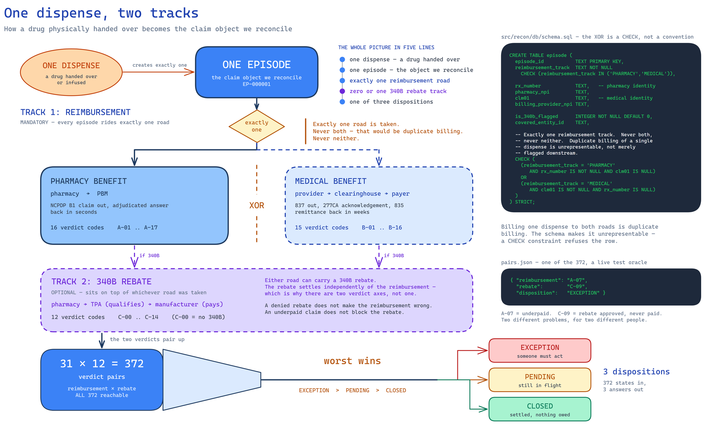
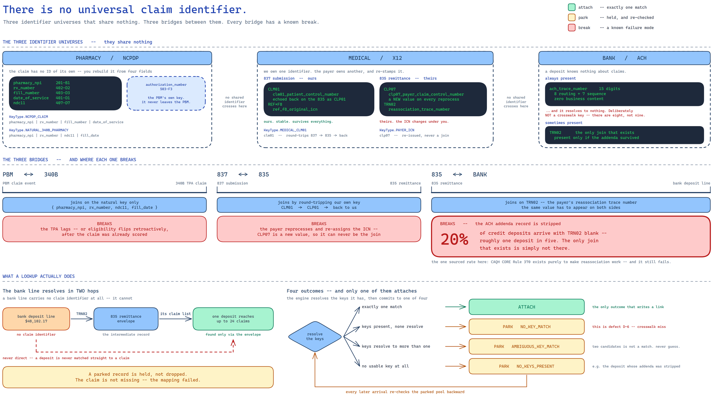
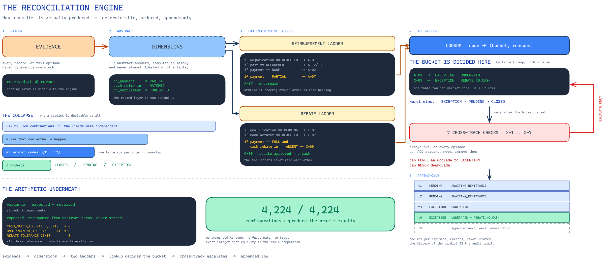
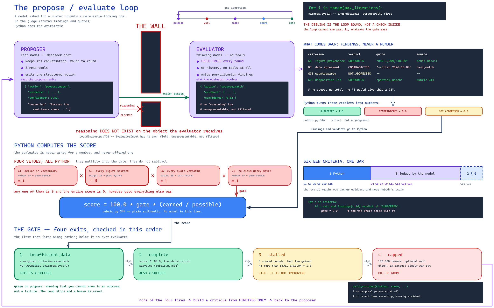
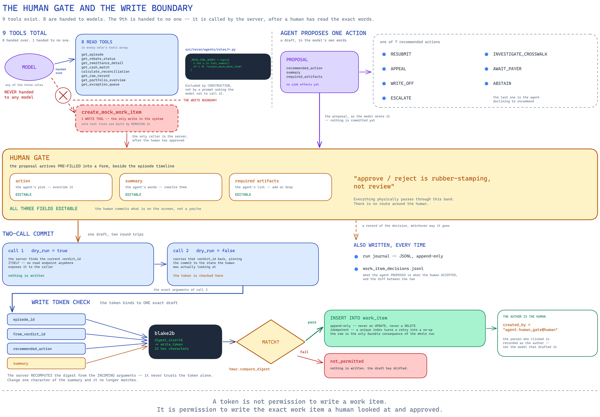

# Design Note — Post-Claim Pharmacy Financial Reconciliation

**One sentence: every number is computed in Python; the LLM only explains numbers it was handed.**

The assignment says that constraint three separate times, so I treated it as the thing being graded and built the whole system around it. Everything below follows from that one decision.

---

## 1. The domain, and the question I'm actually answering

A specialty pharmacy files a claim. Then money moves — or doesn't — down three independent pathways at once, each with its own counterparty, its own identifiers, and its own way of failing. A fourth feed, the bank, is the only proof cash actually landed.

| Pathway                 | Pays for                             | The question                                         | How it fails                            |
| ----------------------- | ------------------------------------ | ---------------------------------------------------- | --------------------------------------- |
| Pharmacy benefit (PBM)  | Drugs picked up at a counter         | Was the expected reimbursement received and settled? | Underpayment, reversal, recoupment      |
| Medical benefit (payer) | Clinician-administered drugs         | Was the claim paid, denied, or still pending?        | Denial, partial payment, missing 835    |
| 340B rebate (TPA)       | Manufacturer rebate on the drug cost | Was the eligible rebate requested, approved, paid?   | Rejected, delayed, unmatched            |
| Bank                    | Nothing — proof only                | Can the financial event be tied to real cash?        | Remittance with no cash, orphan deposit |

The operator's real question is not "what is the status." It's **what money should have arrived, what did, what's outstanding, and what needs a human.** Those are four different computations and only the last one is a judgement call. That split is the whole design.

### One dispense, two tracks

A drug travels exactly one billing road — pills go to the PBM, infusions go to the medical payer. Billing both is duplicate billing, so I made it unrepresentable rather than something to detect afterwards: a `CHECK` constraint on the `episode` table refuses any row that has both a prescription number and a medical claim number. 340B sits on top of either road, optionally, and it changes only what the drug *cost*, retroactively — the patient pays the same and the payer pays the same.

### The hard part is not the arithmetic. It's the joins.

There is no shared claim ID in this world, and inventing one would delete the problem. Three identifier universes — NCPDP, X12, ACH — touch at three bridges, and each bridge breaks for a known reason:

| Bridge      | Joins on                                | Breaks when                                      |
| ----------- | --------------------------------------- | ------------------------------------------------ |
| PBM ↔ 340B | Natural key: NPI + Rx + NDC + fill date | TPA lags, or eligibility flips retroactively     |
| 837 ↔ 835  | `CLM01` round-tripped by the payer    | Payer reprocesses and reassigns the ICN          |
| 835 ↔ bank | `TRN02` reassociation reference       | ACH addenda stripped —**~1 deposit in 5** |

A bank line carries no claim identifier at all, so it resolves in two hops: trace number finds the remittance, and the remittance holds the claim list. One deposit can cover dozens of claims.

---

## 2. Assumptions, stated up front

| # | Assumption                                                      | Why                                                                                                                                                                   | What it costs me                                                                                       |
| - | --------------------------------------------------------------- | --------------------------------------------------------------------------------------------------------------------------------------------------------------------- | ------------------------------------------------------------------------------------------------------ |
| 1 | 340B modelled as**rebate** (cash back), not replenishment | The assignment's own words — "manufacturer payment", "unmatched rebate" — describe the rebate model. Replenishment has no bank leg, so there's nothing to reconcile | Replenishment dominates in the real world. This is out of scope, not a variant                         |
| 2 | The insurer behind the PBM is not modelled                      | No source feed surfaces it as a distinct actor                                                                                                                        | PBM is treated as the reimbursing counterparty in full                                                 |
| 3 | Cash-pay and silently-failed dispenses are excluded             | Detecting them means anchoring on*dispenses*, not claims, which contradicts the claim-centric boundary the brief sets                                               | Real revenue leakage this design cannot see                                                            |
| 4 | **No SLA thresholds anywhere in verdict logic**           | Deliberate. It makes "a verdict cannot change without a new inbound record" true by construction                                                                      | Loses Medicare 30-day, CAQH ±3-day, 340B 45-day. Aging is a read-time sort key, never a verdict input |
| 5 | Defect-injection rates are estimates                            | Only the ~20% addenda-loss rate is sourced                                                                                                                            | Rates are named config constants, tunable, not load-bearing                                            |
| 6 | Entity universe sized for*coverage*, not realism              | 12 drugs, 2 pharmacies, 6 manufacturers — enough to generate every disqualification reason                                                                           | Scale is demonstrated by config rows, not by universe size                                             |

---

## 3. Architecture

**Four boundaries, each held by a test rather than by a convention.**

**Ingest never interprets.** Every source line is stored verbatim with its SHA-256 before a parser sees it. `raw_record` carries `RAISE(ABORT)` triggers on UPDATE and DELETE. Re-loading the same file is a no-op via a UNIQUE index on the file hash.

**The engine is a pure function** of `(episode, cursor)`. It appends a verdict row and never mutates one. The verdict log is append-only at the schema level, so deleting it and replaying rebuilds the same answers.

**The API projects, it does not calculate.** Every figure on screen was written by the engine and is returned verbatim. A test greps the service layer's source and fails if it finds arithmetic or an import of the engine.

**The agent never computes a number.** `calculate_reconciliation()` is a tool call into Python, not reasoning in a prompt. An AST-walking test fails the build if any function other than the single write tool so much as names a transaction or an SQL mutating verb.

**Scale comes from the shape, not from tuning.** A new TPA or payer is an adapter plus config rows — the crosswalk key types, the reason codes and the disposition rollup don't change. Ingest is event-driven: an inbound document carries its own lookup keys and pulls only the episodes it touches, so resolving a 200-day-old claim costs the same as this morning's. There is no time window to widen because there is no sweep.

---

## 4. Data model

The Claim Financial Episode is the semantic anchor. **Records live outside it**, joined by pointer, because one 835 covers dozens of claims and cannot sit inside any one of them.

| Layer      | Tables                                                                                      | Append-only                               |
| ---------- | ------------------------------------------------------------------------------------------- | ----------------------------------------- |
| Raw        | `raw_record`, `ingest_batch`, `quarantined_record`                                    | `raw_record` ✔                         |
| Canonical  | `normalized_record` (14 record kinds)                                                     | ✔                                        |
| Semantic   | `episode`, `crosswalk_key` (8 key types)                                                | `episode` ✔                            |
| Verdict    | `verdict`, `verdict_reason`, `verdict_cross_track_flag`, `verdict_evidence`         | all ✔                                    |
| Unresolved | `parked_record`, `parked_record_key`, `parked_record_resolution`, `cash_allocation` | resolutions appended, parks never deleted |
| Agent      | `work_item`                                                                               | ✔ plus an idempotent unique index        |

Three rules carry most of the weight.

**`received_at` is the only field the pipeline adds.** Every native date on every record points backward — no record promises anything about the future. Without `received_at` there is no cursor, no replay, and no way to represent a late arrival.

**The cursor lives at read time**, not in the data: `process(records where received_at <= cursor)`. "What did we believe on 31 March?" is a parameter, not a feature, and forward and backward use the same code path.

**Failed joins are parked, not dropped** — `NO_KEY_MATCH`, `AMBIGUOUS_KEY_MATCH`, `NO_KEYS_PRESENT`. Every later arrival re-checks the parked pool backward, so an out-of-order deposit can clear a park from three weeks earlier. Two candidates park rather than guess, because picking one attributes real money to the wrong claim and then looks identical to a correct match in every report afterwards. There is deliberately **no identifier normalisation** on the match path — a test asserts no `lstrip("0")` exists, because silently absorbing drift would delete the crosswalk-miss exception the system exists to surface.

Money is integer cents, never float; the conversion function refuses a Python float outright rather than rounding it. Variance is `expected − received`, signed, compared exactly. All three tolerance constants are literally zero.

There is no queue table. A queue is a `SELECT` over the latest verdict per episode, filtered by disposition, ordered by one of five whitelisted sorts. A test asserts no table in the schema has "queue" in its name.

---

## 5. How the synthetic data is generated

The generator is not a fixture writer. It is built backwards from a proof, so that "does the connector reassemble these feeds correctly?" is a **measurement** rather than an assumption.

**Step 1 — enumerate the state space before writing a generator.** `decision_tree/spec.py` declares each decision an episode can make — billing road, adjudication, payment, cash, reversal, 340B qualification, manufacturer decision — as a dimension with legality constraints. `build_tree.py` walks it and emits every legal leaf; `classify.py` labels each leaf with its verdict pair and coherence; `verify.py` re-derives every constraint **independently of the code that produced it**.

- 12,093,235,200 unconstrained combinations → **4,224 legal configurations**
- 3,860 coherent, 364 compliance anomalies
- **372 reachable verdict pairs**, all reachable
- The validator's first run reported 15 violations and *the validator* was wrong — which is the point of writing it separately

**Step 2 — pick which leaves to realise.** `sampling.py` selects from `leaves_classified.json`:

- `full` (1,500 episodes) takes **one leaf per verdict pair first**, so all 372 are covered by arithmetic rather than by luck, then fills the remainder round-robin
- `demo` (60 episodes) guarantees one episode per named edge-case family, then samples the rest
- Stratification is over **verdicts, not configurations**, because configuration frequency spans 252× and 99 of the 372 pairs have exactly one configuration behind them — uniform sampling would lose the rarest and most valuable cases
- `bind_entities` then attaches a real drug, pharmacy, payer and manufacturer consistent with the leaf's billing road

**Step 3 — the orchestrator turns one leaf into facts.** The leaf is a one-line plot summary: `ph_payment = PARTIAL`, `cash_reimb_in = MATCHED`. Everything concrete is decided here.

- `plan.py` costs the leaf into **integer cents** through `reference/pricing.py` — the same module the engine will use, which is what makes an injected underpayment *exactly* the underpayment the engine reports
- `timeline.py` computes every `received_at` from fixed lag windows; the generator has no concept of "now"
- The orchestrator **mints every cross-feed identifier** — natural keys, `trn02`, `allocation_code`, `clm01` — because those are the values two files must agree on
- It composes batches: which claims share a remittance, which `PLB` clawback lands on which *later* batch, which dispenses share a rebate payment
- Money flows **declare → realize → format**: the orchestrator declares a movement, `realizer.py` decides what actually lands (partial, absent, addenda stripped), and only then does a generator format it

**Step 4 — hand each generator a blind slice.** Each of `pbm.py`, `medical.py`, `tpa.py` and `bank.py` receives only what its real source system would know, and formats it in its own wire format.

- A generator never sees an episode id, a verdict, or an expected amount. `contracts.py` asserts this **at runtime** over slice instances and fails the build on a violation
- That assertion was written, correct, imported — and never called. When it was finally wired up it immediately caught every slice leaking the episode id through a free-text reference field
- Generators mint only identifiers that live inside their own company — a PBM authorization number, a payer ICN, an ACH trace. Every one of those is *useless for matching*, which is the same rule stated differently
- Four generators, **six files**: pharmacy and medical each split into claim + remittance because X12 separates the ask from the answer; 340B is one file carrying both directions because it is a vendor export with no standard behind it

**Step 5 — withhold the answer key.** The orchestrator alone writes `truth/ground_truth.json`, recording the intended verdict pair, every expected amount, and which cross-feed links are resolvable **by design** versus unresolvable because a defect was injected. The ingestion package is structurally unable to read it: `load_feeds` accepts only a feeds directory. That is what turns crosswalk accuracy into 1,349/1,354 rather than a claim.

Defects are injected at named, tunable rates rather than as noise — D-1 duplicate delivery, D-2 late arrival, D-3 orphan deposit, D-4 orphan rebate, D-6 identifier drift, D-7 allocation residual, plus per-feed business defects like underpayments whose `CO-45` does not explain the whole gap. Only the ~20% ACH addenda-loss rate is sourced; the rest are estimates. D-5, malformed records, is **deliberately absent** — it was an invented requirement that appeared nowhere in the brief.

Reproducibility is structural: every random stream is seeded from a canonical path string hashed with `blake2b`, never Python's `hash()`, which is salted per process. Seeds are order- *and* insertion-independent, so adding one episode never reshuffles another's output, and the manifest SHA-256s every feed file so "same seed, same bytes" is checkable with a diff.

---

## 6. Deterministic reconciliation

|                              |                                                                |
| ---------------------------- | -------------------------------------------------------------- |
| Reimbursement codes          | **31** — 16 pharmacy (A-xx), 15 medical (B-xx)          |
| Rebate codes                 | **12** (C-xx, where C-00 means the track is absent)      |
| Reachable verdict pairs      | **372**, all reachable, proved by exhaustive enumeration |
| Cross-track compliance rules | **7** (X-1…X-7)                                         |
| Data-integrity exceptions    | **7** (D-1…D-7)                                         |
| Total deterministic rules    | **50** = 43 track + 7 cross-track                        |
| Dispositions                 | **3** — `CLOSED`, `PENDING`, `EXCEPTION`          |

Anything finer than three dispositions belongs in reason codes, which are a *list* rather than a value, because an episode can be `UNDERPAID` and `REBATE_NO_CASH` at the same time. Episode status is worst-wins across the two tracks, so the track that needs a human is the one that surfaces. Cross-track rules run last and may only add reasons or force an upgrade to `EXCEPTION` — never a downgrade.

**The state space was enumerated before the generator was written.** A separate `decision_tree/` package reduced an unconstrained cross-product of **12,093,235,200** to **4,224** legal configurations (3,860 coherent plus 364 compliance anomalies), and that output is loaded as a live test oracle. My own hand-enumeration had claimed 510 pairs and was wrong in four separate ways that partially cancelled out — which is the reason the tree exists at all. 99 of the 372 pairs have exactly one configuration behind them, so sampling stratifies over verdicts rather than configurations.

**`INSUFFICIENT_DATA` is a first-class outcome, not an error path.** The engine emits it in exactly three places where it deterministically knows it cannot decide: a clawback that cannot be tied to any bank movement (A-13), no cash on both tracks at once (X-5), and an expected amount it could not price. The alternative is reporting variance against an expectation of zero — a false zero, which renders an unpriceable claim as perfectly clean. It also matters downstream, because it hands the agent a *deterministic* "I don't know" instead of one it has to invent.

**Measured, not asserted:** the engine reproduces the oracle on **4,224 / 4,224** configurations with no threshold — one divergence means the port is no longer the thing that was proved. Against withheld ground truth the crosswalk reassembles **1,349 / 1,354** resolvable episodes (99.6%) on the full profile. **585 tests pass, 2 skip**, with no API key and no network. Full breakdown in `README.md`.

---

## 7. Agent and tool design

Three roles, nine tools, and a ~150-line custom harness over an OpenAI-compatible client.

| Role                   | Question                      | Shape                                            |
| ---------------------- | ----------------------------- | ------------------------------------------------ |
| Exception Investigator | Why is this claim open?       | Single pass, 8 read tools, ≤5 rounds / 12 calls |
| Workflow Coordinator   | What should a person do?      | Propose ⇄ Evaluate loop                         |
| Portfolio Analyst      | What's the state of the book? | Single pass, aggregate tools                     |

**No framework, deliberately.** I checked four candidate harnesses; none ships an evaluator/scorer abstraction, so that loop is hand-written either way. A framework would only add a dependency across exactly the tool boundary this assignment is grading. It's provider-agnostic through `base_url` plus a model string, and a `ReplayClient` makes the eval set run offline in CI.

**Two agents, and the evaluator never sees the proposer's reasoning.** Self-critique is measured to *degrade* results; external verification improves them. The evaluator gets the proposed action, the evidence and the rubric on a fresh trace — the `reasoning` field does not exist on the object it receives, so it is unrepresentable rather than filtered. The critique fed back between rounds is built from findings only, and its function signature cannot accept a proposal at all.

**The evaluator never emits a score.** It returns per-criterion findings — `SUPPORTED`, `CONTRADICTED`, `NOT_ADDRESSED` — and Python computes `score = 100 × gate × (earned/possible)`. A model asked for a number produces a plausible-looking one; a model asked "is this claim supported, and quote the bit that shows it" is doing something checkable. Sixteen criteria: 6 checked by Python, 8 by the judge, 2 recorded at zero weight. Four **vetoes**, all Python, any one of which zeroes the gate — action valid for the disposition (G1), every figure sourced (G3), every quoted span verbatim in its named source (G5), and no claim that money already moved (G8).

**Four outcomes, never collapsed to a boolean:** `complete` (≥80), `insufficient_data` (rendered as a *success* — more iterations cannot manufacture missing evidence), `stalled` (no improvement across three scored rounds), and `capped` (the hard ceiling, which is the loop bound itself rather than a check inside the body, so it wins ties by construction).

**Grounding is mechanical, not requested politely.** Every figure in generated prose is scanned in Python against what the tools actually returned; an unsourced figure triggers one repair turn and then ships in a separate `unsourced_figures` block rather than silently inside the answer. Citations resolve to six token kinds and a failed citation degrades to plain text rather than breaking the answer.

### The write path is a human gate, not an agent capability

The write tool is never given to any model — role tool lists are built by *removing* it, so there is no prompt that could reach it. A proposal is pre-filled into a form beside the episode timeline, so the button cannot be reached without the evidence on screen, and every field is editable because approve/reject is rubber-stamping rather than review. Commit needs a two-call `dry_run` flow plus a blake2b write token over `episode_id | from_verdict_id | action | summary`, compared with `hmac.compare_digest` — so the token authorises one exact draft, not work items in general. `work_item` is append-only with an idempotency index, and `created_by` records the human, not the model. Override rate is a metric, not a defect.

**Evaluation:** 10 scenarios, tool-path primary and outcome-shape secondary, no LLM judge in the eval set, replayed offline from committed traces. One of the ten is a deliberate failure case — a G3 veto — written up with its production-hardening recommendation in `docs/eval_g3_veto_failure_case.md`.

---

## 8. Security

Scoped to the brief: no production deployment, no IAM buildout. `README.md` carries the full control table; these four shape the architecture.

**The untrusted-text fence.** Payer free text is wrapped in `⟦UNTRUSTED:field#nonce⟧…⟧` with a per-run nonce before it reaches a prompt. You cannot sanitise a rejection reason — it *is* the data — so you mark its boundary and refuse instructions from inside it. The fenced-field list is derived from the projection table, so a newly projected field is fenced automatically rather than remembered.

**A structural provenance check.** A tool argument appearing only inside previously-returned untrusted text is refused and journalled as `injection_attempt_recorded`. That holds whether or not the model obeys the prompt, which is the only kind of guarantee worth having here.

**Least privilege as a shape.** One write tool of nine, `INSERT`-only, never in any model's tool list, enforced by an AST test. Eight tables carry `RAISE(ABORT)` immutability triggers. PHI redaction is fail-closed — unparseable means refused, not answered.

**Audit is the run journal.** Append-only JSONL per run, flushed per line and secret-redacted before write, replayable through `GET /api/agent/runs/{run_id}`. Human-gate decisions are journalled separately with the proposed-versus-accepted diff, which makes override rate measurable.

**Not built, and named rather than hidden:** no authentication, no tenant isolation, no rate limiting, no request-size limit, no retention policy. In production: OIDC at the edge, tenant id as a mandatory predicate in the repository layer rather than a filter trusted at the handler, per-tenant model-call budgets, and PHI under a BAA with minimum-necessary projections.

**Three known gaps in what *is* built,** stated because a reviewer will find them: PHI redaction runs in the agent tool layer but not on the plain read API, so `/api/record/{raw_id}` returns a verbatim payload; `POST /api/regenerate` rebuilds the database with no auth; and the HTTP handler will self-mint a write token when the caller supplies none, which makes the token a draft-integrity check rather than a true authorization gate.

---

## 9. What I'd build next

Ordered by what a reviewer would miss most.

1. **Close the three named security gaps** — redact at the API edge, gate regenerate behind a flag, require the write token instead of minting it. All three are local and none touches architecture.
2. **Derivation lineage.** `verdict_evidence` currently records every record *visible* at that cursor, not the ones that *drove* the verdict. The engine already knows which record fired the rule and throws it away — it's one flag at an existing branch. Only about 30% of verdict changes have a single new record behind them, so this is a real gap and a narrow one.
3. **Tenant isolation**, as a predicate in the repository layer rather than a filter in handlers.
4. **Connector onboarding as config** — an adapter registry so a new TPA is rows, not a module.
5. **Calibrate the score threshold.** 80 is legible but uncalibrated; real calibration needs 100–200 labelled examples per failure mode, reporting true-positive and true-negative rates separately.
6. **Model diversity in the evaluator.** Proposer and evaluator currently default to the same model because a thinking-model evaluator averaged 466s per call against the proposer's 4.1s. The self-preference mitigation is therefore off by default, and I'd rather say that than claim independence I don't have.

**Known limitations, plainly:** 5 of 1,354 full-profile episodes don't reproduce their intended verdict; the demo profile scores 54/54 on its frozen spine but 53/54 on a freshly seeded rebuild; three timeline projections are defensive and unexercised; the SQLite file is not byte-reproducible because it carries load wall-clocks, though the feed files are, verified by SHA-256 in the manifest; and there is no front-end test suite.

---

## Appendix — where to look

`README.md` runs it and answers the six architecture areas in full. `DEMO.md` is the click-by-click script with screenshots. For a single path traced all the way through, `docs/claim_walkthrough.md` follows one claim through the deterministic layer and `docs/agent_walkthrough.md` follows one request through the agent layer. The state space and its derivation are in `docs/reconciliation_state_space.md` and `decision_tree/REPORT.md`; every decision with provenance is in `docs/decision_ledger.md` and `docs/architecture_decisions.md`; the deliberate failure case is `docs/eval_g3_veto_failure_case.md`; and the editable diagram sources sit beside their PNGs in `docs/images/`.
