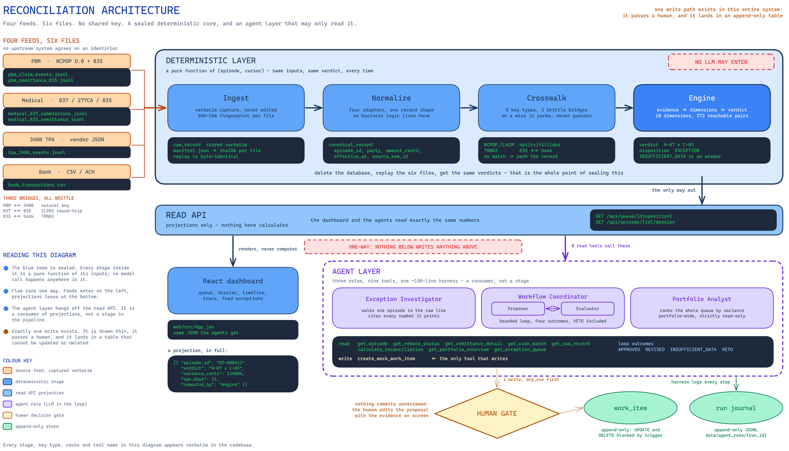
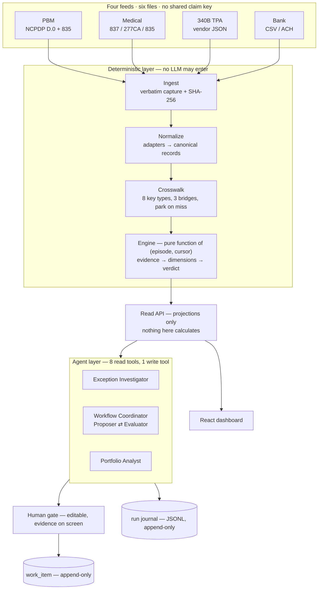

# Post-Claim Pharmacy Financial Reconciliation

A take-home prototype: four independent synthetic data feeds are ingested, crosswalked into claim-level episodes, reconciled by deterministic Python, and surfaced through a React dashboard and an LLM agent layer that **never computes a number**. Every dollar figure, verdict and status on screen was written by the deterministic engine; the agent explains it and recommends what a human should do next.

This file is the practical "how do I run it" reference. Three other documents cover everything else. `DESIGN_NOTE.md` is the submission's design note — domain, assumptions, architecture, data model, agent design, security and what's next, with diagrams. `DEMO.md` is a click-by-click walkthrough script with screenshots of each screen and what each one proves. The two walkthroughs each follow a single path all the way through, which is usually the fastest way to understand how a layer actually behaves: `docs/claim_walkthrough.md` traces one claim through the deterministic layer end to end, from raw feed lines to the verdict on screen, and `docs/agent_walkthrough.md` traces one request through the agent layer end to end, from the click to the checked prose and the committed work item.

## Architecture



Four boundaries, each held by a test rather than by a convention: ingest never interprets, the engine only appends, the API only projects, and the agent never computes a number. `DESIGN_NOTE.md` §3 explains why each one is drawn where it is. The same diagram as a mermaid source, if you'd rather read it as text:

<details>
<summary>Architecture, as mermaid</summary>



</details>

### Diagrams

Six diagrams cover the system, and all of them have editable `.excalidraw` sources beside the rendered PNG in `docs/images/`. They are embedded where they belong in `DESIGN_NOTE.md` and `DEMO.md`; this is the index.

| Diagram | File | What it argues |
|---|---|---|
| System architecture | `docs/images/arch-system.png` | The four boundaries, and where the LLM is and is not allowed to reach |
| Two-track model | `docs/images/domain-two-track.png` | One dispense, pharmacy XOR medical, 340B layered on top |
| Crosswalk bridges | `docs/images/crosswalk-bridges.png` | Three identifier universes, three bridges, park rather than guess |
| Engine pipeline | `docs/images/engine-pipeline.png` | Evidence → dimensions → verdict pair → disposition |
| Agent loop | `docs/images/agent-loop.png` | Propose ⇄ evaluate, the wall between them, four vetoes, four outcomes |
| Human gate | `docs/images/human-gate.png` | The write boundary and the write token |

`docs/images/` also holds seven screenshots of the running app (`01-dashboard.png` through `07-agent-explain.png`), used as the visual script in `DEMO.md`.

## Prerequisites

Python 3.11+, and Node 18+ for the front end.

The deterministic core has **zero runtime dependencies** by design. Everything below an optional extra is opt-in:

```bash
pip install -e ".[api,agent,dev]"   # FastAPI surface + agent layer + pytest
```

There are three extras and they are separable: `api` pulls in FastAPI, uvicorn and pydantic; `agent` pulls in httpx; `dev` pulls in pytest. Install a narrower slice if you only need part of it — `.[api]` alone runs the dashboard with no agent layer at all, and `.[dev]` alone is enough for the deterministic engine's own test suite.

## Quickstart: the dashboard

**1. Start the backend.** Note the `--factory` flag. `recon.api.app:create_app` is a *function* that builds the ASGI app, not an app instance, so the default `uvicorn` invocation without `--factory` fails outright.

```bash
uvicorn recon.api.app:create_app --factory --port 8000
```

**2. Generate the dataset**, once, against that running server. A fresh checkout has no `data/*.sqlite` — those are derived artefacts, gitignored on purpose, and reproducible byte for byte from a fixed seed.

```bash
curl -X POST "http://127.0.0.1:8000/api/regenerate?profile=demo"
```

`profile=demo` is the curated ~60-episode walkthrough set; `profile=full` builds the ~1,500-episode set the test suite asserts full state-space coverage against. The dashboard's own "Rebuild demo" / "Rebuild full" / "Repeat seed" buttons call this same endpoint, so doing it here once is equivalent to clicking one of them.

Omitting `seed`, as above, rebuilds on the published seed and is byte-identical to the last such run — which is how you *check* reproducibility rather than take it on trust: run it twice and diff the `feed_sha256` maps in `manifest.json`. Pass `&seed=<n>` for a genuinely different dataset that is still reproducible from its own seed. The dashboard's two "Rebuild" buttons mint a fresh seed on every press and "Repeat seed" replays the one in the masthead, because *rebuild* reading as *produce the identical file again* surprised everyone who pressed it.

On `demo` a new seed changes the queue mix as well as the amounts: one episode per named edge case is guaranteed whatever the seed, and the rest of the sixty is sampled (see `CuratedSpine` in `src/recon/config.py`). `demo` therefore has two spines — the default sampled one, and `RECORDED`, which pins the composition the committed agent traces replay against and must not drift.

**3. Start the front end.** It proxies `/api` to `127.0.0.1:8000`; see `web/vite.config.js`.

```bash
cd web
npm install
npm run dev
```

**4. Open the URL Vite prints.** That is http://localhost:5173 when the port is free, but Vite falls back to the next available port if something else already has 5173, so read the dev server's output rather than assuming. Drag the replay cursor, pick a queue, open an episode's dossier — the same deterministic dashboard either way.

## The agent layer, with or without an API key

The agent layer's HTTP surface (`/api/agent/*`) is mounted unconditionally by `create_app`, but it degrades gracefully in two independent stages, and the dashboard works fully at every stage:

| What's installed | What works |
|---|---|
| Nothing extra (`.[api]` only) | The whole dashboard. `/api/agent/*` returns a 503 naming exactly what's missing. |
| `.[agent]` installed, no API key | Everything above, **plus** the human-gate/work-item endpoints (`POST /api/agent/work-item`, `GET /api/agent/work-items`, `GET /api/agent/runs/{id}`) and the analysis screen's UI shell. `Explain` and `Decide next steps` — the two calls that reach a live model — 503 with a plain-language "no `RECON_AGENT_API_KEY` configured" message, styled as an ordinary informational state in `/analyse/:episodeId`, not an error. |
| `.[agent]` installed, API key set | Everything, live. |

To run it live, put a key in a `.env` file at the repo root (git-ignored) or export it directly:

```
RECON_AGENT_API_KEY=sk-...
RECON_AGENT_BASE_URL=https://api.deepseek.com
RECON_AGENT_PROPOSER_MODEL=deepseek-chat
RECON_AGENT_EVALUATOR_MODEL=deepseek-v4-pro
```

`DEEPSEEK_API_KEY` also works, as a fallback name for the key. Any OpenAI-compatible chat-completions endpoint works, not only DeepSeek — `base_url` and the two model names are the only provider-specific settings.

Once the backend and front end are both running, open an `EXCEPTION` episode from the dashboard and click **Inspect using AI** at the top of the episode panel. It opens `/analyse/{episode_id}` in a new tab: the episode's dossier on the left, **Explain** and **Decide next steps** on the right. Decide streams the propose → evaluate → score → gate loop live, and the recommended work item is editable before you commit it with **Add to-do**. The third role, the Portfolio Analyst, sits on the main dashboard instead of the per-episode screen, and answers questions about the whole book at the current cursor.

## Running the tests

```bash
python -m pytest tests/ -q
```

That is the whole suite, deterministic engine through agent layer — 587 tests, currently 585 passed and 2 skipped in about 80 seconds with all three extras installed — and it needs **no API key and no network**. `tests/test_agents_evals.py` (the eval set) replays committed fixtures under `tests/fixtures/agent_traces/` through `recon.agents.client.ReplayClient`, which matches every request by an exact digest against what was recorded and raises a clear `ReplayMiss` on anything unexpected. A handful of agent-layer test files skip themselves automatically via `pytest.importorskip("httpx", ...)` if the `agent` extra isn't installed.

Regenerating a fixture is only needed if a prompt or a tool's output shape changes:

```bash
python scripts/agent_smoke.py --record --episode E-000006          # both roles, live
python scripts/agent_smoke.py --record --role coordinator --episode E-000040 \
    --nonce <fixed-hex> --run-id <fixed-id>                        # a REPLAYABLE fixture
python scripts/record_g3_veto_fixture.py                           # hand-scripted, offline
python scripts/record_scripted_eval_fixtures.py                    # hand-scripted, offline
```

`--nonce` and `--run-id` matter for anything meant to be replayed later: the untrusted-text fence nonce is embedded verbatim in every request, so two runs with different nonces produce different request bytes even when nothing else changed. See `agent_smoke.py --help` for the full explanation.

## Where things live

- `src/recon/` — the deterministic core: config, generators, ingestion, the reconciliation engine, the DB layer. No agent-layer or HTTP-layer imports.
- `src/recon/api/` — the read-only FastAPI surface and dossier assembly.
- `src/recon/agents/` — the agent layer: the harness, the three roles (Proposer and Evaluator via the Workflow Coordinator, plus the Exception Investigator and the Portfolio Analyst), tools, scoring, prompts, and the `/api/agent/*` HTTP surface.
- `web/` — the React dashboard and the agent-layer analysis screen (`/analyse/:episodeId`).
- `tests/` — one file per module, plus `test_agents_evals.py` (the eval set) and `test_agents_integration.py` (cross-module seams).
- `docs/` — the two walkthroughs, the feed specification, the reconciliation state space, the decision ledger, the glossary, the diagrams and screenshots in `docs/images/`, and `docs/knowledge_graph.jsonl`, which the agent layer reads at import as grounding material rather than as documentation.
- `decision_tree/` — the exhaustive state-space generator and its own report; a live test oracle (`decision_tree/pairs.json`), not just documentation.
