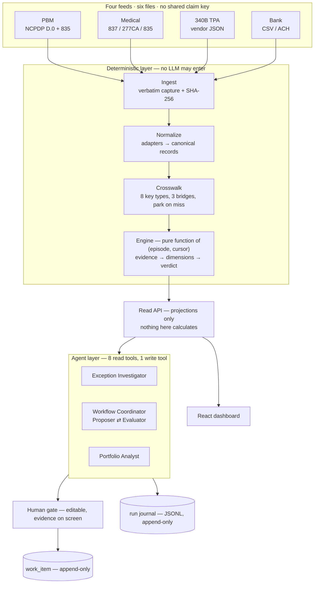

# Post-Claim Pharmacy Financial Reconciliation

Four independent synthetic data feeds are ingested, crosswalked into claim-level episodes, reconciled by deterministic Python, and surfaced through a React dashboard and an LLM agent layer that **never computes a number**. Every dollar figure, verdict and status on screen was written by the deterministic engine; the agent explains it and recommends what a human should do next.

## Deliverables

| # | Deliverable | Where it is | What it contains |
|---|---|---|---|
| 1 | **Short design note** | **[`DESIGN_NOTE.md`](DESIGN_NOTE.md)** | Domain, assumptions, target architecture, data model, generator design, agent/tool design, security, and what I'd build next. Under 5 pages, with diagrams |
| 2 | **Runnable prototype** | This repository | `pip install -e ".[api,agent,dev]"` → `uvicorn recon.api.app:create_app --factory --port 8000` → `curl -X POST "http://127.0.0.1:8000/api/regenerate?profile=demo"` → `cd web && npm install && npm run dev`. Full detail in [Running it](#running-it) below. Working path: synthetic feeds → ingest → crosswalk → reconciliation → three agent behaviours |
| 3 | **Synthetic data generator** | `src/recon/generators/`, `src/recon/reference/`, `decision_tree/` | Six feed files from four independent generators, with seven named defect classes injected at controlled rates. File-by-file table in [The synthetic data generator](#the-synthetic-data-generator) |
| 4 | **Tests / evaluation** | `tests/`, `decision_tree/` | **585 passed, 2 skipped** (587 collected), no API key and no network. 219 tests cover the reconciliation core, 368 the agent layer, plus a 10-scenario agent eval set. Result summary in [Tests and evaluation](#tests-and-evaluation) |
| 5 | **README** | This file | Architecture diagram, prerequisites, how to run the demo, key assumptions, limitations and known trade-offs |

`DEMO.md` is a click-by-click walkthrough script with screenshots of each screen and what each one proves. The two walkthroughs follow a single path all the way through, which is the fastest way to understand how a layer actually behaves: `docs/claim_walkthrough.md` traces one claim through the deterministic layer from raw feed lines to the verdict on screen, and `docs/agent_walkthrough.md` traces one request through the agent layer from the click to the checked prose and the committed work item.

## Architecture


Four boundaries, each held by a test rather than by a convention: **ingest never interprets**, **the engine only appends**, **the API only projects**, and **the agent never computes a number**. `DESIGN_NOTE.md` §3 explains why each one is drawn where it is.

<details>
<summary>The same diagram as mermaid source</summary>



</details>

---

# How the architecture addresses the six areas

These are the six areas the brief asks the architecture to address, in its own words.

## Source connectivity

*How APIs, SDKs, SFTP/files, remittances and bank feeds enter the platform, and how schema versions, retries, duplicate delivery and late-arriving data are handled.*

Ingestion is a two-pass, file-oriented connector that treats every feed as an untrusted drop. Pass one hashes each file and writes every line verbatim into `raw_record` before a parser sees it; pass two replays those rows **sorted by arrival time across all six files together**, so a bank line from September is processed after a claim from August regardless of which file it arrived in.

**Schema versions** are carried, not assumed: every canonical row records the `adapter_version` that produced it, so two adapter generations can coexist in one database. **Retries and duplicate delivery** are handled at two levels — a UNIQUE index on the file's SHA-256 makes re-loading a whole file a no-op, and a UNIQUE index on `(record_kind, idempotency_key)` collapses a re-sent record. That key is the *source record id*, never a natural key, because defect D-1 (the same record delivered twice) must collapse while a genuine duplicate *payment* must not. **Late-arriving data** needs no special path: `received_at` is the only field the pipeline adds, and a record that arrives three weeks out of order simply lands at its own arrival time. Anything whose keys resolve to nothing is **parked** rather than dropped, and every subsequent arrival re-checks the parked pool backward.

## Data foundation

*How raw source fidelity, normalized models, crosswalk keys, lineage and a claim-level semantic model are maintained.*

Four layers, each with a different job. **Raw fidelity**: `raw_record` holds the verbatim line plus its SHA-256, with `RAISE(ABORT)` triggers on UPDATE and DELETE, so the evidence can never be edited. **Normalized model**: `normalized_record` carries 14 record kinds in one shape, with the ~20 fields that are searched or calculated on promoted to real typed columns and the rest kept as canonical JSON. **Crosswalk keys**: a dedicated `crosswalk_key` table indexed on `(key_type, key_value)` holds 8 key types — it is a reverse lookup answering "a document quotes this string, whose is it?", which is the opposite direction from the episode table's "what is this claim?". **Lineage** runs downward by design, so `verdict → verdict_evidence → normalized_record → raw_record → ingest_batch` is one join and `GET /api/record/{raw_id}` returns the original payload with both hashes. **The claim-level semantic model** is the Claim Financial Episode, with records living *outside* it joined by pointer, because one 835 covers dozens of claims and cannot sit inside any of them.

## Reconciliation services

*Where deterministic expected-vs-actual calculations, matching, cash allocation, reversals and close status live. These should not depend on an LLM.*

All of it lives in `src/recon/engine/`, which imports nothing from the API or agent layers and is a pure function of `(episode, cursor)`. **Expected** is recomputed from contract terms through `src/recon/reference/pricing.py` — the same module the generator used — never read from a stored value. **Actual** comes from `cash_allocation` rows rather than from bank rows directly, because one deposit covers many claims. **Matching** is the three-bridge crosswalk, with a two-hop path for bank lines (trace number → remittance → its claim list) and an amount-and-date fallback within three banking days when the ACH addenda were stripped. **Cash allocation** splits a deposit back across a remittance's claim lines and records the `basis` on which each link was made, so "we know this matched" stays distinguishable from "we inferred it". **Reversals** are separated from recoupments by actor — a pharmacy-initiated B2 versus a payer-initiated `PLB WO` — and further split by timing into pre-pay and post-pay. **Close status** is read from `CLP02`, where `1` is settled and `19`/`25` mean money moved while the receivable stayed open.

No LLM is reachable from any of it. An AST-walking test fails the build if any function outside the single write tool so much as names a transaction or an SQL mutating verb.

## Agent/tool boundary

*What tools the agents can call, what they are not allowed to change, and how evidence is returned.*

Nine tools: eight read, one write. **The write tool is never given to any model** — each role's tool list is built by *removing* it, so no prompt can reach it. The eight read tools are `get_episode`, `get_rebate_status`, `get_remittance_detail`, `get_cash_match`, `calculate_reconciliation`, `get_raw_record`, `get_portfolio_overview` and `get_exception_queue`.

What the agent cannot change: anything. There is no tool that mutates a claim, a verdict, a ledger or a status. The only write in the system creates a **work item**, and it is called by the server after a human has edited and confirmed a draft, authorised by a blake2b token bound to that exact draft. `created_by` records the human, not the model.

Evidence comes back in a fixed five-key envelope — `status`, `data`, `error_type`, `message`, `retryable` — so a validation failure, a blocked duplicate and a successful read all look the same to the model and no stack trace ever escapes. Payer free text arrives wrapped in a per-run nonce fence, marking it as data rather than instruction. Every figure the model writes is then scanned in Python against what the tools actually returned, and citations resolve to real record and verdict ids.

## Scale and tenancy

*How the design extends to additional TPAs, payers, health systems and reporting variants through configuration rather than one-off code.*

A new TPA or payer is an adapter plus reference rows. The crosswalk key types, the reason-code vocabulary, the disposition rollup and the 372-pair verdict space do not change, because none of them branches on *which* payer — payer identity enters only as a lookup into contract terms. Reporting variants are the same story: queue orderings are a named whitelist, so adding a ranking is a row rather than a code path.

Processing cost is independent of history because ingestion is **event-driven, never scan-driven**. An inbound document carries its own lookup keys and pulls only the episodes those keys resolve to, so recomputing a 200-day-old claim costs exactly what recomputing this morning's does. There is no time window to widen, which is the usual failure of a sweep-based design.

**Tenancy is designed but not implemented**, and I would rather say so than imply otherwise. The repository layer is the correct seam — a tenant id belongs there as a mandatory query predicate, not as a filter trusted at the handler — but no such predicate exists today.

## Security and operations

*Authentication, tenant isolation, least-privilege access, audit logs, observability, data retention and safe handling of PHI in a real implementation.*

**Built**, because it was cheap and demonstrable: a per-run untrusted-text fence around payer free text; a structural provenance check that refuses a tool argument appearing only inside previously-returned untrusted text and journals it as `injection_attempt_recorded`; fail-closed PHI redaction on the raw-payload tool, which refuses rather than answers when a PHI key is present but unparseable; least privilege as 1 write tool out of 9, `INSERT`-only and AST-tested; immutability triggers on 8 tables; parameterised SQL throughout with a whitelisted `ORDER BY` and a test that `episode_id;DROP TABLE verdict` returns 422; secrets from env or a git-ignored `.env`, with `__repr__` overridden so a stack trace prints `api_key=<set>`.

**Audit and observability** are the append-only JSONL run journal — every `llm_request`, `tool_call` and `tool_result`, flushed per line and secret-redacted before write, replayable into a run summary through `GET /api/agent/runs/{run_id}`. Human-gate decisions are journalled separately with the proposed-versus-accepted diff, so override rate is measurable.

**Not built, and named rather than hidden:** no authentication, no tenant isolation, no rate limiting, no request-size limit, no retention policy. In production: OIDC at the edge, tenant id pushed into the repository layer, per-tenant model-call budgets, and PHI under a BAA with minimum-necessary projections rather than redaction after the fact. Three known gaps in what *is* built are listed in [Limitations](#limitations-and-known-trade-offs).

---

# The synthetic data generator

Four independent generators write six feed files. The split is deliberate: each generator receives only what its real source system would know, so no shared key can leak across feeds and the crosswalk has to earn every join.

## The six feeds

| File | Format | Written by | Contains |
|---|---|---|---|
| `pbm_claim_events.jsonl` | JSONL | `generators/pbm.py` | NCPDP D.0 `B1` adjudications and `B2` reversals |
| `pbm_remittance_835.jsonl` | JSONL | `generators/pbm.py` | X12 835 batches; one line is one whole remittance covering up to 24 claims |
| `medical_837_submissions.jsonl` | JSONL | `generators/medical.py` | 837 claims (original / replacement / void) **and** 277CA acknowledgments |
| `medical_835_remittance.jsonl` | JSONL | `generators/medical.py` | X12 835 batches from the medical payer |
| `tpa_340b_events.jsonl` | JSONL | `generators/tpa.py` | Vendor export carrying **both directions** — qualification, rebate request, manufacturer decision, reversal, payment batch |
| `bank_transactions.csv` | CSV | `generators/bank.py` | NACHA CCD+ style ACH credits and debits |

Pharmacy and medical each get *two* files because X12 separates the ask from the answer. 340B gets *one*, because it is a vendor portal export with no standard behind it — request and response events are interleaved in the same file and sorted into place only by `received_at`.

## The code

| File | Job |
|---|---|
| `decision_tree/spec.py` | Declares the decision dimensions and their legality constraints |
| `decision_tree/build_tree.py` | Walks the tree, emitting every legal leaf |
| `decision_tree/classify.py` | Classifies each leaf into a verdict pair and coherence label |
| `decision_tree/verify.py` | Re-derives every constraint independently and validates the output |
| `decision_tree/leaves_classified.json` | **4,224 legal configurations** — the generator's input |
| `decision_tree/pairs.json` | The 372 reachable verdict pairs, loaded as a live test oracle |
| `generators/sampling.py` | Picks which configurations to realise, stratified over verdicts |
| `generators/plan.py` | Turns one classified leaf into a fully costed `EpisodePlan` in integer cents |
| `generators/timeline.py` | Computes every `received_at` from fixed lag windows |
| `generators/orchestrator.py` | Decides everything, formats nothing — binds entities, composes batches, mints cross-feed identifiers, writes ground truth |
| `generators/contracts.py` | The slice dataclasses plus the runtime blindness assertion |
| `generators/realizer.py` | Turns declared money movements into what actually lands; every cash-side defect lives here |
| `generators/pbm.py`, `medical.py`, `tpa.py`, `bank.py` | Format only. Each knows its own wire format and nothing about the others |
| `reference/` | The fixed universe: 12 drugs, entities, pricing, code tables, banking calendar, patients |

The orchestrator alone writes `truth/ground_truth.json`, and the ingestion package is structurally unable to read it — `load_feeds` accepts only a feeds directory. That is what makes crosswalk accuracy a **measurement** rather than an assumption.

## The injected defects

| Code | Defect | Rate |
|---|---|---|
| D-1 | Duplicate delivery — same payload, later timestamp | 3% |
| D-2 | Late arrival — `received_at` shifted 7–45 days, event dates untouched | 8% |
| D-3 | Orphan bank deposit, attributable to nothing | 2% |
| D-4 | Orphan rebate — allocation code lost in transit | from addenda loss |
| D-5 | *Not generated.* Malformed records were never in the brief | — |
| D-6 | Crosswalk miss — Rx number spelled differently across two feeds | 6% drift + 2% truncation |
| D-7 | Allocation residual — a forward-balance adjustment with no reference | 5% |

Plus per-feed business defects: underpayments whose `CO-45` does not explain the whole gap, overpayments, duplicate payments, missing settlement, netted recoupments landing on a *later* batch, silent replacement 837s that drop a service line, ICN discontinuity, contract-pharmacy restrictions, patient-definition failures, and a quota of medical 340B key collisions so the ambiguous-match path fires at a known rate.

**Only the ~20% ACH addenda-loss rate is sourced**; every other rate is an estimate, and all of them are named constants rather than literals scattered through the code.

## Reproducibility

Every random stream is seeded from a canonical path string hashed with `blake2b` — never Python's built-in `hash()`, which is salted per process. Seeds are therefore order-independent *and* insertion-independent: adding one episode never reshuffles another's output. The manifest SHA-256s every feed file, so "same seed, same bytes" is checkable with a diff rather than taken on trust.

```bash
curl -X POST "http://127.0.0.1:8000/api/regenerate?profile=demo"   # 60 episodes, curated
curl -X POST "http://127.0.0.1:8000/api/regenerate?profile=full"   # 1,500 episodes, all 372 pairs
```

---

# Tests and evaluation

```bash
python -m pytest tests/ -q
```

**585 passed, 2 skipped** (587 collected), in about 75 seconds, with **no API key and no network**. The two skips are `pytest.importorskip("httpx")` guards that fire only when the `agent` extra is not installed.

| Area | Tests |
|---|---|
| Reconciliation core | **219** — `test_generators` 62, `test_decisions` 43, `test_scenarios` 41, `test_api` 38, `test_query_plans` 20, `test_end_to_end` 15 |
| Agent layer | **368** across 11 files — tools 114, rubric 89, schemas 35, evals 25, grounding 18, transport 17, integration 17, api 16, analyst 15, roles 12, harness 10 |

## How correctness is actually established

The reconciliation core is not tested by hand-written examples hoping to cover the space. **The state space was enumerated first, independently, and is used as an oracle.**

`decision_tree/` reduces an unconstrained cross-product of **12,093,235,200** combinations to **4,224** legal configurations — 3,860 coherent and 364 compliance anomalies — producing **372 reachable verdict pairs**. `decision_tree/verify.py` re-derives every constraint from the finished leaf *independently of the code that generated it*, so a shared assumption cannot hide in both halves. That mattered: the validator's first run reported 15 violations and the **validator** was wrong, not the generator.

Three assertions follow from it:

**The engine reproduces the oracle exactly.** `test_engine_verdicts_reproduces_all_4224_oracle_classifications` runs the shipped classifier against all 4,224 configurations and compares verdicts, cross-track flags and coherence. There is **no threshold** — one divergence fails, because the engine is a line-for-line port of the proven prototype and one divergence means it is no longer the thing that was proved.

**The generator produces every reachable pair.** `pairs.json` is loaded as a live oracle and the coverage test fails if any of the 372 goes unproduced on the full profile.

**The crosswalk is scored against withheld ground truth.** The connector cannot read `ground_truth.json`, so reassembly accuracy is measured: **1,349 / 1,354** resolvable episodes (99.6%) on the full profile, and 54/54 on the frozen demo spine.

Query plans are pinned too — every hot query has a test that runs `EXPLAIN QUERY PLAN` and asserts no table scan, so an index regression fails a test instead of quietly costing latency.

## The agent evaluation loop

Ten scenarios, run offline against committed traces. No LLM judges the eval set; grading is on **tool path** first and **outcome shape** second, both deterministic.

| Scenario | What it pins |
|---|---|
| `eval-e000006-x1-denied-rebate` | The X-1 compliance case: claim denied, rebate paid anyway |
| `eval-e000032-no-cash` | Remittance with no cash |
| `eval-e000040-insufficient-data` | Both tracks dry — deterministic `INSUFFICIENT_DATA` |
| `eval-e000002-closed-abstain` | A closed episode; the correct action is to abstain |
| `eval-e000825-crosswalk-miss` | D-6 identifier drift |
| `eval-g3-veto-failure` | **The deliberate failure case** — an unsourced figure trips the G3 veto |
| `eval-g8-write-verb-veto` | A proposal claiming money already moved |
| `eval-g1-disposition-mismatch` | An action not permitted for that disposition |
| `eval-happy-path-cites-tool-result` | Clean run, every figure cited |
| `eval-abstain-completes` | Abstention reaching a `complete` outcome |

The mechanism is a **record/replay client**: a recording run writes every request and response to a fixture, and replay hashes each request with `blake2b` over `(model, messages, tools, tool_choice)` and looks it up, raising a clear `ReplayMiss` on anything unexpected. Five fixtures are live recordings; five are hand-scripted offline.

Grading runs the full harness — propose, evaluate, score, gate — so an eval failure means the *loop* changed, not just a prompt. `eval-g3-veto-failure` is the required failure case and is written up with its production-hardening recommendation in `docs/eval_g3_veto_failure_case.md`.

```bash
python -m pytest tests/test_agents_evals.py -q     # the eval set alone, offline
```

---

# Running it

## Prerequisites

Python 3.11+ and Node 18+. The deterministic core has **zero runtime dependencies** — `dependencies = []` in `pyproject.toml`, and an AST scan finds no non-stdlib import anywhere under the engine, generators, ingest, crosswalk, db or domain packages. Everything else is an opt-in extra.

```bash
pip install -e ".[api,agent,dev]"
```

`api` brings FastAPI, uvicorn and pydantic; `agent` brings httpx; `dev` brings pytest. Install a narrower slice if you want less: `.[api]` alone runs the dashboard with no agent layer at all, and `.[dev]` alone is enough for the deterministic test suite.

## The dashboard

**1. Start the backend.** The `--factory` flag is mandatory — `create_app` is a function that builds the ASGI app, not an app instance, so the default `uvicorn` invocation fails outright.

```bash
uvicorn recon.api.app:create_app --factory --port 8000
```

**2. Generate the dataset**, once, against that running server. A fresh checkout has no `data/*.sqlite`; those are derived artefacts, gitignored on purpose, and reproducible from a fixed seed.

```bash
curl -X POST "http://127.0.0.1:8000/api/regenerate?profile=demo"
```

`profile=demo` is the curated 60-episode walkthrough set; `profile=full` builds the 1,500-episode set the coverage test asserts all 372 verdict pairs against. Omitting `seed` replays the published seed and is byte-identical to the last such run — which is how you *check* reproducibility rather than take it on trust: run it twice and diff the `feed_sha256` maps in `manifest.json`. Pass `&seed=<n>` for a genuinely different dataset that is still reproducible from its own seed.

**3. Start the front end.** It proxies `/api` to `127.0.0.1:8000`.

```bash
cd web && npm install && npm run dev
```

**4. Open the URL Vite prints.** It defaults to `http://localhost:5173` but falls back to the next free port if something already holds it, so read the output rather than assuming.

Drag the replay cursor, pick a queue, open an episode's dossier. `DEMO.md` walks this click by click with screenshots.

## The agent layer

`/api/agent/*` is mounted unconditionally and degrades in two stages. The dashboard works fully at every stage.

| Installed | What works |
|---|---|
| `.[api]` only | The whole dashboard. `/api/agent/*` returns 503 naming exactly what is missing |
| `.[agent]`, no API key | The above, plus the human-gate and work-item endpoints and the analysis screen's shell. `Explain` and `Decide next steps` return 503 with a plain-language message, styled as an informational state rather than an error |
| `.[agent]` + API key | Everything, live |

Put a key in a git-ignored `.env` at the repo root, or export it:

```
RECON_AGENT_API_KEY=sk-...
RECON_AGENT_BASE_URL=https://api.deepseek.com
RECON_AGENT_PROPOSER_MODEL=deepseek-v4-pro
RECON_AGENT_EVALUATOR_MODEL=deepseek-flash
RECON_AGENT_INVESTIGATOR_MODEL=deepseek-flash
```

`DEEPSEEK_API_KEY` also works as a fallback name. Any OpenAI-compatible chat-completions endpoint works — `base_url` and the model names are the only provider-specific settings. The thinking model rejects forced `tool_choice`, so roles that need guaranteed structured output run better on the non-thinking tier.

Open an `EXCEPTION` episode and click **Inspect using AI** at the top of the episode panel. It opens `/analyse/{episode_id}`: the dossier on the left, **Explain** and **Decide next steps** on the right. Decide streams the propose → evaluate → score → gate loop live, and the recommended work item is editable before you commit it.

## Regenerating agent fixtures

Only needed if a prompt or a tool's output shape changes.

```bash
python scripts/agent_smoke.py --record --episode E-000006
python scripts/agent_smoke.py --record --role coordinator --episode E-000040 --nonce <hex> --run-id <id>
python scripts/record_g3_veto_fixture.py
python scripts/record_scripted_eval_fixtures.py
```

`--nonce` and `--run-id` matter for anything meant to be replayed: the untrusted-text fence nonce is embedded verbatim in every request, so two runs with different nonces produce different request bytes even when nothing else changed.

---

# Key assumptions

| Assumption | Why |
|---|---|
| 340B is modelled as **rebate** (cash comes back), not replenishment | The brief's own vocabulary — "manufacturer payment", "unmatched rebate" — describes the rebate model, and it is the only version with a bank leg to reconcile. Replenishment dominates in reality and is out of scope |
| The insurer behind the PBM is not modelled | No source feed surfaces it as a distinct actor; the PBM is the reimbursing counterparty in full |
| Cash-pay and silently-failed dispenses are excluded | Detecting them means anchoring on dispenses rather than claims, which contradicts the post-claim boundary the brief sets |
| **No SLA thresholds anywhere in verdict logic** | Deliberate. It makes "a verdict cannot change without a new inbound record" true by construction. Aging is a read-time sort key, never a verdict input |
| Defect rates are estimates | Only the ~20% addenda-loss rate is sourced. All are named config constants |
| The entity universe is sized for coverage, not realism | 12 drugs, 2 pharmacies, 6 manufacturers — enough to generate every disqualification reason |

# Limitations and known trade-offs

**Three known security gaps in what is built**, stated because a reviewer will find them: PHI redaction runs in the agent tool layer but not on the plain read API, so `GET /api/record/{raw_id}` returns a verbatim payload; `POST /api/regenerate` rebuilds the database with no auth; and the HTTP handler self-mints a write token when the caller supplies none, which makes the token a draft-integrity check rather than a true authorization gate.

**Not implemented at all:** authentication, tenant isolation, rate limiting, request-size limits, retention policy.

**Measurement gaps:** 5 of 1,354 full-profile episodes do not reproduce their intended verdict. The demo profile scores 54/54 on its frozen spine but 53/54 on a freshly seeded rebuild. `verdict_evidence` records every record *visible* at a cursor rather than the ones that *drove* the verdict, so derivation lineage is coarser than it looks.

**Trade-offs taken deliberately:** no agent framework, because none of the four surveyed ships an evaluator/scorer abstraction and a framework would add a dependency across exactly the boundary being graded. The score threshold of 80 is legible but uncalibrated. Proposer and evaluator can share a model, which turns off the self-preference mitigation — real calibration needs 100–200 labelled examples per failure mode. The SQLite file is not byte-reproducible because it carries load wall-clocks, though the feed files are. There is no front-end test suite.

---

# Where things live

- `src/recon/` — the deterministic core: config, generators, ingestion, crosswalk, the reconciliation engine, the DB layer. No agent-layer or HTTP imports.
- `src/recon/api/` — the read-only FastAPI surface and dossier assembly.
- `src/recon/agents/` — the agent layer: harness, three roles, nine tools, scoring, prompts, and the `/api/agent/*` surface.
- `web/` — the React dashboard and the `/analyse/:episodeId` analysis screen.
- `tests/` — one file per module, plus `test_agents_evals.py` (the eval set) and `test_agents_integration.py` (cross-module seams).
- `decision_tree/` — the exhaustive state-space generator and its report; a live test oracle, not documentation.
- `docs/` — the two walkthroughs, the feed specification, the state space, the decision ledger, the glossary, diagrams and screenshots in `docs/images/`, and `docs/knowledge_graph.jsonl`, which the agent layer reads at import as grounding material rather than as documentation.

## Diagrams

All six have editable `.excalidraw` sources beside the rendered PNG in `docs/images/`.

| Diagram | File | What it argues |
|---|---|---|
| System architecture | `arch-system.png` | The four boundaries, and where the LLM is and is not allowed to reach |
| Two-track model | `domain-two-track.png` | One dispense, pharmacy XOR medical, 340B layered on top |
| Crosswalk bridges | `crosswalk-bridges.png` | Three identifier universes, three bridges, park rather than guess |
| Engine pipeline | `engine-pipeline.png` | Evidence → dimensions → verdict pair → disposition |
| Agent loop | `agent-loop.png` | Propose ⇄ evaluate, the wall between them, four vetoes, four outcomes |
| Human gate | `human-gate.png` | The write boundary and the write token |
