# One Claim, End to End

> **Correction, added by an audit against the running code, and re-audited since.** The worked
> example below — claim `E-000042`, verdicts `A-07`/`C-09`, short $1,367.97 with a $6,864.00
> rebate — **does not match the data this repository generates.** The pair `A-07`/`C-09` lands on
> no episode at all.
>
> **This is not connectivity-layer drift.** It was checked at `dbb129e`, before any of that work:
> the example was already wrong there. The figures are a hand-composed illustration that was never
> re-derived from a run.
>
> The narrative is still a faithful description of *how the system works* — that is what it is for.
> But **do not click `E-000042` during a walkthrough.** On the demo spine as it stands it is
> `A-13`/`C-14`, a different claim than the one described here.
>
> **Point at `E-000004` instead.** It is the episode that tells the approved-but-unpaid-rebate
> story: reimbursement expected and received at $14,540.39 with the bank deposit matched, and a
> rebate of $4,149.00 approved in September and still unpaid ten cursors later — `A-04`/`C-01`
> every month until the age threshold trips it to `A-04`/`C-09`, EXCEPTION, at the final cursor.
> It is the only `C-09` in the database.
>
> **An episode id in prose is perishable, and this banner is the proof.** Its first version named
> `E-000007` as the episode to click, at $6,638.63 reconciled and $1,929.00 outstanding. That was
> true when it was written and is false now: the generator reassigns ids on every reseed, and
> `E-000007` is today `A-02`/`C-00`, PENDING, nothing received. Before quoting any id from this
> document, re-derive it:
>
> ```sql
> SELECT episode_id, reimbursement_verdict_code, rebate_verdict_code, expected_rebate_cents
> FROM verdict v
> WHERE rebate_verdict_code = 'C-09'
>   AND cursor_at = (SELECT MAX(cursor_at) FROM verdict v2 WHERE v2.episode_id = v.episode_id);
> ```


*This is the walkthrough document for the deterministic half of the system — the generators, the connector, the crosswalk, the reconciliation engine and the read layer. The agent layer is deliberately not in here; it gets its own document. Read this straight through: it is about 90 minutes and it is the whole thing. It is written for the interview question you know is coming — "trace one claim end-to-end" — so it follows one real claim from the moment a drug leaves the shelf to the moment a finance analyst sees it in a queue, and stops to explain the domain wherever the machinery depends on it. Where you only need to recognise something, I say so. Where you need to be able to defend it under pushback, I say that too.*

---

## How to read this

There are five parts.

**Part I** is the domain refresher — who pays you, for what, and through which intermediary. If you have been away from pharmacy revenue cycle for a while, this is the part that puts the vocabulary back.

**Part II** is how the synthetic data gets made, because the interviewer will ask why they should believe a reconciliation system that grades its own homework.

**Part III** is the spine: one claim, one stage at a time. If you get only one part solid, make it this one.

**Part IV** is the hard cases — the four or five situations that separate a real reconciliation system from a spreadsheet with a `VLOOKUP`.

**Part V** is the defence: the architectural moves worth naming out loud, and the honest list of what production would need that this does not have.

Three threads run the whole length, and I will name them again at the end:

1. **Nobody shares an identifier.** Every hard thing in this system descends from that one fact.
2. **Every number is born in Python, and nothing is ever mutated.** Records arrive and are frozen; verdicts are derived, appended, and thrown away on the next rebuild.
3. **The defect is the point.** This system is built to let broken things stay visibly broken rather than quietly smoothing them over.

---

## 1. The whole thing in one paragraph, and one picture

A specialty pharmacy dispenses a drug. That one physical act can generate money from up to three different places, on three different schedules, described in three different document formats, none of which share a claim number. A fourth feed — the bank — proves whether any of it actually arrived. This system ingests those four feeds, links their records back to the dispense they belong to, computes what *should* have been received versus what *was*, and sorts every claim into one of three buckets: nothing to do, waiting on someone, or work it.

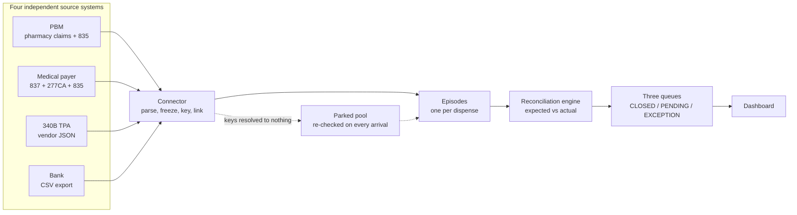

Note the dotted line. It is not decoration — it is roughly where the interesting half of the engineering lives, and Part IV is mostly about it.

**The mental model to carry out of the room:** *one dispense creates one episode; the episode has two tracks; each track gets a verdict; the two verdicts roll up into one of three dispositions, which decides which queue it sits in.*

---

# PART I — The domain, refreshed

## 2. Who owes you money, and for what

**What it is:** the **operator** here is a health-system specialty pharmacy — the business that physically handed over or infused the drug, and is therefore owed money. The user of this system is their back-office finance team, the people who at month end have to answer "we dispensed $4.2M of drug; where is it?"

Money can arrive from three payers, and a fourth feed only proves it landed:

| Source                                 | Pays for                                                      | Arrives as                              |
| -------------------------------------- | ------------------------------------------------------------- | --------------------------------------- |
| **PBM**                          | Pills and self-administered drugs picked up at a counter      | ACH deposit, explained by an 835        |
| **Medical payer**                | Drugs a clinician administers — infusions, injections, chemo | ACH deposit, explained by an 835        |
| **Manufacturer**, via a 340B TPA | A rebate on what the drug*cost*, if the dispense qualified  | ACH deposit, explained by a vendor file |
| **Bank**                         | Nothing. It is the proof, not a source                        | CSV line                                |

**Why the distinction matters:** each of those three is a genuinely separate counterparty with its own contract, its own timeline, and its own failure modes. A reconciliation system that models "the payer" as one thing cannot represent the most valuable exception in the domain — a claim the insurer denied while the manufacturer paid the rebate anyway, which leaves you *net negative* on a dispense you were never paid for. You will see that case again in §25.

**Where it shows up:** the moment somebody in the interview asks "why not just one reimbursement table?", this is the answer. Two roads, two contracts, two identifier universes, two clocks. Collapsing them saves a table and deletes an entire class of exception.

---

## 3. The pharmacy benefit road

This is the road most people picture when they hear "pharmacy claim", and it is the one with the most counter-intuitive structure. Worth the extra space.

**What it is:** a patient walks up to a counter. The pharmacy transmits a claim to the **PBM** — the Pharmacy Benefit Manager, a contractor the health insurer hires to run the drug benefit — and gets an answer back *in seconds*, while the patient is standing there. That answer includes the price. The pharmacy then hands over the drug. The actual money shows up weeks later, in a batch, covering dozens of claims at once.

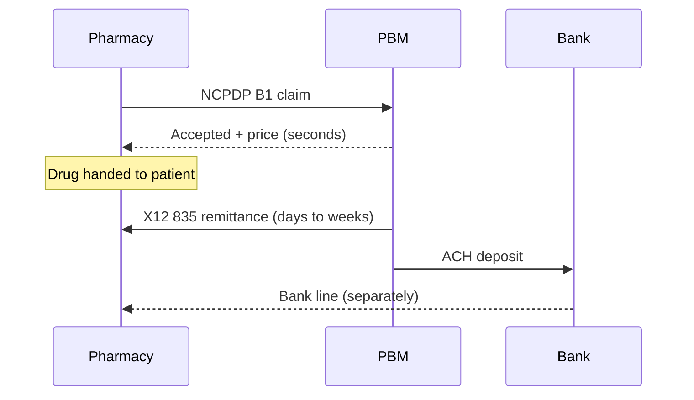

Two things about that picture are load-bearing.

First, **the PBM is not the insurer** but for reconciliation purposes it may as well be — it adjudicates, it holds the contracted rate, and it is the party that owes you. The insurer behind it never appears in any feed at all, which is why it is explicitly out of scope here.

Second, **adjudication and payment are two entirely separate documents arriving weeks apart.** The B1 response tells you what you are owed. The 835 tells you what you are being paid. They are not the same number often enough for that gap to be the product. NCPDP runs the counter conversation (a standard called Telecom D.0, with B1 for a claim and B2 for a reversal); X12 runs the money conversation (the 835 remittance advice). Different standards bodies, different vocabularies, and — critically — **different identifiers**.

**The practitioner's detail worth knowing:** on a *pharmacy* 835, the field that is supposed to identify the claim, `CLP01`, is not a claim number. It is the prescription number with the fill number glued onto the end after the literal word `FILL` — so fill 00 of Rx 7845102 arrives as the string `"7845102FILL00"`. That is NCPDP's documented convention, not a quirk of this dataset, and pulling it back apart is a genuine parsing step in the connector. If you mention this unprompted, you sound like someone who has actually read an 835.

**And one more, because a verdict depends on it:** there is no "this claim is closed" transaction in the pharmacy world. Settlement is read off `CLP02`, the claim status code — `"1"` means paid and finalised, while `"19"` or `"25"` mean money moved but the receivable is *not* closed. A remittance that shows `19` and is never followed by a `1` line is money in the bank against an account that is still technically open. That is a real exception (`A-06`, "missing settlement"), and it only fires if you read `CLP02` correctly.

---

## 4. The medical benefit road

**What it is:** the same drug company's product, but infused in a clinic rather than picked up at a counter, is not a pharmacy claim at all. It is a *medical* claim, billed on an 837 to the patient's medical insurer, and the answer comes back weeks later on an 835.

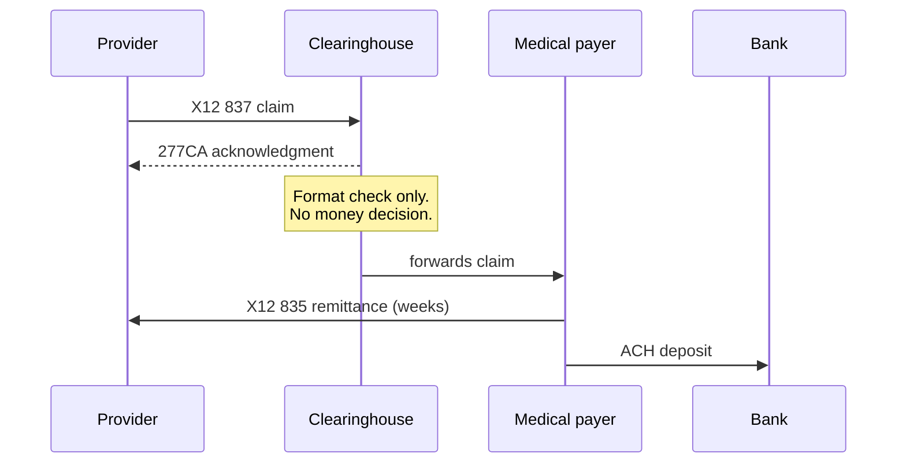

**Why the shape differs:** the intermediary does much less work here. A PBM *adjudicates* — it decides and prices the claim on the plan's behalf. A **clearinghouse** decides nothing about money; it validates the file's structure and routes it. The 277CA it sends back means "this parsed and I forwarded it", not "this will be paid." That is precisely why the medical road has an extra acknowledgment hop the pharmacy road lacks entirely, and why medical is asynchronous where pharmacy is synchronous.

**The practitioner's detail:** the medical claim has *two* identifiers and only one of them is stable. `CLM01` is the Patient Control Number — yours, you assigned it, it never changes for the life of the claim. `CLP07` is the payer's own Internal Control Number, and the payer typically mints a **brand-new one every time it reprocesses the claim**, while `CLM01` sits unchanged. A connector that treats `CLP07` as the claim's identity will silently fork one claim's history into unrelated fragments the first time an appeal goes through. This system keys on `CLM01` and merely *records* `CLP07`.

**One more you will be glad to have:** there is no "appeal" flag on the wire. An appeal shows up either as a replacement 837 (frequency code `7`, which fully replaces the original — whatever the new file omits is *dropped*, there is no merge) or as a credit line inside the 835's provider-level adjustment segment. Both are real, both are modelled, and neither announces itself.

---

## 5. The 340B rebate road

**What it is:** 340B is a federal program letting qualifying hospitals buy drugs at steep discounts. The mechanic that matters for reconciliation is this: **340B changes only what the drug cost you, retroactively.** The patient pays the same. The payer pays the same. Nobody on the revenue side knows anything happened.

The worked example is the fastest way to hold it: you buy the drug for $70 and you get reimbursed $100 regardless. If this dispense qualifies for 340B and the 340B ceiling price is $25, you are owed $45 back. That $45 is a separate receivable, from a completely different counterparty, with its own paperwork and its own bank deposit.

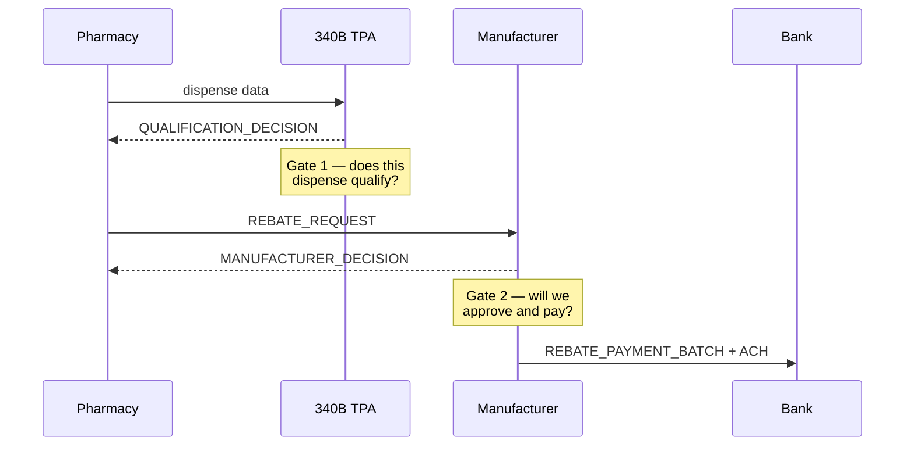

**Why it produces its own exceptions:** there are **two independent gates operated by two different parties.** The TPA decides *qualification* — the patient-definition test, run per individual dispense. The manufacturer decides *approval and payment*, on entirely separate grounds. "Qualified but never paid" is therefore a real, common, and valuable state, and no single-gate model can express it.

Two other things shape the data. The covered entity's enrolment is a standing status, but each dispense still has to pass the patient test — so qualification is per-claim, not per-hospital. And roughly 30–60% of claims at a health-system specialty pharmacy carry a rebate at all, which is why the 340B track is modelled as *optional* while the reimbursement track is mandatory.

**The documented simplification, and say it before they ask:** there are two real-world 340B mechanics. **Rebate** — the manufacturer sends cash back. **Replenishment** — the wholesaler ships you discounted replacement stock and no cash ever moves. Replenishment actually dominates in practice. This system models the rebate mechanism, deliberately, because it is the only version where 340B has a *bank leg to reconcile* — and because the assignment's own wording ("manufacturer payment", "unmatched rebate") describes the rebate model. That is a scoped assumption, not an oversight, and owning it is stronger than being caught by it.

**The practitioner's detail:** the 340B feed is the worst-quality feed in the system *on purpose*. No X12, no standards body, no trace number — a vendor JSON export. That is the honest state of the 340B TPA market, and degrading it would make the crosswalk easier in a way that real operators never get.

---

## 6. Why there is no universal claim identifier

This is the most important section in Part I, and it is the premise the entire architecture rests on.

**What it is:** there is no field — none — that appears in all four feeds and identifies the same claim. There are **three separate identifier universes**, and the pharmacy and medical ones share literally nothing, because they were standardised by different bodies for different rails.

| Feed                     | What it identifies claims by                                                                                                                                                |
| ------------------------ | --------------------------------------------------------------------------------------------------------------------------------------------------------------------------- |
| **PBM / pharmacy** | `{pharmacy NPI, Rx number, fill number, date of service}` plus an NDC. Separately, a PBM-assigned authorization number that never leaves the PBM                          |
| **Medical**        | `CLM01`, which you assigned and which is echoed back; and `CLP07`, the payer's own ICN, which changes on reprocessing                                                   |
| **340B TPA**       | The pharmacy natural key, or`{provider NPI, NDC, service date}` for clinic-administered drugs. Never the PBM's authorization number                                       |
| **Bank**           | A 15-digit ACH trace number — pure plumbing, zero business content — and`TRN02`, the payer's reassociation reference, present only if the addenda survived transmission |

**Why this is the whole problem:** linking the four feeds is therefore not a join. It is **three separate bridges, each with its own documented failure mode**:

- **PBM ↔ 340B** links on a natural key only. It breaks when the TPA lags, or when eligibility flips retroactively after the claim was already scored.
- **837 ↔ 835** links by round-tripping `CLM01`. It breaks when the payer reprocesses and reassigns an ICN.
- **835 ↔ bank** links on `TRN02`. It breaks *constantly*, because most bank exports strip the CCD+ addenda record that carries it. An entire industry operating rule — CAQH CORE Rule 370 — exists purely to make this work, and it still fails in practice roughly one deposit in five.

**The practitioner's detail that gets remembered:** the bank line carries no claim identifier at all, so it **resolves in two hops** — trace number finds the remittance, and the remittance holds the claim list. One deposit can touch dozens of claims. That is not a modelling choice; it is what a bank export is.

**And the design decision that follows from it, which you should be ready to defend:** the connector does **no identifier normalisation** on the primary match path. No stripping leading zeros, no case folding, no trimming. There is not a single `lstrip("0")` in the package, and a test asserts the behaviour it would break — `test_a23_key_builders_do_not_normalise` requires a zero-padded Rx to build a *different* key from a bare one. (No test greps the source for the call. Worth saying, given this document's own advice two sections down: grep for the test before believing the sentence.) If a feed spells the Rx number `07845102` and another spells it `7845102`, that match is *meant* to fail — because the failure is the exception the system exists to surface. Normalising it away would be the engine quietly covering up the thing it was built to find. (Re-rendering a date from `CCYYMMDD` to `YYYY-MM-DD` is allowed, and the line is precise: re-rendering *one* value is parsing; deciding *two* values match is normalisation.)

That is thread #1, and it will keep coming back.

---

# PART II — Where the data comes from

## 7. Four blind generators and one orchestrator

**What it is:** the synthetic data is produced by four independent generators — PBM, medical, TPA, bank — plus an orchestrator that coordinates them. The split is strict: **the orchestrator decides everything and formats nothing; the generators format everything and decide nothing.**

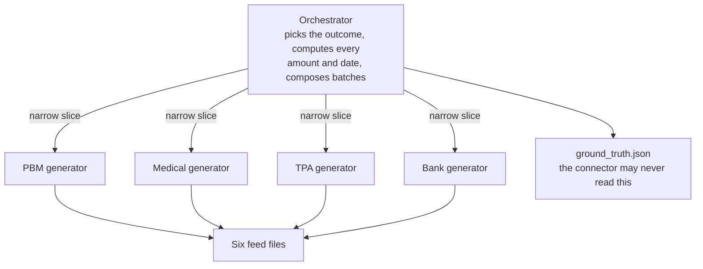

**Why it is built this way:** if you generate from a canonical model outward, every feed inherits the same primary key, the crosswalk becomes a no-op join, and you have tested nothing. So each generator receives only what its real source system would actually know — its own identifiers, its own format, its own timing — and is structurally forbidden from seeing the episode identity.

That is enforced, not requested. A runtime assertion walks every slice handed to a generator and fails the build if any field name is on a forbidden list (`episode_id`, `verdict`, `expected_reimbursement_cents`, and others) or if any string *value* looks like an episode id. Worth knowing why that assertion exists: it was written, correct, imported — and **never called**, so the isolation it claimed to enforce was unenforced for a while while reading as covered. When it was finally wired up it immediately caught that every slice was embedding the episode id through a reference field.

**Where it shows up:** the orchestrator alone writes `truth/ground_truth.json`, and the ingestion package is structurally unable to reach it — `load_feeds` takes a *feeds directory* path, so the truth directory is not on any path it can construct. That is what makes the crosswalk **scoreable rather than assumed**: you can measure how many episodes the connector reassembled correctly, against an answer key it provably never saw. Current numbers: 54 of 54 resolvable episodes on the demo profile, 1,349 of 1,354 (99.6%) on full.

---

## 8. How an episode is decided before it is written

**What it is:** before any feed file exists, the system already knows the complete state space it is drawing from. A separate `decision_tree/` package exhaustively enumerates every legal combination of choices an episode can make — was it a pharmacy or medical claim, was it rejected, did a payment arrive, was it full or partial, did cash land, was there a reversal, did 340B qualify, did the manufacturer approve — and validates each choice against the ones above it.

The measured result:

```
unconstrained cross-product     12,093,235,200
valid configurations                     4,224
verdict pairs                  31 x 12 =   372   all 372 reachable
coherent / anomalous               3,860 / 364
deterministic rules             43 track + 7 cross-track = 50
if-checks per episode           min 10, avg 21, max 32
```

**Why that matters more than it looks:** over 99.99% of the naive cross-product is structurally impossible, and the enumeration is what proves *which* 0.00003% is real. Two payoffs. First, **all 372 verdict pairs are reachable**, which proves the two tracks are independent at the verdict level — so every cross-track rule is an *annotation* and never a prohibition, and the engine needs no cross-track validity table at all. Second, the resulting `pairs.json` is loaded as a **live test oracle**: a coverage test fails if the generator ever stops producing any one of the 372.

**The practitioner's detail:** the first hand-enumeration of this state space was `34 × 15 = 510` and was wrong in four separate ways that partially cancelled out. A claimed "60× frequency spread" across pairs turned out to be **252×**. The lesson is the one the finding recommends: measure, do not assert. It also drives a real design constraint — with a 252× spread and 99 of the 372 pairs having exactly *one* configuration behind them, sampling has to stratify over **verdicts**, never configurations, or the rarest and most valuable cases vanish from every sample.

---

## 9. The seeded defects

**What it is:** the generator deliberately injects broken data. Not noise — named, rate-controlled, individually reachable defects, because a reconciliation system with clean inputs demonstrates nothing.

The seven feed-level ones, which sit orthogonal to the 372 verdict pairs rather than multiplying into them:

| Code          | What it is                                                                                       | Where                                             |
| ------------- | ------------------------------------------------------------------------------------------------ | ------------------------------------------------- |
| **D-1** | Duplicate delivery — the same payload arrives twice with a later timestamp                      | any feed, 3%                                      |
| **D-2** | Late arrival —`received_at` shifted 7–45 days while the event dates stay put                 | any feed, 8%                                      |
| **D-3** | Orphan deposit — a bank credit attributable to nothing                                          | bank, 2%                                          |
| **D-4** | Orphan rebate — a rebate deposit whose allocation code was lost in transit                      | bank + TPA                                        |
| **D-5** | *Not generated.* Malformed records were an invented requirement and were dropped               | —                                                |
| **D-6** | Crosswalk miss — the Rx number is spelled differently in two feeds, so the join genuinely fails | PBM 835**or** TPA, 6% drift + 2% truncation |
| **D-7** | Allocation residual — a forward-balance adjustment carrying no reference at all                 | 835, 5%                                           |

On top of those, each feed carries its own list: underpayments where the contractual adjustment does *not* explain the whole gap, overpayments, duplicate payments, missing settlement, recoupments landing on a later batch, silent replacement 837s that drop a service line, ICN discontinuity, appeals arriving two different ways, contract-pharmacy restrictions, patient-definition failures, and a quota of medical 340B key collisions so the ambiguous-match path fires at a known rate.

**Why D-5 being absent is worth saying out loud:** it was invented. A planning agent wrote "malformed records" into a requirements document, formatted identically to the real requirements, and it propagated into every downstream plan before anyone checked that the source assignment never asked for it. Being able to say *"we dropped that one because it was never in the brief"* is a better answer than having built it.

**The practitioner's detail:** only one injection rate is actually sourced — the ~20% addenda-loss rate that strips `TRN02` from bank lines is an industry figure. Every other rate is an estimate, and all of them live as named constants in one config file rather than as literals sprinkled through the generators. That is the difference between a tunable dataset and a fixed one.

---

## 10. Why the same seed gives the same bytes

**What it is:** run the generator twice with the same seed and you get byte-identical files. The manifest SHA-256s every feed file so you can prove it with a diff rather than a promise.

**Why it is harder than it sounds:** every random stream in the system is a *fresh* generator seeded from a canonical path string — master seed, profile, generator name, episode id — hashed with `blake2b`. Not Python's built-in `hash()`, which is salted per process by `PYTHONHASHSEED` and would make output irreproducible across runs; an AST-walking test fails the build if `hash()` ever appears in a seeding path. And because each stream's seed derives from its own path rather than from shared mutable state, **inserting one episode never reshuffles any other episode's output** — seeds are order-independent *and* insertion-independent.

The same discipline runs through the engine. There is no wall clock anywhere: `config.py` is AST-tested to contain no `.now()`, `.today()` or `.utcnow()`, and the engine stamps every computed verdict with the constant `1970-01-01T00:00:00Z` specifically so two runs over identical data produce identical rows.

**Where it shows up:** two profiles. `demo` is 60 episodes, curated so every named edge-case family is guaranteed present — that is the one you demo. `full` is 1,500 episodes, stratified so all 372 verdict pairs are covered by arithmetic rather than by luck; it refuses to build below 372 episodes because it could not keep that promise.

---

# PART III — One claim, end to end

## 11. Setting the scene

Here is the claim we are going to follow. The figures are illustrative but the *shapes* are exactly what the system produces, and the arithmetic is real — you can reproduce every number in this part from the formulas.

> **The dispense.** On 3 September, the pharmacy dispenses 30 units of IBRUTINIB — an oral specialty drug, so it travels the **pharmacy benefit** road. The patient is covered by MERIDIANRX. The hospital is a 340B covered entity and the pharmacist flags the dispense as 340B-related at the point of sale.

That single act is about to produce records in four feeds over the next three weeks, and the system's job is to put them back together without any of them agreeing on what to call the claim.

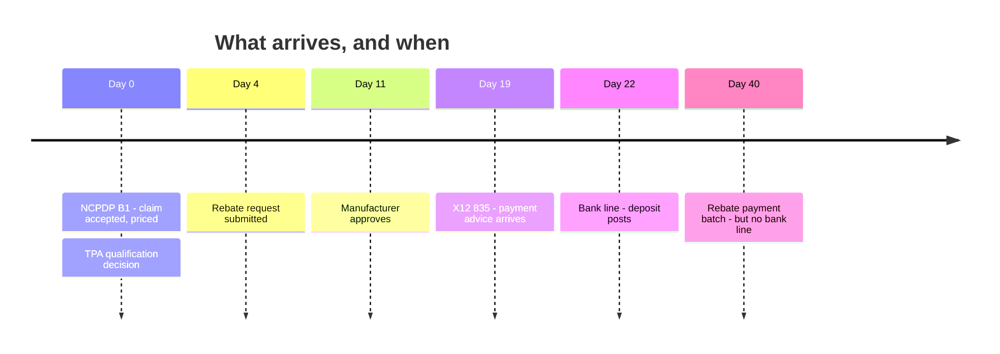

---

## 12. Day 0 — the claim, and what the PBM says back

The pharmacy transmits an NCPDP **B1**. Seconds later the PBM answers, and the connector's first record looks like this:

```
record_id                    PBM-EVT-000418
source_system                PBM_ADJUDICATION
transaction_code             B1
received_at                  2025-09-03T14:22:07Z
service_provider_id           1417...          <- the pharmacy's NPI
prescription_ref_number       7845102
fill_number                   00
date_of_service               2025-09-03
product_service_id            0007-4444-30     <- the NDC
quantity_dispensed            30
bin / pcn / group_id          604211 / ...
submission_clarification_code 20               <- the 340B flag
response_status               A                <- accepted
authorization_number          8H4K2Q7R         <- PBM-assigned, opaque
total_amount_paid             13679.75
```

Three things to notice, because each one causes work later.

**There is no claim number.** The claim's identity is the *composite* `{service_provider_id, prescription_ref_number, fill_number, date_of_service}`. Nothing here is a surrogate key. The `authorization_number` the PBM assigns is opaque, useful only between you and the PBM, and — importantly — it never reaches the TPA.

**`submission_clarification_code = 20` is the 340B flag.** That is NCPDP field 420-DK. It is the only signal at the point of adjudication that this dispense is 340B-related, and note what it is: *a flag on somebody else's record*, not an identifier of its own. It is why the pharmacy-side 340B bridge has to be a natural key.

**`total_amount_paid` is a promise, not money.** It is what the PBM says it will pay. Whether it does is a separate document, three weeks out.

And the arithmetic behind that promise, which the engine will independently recompute later from the same contract terms:

```
charge          = WAC $520.00 x 30 units              = $15,600.00
contracted      = charge x (1 - 12% rate) + $1.75 fee = $13,729.75
patient copay   = flat                                = $    50.00
expected        = contracted - copay                  = $13,679.75
```

---

## 13. Ingest — from a line of text to a claim object

**First, the handover.** The generator wrote our B1 to disk as a single line of JSON in `pbm_claim_events.jsonl`, and then the whole generation program exited. What survives is six files in a folder and nothing else. The connector is a **separate program** that never ran the generator, cannot ask it anything, and sees only what a vendor SFTP drop would look like on a Monday morning. Everything below happens on that side of the line.

**It runs in two passes, not one.** Pass one reads all six files and dumps every line into `raw_record` — nothing is parsed yet. Pass two replays every stored line **sorted by arrival time across all six files together**, and parses them in that order. That second sort is the point: a bank line from 22 September is processed after a pharmacy claim from 3 September even though they live in different files, so the replay reproduces the order the world actually happened in.

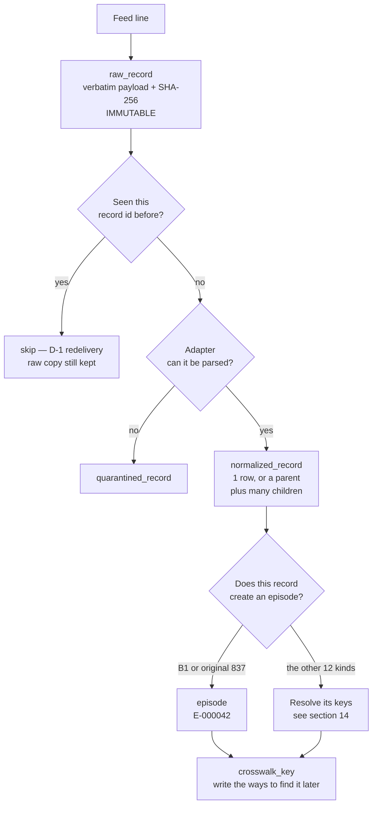

**Notice that both branches end in the same place.** Whether a record creates an episode or attaches to one, the last thing it does is write rows into `crosswalk_key` — the reverse-lookup table that says *"if a future document quotes this string, it means this episode."* Our B1 writes three of them on day 0, and those three rows are the only reason the remittance can find anything on day 19. A record that created an episode and wrote no crosswalk rows would be permanently unreachable.

**One line does not mean one row.** An 835 batch is a single line of the feed file and becomes many rows — one `REMITTANCE` envelope carrying the deposit total and trace number, plus one `REMITTANCE_CLAIM_LINE` child per claim (capped at 24, though the demo profile's batches run far smaller — the largest observed is 15 rows), plus a `PROVIDER_LEVEL_ADJUSTMENT` child per PLB entry. The children point back at the envelope through `parent_norm_id`, which is a self-reference inside the same table. That split exists because the money identifier lives on the envelope while the claim identifier lives on the line.

**And only two of the eighteen record kinds create an episode** — a pharmacy `B1` and an original medical `837`. Two more, the `REMITTANCE` and `REBATE_BATCH` envelopes, are resolution roots that neither create nor attach. The remaining fourteen attach to an episode that already exists, which makes sense said out loud: an 835 does not create a claim, it *answers* one.

Three design points here are worth defending.

**The raw layer is kept forever and separately.** Not for sentiment — because the interview will ask how an investigator traces a number back to its source. The chain is `verdict → verdict_evidence → normalized_record → raw_record → ingest_batch`, and lineage runs *downward* deliberately so that "show me the source line behind this figure" is one join. The API exposes it as a single endpoint that returns the verbatim payload plus both hashes, so a reader can verify the record *and* the file it claims to come from.

**Money becomes integer cents at the boundary and** **never leaves.** There is exactly one conversion function, and it **refuses to accept a Python float** — it raises rather than converting, with the reason in the error message: a binary float round-trip leaves a residue indistinguishable from a real one-cent underpayment. JSON is parsed with `parse_float=Decimal` so a float never exists in the first place. A schema test greps every money column and asserts it is declared `INTEGER`; another asserts the word `REAL` appears nowhere in the DDL.

**Idempotency runs at two levels.** File-level: the whole feed file's hash is unique, so re-loading it is a no-op. Record-level: `(record_kind, idempotency_key)` is a unique index, keyed on the **source record id**, never on a natural key. That distinction is subtle and load-bearing — D-1 is the *same record* delivered twice and must collapse; a genuine duplicate *payment* is two different records describing two real events and must not. Collapsing on a natural key would merge them and silently delete two reachable states from the system.

**So four tables get written for our one B1.** `raw_record` gets the photocopy. `normalized_record` gets the parsed row. `episode` gets `E-000042` — a pharmacy-track claim carrying the Rx number, NDC, quantity, date and the 340B flag, written **once** and then frozen by a trigger. And `crosswalk_key` gets three rows naming the three different strings a future document might use to refer to this claim.

That last table is the one the next section is about, and it is worth being clear about why the same identifiers appear in two places. The `episode` row is the claim's *description* — you read it once you already know the episode id. The `crosswalk_key` rows are a *reverse lookup* — you read them when a document arrives quoting some string and you have no idea whose it is. Opposite directions, and one table cannot serve both, because an episode has one description and four or five different names across four feeds.

---

## 14. The crosswalk — publish and look up

This is the mechanism the whole architecture is organised around, so it gets the full treatment.

**What it is:** every record, on arrival, does two things. It **publishes** the keys it makes resolvable, and it **looks up** the keys it needs someone else to have published. Both go through one table, `crosswalk_key`, as a point seek on `(key_type, key_value)`.

There are exactly eight key types under Decision A24, one per bridge. *(The connector layer later added four more — `BEACON_ID`, `COVERED_ENTITY_340B`, `HCPCS`, `PAYMENT_REFERENCE` — additively, leaving all eight below unchanged. All four are published on an ordinary run now that Beacon's three inbound payloads load with every build.)*

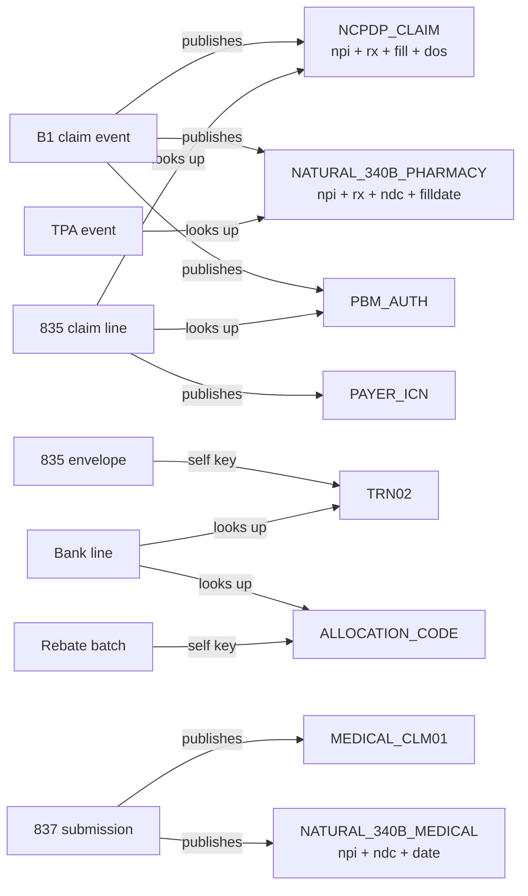

**Why one file builds all of them:** because building key strings in two places is exactly how you end up with a crosswalk that works perfectly for pharmacy claims and silently misses every medical one. Every key in the system is constructed by one module, and the 835 side of the pharmacy bridge *reconstructs* the `NCPDP_CLAIM` key by splitting `CLP01` back into Rx and fill — the parsing step from §3, now doing real work.

**What happens when a lookup finds nothing — and this is the interesting half.** There are five outcomes and no tie-breaks anywhere:

| Outcome                                            | What the connector does                    |
| -------------------------------------------------- | ------------------------------------------ |
| Exactly one match                                  | Attach it                                  |
| Keys present, nothing matches                      | **Park** it: `NO_KEY_MATCH`                |
| More than one match                                | **Park** it: `AMBIGUOUS_KEY_MATCH`         |
| No usable keys at all                              | **Park** it: `NO_KEYS_PRESENT`             |
| One match, but it names a different covered entity | **Park** it: `COVERED_ENTITY_MISMATCH`     |

*The fifth was added by the connector layer (requirement E1) and is the only one where the keys
resolved perfectly. The record and the episode simply disagree about whose 340B claim it is, and
attaching would credit one covered entity's savings to another. Silence is never a contradiction:
the check fires only when both sides name an entity and the two differ.*

A parked record is *held*, not discarded — "the claim is not missing, the mapping failed", which is a different problem with a different owner. And every subsequent arrival does a **backward re-check**: it probes the parked pool for anything that now resolves against the keys it just published. That is what lets an out-of-order bank deposit retroactively clear a park from three weeks earlier, with no window to tune and no sweep job to schedule.

**The practitioner's detail:** the weakest key in the set is `NATURAL_340B_MEDICAL` — `{provider NPI, NDC, service date}` — because a clinic-infused drug has no prescription number to key on. Two administrations of the same drug at the same site on the same day are *genuinely indistinguishable*, and the system's answer is to park the ambiguity rather than pick. Picking one is a coin flip that attributes real money to the wrong episode and looks identical to a correct match in every report afterwards. The generator seeds these collisions at a known rate specifically so that path is exercised.

---

## 15. Day 19 — the 835 arrives, and it is short

Sixteen days later the PBM sends a remittance. One line in the feed is one **whole 835 batch** covering up to 24 claims, with our claim as one nested entry:

```
record_id        PBM-835-000073
bpr              total_actual_provider_payment: 284,916.03
trn              reassociation_trace_number: 042088311907744
claim_payments[]
  ...
  clp01_patient_control_number   7845102FILL00     <-- rx + FILL + fill no.
  clp02_claim_status_code        1                 <-- settled
  clp03_total_charge             15600.00
  clp04_payment_amount           12311.78          <-- short
  clp05_patient_responsibility      50.00
  clp07_payer_claim_control_number » payer's ICN
  adjustments[]
    CO-45  1870.25                                 <-- contractual write-off
  ...
```

The connector splits `CLP01` into `("7845102", "00")`, rebuilds the `NCPDP_CLAIM` key, resolves it to `E-000042`, and attaches. The envelope separately publishes its `TRN02` as a **self key** — a key that resolves to the remittance itself, never to a claim — which is the first hop of the bank bridge, three days from now.

**The question the engine now has to answer: is this an underpayment, or is it just the contract?** A CO-45 is a *contractual adjustment* — the legitimate difference between what you charged and what you agreed to accept. It is not a problem. So the discrimination is arithmetic, not a flag:

```
residual = charge - payment - sum(adjustments)
         = 15,600.00 - 12,311.78 - 1,870.25 - 50.00
         = 1,367.97
```

A residual of zero means the adjustments fully explain the gap and this is a clean contractual write-down. A **non-zero residual means money is genuinely missing**, and that is what we have. The verdict will be `A-07`, underpaid.

Note that this is the one sanctioned exception to the identity `clp03 = clp04 + Σ(adjustments)` — the generator injects underpayments precisely by breaking it, with a CO-45 that does not cover the whole gap. If the identity always held, there would be no underpayment to find.

---

## 16. Day 22 — the bank line, and the two-hop resolution

Three days after the remittance, a deposit posts:

```
posting_date, description, ach_trace_number, trn02, company_name, amount, type
2025-09-22, "ACH CREDIT MERIDIANRX", 021000021907744, 042088311907744, MERIDIANRX, 284916.03, CREDIT
```

That line contains **no claim identifier whatsoever**. It resolves in two hops:

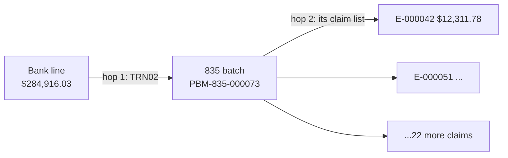

**Why allocation is real work and not a footnote:** one deposit against many claims means "did this episode's money arrive?" is a question about the *allocation*, not about the bank row. The connector splits the deposit back across the remittance's claim lines and writes one `cash_allocation` row per episode, recording the **basis** on which each link was made — `TRN02`, `ACH_TRACE`, `ALLOCATION_CODE`, `AMOUNT_DATE` or `RESIDUAL`. Recording the basis is what lets a reader later distinguish "we know this matched" from "we inferred this matched." The same splitter serves the 340B rebate batches, which have exactly the same one-to-many shape under a different key.

**When hop 1 cannot start at all:** about one deposit in five arrives with the CCD+ addenda stripped, so `TRN02` is simply absent. The fallback is amount-and-date: find a remittance with the exact same amount whose settlement date is within **three calendar days**. The window is CAQH CORE Rule 370's ±3 *business* days, taken rather than invented. And it holds the same line as everything else — **two candidates park rather than guess**. A residual false-positive rate on that path is inherent, not a defect, which is precisely why the basis is recorded on every allocation row.

---

## 17. The engine — dimensions, verdict, disposition

We now have everything. Here is where the number gets made, and this is the section to have cold.

**What it is:** the engine is a pure function. Give it an episode and a point in time, and it reads every record visible at that point, derives an abstract description of what happened, classifies it, and appends a row. It never mutates anything and it never writes to the records it read.

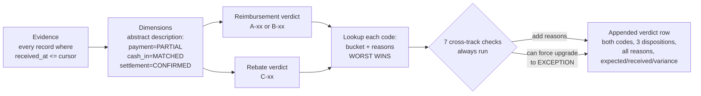

**Read the order carefully, because it is the opposite of what most people assume.** The bucket is decided by the two verdict codes alone — each code has its bucket sitting next to it in a lookup table, and the episode takes the worse of the two. The seven cross-track checks run *after* that, and all they can do is attach extra reasons or **force an upgrade to EXCEPTION**. They never move an episode down. That matters because it means an episode's bucket is explainable from its two codes first, with the cross-track story as an overlay rather than a hidden input.

**And the row it writes is not just the bucket.** One row per `(episode, cursor)`, and it carries the whole answer:

```
episode_id  E-000042        cursor_at  2025-09-25T23:59:59Z
reimbursement_verdict_code  A-07       rebate_verdict_code  C-09
episode_disposition         EXCEPTION
reimbursement_disposition   EXCEPTION  rebate_disposition   EXCEPTION
expected_reimbursement_cents  1367975  received  1231178  variance   136797
expected_rebate_cents          686400  received        0  variance   686400
reopened_from  NULL   previously_closed_at  NULL   reopened_on  NULL
engine_version  ...    reference_fingerprint  ...
```

Plus three child tables hanging off it: the reasons, the cross-track flags that fired, and — the one that makes the whole thing auditable — `verdict_evidence`, the list of exactly which source records this answer was computed from.

Note what is **not** in there: no age column, no SLA, no due date. Aging is `cursor − date_of_service` computed when somebody looks. And the table is append-only, enforced by a trigger that aborts with `verdict log is append-only`, so the row above never changes — the next document simply produces a new row at a new cursor.

**The three stages, plainly.** *Dimensions* turn raw records into a handful of abstract values — was the claim rejected, did a payment arrive, was it full or partial or over, did cash land, was there a reversal or a recoupment, did settlement confirm. *Classification* maps those onto a verdict code: 16 pharmacy codes (`A-xx`), 15 medical (`B-xx`), 12 rebate (`C-xx`). *Composition* rolls the two verdicts into one disposition. Between 10 and 32 `if`-checks run per episode, averaging 21.

**Why there are two verdict axes and not one:** because the reimbursement story and the rebate story fail independently and you need to see both. `A-04 / C-08` is "paid, cash matched, settled — and the rebate landed too." `A-07 / C-09` is "underpaid, and separately the approved rebate never arrived." Those are two different pieces of work for two different people, and a single collapsed status would hide one of them. The 372-pair enumeration is the proof that they really are independent.

For our claim: payment is `PARTIAL`, cash is `MATCHED`, settlement is `CONFIRMED` from `CLP02 = "1"`, no post-payment event. That is **`A-07` — underpaid**, disposition `EXCEPTION`, reason `UNDERPAID`.

**The practitioner's detail worth stealing:** branch order inside the classifier is load-bearing and commented as such. Post-payment events — a reversal, a recoupment — are tested **before** the payment amount, because they *redefine* what the payment means. A claim that was paid in full and then clawed back is not a paid claim with an asterisk; it is a clawback. Get that order backwards and the verdict is wrong in a way that still looks plausible.

**And the thing that makes it trustworthy:** the classifier is a *line-for-line hand port* of the decision-tree prototype, deliberately not a reimplementation, and a test runs it against all 4,224 oracle configurations with **no tolerance** — one divergence is a failure, because one divergence means the port is no longer the thing that was proved. (The docstring claiming that test existed was written before the test did. It was found by a documentation audit, not by code review. Grep for the test before believing the sentence, especially when you wrote the sentence.)

---

## 18. Expected versus actual, and the tolerance that is zero

**What it is:** variance is `expected − received`, in integer cents, signed. Positive is a shortfall; negative means you were overpaid.

**Where "expected" comes from:** the engine recomputes it from the contract terms — drug, payer, quantity — using the **same pricing module the generator used**, never from a stored value and never from ground truth. That is the deterministic boundary in its most literal form: the number is born in Python, from reference data, at read time.

```
expected_reimbursement = contracted_allowed - patient_responsibility
                       = $13,679.75
received_reimbursement = sum of cash_allocation rows for this episode
                       = $12,311.78
variance               = $ 1,367.97
```

Which, satisfyingly, is the same $1,367.97 as the residual in §15 — because `expected = charge − CO45 − PR`, so the residual arithmetic and the variance arithmetic are the same statement viewed from two directions. If those two ever disagree, something is wrong.

**The tolerance is zero, and defend that rather than apologise for it.** Cash matching is exact integer comparison with no epsilon. The reasoning is in the code: *a tolerance here would quietly absorb the one-cent variances the whole design exists to keep visible.* The configuration exposes three named tolerance constants — cash match, underpayment, rebate — all set to `0`, purely so a future per-tenant rule can read `abs(delta) <= tolerance_for(CASH_MATCH)` rather than `delta == 0`. The hook exists; the value is zero, deliberately.

**One more honest detail:** for a few terminal verdicts the expected amount is force-zeroed rather than carried forward — a claim rejected at the counter, a reversal before payment. Carrying an expectation against a claim that was never going to pay would report a variance that is not real.

---

## 19. The other half of the same claim — the 340B track

Running in parallel the whole time, on completely different paperwork:

| Day | Record                     | What it says                     |
| --- | -------------------------- | -------------------------------- |
| 0   | `QUALIFICATION_DECISION` | TPA: qualified                   |
| 4   | `REBATE_REQUEST`         | submitted to the manufacturer    |
| 11  | `MANUFACTURER_DECISION`  | approved                         |
| 40  | `REBATE_PAYMENT_BATCH`   | paid, with an`allocation_code` |
| —  | *bank line*              | **never arrives**          |

The TPA records resolve against the episode on `NATURAL_340B_PHARMACY` — `{pharmacy NPI, Rx number, NDC, fill date}` — because the TPA has never seen the PBM's authorization number and never will.

The rebate itself is a pure drug-economics calculation, unrelated to who reimbursed the claim:

```
spread = acquisition $416.00 - 340B ceiling $187.20 = $228.80 per unit
expected rebate = $228.80 x 30 = $6,864.00
```

The manufacturer approved and the batch says it paid. But the allocation code never resolved to a bank line, so received rebate cash is `$0.00`. That is **`C-09` — rebate approved, no cash**, disposition `EXCEPTION`, reason `REBATE_NO_CASH`.

**Why this is a good case to walk through:** it is money you are genuinely owed by a party most claim systems do not even model, sitting behind paperwork that says everything went fine. Nothing on the reimbursement side would ever surface it.

---

## 20. Rollup — two verdicts, one queue

**What it is:** each track's verdict maps to a disposition, and the episode takes the worst of them.

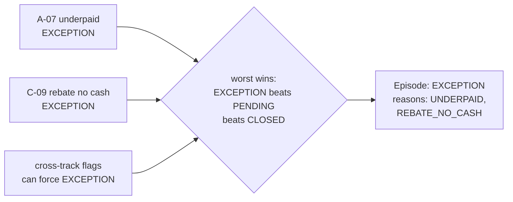

**Why exactly three dispositions:** because "what do I do with this?" has exactly three answers. Nothing (`CLOSED`). Wait — someone external owes you a response and no defect exists (`PENDING`). Work it (`EXCEPTION`). Everything finer-grained lives in the reason codes, which are a **list**, not a single value, because an episode can be underpaid *and* missing settlement *and* short on cash at once.

**The two refinements worth naming:**

**Reopened is a flag, not a fourth disposition.** When new information moves an episode backwards — `CLOSED` to anything, or `PENDING` to `EXCEPTION` — the row records `reopened_from`, `previously_closed_at` and `reopened_on`. Adding a fourth bucket would have been the obvious move and would have broken the "three answers" logic; as a flag it instead does useful work as a *ranking* signal, because a claim that settled and then came undone is a different kind of problem from one that never settled.

**Some terminal states are `EXCEPTION`, not `CLOSED`.** A lost appeal is finished, but it is not nothing-to-do — a system that quietly closed it would be deciding to write money off on the operator's behalf. That is somebody's decision to make, not the engine's.

Our claim lands in the exception queue with both reasons attached. Which brings us to the last structural idea in Part III.

---

## 21. The queue is a query, and the cursor is the clock

**What it is:** there is no exception queue table. The queue is a `SELECT` over the latest verdict per episode, filtered by disposition, ordered by one of five whitelisted sorts. A test literally asserts that no table in the schema has "queue" in its name.

**Why that is the load-bearing idea and not a detail:** if the queue were a table, things would *move into* it, and movement means state, and state means the queue can disagree with the verdicts. Because it is a query, it cannot. Delete the entire verdict log and it rebuilds by replay.

That works because of the **cursor**. Every derived read takes a point in time and filters `received_at <= cursor`. The generator has no concept of "now" — it writes the whole timeline. The engine processes what had arrived by a given instant.

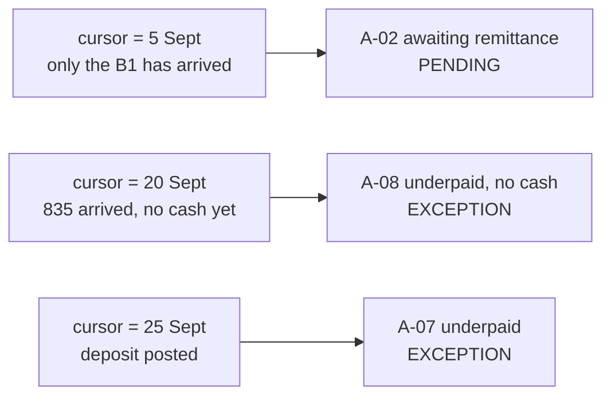

**Three things fall out of it for free, and this is the answer to "how do you handle audit".**

*"What did we believe on 31 March?"* is a cursor value. Forward and backward run the same code path; there is no separate historical query.

*Aging is never a verdict.* Days-open is `cursor − date_of_service`, computed in SQL at read time and never stored. SLA thresholds were removed deliberately. The payoff is exact and worth quoting: **an episode with no new inbound record cannot change disposition**, which makes event-driven incremental processing *provably* complete rather than an optimisation you hope is safe. Real deadlines exist — Medicare's 30-day ceiling, state prompt-pay statutes, CAQH's ±3 business days — but they are policy, and policy belongs in configuration, never as a field on a record.

*Replay is not a feature that had to be built.* It is what the design already is. `received_at` is the **only** field the pipeline adds to any record; every other date is native to its format and points backward. One documented exception: the NACHA effective entry date, which is a settlement instruction already transmitted rather than a forecast.

---

# PART IV — Where it gets hard

## 22. When the crosswalk misses

**What it is:** D-6. A record that is unmistakably about a claim, carrying an identifier that does not match. The generator produces it by rendering an Rx number differently in two feeds — `07845102` where the claim said `7845102`, or the last digit truncated.

**Why the system refuses to fix it:** because the miss is a real operational event with a real owner. "The remittance did not arrive" and "the remittance arrived and we could not match it" are different problems needing different people. Normalising the identifier would merge them into one and hide the more actionable of the two.

**What the operator actually sees:** the record parks. The episode keeps reading as whatever it was without that remittance — still `A-02`, *awaiting remittance* — because the engine's evidence query joins through the crosswalk, and a parked record has no crosswalk row. Meanwhile the episode's dossier surfaces the parked record separately, in an **unresolved** section: *documents that are probably about this claim but whose identifiers did not match.* That is D-6 from the claim's point of view, and it is deliberately not dressed up as a timeline event, because it did not happen to the claim.

**The practitioner's detail:** the feed-level reason codes — `CROSSWALK_MISS`, `ORPHAN_DEPOSIT`, `ORPHAN_REBATE`, `ALLOCATION_RESIDUAL`, `DUPLICATE_DELIVERY` — exist in the vocabulary but are **never attached to an episode's verdict**. They are computed as queries over the parked pool and the raw layer. A crosswalk failure is not a property of the claim it failed to reach; it is a property of the feed.

---

## 23. The netted recoupment — the best trap in the dataset

**What it is:** a payer decides it overpaid you on a claim last month. It does not send an invoice. It pays you **less** in a later batch and explains the difference in a segment of the 835 called `PLB` — provider-level adjustment — that does not belong to any claim in that batch.

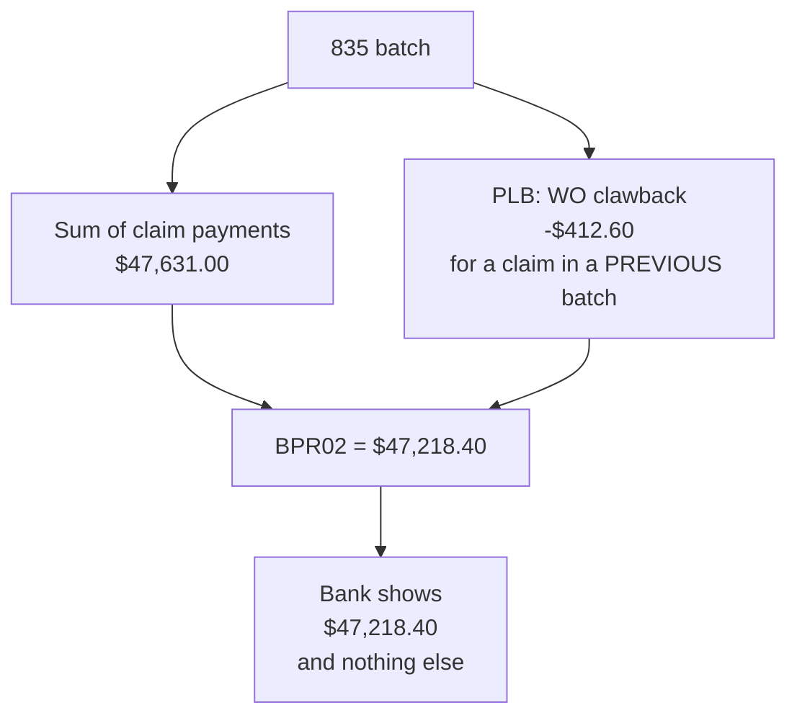

**Why it is the best trap:** the bank is structurally blind to it. The deposit is short and there is no explanation anywhere in the banking data, because the explanation exists only in a segment of a document the bank never sees. So `Σ(claim payments) − PLB = what hits the bank`, and if you reconcile the deposit against the claim list without reading `PLB`, every claim in the batch looks slightly underpaid and the real event — a clawback on a claim from six weeks ago — is invisible.

**Where it shows up:** six `PLB` reason codes are modelled and three actually arrive. `WO` is overpayment recovery, and it dominates. `RA` is a retroactive adjustment, which is how a won appeal often arrives. `FB` is a forward balance. `L6` — interest owed *to* you, negative, *increasing* the payment — along with `CS` and `72`, is defined and never emitted by any generator. Sign convention bit us once — an early draft of the feed spec had appeal credits positive, which is self-contradictory under `BPR02 = Σ(CLP04) − Σ(PLB, signed)` and was corrected.

**And the deliberate cruelty:** `FB` entries are generated with **no reference at all**, as D-7. The residual must be tracked as an unallocated forward balance, not absorbed into whatever claim happens to be nearby.

---

## 24. Reversal versus recoupment

**What it is:** two events, same money, same direction, opposite meanings.

A **reversal** is *pharmacy-initiated*. You transmit a B2 and cancel the claim — the patient never picked up, the wrong drug was billed. A **recoupment** is *payer-initiated*. The payer claws money back with a `PLB WO` line and there is no B2 anywhere.

**Why the distinction is not academic:** they have different owners, different remediation, and different implications for the 340B track sitting on top. A reversal means the dispense did not really happen, which means any rebate claimed against it is *invalid*. A recoupment means the dispense happened and the payer changed its mind, which means the rebate may still be perfectly valid — or may rest on claim facts now known to be wrong.

**How the system tells them apart:** the actor is the discriminator and it is visible on the wire. A B2 record exists or it does not. And a reversal is further split by timing, not by a different record — if no payment had landed yet it is pre-pay (`A-16`); if money had already moved it is post-pay (`A-10` if the cash went back out, `A-11` if it did not). Same NCPDP transaction, three verdicts, disambiguated entirely by what else was true at the time.

---

## 25. Cross-track flags, and `INSUFFICIENT_DATA`

**What they are:** seven checks that run on **every** episode after both tracks are classified independently. They are annotations, never prohibitions — which is exactly what the "all 372 pairs are reachable" proof licences.

The one to lead with in an interview is **X-1: reimbursement denied while rebate money is held.** The insurer refused to pay for the drug; the manufacturer sent you the 340B rebate anyway. Your net position on that dispense is *negative* — you are holding money you may owe back on a claim that paid you nothing. It is invisible to any system that models one track, which makes it the strongest walkthrough material in the dataset.

The others, briefly: **X-2**, rebate active on a dispense that never happened — not merely unmatched, *invalid*. **X-3**, a recoupment undermining a qualification that consumed the now-wrong claim facts. **X-5**, no cash on *both* tracks at once. **X-6**, total loss on every channel. **X-7**, an appeal won after the rebate was already clawed back, so the clawback's basis may be void. And **X-4**, which is explicitly the *not*-a-conflict case — reimbursement settled cleanly and only the rebate was rejected — carrying zero reasons and forcing nothing, so the engine does not over-report.

**`INSUFFICIENT_DATA` deserves its own paragraph** because the requirement was to say when the data is not enough, and there is a difference between an agent hedging and an engine *knowing*. There are exactly three places the engine deterministically knows it cannot decide:

1. **A clawback it cannot tie to any bank movement** — it may or may not have happened, and it may be double-counted.
2. **No cash on both tracks simultaneously** (X-5) — two payers failing independently on one episode is implausible; it is almost certainly one cause on our side, and the honest answer is that the engine cannot attribute it.
3. **An expected amount it could not price** — no contract terms for that payer and drug. This one is the sharpest: the alternative is reporting a variance against an expectation of zero, which would render a completely unpriceable claim as *perfectly clean*.

That third case is the one to quote if someone pushes on whether "insufficient data" is a real signal or a cop-out. It is the difference between an unknown and a false zero.

---

# PART V — Defending it

## 26. Six moves worth naming out loud

**One. Recompute, never mutate.** Verdicts are derived per `(episode, cursor)` and appended; the verdict log carries triggers that abort any update or delete. The exception queue is a query, not a destination. Delete the whole log and it rebuilds by replay. *The trade-off to own:* you pay storage and compute for a history nobody may ever read, and the answer is that you cannot retrofit an audit trail onto a system that overwrote its evidence.

**Two. Event-driven, never scan-driven.** The inbound document is the trigger and it carries its own lookup keys. Parse, extract keys, fetch only the episodes they resolve to, recompute those. A 200-day-old episode is touched the instant a document referencing it arrives, and there is **no window to tune** — which is the actual complaint about scan-driven designs, where correctness depends entirely on the window being wide enough and nobody can prove it is.

**Three. No identifier normalisation on the primary path.** Covered in §6. The failure is the feature.

**Four. Aging is never a verdict.** Covered in §21. It buys provable completeness for incremental processing.

**Five. Store everything, including the things that did not work.** Parked records, quarantined records, orphan deposits, unallocated residuals — all first-class rows, not log lines. The database was designed from the query patterns backward rather than the entities forward, and the hot queries are pinned by tests that run `EXPLAIN QUERY PLAN` and assert no table scan -- nine of them today, and the queue read itself is not yet one of them. That audit found five scans and ten indexes the planner never chose. *The sharpest thing it taught:* a **partial index whose predicate is bound as a query parameter is silently declined by SQLite**, because the planner cannot prove at plan time that the parameter satisfies the `WHERE` clause.

**Six. State, do not narrate.** The deterministic layer emits a record kind and that record's own fields, verbatim — never a sentence. An earlier version wrote English prose per event, and it failed in a specific way: English existed only for branches somebody had written out, so an unanticipated record produced *nothing at all* while the component looked able to describe anything. One projection per record kind plus a single generic renderer replaced 51 hand-written branches across 13 functions, and an import-time check raises if any record kind lacks one. A silent `continue` on an unknown kind had already made four record kinds invisible in every episode payload, with no error anywhere.

---

## 27. What is not here, and what production would need

Say these before you are asked. Each one is a scoped decision with a reason, not a gap you hoped nobody would notice.

**340B replenishment.** Modelled as rebate only. Replenishment dominates in the real world but produces no receivable and no bank leg, so there is nothing to reconcile.

**The no-claim dispense.** A drug goes out and no claim is ever filed — real revenue leakage, and genuinely out of scope because the brief starts *after* a claim is filed.

**The insurer behind the PBM.** Never appears in any feed. The PBM is modelled as the reimbursing counterparty in full.

**Malformed records.** Dropped as an invented requirement (§9). A malformed row quarantines; nothing generates one.

**Multi-tenancy.** The design extends through configuration — tolerances, injection rates, SLA thresholds if reintroduced — rather than one-off code, but no tenant isolation is implemented. That is the honest line: the *seams* are there, the enforcement is not.

**PHI.** There is none to redact, structurally — no name, no date of birth, no address, no diagnosis, because none of the four real feeds carries demographics either. A patient is an id, a cardholder id and a person code. In production the ingest layer would need a redaction pass the moment a feed carried more.

**Scale.** SQLite, single file, one process. The query plans are pinned and the access patterns are point seeks, so the shape survives a move to Postgres — but nobody has run it there.

**Test coverage.** 988 tests collected — 583 when this was written, before the connectivity layer added the rest. Three buckets now rather than two: the deterministic engine, the agent layer (~368 in `test_agents_*`), and the connectivity layer (`test_connectors` 92, `test_readiness` 44, `test_control_totals` 27, `test_authority` 25, `test_sites` 17, `test_mapping` 16, `test_vendor_ingest` 15, `test_file_pattern` 14, `test_vendor_evidence` 14, `test_vendor_connector_leg` 13, `test_api_pattern` 13). One of those 919 fails, and it is not one of these: `test_query_plans.py::test_latest_verdict_walks_the_index_not_the_table`, where SQLite picks a different index than the one the assertion names. Both are index seeks, so nothing scans; the test pins a name rather than the property it cares about. Say that plainly rather than rounding to green. The deterministic side still covers — the engine against all 4,224 oracle configurations, every hot query's plan, the full HTTP surface under concurrency, and end-to-end reproduction of all 372 verdict pairs. There is **no frontend test suite at all.** Say that plainly.

---

## 28. The 60-second version and the 5-minute version

**60 seconds, if they ask you to summarise:**

> Four source systems, none of which share a claim identifier, get ingested and frozen. A crosswalk links their records back to the dispense they belong to across three separate bridges, each with a documented failure mode, and anything that cannot be linked is parked and re-checked on every subsequent arrival rather than dropped. A deterministic engine then recomputes what was expected from contract terms, compares it to cash that was actually allocated, and assigns each of the two tracks a verdict — 31 reimbursement states, 12 rebate states, 372 reachable pairs, all of them proved reachable by exhaustive enumeration. Those roll up worst-wins into three dispositions. Nothing is ever mutated: the queue is a query over a verdict log that rebuilds by replay, and the whole system is replayable to any point in time by moving one cursor.

**5 minutes, if they say "trace one claim":** walk §12 → §13 → §14 → §15 → §16 → §17 → §19 → §20. That is the spine of Part III and it is eight stops. The three places to slow down are the `CLP01` split (§15), the two-hop bank resolution (§16), and the residual-versus-variance identity (§18) — each is a thirty-second detour that demonstrates you have read the actual formats rather than a summary of them.

**If they push on one thing, expect it to be the crosswalk.** The answer is §6: no universal identifier, three bridges, park rather than guess, and no normalisation because the miss is the product.

---

*Three threads ran through all of this. **Nobody shares an identifier** — that single fact produces the eight key types, the two-hop bank resolution, the parked pool, the backward re-check, and D-6, and it is why the crosswalk rather than the arithmetic is the hard part of reconciliation. **Every number is born in Python and nothing is ever mutated** — which is what makes the queue a query, the audit trail free, the replay exact, and the deterministic boundary something the architecture enforces rather than something a prompt requests. And **the defect is the point** — zero tolerance, no normalisation, ground truth withheld from the connector, parked records kept as first-class rows: at every decision the system chose to let a broken thing stay visibly broken rather than smooth it over, because smoothing it over is indistinguishable from getting it right, and only one of those is worth building.*
