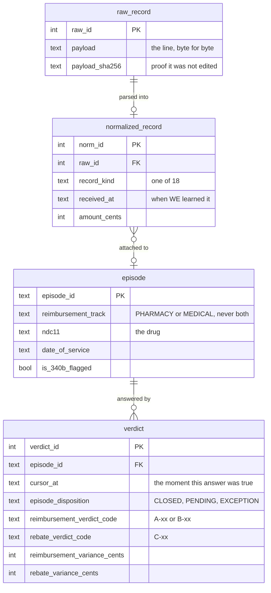
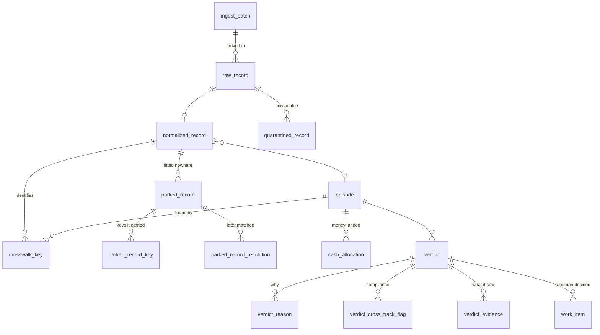

# The data model, in one picture

Twenty tables, but only four of them carry the story. Everything else hangs off those four.

## The spine

A file arrives. A line of it is stored exactly as it came. That line is parsed into a common
shape. The common shape is attached to a claim. The claim gets an answer.

**Three things this shape encodes, which are the whole design:**

- **`raw_record` is never edited and `verdict` is never updated.** Nine tables carry
  `RAISE(ABORT)` triggers; an `UPDATE` or `DELETE` fails rather than succeeding quietly. A
  verdict is not a status field that changes — it is a new row.
- **An episode does not contain its records, it points at them.** One remittance covers dozens
  of claims, so it cannot live inside any one of them. That is why the middle arrow is
  many-to-one and not composition.
- **`cursor_at` is why there are 543 verdicts for 60 claims.** The same claim is answered again
  every time new evidence arrives, and every old answer is still there. "What did we believe on
  31 March" is a `WHERE cursor_at <= ...`, not a feature.

---

## What hangs off it

| Group | Tables | What it answers |
|---|---|---|
| **Arrived** | `ingest_batch`, `raw_record`, `normalized_record` | What did we receive, and when |
| **Matched** | `crosswalk_key` | Which identifiers resolve to which claim |
| **Did not match** | `parked_record`, `parked_record_key`, `parked_record_resolution`, `quarantined_record` | What we could not attach, held rather than dropped |
| **Concluded** | `verdict`, `verdict_reason`, `verdict_cross_track_flag`, `verdict_evidence` | The answer, why, and what it was based on |
| **Money** | `cash_allocation` | Which deposit paid which claim, and on what basis |
| **Human** | `work_item` | The one table a person writes to |
| **Plumbing** | `connector_source`, `connector_checkpoint`, `schema_contract`, `control_total`, `meta` | Where feeds come from and whether they reconcile |

---

## The two that surprise people

**`verdict_evidence` is the biggest table in the database** — 2,520 rows against 60 claims on
the demo profile, 72,839 against 1,500 on the full one. It records every record that was
*visible* when a verdict was computed. That is what makes a verdict reproducible: you can ask
not just what the engine decided but what it was looking at.

**`parked_record` is not an error table.** A document whose identifiers match nothing is held
and re-checked on every later arrival — `parked_record_resolution` is the row that gets written
when a later document finally resolves it. A bank line that arrives on Tuesday and parks can be
claimed on Friday by the remittance that explains it. Nothing is dropped, which is why the
crosswalk can be scored at all.

---

## What these diagrams leave out, on purpose

Both pictures are simplified, and simplification that nobody writes down turns into a picture
people think is complete. `python scripts/er_diagram.py --check` prints every foreign key in the
schema that the diagrams above do not draw. Today that is eleven, in three groups:

- **Plumbing** — `connector_source → connector_checkpoint`, `connector_source → schema_contract`.
  Where feeds come from, not what a claim is.
- **Second and third references to the same parent** — `verdict_evidence` points at both
  `raw_record` and `normalized_record`; `cash_allocation` points at `normalized_record` twice
  (the bank line and the remittance); `parked_record` points at both. Drawing each one turns the
  picture into a knot and tells a reader nothing the single arrow did not.
- **`normalized_record → normalized_record`** — a record can have a parent record, which is how
  a remittance owns its claim lines. Real, and self-referential arrows make diagrams worse.

One arrow is deliberately *not* the foreign key it looks like. The spine draws
`normalized_record }o--o| episode` — "records attach to a claim" — but the actual FK runs the
other way, `episode.anchor_norm_id → normalized_record`, because an episode is *created by* one
anchoring record and then *found by* many others through `crosswalk_key`. The conceptual
relationship and the constraint point in opposite directions, and the conceptual one is the one
worth drawing.

---

*The curated diagrams are hand-written; `scripts/er_diagram.py` reads the live schema so the
omissions above stay a checked list rather than a claim. Counts are the demo profile.*
