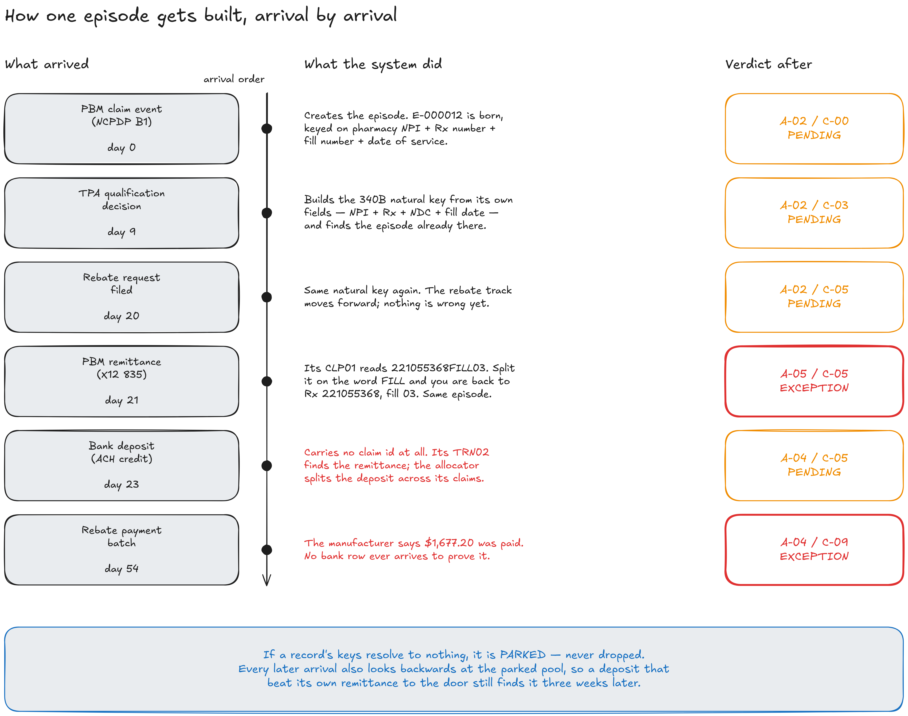
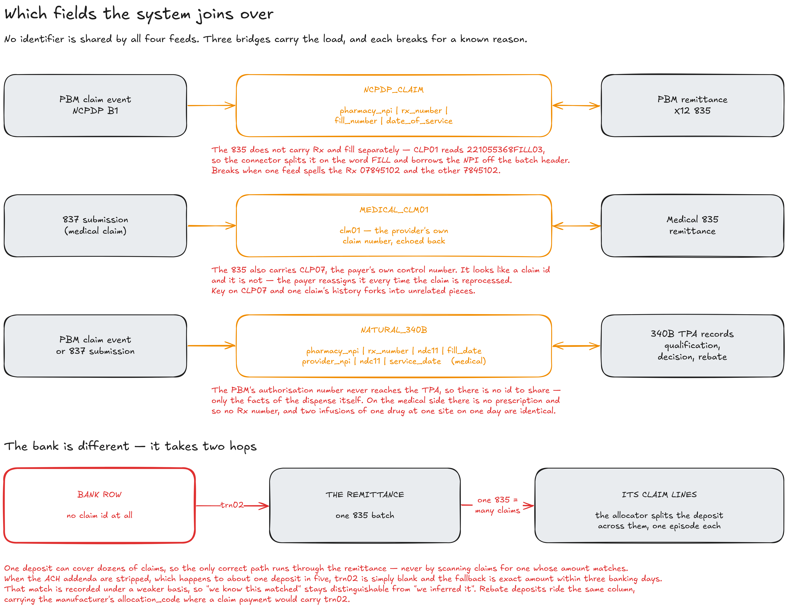
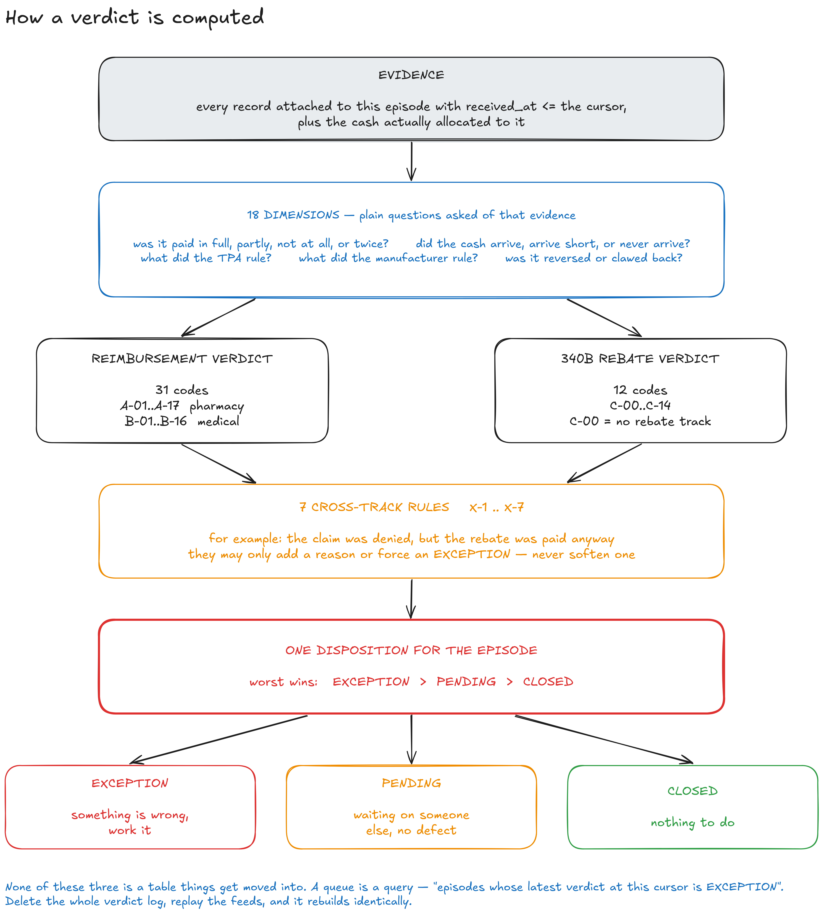

# Post-Claim Pharmacy Financial Reconciliation — the solution, in three passes

*This is the document you recite. It is built in three passes over the same system, each one closer in. Pass one is the shape of the whole thing in five blocks. Pass two walks the moving parts: how the test data is made, how one claim turns into an episode, and how the engine reaches a verdict. Read it straight through — about twenty-five minutes — and you will be able to answer anything an L6 asks without opening the code. Every diagram referenced here has an editable `.excalidraw` source next to it in `diagrams/`.*

**Three ideas run through everything below. Watch for them, because every design decision in this system is one of these three wearing a different hat.**

1. **Nothing in this world carries one claim number end to end.** There is no shared ID. That single fact is the hard part of the problem, not the arithmetic.
2. **The system never guesses.** When it cannot tell, it says so out loud and holds the record rather than picking an answer that will look identical to a correct one in every report afterwards.
3. **Everything is a replay.** Nothing is edited in place. Delete every answer the system has ever produced, feed it the same files again, and you get the same answers back, byte for byte.

---

# Part 1 — The system at one glance

## 1.1 The problem, in one paragraph

A specialty pharmacy sits inside a hospital. It dispenses very expensive drugs. The moment a drug goes out the door, the hospital is owed money — and that money comes back from up to three different places, on three different timetables, in three different formats, through parties who do not talk to each other.

The pills a patient picks up at a counter get billed to a **PBM** — a pharmacy benefit manager, the company that runs the drug benefit for an insurer. The drugs a clinician infuses in a chair get billed to a **medical payer** instead, through a clearinghouse. And on top of either one, if the hospital qualifies for the federal **340B** discount programme, a drug manufacturer owes a separate cash rebate, decided by a separate company called a **TPA** — a third-party administrator whose only job is to rule on whether that particular dispense qualifies.

Three roads for the money. A fourth feed, the bank, is the only proof that any of it actually landed.

Nobody sends the hospital a statement saying *here is what you are owed and here is what you got*. **That statement is the product.** The operator's real question is four separate questions: what should have arrived, what did arrive, what is still outstanding, and which of those needs a human to pick up the phone. Only the last one is a judgement call. That split is the whole design.

## 1.2 The five blocks

Read it top to bottom. There are only five things.

**The outside world** sends us files and answers API calls. Five kinds of counterparty: the PBM, the medical payer, the 340B TPAs (in this build, Verity and Craneware), the bank, and Beacon — the manufacturer-side rebate platform, and the only one we also send data *to*.

**Connectors** go and get it. They know how to reach an SFTP drop or an HTTP endpoint, which credential to use, whether we are even allowed to pull that entity's data yet, and how to tell whether a file has changed since last time. What they deliberately do *not* know is what any of it means. Fetching and interpreting are two jobs and they live on opposite sides of a wall.

**Ingest and crosswalk** is where meaning arrives. Every line is stored word for word with a hash of itself before any parser touches it, so the evidence can never be edited afterwards. Then each line is turned into one common shape, and then — this is the interesting bit — attached to the right **episode**. More on that in 2.3, because it is the hardest part of the system.

**The reconciliation engine** is plain Python with no network and no model behind it. It takes one episode plus a point in time and returns a verdict. It cannot write to a source record; it only appends a new verdict row.

**The read layer** hands those verdicts to a dashboard and to an AI agent layer. Both only read.

Notice what the arrows on the right say. Ingest writes **records in**. The engine reads evidence and writes **verdicts out**. Those are the only two things that ever write to the database on the deterministic side, and both of them only ever add rows — they never change one.

## 1.3 The one rule that shapes everything

**Every number in this system is computed in Python. The language model only explains numbers it was handed.**

That is worth saying slowly, because it is the constraint the whole architecture is bent around. The agents can read nine things and write one. Eight of the nine tools are read-only. The ninth — the only write in the system — creates a *work item*, a to-do for a human, and it is never put in any model's tool list at all. The role's tools are built by *removing* it, so there is no prompt you could write that reaches it. A person edits the draft on screen and presses the button; the record of who did it names the person, not the model.

Why go that far? Because a reconciliation number that a model produced is a number you cannot defend in an audit. If the engine computes it, you can point at the exact raw line it came from. If a model computed it, you can point at a paragraph.

---

# Part 2 — How the moving parts work

## 2.1 Making the data

Nobody is going to hand a take-home project real claims data, so the system generates its own. But this is not a fixture writer that sprinkles plausible rows into files. It is built backwards from a proof, and that is the part worth explaining.

**What it is.** Before any generator existed, a separate little programme enumerated every legal outcome an episode can have. `spec.py` lists each decision an episode makes — pharmacy road or medical road, accepted or rejected, paid in full or short or not at all, did the TPA qualify it, did the manufacturer approve it, did the cash arrive. `build_tree.py` walks that list and emits every combination that is legally possible, skipping the ones that cannot exist (you cannot have a recoupment on a claim that was never paid). `classify.py` labels each surviving combination with the verdict it deserves. And `verify.py` re-derives every rule *independently of the code that produced it*, so a wrong assumption cannot hide in both halves.

The numbers are the headline: **12,093,235,200** raw combinations collapse to **4,224** that are legally possible, and those land on exactly **372 distinct verdict pairs**. All 372 are reachable.

**Why that is clever.** It turns "does my engine work?" from an opinion into a measurement. That 4,224-row file is loaded as a live test oracle: the shipped engine is run against all 4,224 configurations and compared verdict by verdict, with **no tolerance threshold** — one disagreement fails the build. It also caught a real error. The hand-count before the tree existed said 510 verdict pairs. It was wrong in four separate ways that partly cancelled out. And the first run of the independent verifier reported fifteen violations — where *the verifier* was wrong, not the generator, which is precisely why it is written separately.

**Then the orchestrator turns one of those cases into facts.** A case from the tree is a one-line plot summary: *payment partial, cash matched, rebate approved*. The orchestrator makes it concrete. It picks a real drug, a real pharmacy, a payer and a manufacturer. It prices the whole thing in **integer cents** — never floating point, because a float gives every claim a phantom one-cent variance that is indistinguishable from a real underpayment. It computes every arrival date from fixed lag windows. And critically, **it mints every identifier that two different files have to agree on** — the natural keys, the trace numbers, the allocation codes.

**Then it hands each generator a blind slice.** This is the discipline that makes the whole exercise honest. Each of the four generators receives only what its real-world source system would actually know, and formats it in its own wire format. A generator never sees an episode id, never sees a verdict, never sees an expected amount. There is a runtime check that asserts this over every slice — and when it was finally wired up, it immediately caught every slice leaking the episode id through a free-text field.

The four generators produce six files, mapped onto the four money roads:

**Pharmacy benefit.** Two files, because the standard separates the ask from the answer. `pbm_claim_events.jsonl` is the moment-of-dispense conversation in NCPDP D.0 — a `B1` billing transaction and the PBM's paid-or-rejected answer, seconds apart. A `B2` is a reversal, and it is worth knowing that **a reversal carries no identity of its own**; it matches the original by repeating the same four fields. Then `pbm_remittance_835.jsonl` is the X12 835 payment advice that turns up weeks later. One line in that file is *one whole remittance covering up to twenty-four claims* — which is what makes the bank deposit a single lump.

**Medical benefit.** Also two files. `medical_837_submissions.jsonl` carries the 837 claim the clinic sends to the payer, plus the 277CA acknowledgement the clearinghouse sends back. Those ride together deliberately: without the 277CA, "the clearinghouse rejected this before the payer ever saw it" and "accepted, still waiting" look *identical on the wire* — both are an 837 with no payment against it. Then `medical_835_remittance.jsonl` is the payer's remittance.

**340B rebate.** One file, `tpa_340b_events.jsonl`, carrying both directions at once — qualification decisions, rebate requests, manufacturer decisions, reversals, payment batches. One file because **there is no standard here at all**. No 835, no trace number, nothing. Real TPAs ship vendor-specific CSV exports and portal downloads, and nothing about the shape is standardised vendor to vendor. That is not a modelling shortcut; it is the actual state of this corner of the industry, and it is exactly why "unmatched rebate" is one of the named exceptions the brief asks for.

**Cash.** `bank_transactions.csv`, which is what a bank actually gives you: date, description, amount, a running balance and a trace number. It is a CSV, not an EDI standard, and it was never designed to carry claims data — it was designed to reconcile a checking account. **This feed is the weakest link by design, because it is the weakest link in the real workflow.**

**Vendor exports.** Alongside all that, the same run writes the same dispenses again in each vendor's own house style: five CSVs for Verity, five for Craneware, five JSONL payloads for Beacon. Here is the practitioner's detail worth quoting in the room — Verity spells the drug code `ndc_11`, Craneware spells it `ndc11`, and Beacon calls the date `date_of_service` where the other two call it `fill_date`. Three vendors, three spellings, one fact. That is the whole argument for a connector layer in a single line.

**And the answer key is withheld.** The orchestrator alone writes `truth/ground_truth.json` — the intended verdict for every episode, every expected amount, and a note on which cross-file links are resolvable *by design* versus deliberately broken. The ingestion code is structurally unable to read it; the function that loads feeds accepts only the feeds directory. That is what turns crosswalk accuracy into a measured **1,349 out of 1,354** rather than a claim.

**One last thing: the defects are deliberate and named.** Three percent of records are delivered twice. Eight percent arrive seven to forty-five days late, with their *event* dates untouched. Six percent have an Rx number spelled differently in one feed than another — `07845102` against `7845102`. About one bank deposit in five loses the addenda record that carries the payer's reference. Each one has a code, a rate held in a named constant, and a specific exception it is meant to trigger. Only the twenty-percent addenda-loss figure comes from a published source; the rest are estimates, and they are labelled as estimates.

## 2.2 How one episode gets built

**What an episode is.** One dispense creates one **episode** — the whole financial story hanging off one drug going out the door. The claim, the optional rebate, and all the cash. It has exactly two tracks: a reimbursement track (pharmacy *or* medical, never both, never neither) and an optional 340B rebate track. The brief calls it a Claim Financial Episode; internally it is the claim object, and it is the thing every screen and every query is about.

The distinction that matters here: **a claim is one request for payment; an episode is the claim plus the rebate plus the cash.** Calling them both "the claim" is how these designs get confusing.

**Why records live outside it.** An episode does not contain its records. It points at them. That is forced by reality: one 835 remittance covers dozens of claims, so it cannot sit inside any one of them. Records are immutable rows stored once; an episode is a set of pointers to them.

**How it grows.** Now read the diagram. The left column is what physically arrived; the right column is the verdict immediately afterwards. This is the same episode — `E-000012` on the demo dataset — six times. Every code and every figure below was read off the running engine, not composed by hand.

Day zero, a PBM claim event lands. It is one of only two kinds of record that can **create** an episode (the other is an original medical 837). The episode is born, keyed on pharmacy NPI plus Rx number plus fill number plus date of service. Verdict: `A-02 / C-00`, PENDING — accepted, waiting for payment, no 340B track in sight. Nothing is wrong; something is simply owed.

Day nine, the TPA's qualification decision arrives. It has never heard of the PBM and carries none of its identifiers. It builds a key out of the facts of the dispense — NPI, Rx, drug code, fill date — and finds the episode already sitting there. The rebate track switches on: `C-03`, qualified, request not yet filed. Day twenty, the rebate request goes in and it moves to `C-05`, waiting on the manufacturer. Still PENDING; still nothing wrong.

Day twenty-one, the PBM's remittance arrives, and this is the one to slow down on in the room. The 835 does not carry the Rx number and the fill number as separate fields. It carries one string: `221055368FILL03`. The connector splits it on the literal word `FILL`, recovers `Rx 221055368, fill 03`, borrows the pharmacy's NPI off the batch header, and rebuilds the same key the claim event published. **That is a crosswalk, not a join.** The verdict jumps to `A-05` — EXCEPTION — because the remittance now claims money moved and the bank has no matching deposit.

Day twenty-three, the deposit lands and the exception clears itself: `A-04`, paid and cash-matched at $5,860.42. Note that nothing "resolved a ticket". A new fact arrived and the verdict was recomputed.

Day fifty-four, the rebate payment batch says the manufacturer approved and paid $1,677.20 — and **no bank row ever arrives to prove it**. Final state: `A-04 / C-09`, EXCEPTION. The reimbursement side of this episode is perfectly clean. The rebate side is a manufacturer that says it paid and a bank that disagrees. That is real money, it is findable, and it is the kind of thing that goes uncollected for a year in a system built on spreadsheets.

**And what happens when a record fits nowhere.** It is **parked**, never dropped. It keeps its keys, and every later arrival does two things instead of one: it resolves its own keys forward, and it looks *backwards* at the parked pool to ask whether anything sitting there now resolves against it. Skip that second step and two failure modes become permanent instead of temporary — a deposit that beat its own remittance through the door never gets a second chance, and an unmatched payment stays unmatched forever even after the record that explains it finally lands.

There are four reasons to park, and they are kept distinct on purpose: the record carried no usable key at all; its keys resolved to nothing; its keys resolved to **more than one** episode; or it resolved cleanly but disagrees about which 340B entity owns the claim. Those are four different problems with four different owners, and collapsing them into "unmatched" throws that away.

## 2.3 The reconciliation engine — and the keys it joins on

This is the section to get solid. If the interview goes deep anywhere, it goes deep here.

### The keys

Start from the fact that makes this hard. **There is no shared claim ID.** The pharmacy world runs on NCPDP, the medical world runs on X12, and the bank runs on ACH. Three separate standards bodies, three separate rails, three separate vocabularies. The medical feed and the pharmacy feed share literally nothing. A generator that invents a common claim number papers over the exact problem the system exists to solve.

So instead of one key, there are three bridges, and **each one breaks for a reason you can name in advance.**

**Bridge one — the pharmacy claim to its payment.** The key is four fields together: `pharmacy_npi | rx_number | fill_number | date_of_service`. The claim event publishes it. The remittance rebuilds it by splitting `CLP01` on the word `FILL`, as above. It breaks when the two feeds spell the Rx number differently — one zero-padded, one not.

**Bridge two — the medical claim to its payment.** The key is `clm01`, the provider's own claim number, which the payer echoes back untouched. The trap here is the field sitting right next to it: `CLP07`, the payer's own internal control number. It looks like a claim id. It is not. The payer **reassigns it every time the claim is reprocessed**, while `clm01` never changes. Key on `CLP07` and the first time a claim is reprocessed, its history silently forks into unrelated pieces. Nothing errors. You just quietly have two claims where there was one.

**Bridge three — the claim to its 340B rebate.** There is no id to share at all. The PBM's own authorisation number never reaches the TPA; the two companies do not talk. So the key is built out of the facts of the dispense itself: `pharmacy_npi | rx_number | ndc11 | fill_date`. On the medical side it is weaker still — a clinic-infused drug has no prescription, therefore no Rx number, so the key falls back to `provider_npi | ndc11 | service_date`. **Two infusions of the same drug, at the same site, on the same day are genuinely indistinguishable.** There is no clever fix. The system parks them as ambiguous rather than picking one, because picking one attributes real money to the wrong claim and then looks exactly like a correct match in every report forever after.

**And the bank is different, because it takes two hops.** A bank line carries no claim identifier — it cannot, a bank has no concept of a claim. Its `trn02` field resolves to a **remittance**, not a claim. The remittance holds the claim list. So cash reaches an episode through the allocator: find the remittance, read its claim lines, split the deposit across them by each line's own paid amount.

Two practitioner details here, both worth having ready. First, the split is **never pro rata**. Each claim line gets its own stated amount; a provider-level clawback becomes its own negative entry. Smearing a clawback proportionally across forty claims turns one traceable recoupment into forty phantom underpayments. Second, when the ACH addenda are stripped and `trn02` is simply blank — about one deposit in five — the fallback is **exact amount within three banking days**, and that match is recorded under a *different basis code*. So "we know this matched" stays permanently distinguishable from "we inferred it".

**The rule that ties the whole crosswalk together: there is no identifier normalisation anywhere on the match path.** No stripping leading zeros, no upper-casing, no trimming. There is a test asserting that `7845102` and `07845102` build *different* keys. Quietly absorbing that drift would make the numbers look better and would delete the crosswalk-failure exception the system exists to find. The claim is not missing — the mapping failed, and that is a different fix with a different owner.

### The engine

**What it is.** The engine is a pure function of two arguments: one episode, and a point in time called the **cursor**. It gathers every record attached to that episode that arrived on or before the cursor, plus the cash allocated to it, and returns a verdict. It writes nothing except a new verdict row.

That cursor is why "what did we believe on 31 March?" is a *parameter* rather than a feature. Forward and backward run through the same code path.

**Then it asks eighteen plain questions of that evidence.** Not eighteen clever questions — eighteen boring ones. Was it paid in full, partly, not at all, or twice? Did the cash arrive, arrive short, or never arrive? What did the TPA rule? What did the manufacturer rule? Was it reversed, and if so before or after the money moved? Those answers are called **dimensions**, and they are deliberately the same names and the same value vocabularies as the decision tree from 2.1 — because the engine is a line-for-line port of the classifier that enumeration proved.

**The two tracks are then judged separately.** The reimbursement track gets one of 31 codes (`A-01`..`A-17` for pharmacy, `B-01`..`B-16` for medical). The rebate track gets one of 12 (`C-00`..`C-14`, where `C-00` simply means there is no rebate track on this episode — absence is not an exception). That is where `A-04 / C-09` from the last section comes from.

**Then seven cross-track rules run last.** These are the compliance cases where each track looks fine alone and the pair is a problem — a claim that was denied but had a rebate paid on it anyway, or a dispense that was reversed while the rebate stayed live. They may only **add a reason or force an escalation**. They can never soften one. Direction matters here: a rule that can downgrade is a rule that can hide something.

**Finally it rolls up to one of three dispositions.** `CLOSED`, `PENDING`, `EXCEPTION` — because "what do I do with this?" only has three answers: nothing, wait, work it. Worst wins, so the track that needs a human is the one that surfaces. Anything finer than three lives in **reason codes**, which are a *list* rather than a single value, because an episode can be underpaid *and* missing its settlement confirmation *and* short on cash at the same time. One field cannot hold that. A list can.

**Three things about this engine are worth calling out deliberately.**

*It can say "I don't know", and that is a first-class answer.* There are exactly three places where the engine deterministically knows it cannot decide — a clawback that cannot be tied to any bank movement, both tracks dry at once, and an episode it could not price from contract terms. Each emits `INSUFFICIENT_DATA` and escalates. The alternative is reporting variance against an expected amount of zero, which renders an unpriceable claim as perfectly clean. It also matters downstream: it hands the agent layer a *deterministic* "I don't know" instead of one the model has to invent.

*Aging is not an input.* There are no SLA thresholds anywhere in the verdict logic. Age is computed at read time and used only to sort a queue. That sounds like a small thing and it is the load-bearing one: it makes "a verdict cannot change unless a new record arrives" true **by construction**, which is what allows the system to recompute only the episodes a new document touched, and still be provably complete. Resolving a two-hundred-day-old claim costs exactly what resolving this morning's costs. There is no time window to widen, because there is no sweep.

*There is no queue table.* A queue is a `SELECT` over the latest verdict per episode, filtered by disposition. Nothing is ever moved into it. There is a test asserting no table in the schema has the word "queue" in its name. Delete the entire verdict log, replay the feeds, and every queue rebuilds identically — which is thread three from the top of this document, cashed out.

### What is actually measured

Numbers to have ready, because they are the difference between a claim and a demonstration.

The engine reproduces the independently-generated oracle on **4,224 of 4,224** configurations, with no threshold. Against the withheld answer key, the crosswalk reassembles **1,349 of 1,354** resolvable episodes — **99.6%**. The suite is **585 tests passing** on the core build and **978** with the connector work included, with one known pre-existing failure that is reported as a failure rather than rounded to green. No API key, no network. Every hot query has a test that runs its execution plan and fails if it ever starts scanning a table.

Worth being precise about that 1,354, because someone will ask: the full profile is about 1,500 episodes, and 1,354 is the subset the generator did *not* deliberately break. Episodes carrying an injected identifier drift are excluded from the denominator on purpose — a connector that "resolved" those would have normalised away the very defect it is supposed to report.

And the honest gaps, because a reviewer will find them anyway: there is no authentication and no tenant isolation — the repository layer is the right seam for it and the predicate is not there yet. Five of those 1,354 do not reproduce their intended verdict. The evidence attached to a verdict records every record *visible* at that cursor rather than the ones that actually *drove* it, so the lineage is coarser than it looks.

---

*Three ideas, one last time, because they are the thing to walk out of the room with. **There is no shared claim ID** — so the system is built out of three named bridges, each with a named failure mode, rather than one join that pretends to be reliable. **It never guesses** — an ambiguous match parks, a missing key parks, an unpriceable episode says `INSUFFICIENT_DATA`, and every inferred cash match is recorded as inferred. And **everything is a replay** — raw lines are immutable, verdicts are appended, aging is not an input, and the cursor is a parameter, so the answer to "what did we believe in March" and the answer to "what do we believe now" come out of the same function. The state space was enumerated before the generator was written, the answer key is withheld from the code being graded, and the language model never computes a number. That is the argument.*
