# The Executive View — product narrative and screen-by-screen design brief

**For:** a Claude Design session that will draw every screen in this document.
**Audience of the final product:** McKinsey's Leader of Tech in Healthcare and Leader of Product in Healthcare.
**Hard constraint:** the code is frozen. Nothing new gets built. Every change in this document is layout, naming, grouping, type, colour and spacing over data the system already returns.

---

## How to read this document

- **Part 1** is the product narrative. Read it first. Every design decision is downstream of it.
- **Part 2** is the design law — the few things that are fixed. Light scheme, locked type and spacing, and the hard constraints. Everything not named there is yours to decide.
- **Part 3** is the screens. Four screens, each broken into its sections. Every section has a screenshot, what it holds today, and **who reads it and what they need from it**. The visual answer is yours.
- **Part 4** is the plain-English dictionary. The single largest change in this redesign is replacing codes with words. This is the word list.

**How to treat Part 3.** Where it describes today's screen, that is fact — read it as the inventory. Where it suggests a treatment, read it as *intent, not instruction*: it tells you what the section is for and what has to survive. If you find a better way to serve the same purpose, take it. The only lines that are binding are the ones marked as constraints — available data fields, and the rules in Part 2.

---

# Part 1 — The product narrative

## What a product narrative is

A product narrative is not a feature list and not a pitch deck. It is the **story of a person's problem, told in their language, in which your product is the turn**. It has a fixed shape, and every good one has all five parts:

1. **The world, as the buyer already experiences it.** No product in it yet. If they don't nod here, nothing after lands.
2. **The tension.** The specific thing that is broken or expensive, stated as a cost they already pay.
3. **The turn.** What changes. One sentence. Not a feature — a change in what is possible.
4. **The new world.** What their day looks like after. Concrete, not adjectival.
5. **The proof.** Why this is real and not a demo.

Why the CTO told you to ask for one: a narrative forces you to name the buyer, the cost and the change *before* you design anything. Once it exists, it settles arguments. "Does this screen belong?" becomes "does this screen serve the narrative?" — which has an answer. Every section of Part 3 is justified against Part 1.

The other reason: your audience is a Tech leader and a Product leader at a consulting firm. They are not grading your engineering. They are grading whether you can **see a business through a system**. An engineering narrative says "here is what I built." A product narrative says "here is what it is worth, to whom, and why the alternative is expensive."

---

## The narrative

### 1. The world

A hospital pharmacy hands an expensive drug to a patient. That is one physical act, and it takes two seconds.

From that moment the hospital is owed money — and the money comes back from **up to three different places, on three different timetables, in three different formats, from parties who do not talk to each other**.

- Pills picked up at a counter bill to a **PBM**.
- The same drug infused in a chair bills to a **medical insurer**, through a clearinghouse.
- On top of either, if the hospital qualifies for the federal **340B** programme, a **drug manufacturer** owes a separate cash rebate — and whether this particular dispense qualified is ruled on by a **TPA**, a company whose entire job is that one decision.
- A fourth feed, the **bank**, owes nothing. It is the only proof any of the other three actually landed.

Roughly 30–60% of a health-system specialty pharmacy's claims carry a 340B rebate. So for a large share of the book, the hospital is chasing two receivables from two unrelated counterparties on one drug.

### 2. The tension

**Nobody sends the hospital a statement saying: here is what you were owed, and here is what you got.**

There is no such document, because there is no shared identifier. The four feeds were standardised by different bodies, for different rails, in different decades. The pharmacy feed and the medical feed share literally nothing. A bank line does not carry a claim number at all — it carries a trace number that resolves to a *remittance*, and the remittance holds the claim list. One deposit can cover dozens of claims.

So the month-close question — *we dispensed millions of dollars of drug; where is it?* — is answered today with a spreadsheet and a `VLOOKUP`. And that spreadsheet cannot distinguish:

- **an underpayment from a contractual discount.** A payer that pays less than you billed is usually correct — the contract says so. The test is arithmetic: charge minus payment minus stated adjustments. A non-zero remainder is money genuinely missing. Nobody does that subtraction on every claim by hand.
- **a rebate that was refused from a rebate that was approved and never sent.** The manufacturer's paperwork says paid. No cash ever arrives. Nothing on the reimbursement side would ever surface it, because it is a different counterparty on different paperwork.
- **a missing claim from a failed match.** The money arrived. The identifier was spelled `07845102` in one feed and `7845102` in the other. The claim still reads as *awaiting payment* forever. The claim is not missing — the mapping failed, and that is a different problem with a different owner.
- **a clawback from forty small underpayments.** A payer that thinks it overpaid you last month does not send an invoice. It **pays you less in a later batch** and explains the difference in a line that belongs to no claim in that batch. Reconcile the deposit against the claim list without reading that line, and one traceable recoupment reads as forty phantom underpayments.
- **a compliance problem from a good month.** The insurer refused to pay for the drug. The manufacturer sent the 340B rebate anyway. Net position on that dispense is negative — the hospital is holding money it may owe back, on a claim that paid nothing. No single-track view can see it.

Each of those is money. The last one is money *and* an audit finding.

### 3. The turn

**The statement nobody sends is the product.**

One system reads all four feeds, rebuilds each dispense into a single financial story despite the missing identifier, and states — per claim, in dollars — what should have arrived, what did, what is still outstanding, and which of those needs a human to pick up the phone.

Three of those four are arithmetic. **Only the last one is a judgement call.** That split is the whole design.

### 4. The new world

The analyst opens one screen and sees the book sorted into three piles, because *"what do I do with this?"* has exactly three answers: **nothing, wait, work it.**

They open the pile that needs work, ranked by money. They click a claim and get its entire life in one view — what was filed, what the payer said, when cash moved, how the rebate went, and every point at which the answer changed. They can drag the date backwards and see exactly what the system believed on 31 March, because that is a parameter, not a feature.

When they want the reasoning in English, an AI layer reads that same evidence and writes four paragraphs with citations that click through to the literal line in the source file. When they want a recommendation, a second model grades the first against a sixteen-point checklist before a human ever sees it. Then a **person** — editing every field, not approving a draft — commits the one row the AI layer is ever allowed to write.

### 5. The proof

Three claims, each one measurable rather than assertable:

- **Every number is computed in Python. The model only explains numbers it was handed.** Nine tools; eight read-only; zero write tools in any model's tool list. A Python check scans every figure in generated prose against what the tools actually returned, and an unsourced figure is a veto, not a deduction. *A number a model produced is a number you cannot defend in an audit.*
- **Correctness is measured, not claimed.** The rules were enumerated before they were written: 12,093,235,200 raw combinations reduce to 4,224 legal ones, producing 372 verdict pairs — all 372 reachable. The engine reproduces the independent oracle on 4,224 of 4,224, with no tolerance. One disagreement fails the build.
- **The system never guesses, and says so.** Two claims that are genuinely indistinguishable are parked, not picked — because picking one attributes real money to the wrong claim and then looks identical to a correct match in every report afterwards. *"I cannot tell"* is a first-class answer with its own code, not a failure state.

### The line to end on

> The deterministic layer decides what is true. The AI layer decides what is worth saying about it. A human decides what to do.

---

## What this narrative demands of the interface

Every design instruction in Part 3 comes from one of these. If a change cannot be traced to a line here, it is decoration and should be cut.

| The narrative says | So the screen must |
|---|---|
| "what should have arrived, what did, what's outstanding" | lead with **money**, not counts. Dollars first, episodes second. |
| "nothing, wait, work it" | make the three piles the most prominent object on the page, and name them as actions, not as database enums. |
| "which of those needs a human" | rank by money and age, and say out loud what the human is supposed to do. |
| "a different problem with a different owner" | keep the failure types visibly distinct. Never collapse them into "unmatched". |
| "what did we believe on 31 March" | make the date control read as a point in time, not as a slider with a number on it. |
| "the model only explains numbers it was handed" | keep the provenance visible — citations, source links, "computed in Python" — because that is the differentiator, not a footnote. |
| "an audit finding" | compliance flags cannot look like ordinary chips. |

---

# Part 2 — Design law

## This is not a greenfield visual system. It was measured.

`docs/frontend_linear_benchmark.md` records a real browser measurement of linear.app — 3,113 elements across three passes — diffed against this app. **Do not re-derive these values and do not "improve" them.** They are already correct and already implemented.

### Locked — use as-is

| Thing | Value |
|---|---|
| UI typeface | Inter Variable (local npm package, already installed) |
| Identifier typeface | `ui-monospace` stack. Reserved for ids, dates and money — the role Linear gives Berkeley Mono |
| Weights | 400 body · 550 buttons · 640 headings |
| Type scale | 10 / 11 / 12 / 13 / 14 / 16 / 19 / 28px. Eight steps, no ninth |
| Letter-spacing | −0.01em body · −0.014em at 19px · −0.022em reserved for 28px display only |
| Line height | 1.25 tight · 1.55 body |
| Spacing scale | 2 / 4 / 6 / 8 / 12 / 16 / 24 / 32 / 48px |
| Radius | 12px cards and panels · 8px md · 6px controls · 4px xs · 999px pills |
| Page background | `#f7f8fa` |
| Ink | `#16161c` |
| Shadows | **Zero.** A deliberate, reasoned divergence — a shadow reads as depth on a near-black page and as smudge on a light one at this density. Borders do the separating. |
| Theme | **Light only, unconditionally.** Dark mode was removed on purpose. Do not add a dark variant. |

### The full colour set, and what each is for

| Token | Hex | Used for |
|---|---|---|
| `--surface-0` | `#f7f8fa` | page background |
| `--surface-1` | `#ffffff` | panels, cards, buttons, tiles |
| `--surface-2` | `#f0f1f4` | nested content — table heads, chips, code pills, hover, log blocks |
| `--border` | `#e4e5ea` | every hairline |
| `--border-strong` | `#c6c8d2` | control borders, and the fallback for every runtime custom property |
| `--text-primary` | `#16161c` | body ink |
| `--text-secondary` | `#4c4d5a` | headings, table headers, tile labels |
| `--text-muted` | `#66677a` | hints, empty states, timestamps (4.86:1 on `--surface-2`) |
| `--status-good` | `#0ca30c` | Closed |
| `--status-warning` | `#fab219` | Pending |
| `--status-serious` | `#ec835a` | cross-track flag chips |
| `--status-critical` | `#d03b3b` | Exception, reopened, negative variance, errors |
| `--track-rebate` | `#4a3aa7` | the 340B rebate track — **declared and currently unused by the stylesheet** |
| `--accent` | `#5e6ad2` | links, primary buttons, selection, focus |
| `--accent-hover` | `#4f5ac0` | primary hover |
| `--accent-soft` | `#eceefb` | selected table row wash |

Four more are set at runtime from JSX and consumed in CSS with fallbacks: `--tile-color`, `--dot`, `--d`, `--oc`. Any recolour must audit those too.

## What you are allowed to change

Everything about **arrangement, naming, hierarchy and grouping**. Nothing about the token values above.

In scope: which section sits where; what is a heading versus a label; what is a chip versus plain text; what is shown by default versus behind a disclosure; column order, count and names; what is large and what is small; what is `--text-primary` versus `--text-muted`; how many words a label gets; what gets a colour and what stays neutral.

## What you may not do

1. **No new data.** The backend is frozen. Every field you can use is listed in Part 3 under its section. If a field is not listed there, it does not exist and cannot be fetched.
2. **No new dependencies.** The entire dependency list is `react`, `react-dom`, `@fontsource-variable/inter`. There is **no charting library, no icon library, no CSS framework, no router, no state manager**. Every icon on screen today is a literal Unicode character (`▲ ◷ ✓ ◀ ▶ ⚠ ✕ → ← ↳ ◉`). Every bar is hand-rolled CSS. A chart, if one is needed, must be inline SVG or CSS.
3. **No renaming of verdict, reason or exception codes.** The code strings feed the AI layer's grounding tables and recorded evaluation fixtures. Renaming one silently breaks the AI layer. **Add plain-English labels beside the codes; never replace the code string in the data.**
4. **No dark mode.**
5. **No shadows.**

## The three aesthetic rules that carry the whole redesign

**1. Money is the headline. Everything else is a subtitle.**
Today the biggest number on a queue tile is an episode count (`40`) and the dollar figure is 12px monospace underneath it. Backwards for this audience. The dollars are why anyone opened the page.

**2. Every code gets a word. The code stays, demoted.**
The screen is currently readable only by someone holding a 43-entry lookup table. The plain-English strings already exist in the codebase — `VERDICT_DESCRIPTIONS` at `src/recon/domain/verdicts.py:126`, exposed by `describe()` at line 142. The frontend has never imported them. Part 4 is the full word list. Pattern: **the human label is the primary text; the code becomes a small muted monospace suffix** so an operator can still cite it.

**3. One thing per screen region, and a stated question above it.**
Each panel today opens with a 3–5 line paragraph of design rationale — genuinely good writing, aimed at a reviewer grading the architecture. An executive does not read it. Convert each to **one short line stating the question the panel answers**; move the rationale to a hover or drop it.

---

# Part 3 — The screens

**Four screens after this redesign**, up from three. Splitting Verdict distribution onto its own screen is the one change here that touches wiring rather than pixels; its cost is stated in Screen 3.

| # | Screen | Route | The question it answers |
|---|---|---|---|
| 1 | **Operations** | `/` | Where is my money, and what needs working? |
| 2 | **Episode** | `/analyse/{id}` | What happened to this one claim, and what should we do? |
| 3 | **Verdict library** | `/` + nav state (new) | What kinds of problems does the book contain? |
| 4 | **Connectivity** | `/` + nav state | Which data sources are actually wired up? |

Screens 1, 3 and 4 share one masthead and swap the body below it. Screen 2 is a separate page reached by a button.

All figures quoted below are live, read off the running app on the `demo` profile, seed `8984883`, cursor `2026-07-01`.

---

## Screen 1 — Operations (the landing page)

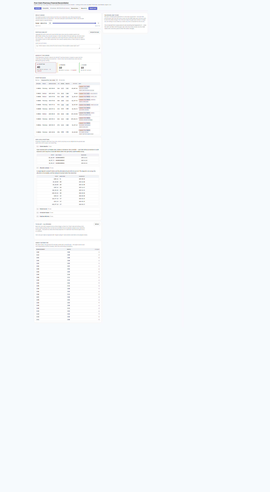

Today: one 4,727px scroll containing seven stacked panels in a 3fr/2fr grid, with a sticky episode panel on the right.

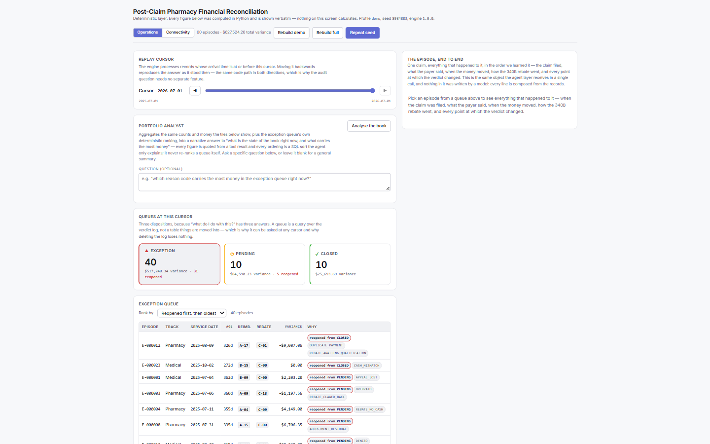

**The single biggest structural problem:** above the fold you get the masthead, a paragraph about how the replay cursor works, and a paragraph about how the Portfolio Analyst works. **The three tiles carrying the money are below the fold.** An executive has to scroll to reach a dollar figure.

**The fix in one sentence:** the money tiles move to the top directly under the masthead; the replay cursor becomes a compact control inside the masthead row; the Portfolio Analyst drops below the worklist.

### Target order for the left column

1. Money summary — the three tiles, enlarged
2. The worklist — queue table
3. Money and documents we could not match — renamed feed exceptions
4. Portfolio Analyst
5. To-do list

Verdict distribution leaves this screen entirely.

---

### 1.1 Masthead

**Today.** `Post-Claim Pharmacy Financial Reconciliation` at 19px/640. Below it: *"Deterministic layer. Every figure below was computed in Python and is shown verbatim — nothing on this screen calculates. Profile `demo`, seed `8984883`, engine `1.0.0`."* Right side, baseline-aligned: an Operations/Connectivity segmented toggle, the text `60 episodes · $627,524.26 total variance`, and three buttons — `Rebuild demo`, `Rebuild full`, `Repeat seed`.

**Why it fails.**
- The subtitle is an engineering disclaimer plus three build parameters. `seed 8984883` means nothing to a buyer and signals "test harness".
- The only real money figure on the masthead — **$627,524.26** — renders as 12px muted body text, smaller and quieter than the buttons beside it.
- Three destructive `Rebuild` buttons occupy the most valuable real estate on the page. One wipes and regenerates the entire database.
- Page `<h1>` and browser tab title disagree — "Financial" is in one and not the other.

**Build this instead.**
- Product name left, one line. Drop "Deterministic layer" and the build parameters from the visible subtitle — put profile/seed/engine behind a small muted disclosure. Keep the "every figure was computed in Python" claim; it is a differentiator. Make it one quiet line, not the first thing under the title.
- **Promote `$627,524.26` to a display figure** — 28px, tabular, `--text-primary`, with `Total variance across 60 claims` beneath it at 11px uppercase muted. This is the number the room should see first.
- Move the replay cursor into this row (§1.2).
- Collapse the three Rebuild buttons into one secondary control, or move them off the masthead entirely. They are demo plumbing, not product.
- Fix the tab title to match the `<h1>`.
- The masthead row is `align-items: baseline` while the control cluster inside it is `align-items: center`. Pick one.

**Available fields.** `GET /api/meta` → `profile`, `episode_count`, `engine_version`, `adapter_version`, `stored.master_seed`, `cursor.{min, max, window_start, window_end}`. Totals from `GET /api/overview`.

---

### 1.2 Replay cursor

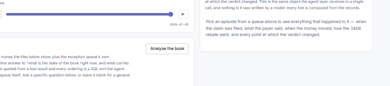

**Today.** A full panel with `<h2>Replay cursor` and a three-line paragraph. The control: the word `Cursor`, a monospace `2026-07-01`, a `◀` button, a range slider, a `▶` button, and beneath it two bare dates `2025-07-01` and `2026-07-01` at the far edges with nothing labelling them.

**Why it fails.**
- A whole panel — ~195px above the fold — for one date control.
- "Cursor" is a database word. Three names for one control: the heading says `Replay cursor`, the visible label says `Cursor`, the accessible name says `Replay cursor`, and the code comment says there is no replay mode.
- The two end dates read as orphans. Nothing says they are the window bounds.
- Bare ISO dates. `2026-07-01` is not how a person says a date.
- The slider is not disabled while data loads, though the step buttons are — dragging mid-fetch is possible.

**Build this instead.**
- **Move it into the masthead row** as a compact control. No panel, no heading.
- Label it as a question: **`Showing the book as of`** followed by the date.
- Format the date long — `1 July 2026` — keeping tabular figures so it does not jitter while dragging.
- Add a quiet persistent state when the cursor is not at the latest date: a chip reading **`Historical view — 142 days back`** in `--status-warning`. Show nothing at the newest date. This is the feature that proves the audit story, and right now it is invisible unless you already know what the slider does.
- Label the end dates inline: `Earliest 1 Jul 2025` … `Latest 1 Jul 2026`.
- Disable the slider along with the step buttons while busy.

**Available fields.** `cursor.window_start`, `cursor.window_end`, `cursor.min`, `cursor.max` from `/api/meta`. Format is `YYYY-MM-DDTHH:MM:SSZ`; the control always emits end-of-day. Every read endpoint accepts it except `/trace`, `/record`, `/connectivity` and `/meta`.

---

### 1.3 The three money tiles — the most important object on the page

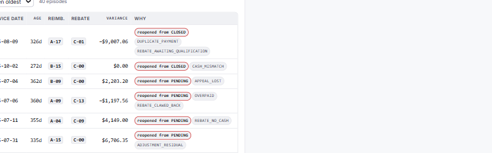

**Today.** Heading `Queues at this cursor`, a three-line paragraph, then three tiles in a `repeat(auto-fit, minmax(230px, 1fr))` grid. Each tile: a 12px uppercase label with a Unicode glyph, a 28px count, a 12px monospace money line.

| Tile | Glyph | Count | Money line | Colour |
|---|---|---|---|---|
| `Exception` | `▲` | **40** | `$517,240.34 variance · 31 reopened` | `--status-critical` |
| `Pending` | `◷` | **10** | `$84,590.23 variance · 5 reopened` | `--status-warning` |
| `Closed` | `✓` | **10** | `$25,693.69 variance` | `--status-good` |

**Why it fails.**
- **The count is 28px and the dollars are 12px.** The eye lands on `40`, `10`, `10`. The narrative says money leads.
- `Exception`, `Pending`, `Closed` are database enum names describing a *state*. The narrative promised an *action*: nothing, wait, work it.
- The only explanation of each bucket is a `title` tooltip — invisible until hover, unreachable on touch, and it is the most valuable copy on the screen. The three strings: *"A defect exists. Work it."* / *"Waiting on an external party. No defect. Ranked by age."* / *"Nothing to do."*
- `variance` is jargon. So is `reopened` with no explanation.
- Clicking the already-selected tile re-fetches rather than doing nothing.

**Build this instead.**
- **Invert the hierarchy.** Dollars at 28px tabular. Episode count demoted to a 12px line: `40 claims`.
- **Rename to the action, keep the state as a subtitle.** Suggested: `Needs work` / `Waiting on someone` / `Settled`, with the enum name as a small muted suffix.
- **Promote the tooltip to visible copy** — one line under each tile at 11px muted. This single change does more for comprehension than anything else on the screen.
- **`reopened` needs words.** It means *this claim was settled and has come undone*. 31 of 40 exceptions are reopened — the loudest signal on the page, currently a six-word monospace fragment. Give it a line: `31 were previously settled and reopened`.
- Keep the 3px coloured left border and the colour assignment exactly as-is. They work.
- Make the selected tile obvious beyond the current `--surface-2` fill — selection currently reads as hover.

**Available fields.** `GET /api/overview` → `by_disposition.{EXCEPTION|PENDING|CLOSED}.{episodes, expected_cents, received_cents, variance_cents, reopened}`. All three keys always exist, zero-filled.

> **Two cautions.** `variance_cents` here is a sum of **absolute** values; the per-row `total_variance_cents` on a queue row is **signed**. They will not reconcile — never present them as the same quantity. And `expected_cents` / `received_cents` are already returned per bucket and **displayed nowhere today** — they are free material for an "$X expected, $Y received" line at zero backend cost.

---

### 1.4 The worklist (queue table)

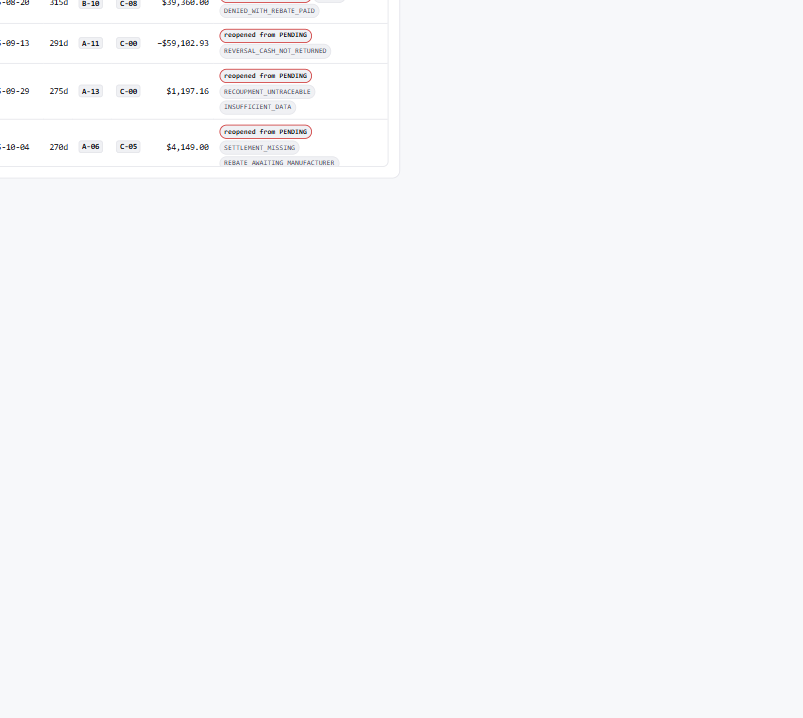

**Today.** Heading `EXCEPTION queue` — the raw enum interpolated into a string, then uppercased by CSS. A `Rank by` dropdown, a count, then an 8-column table capped at 46vh with sticky headers.

Columns: `Episode` · `Track` · `Service date` · `Age` · `Reimb.` · `Rebate` · `Variance` · `Why`

A live row: `E-000013` · `Medical` · `2025-08-20` · `315d` · `B-10` · `C-08` · `$39,360.00` · `reopened from PENDING` `DENIED` `DENIED_WITH_REBATE_PAID`

**Why it fails.**
- `EXCEPTION queue` shouts a database word.
- `Reimb.` is an abbreviation with a full stop.
- **The `Reimb.` and `Rebate` columns are two bare codes with no words anywhere on screen to decode them.** `B-10` means *the insurer denied the claim and nobody has appealed*. `C-08` means *the rebate was approved, paid, and the cash landed*. Together they are the compliance story. On screen they are four characters each.
- The `Why` column is a bag of SCREAMING_SNAKE chips — up to five per row — with no legend. `QUALIFICATION_UNDERMINED_BY_RECOUPMENT` is a real live value.
- `Why` is the only column allowed to wrap while every other cell is `nowrap`, so row heights are ragged.
- Negative variance means *we owe a refund* — explained only in a hover tooltip.
- `315d` for age. Four different monospace treatments in one row.

**Build this instead.**
- Heading: **`Claims that need work`**, count as subtitle: `40 claims · $517,240.34 outstanding`.
- **Merge `Reimb.` and `Rebate` into one column, `What's wrong`.** Plain-English verdict name as primary text, code as muted monospace suffix, two stacked lines when both tracks have something to say:
  > **Insurer denied the claim** `B-10`
  > **Rebate paid in full** `C-08`
- **Cap `Why` at two chips plus `+3 more`**, each carrying its plain-English label from Part 4. The code goes in the hover.
- **A cross-track flag must not look like an ordinary chip.** `X-1` is a compliance exposure. Give it the `--status-serious` treatment CSS already defines, plus an explicit label: `Compliance — denied but rebate paid`.
- **Reopened is a row state, not a chip.** Move it out of `Why` and mark the row itself — a left edge or a narrow dedicated column.
- Age: `315 days` or `10 months`. Not `315d`.
- Variance: keep the U+2212 minus and tabular figures. Put a visible legend above the table — `Negative = we owe a refund` — instead of a tooltip.
- Rename the `Rank by` options: `Reopened first, then oldest` → `Reopened first`; `Oldest first`; `Largest variance first` → `Biggest money first`; `Episode id` → `Claim number`.
- Give `Track` an icon or colour rather than repeating the words `Pharmacy`/`Medical` forty times.

> **Hard limits.** **Do not add sorts** — the API allows exactly five (`reopened_first`, `age_desc`, `age_asc`, `variance_desc`, `episode_id`) and returns 422 for anything else. **Do not add filters** — there is no filter parameter beyond disposition and cursor. No payer filter, no drug filter, no date range, no search. Designing one is designing a backend change.

**Available fields per row.** `episode_id`, `track`, `date_of_service`, `ndc11`, `age_days`, `disposition`, `reimbursement_verdict`, `rebate_verdict`, `reimbursement_variance_cents`, `rebate_variance_cents`, `total_variance_cents` (signed), `absolute_variance_cents` (unsigned), `reopened_from`, `reason_codes[]`. `ndc11` and `absolute_variance_cents` are returned and **not displayed today**. There is no total-row-count field; `limit` caps at 1000 with no pagination.

---

### 1.5 Feed-level exceptions

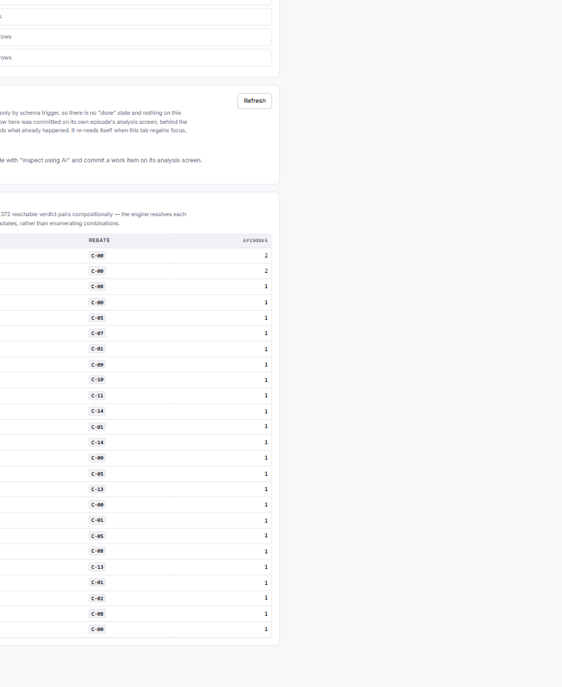
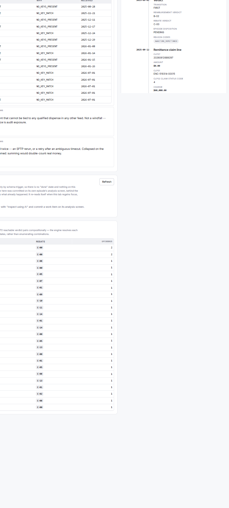

**Today.** Heading `Feed-level exceptions`, a two-line paragraph about the episode state space, then five independent `
` accordions. Each summary: a code chip, a bold title, a row count. Each body: a ~30-word paragraph and a three-column table.

| Order | Chip | Title | Live rows | Default |
|---|---|---|---|---|
| 1 | `D-3` | Orphan deposits | 3 | **open** |
| 2 | `D-7` | Allocation residuals | 10 | **open** |
| 3 | `D-6` | Parked records | 15 | collapsed |
| 4 | `D-4` | Unmatched rebates | 0 | collapsed |
| 5 | `D-1` | Duplicate deliveries | 0 | collapsed |

**Why it fails.**
- **`D-3`, `D-7`, `D-6` are unexplained and out of numeric order on screen.** Nothing anywhere says what D means. It is a fourth code namespace — *feed-level data exceptions*, a separate axis from the A/B/C verdict tracks — and the screen never says so. A reader who has learned A, B and C are tracks will reasonably assume there is a track D. **There is not.**
- **The open/closed rule is backwards.** It opens a section when `0 < rows < 12`. So the section with the *most* problems (`D-6`, 15 rows) starts hidden, while two empty sections are also hidden — the panel can look busy while concealing its biggest item.
- Two ~30-word rationale paragraphs are visible simultaneously by default.
- Column labels unreadable alone: `Caused by`, `Bank row`, `Payload digest`, `ACH trace`.
- `Payload digest` prints 48 characters of a SHA-256 hash, silently truncated with no ellipsis.
- `record_kind`, `park_reason` and `source_system` all render in monospace as though they were identifiers.

**Build this instead.**
- **Rename the panel to what it is: `Money and documents we could not match to a claim`.**
- **Lead with the dollars.** `D-3` and `D-7` are dollar-denominated and cursor-aware. This panel holds real unattributed cash and currently presents it as a collapsed accordion.
- **Sentence titles, code demoted:**
  - `D-3` → **Cash we received but cannot attribute** · 3 items
  - `D-7` → **Deposits that did not fully allocate** · 10 items
  - `D-6` → **Documents whose ID did not match anything** · 15 items
  - `D-4` → **Rebate money we cannot tie to a dispense** · 0 items
  - `D-1` → **The same file delivered twice** · 0 items
- **Reorder by consequence, not code number.** Dollar-carrying first, then document-matching, then hygiene.
- **Fix the disclosure rule.** Open what has rows, collapse what is empty, never hide the biggest. Put an aggregate line in the panel header so nothing important sits behind a click.
- Keep the blurbs — they are excellent — but show one line each, or move them behind a `?`.
- Rename columns: `Caused by` → `From the deposit received on`; `Bank row` → `Bank line`; `Payload digest` → `File fingerprint`, truncated visibly with `…`.
- **Preserve the distinction between the five.** The narrative line *"four different problems with four different owners"* is exactly this panel. Do not merge them into one "Unmatched" list.

**Available fields.** `GET /api/feed-exceptions` → `orphan_deposits[]{norm_id, amount_cents, received_at, ach_trace_number}` · `allocation_residuals[]{allocated_cents, bank_norm_id, caused_by_received_at}` · `parked[]{norm_id, record_kind, park_reason, received_at}` · `orphan_rebates[]{norm_id, record_kind, received_at, park_reason}` · `duplicate_deliveries[]{source_system, payload_sha256, deliveries}`. UI caps rows at 40 with a `showing 40 of N` note. `duplicate_deliveries` ignores the cursor.

---

### 1.6 Portfolio Analyst

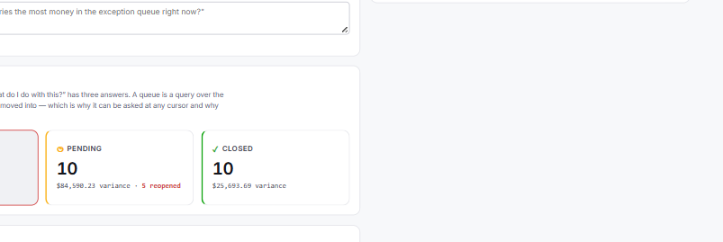

**Today.** A panel with `Portfolio Analyst`, an `Analyse the book` button, a five-line paragraph, and an optional question textarea. On run it streams a progress log, then renders four labelled prose blocks with inline citation superscripts.

**Why it fails.**
- It sits **second on the page, above the money**. An AI panel outranking the book's own numbers reads as a demo feature, not a product.
- The heading names an internal agent role. Nobody outside the team knows what a "Portfolio Analyst" is.
- The five-line paragraph is the densest copy on the screen and it explains architecture.
- Section labels come from raw response keys with underscores swapped for spaces: `state_of_the_book`, `what_is_concentrated`, `what_i_could_not_determine`, `where_to_look_first`.
- The 503 path shows the server's raw message. The long-run warning mentions "the provider's fast tier is down" — an internal operational detail.

**Build this instead.**
- **Move it below the worklist.** It answers a question asked *after* seeing the numbers.
- Heading: **`Ask about the book`**. Drop the role name.
- Reduce the paragraph to one line: *Every figure it quotes was computed by the engine and cited — it explains the numbers, it never produces one.* That sentence is the differentiator and it is currently buried at word 40 of 90.
- Real headings for the four output sections: `The state of the book` · `Where the money is concentrated` · `What I could not determine` · `Where to look first`.
- **Keep the citation superscripts and the unsourced-figure warning.** They are the proof in the narrative. Style the warning as a proper alert, not a bare outlined box.
- Style `What I could not determine` as a **feature**, not an apology — it is "the system never guesses" made visible.

---

### 1.7 To-do list

**Today.** Heading `To-do list — all episodes`, a `Refresh` button, and a four-line hint reading, verbatim: *"Read-only: work_item is append-only by schema trigger, so there is no "done" state and nothing on this screen mutates anything…"* Empty state: *"No to-dos yet. Open an episode with "Inspect using AI" and commit a work item on its analysis screen."* Seven columns when populated: `Work item` · `Episode` · `Action` · `Rationale` · `Created` · `By` · `Artifacts`.

**Why it fails.**
- The hint leaks a **database table name** (`work_item`) and the phrase `append-only by schema trigger` to a business reader. It also uses a raw `--` instead of an em dash.
- The hint is longer than the table it describes.
- `recommended_action` renders in the same `.verdict-code` pill style as verdict codes, so two entirely different kinds of thing look identical.
- `created_by` prints a raw system identifier.

**Build this instead.**
- Heading: **`Actions committed by the team`**.
- One-line hint: *Every row here was approved by a person on a claim's own page. This list only reads — nothing here can be edited or checked off.*
- Give the action its own visual treatment, distinct from verdict codes — it is a decision, not a diagnosis. Label the seven values in plain English (Part 4).
- Format `created_by` as a person and keep it. *"The record of who did it names the person, not the model"* is a narrative point worth showing.
- Keep the "hidden by cursor" notice. Counting what the cursor hides rather than silently dropping it is the same honesty discipline as the rest of the page.

**Available fields.** `GET /api/agent/work-items?limit=` → `work_items[]{work_item_id, episode_id, recommended_action, summary, created_at, created_by, required_artifacts[], at_cursor}`.

---

### 1.8 The episode side panel (right column)

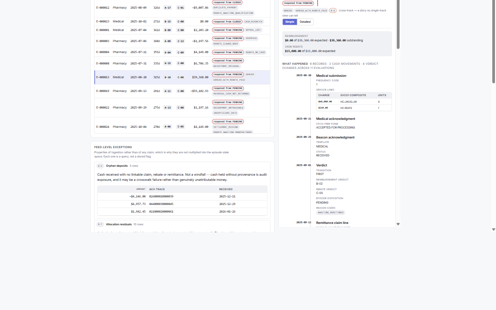

Shared with Screen 2 and specified in full there (§2.2–2.5). On Screen 1 it is sticky, `3fr/2fr`, `max-height: calc(100vh - 48px)`, collapsing below the left column at 1100px.

**Screen-1-specific issues:**
- Its empty state is a 40-word paragraph. Replace with a short line plus a pointer.
- The `onClose` prop is destructured and never used — **there is no way to dismiss the panel** once an episode is selected.
- The `Inspect using AI` button only appears after a dossier loads, so the panel's most important affordance materialises late.

---

## Screen 2 — The episode page (`/analyse/{id}`)

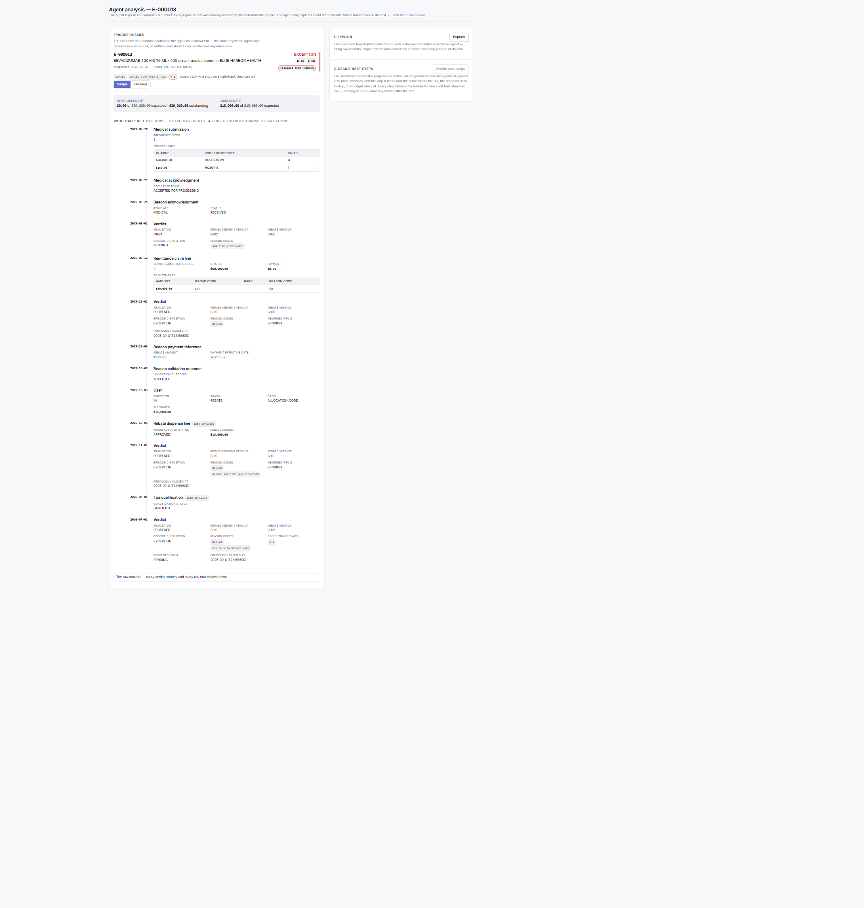

**Today.** Two columns. Left: the same episode dossier component as Screen 1. Right: two stacked panels, `1. Explain` and `2. Decide next steps`. Masthead is a bare `<h1>` reading `Agent analysis — E-000013`, a paragraph, and a plain text link `← Back to the dashboard`.

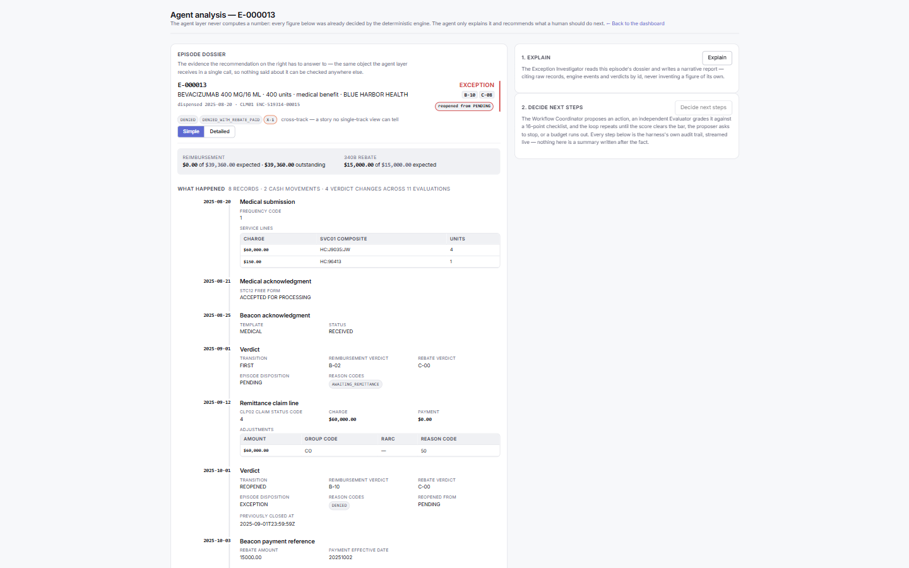

**Structural note.** This page is reached only by a full browser navigation into a new tab. There is no router and no in-app back. It is, in effect, a second application sharing a stylesheet.

---

### 2.1 Episode page masthead

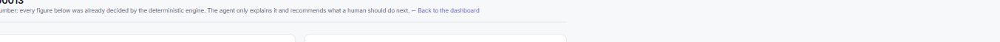

**Today.** `<h1>Agent analysis — E-000013`. Subtitle: *"The agent layer never computes a number: every figure below was already decided by the deterministic engine. The agent only explains it and recommends what a human should do next."* Then an inline anchor `← Back to the dashboard`.

**Why it fails.** The page is titled after the *technology* rather than the *claim*. An executive opening this wants to see the claim.

**Build this instead.**
- `<h1>` carries the claim's human identity — **`BEVACIZUMAB 400 MG · Blue Harbor Health · dispensed 20 Aug 2025`** — with `E-000013` as a muted monospace suffix.
- Put status and outstanding dollars in the masthead so they survive scrolling: `$39,360.00 outstanding · needs work`.
- Make `← Back` a real button, top-left, not an inline link inside a paragraph.
- Keep the "never computes a number" sentence. Shorten it, set it as a quiet line, not a lead paragraph.

---

### 2.2 Dossier header

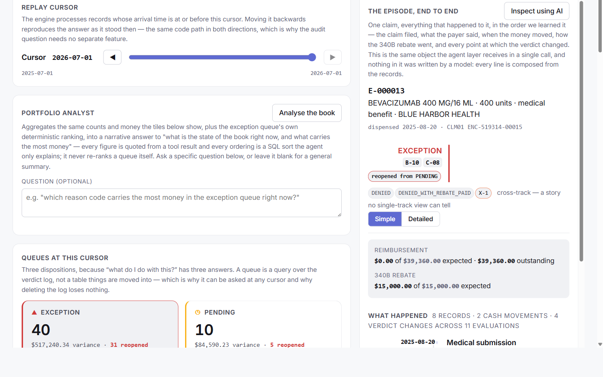

**Today, in render order:** episode id at 16px mono/650 · a composed drug line (`BEVACIZUMAB 400 MG/16 ML · 400 units · medical benefit · BLUE HARBOR HEALTH`) · a keys line (`dispensed 2025-08-20 · CLM01 ENC-519314-00015`) · right-aligned: `EXCEPTION` in raw uppercase, then two unlabelled code pills `B-10` `C-08`, then `reopened from PENDING` · then chips `DENIED` `DENIED_WITH_REBATE_PAID` `X-1` followed by loose text *"cross-track — a story no single-track view can tell"* · then a `Simple`/`Detailed` toggle.

**That is 17+ distinct facts in four font sizes and three families before the timeline starts.**

**Why it fails.**
- **The two verdict pills are the worst single element in the product.** Two opaque codes side by side with nothing saying which is reimbursement and which is rebate. The only place that mapping is stated is a column header inside a collapsed accordion further down the page.
- `EXCEPTION` is a raw enum. `CLM01` is an EDI segment identifier printed as a field label.
- The `X-1` chip looks identical to the two beside it, but it is a compliance exposure and they are ordinary reason codes.
- *"cross-track — a story no single-track view can tell"* is a pitch line sitting in a data region, rendering as loose text after three chips.

**Build this instead.**
- **Two labelled rows, not two bare pills:**
  > Insurance · **Denied by the payer, no appeal filed** `B-10`
  > 340B rebate · **Approved, paid, cash matched** `C-08`
- Status as a word with its colour: **`Needs work`**, `EXCEPTION` as a muted suffix.
- `reopened from PENDING` → **`Was settled on 1 Sep 2025, reopened since`**. The date is already in the payload as `previously_closed_at`.
- **Give the cross-track flag its own band** — `--status-serious`, full width, with a sentence: *"Compliance exposure — the insurer refused to pay for this drug and the manufacturer paid the 340B rebate anyway. Net position is negative."* This is the best story in the product and it currently renders as a 3-character chip.
- Hide `CLM01`, `Rx`, `fill_number` and NPIs behind a `Claim identifiers` disclosure. An executive never needs them; an operator needs them on demand.
- Keep the `Simple`/`Detailed` toggle. It works, and the split is computed server-side so the AI layer and the UI agree.

**Available fields.** `GET /api/episode/{id}/dossier` → `identity{track, drug, ndc11, quantity, date_of_service, payer, pharmacy_npi, rx_number, fill_number, clm01, billing_provider_npi, is_340b_flagged, opened_at}` · `current{reimbursement_verdict, rebate_verdict, episode_disposition, reason_codes[], cross_track_flags[], reopened_from, as_of}`. `previously_closed_at` and the per-track `reimbursement_disposition` / `rebate_disposition` exist on `GET /api/episode/{id}` and are **shown nowhere today**.

---

### 2.3 The money band

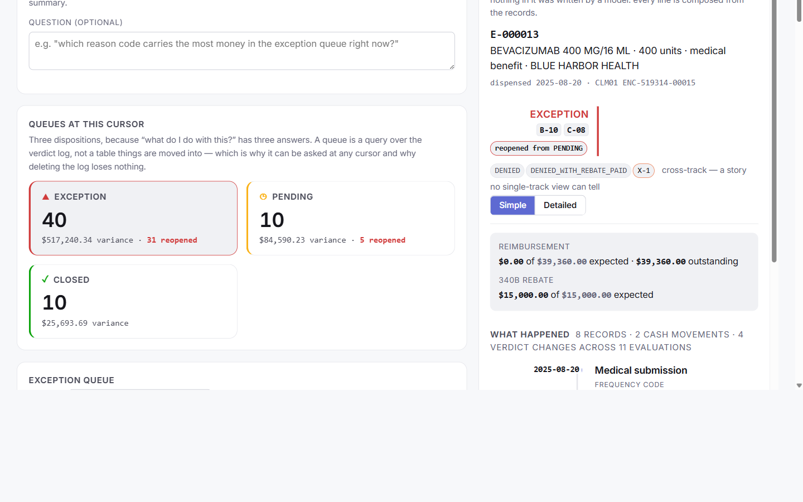

**Today.** A grey rounded band with two cells:

> **REIMBURSEMENT** — `$0.00` of `$39,360.00` expected · `$39,360.00` outstanding
> **340B REBATE** — `$15,000.00` of `$15,000.00` expected

**Why it fails.** This is the most important region on the page for the target audience, styled as a subdued utility strip in 13px text. `$39,360.00 outstanding` — the entire reason the claim is in the queue — is the same size and weight as the words around it.

**Build this instead.**
- **Make this the visual anchor of the page**, directly under the header. The outstanding figure gets display treatment: 28px, tabular, `--status-critical` when money is owed to us.
- Three explicit labels per track, not a run-on sentence: `Expected` / `Received` / `Outstanding`.
- Colour the rebate track with `--track-rebate` (`#4a3aa7`) — the token exists and the stylesheet never uses it.
- When the rebate is absent the cell prints `no rebate expected`. Suppress the cell rather than showing an apology where a number should be.
- Show the net position when the two tracks disagree in sign. E-000013 is exactly that case: $39,360 owed to us on one track, $15,000 already received on the other, on a claim the insurer denied. That net **is** the compliance story.

**Available fields.** `economics{expected_reimbursement_cents, received_reimbursement_cents, reimbursement_variance_cents, expected_rebate_cents, received_rebate_cents, rebate_variance_cents}`. All integer cents. **No percentage field exists anywhere in the API** — any ratio must be computed in the browser.

---

### 2.4 The timeline

**Today.** An ordered list in a `130px 1fr` grid. Left gutter: right-aligned monospace `YYYY-MM-DD` and a coloured status dot. Right: a 14px bold headline, an optional `late-arriving` pill, then a `repeat(auto-fill, minmax(180px, 1fr))` grid of label/value pairs. Detailed view adds a provenance line with a clickable `file:line` link expanding raw JSON and two SHA-256 hashes. Heading above: `What happened` followed by `8 records · 2 cash movements · 4 verdict changes across 11 evaluations`.

**Why it fails.**
- **`humanizeTag` destroys acronyms.** It lowercases the whole tag then capitalises only the first letter, producing **`Tpa qualification`**, `Tpa rebate request`, `Tpa manufacturer decision`, `Tpa reversal` on screen.
- **`humanizeKey` uppercases anything matching a short letter+digit pattern**, so raw EDI segment ids render as field labels: `CLP02 claim status code`, `SVC01 composite`, `STC12 free form`.
- Fact keys are never curated — whatever the payload holds becomes a `<dt>`. A `VERDICT` event shows five rows of enums: `Transition: FIRST`, `Reimbursement verdict: B-02`, `Rebate verdict: C-00`, `Episode disposition: PENDING`, `Reason codes: AWAITING_REMITTANCE`.
- Tables render **inside a definition list** for nested line items.
- The counts string welds four numbers onto a heading.
- **The status dot is clipped** — Part 5, bug 1.

**Build this instead.**
- **Fix the two humanisers.** Use an explicit label map for the 16 event tags rather than string-mangling:
  - `TPA_QUALIFICATION` → **340B administrator ruled on eligibility**
  - `TPA_MANUFACTURER_DECISION` → **Manufacturer ruled on the rebate**
  - `REMITTANCE_CLAIM_LINE` → **Payer's payment decision**
  - `PROVIDER_LEVEL_ADJUSTMENT` → **Payer clawback**
  - `BANK_TRANSACTION` → **Money moved at the bank**
  - `MEDICAL_ACKNOWLEDGMENT` → **Clearinghouse accepted the claim**
  - `REBATE_DISPENSE_LINE` → **Rebate line on a manufacturer payment**
- **Group the timeline into three lanes or three colours** — insurance, 340B rebate, cash. That parallelism is the whole domain insight and a single column hides it.
- **`VERDICT` events should read as a sentence, not a field list:** *"1 Oct 2025 — reopened. Now: denied by the payer. Was: awaiting payment."*
- Long dates: `20 Aug 2025`.
- Keep `late-arriving` and the `happened X, learned Y` treatment. Late arrival is a core domain fact, already well handled.
- Keep the provenance link and the raw-record panel. Being one click from the literal source line is the proof in the narrative — it deserves to be *more* visible in Detailed view, not less.
- Move the counts line off the heading into its own quiet row.

**Available fields.** `timeline[]{at, occurred_on, tag, facts{}, essential[], source{}, late}` · `counts{records, cash_allocations, verdicts_written, verdict_changes}`. `essential[]` is a server-authored list of which fact keys matter — the Simple/Detailed split is already in the payload.

---

### 2.5 Evidence accordion and unresolved records

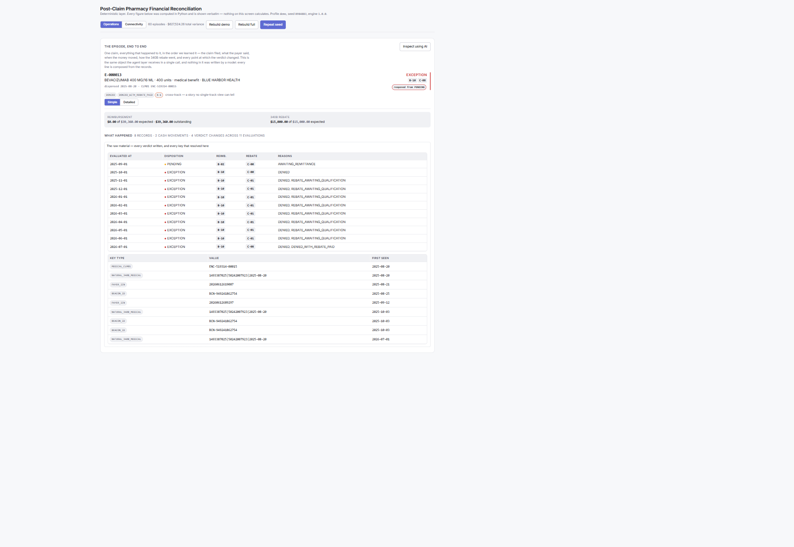

**Today.** A closed-by-default `
` summarised *"The raw material — every verdict written, and every key that resolved here"*, containing two stacked tables:
- **Verdict log** — `Evaluated at` · `Disposition` · `Reimb.` · `Rebate` · `Reasons`. The disposition cell is a literal `●` glyph followed by the raw enum.
- **Crosswalk keys** — `Key type` · `Value` · `First seen`.

Above it, when present, an **unresolved records** table — `Record` · `Why it parked` · `Key it carried` · `Arrived` — under *"Records that tried to reach this claim and could not"*.

**Why it fails.**
- `key_type` chips are raw: `NCPDP_CLAIM`, `MEDICAL_CLM01`, `PAYER_ICN`, `TRN02`, `ALLOCATION_CODE`, `NATURAL_340B_PHARMACY`, `NATURAL_340B_MEDICAL`, `PBM_AUTH`, `BEACON_ID`, `COVERED_ENTITY_340B`, `HCPCS`, `PAYMENT_REFERENCE`.
- `park_reason` chips are raw: `NO_KEY_MATCH`, `AMBIGUOUS_KEY_MATCH`, `NO_KEYS_PRESENT`, `COVERED_ENTITY_MISMATCH`.
- The `●` glyph is a second, inconsistent treatment of the same status-dot concept used in the timeline.
- The verdict log is where a reader would finally learn that the first code is reimbursement and the second is rebate — and it is collapsed by default.

**Build this instead.**
- Split into two disclosures with plainer summaries: **`How this claim's answer changed over time`** and **`Which identifiers matched this claim`**.
- The verdict log is the best audit artefact in the product. Surface a one-line summary outside the accordion: *"Evaluated 11 times, the answer changed 4 times."* Both numbers are already in `counts`.
- Give `park_reason` its plain-English label (Part 4). These are the four *"different problems with different owners"* from the narrative.
- **Keep the unresolved-records table prominent.** Records that tried to reach this claim and failed are by definition invisible everywhere else. Heading: **`Documents that may belong to this claim but did not match`**.

---

### 2.6 Explain and Decide

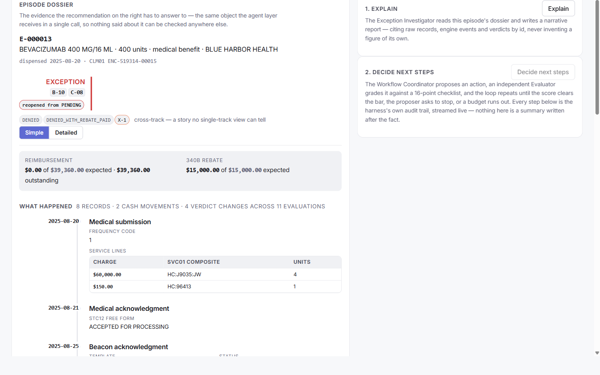

**Today, idle.** Two panels: `1. Explain` with an `Explain` button and a two-line description; `2. Decide next steps` with a disabled button (tooltip `Run Explain first`) and a four-line description.

**On run, Explain** produces four prose blocks labelled from raw keys — `what happened`, `why it is open`, `what i could not determine`, `what a human should check first` — plus a citation count and an optional unsourced-figure warning.

**On run, Decide** streams an append-only log into a 42vh scroll box, one row per event, dividers reading `Iteration 1`, `Iteration 2`. Event kinds render as `tool_call {name}({args truncated to 140 chars})`, `↳ {status} ({error_type}) · {bytes} B · {elapsed_ms} ms`, `score: 0.847 — 2 criteria not supported`, `gate: continue (score 0.847)`. Then an outcome banner and an editable work-item form.

**What to keep.** The `1.` / `2.` numbering and the disabled second button are **good product design**. The gating rule — *nobody should read a recommendation before reading what happened* — is a real safety property. Make it explicit in the UI rather than hiding it in a tooltip.

**Why it still fails.**
- The idle state is almost entirely empty space with two paragraphs of architecture.
- The live log leaks internal event names to screen: `llm_error:`, `tool_call`, `forced_tool_name_coerced`, `injection_attempt_recorded`, plus an unhandled-kind fallback printing `{kind}: {raw JSON}`.
- **Tool results are never shown** — only status, error type, byte count and elapsed ms. The evidence the report cites never reaches the screen.
- `proposal.evidence[]` and `result.citations[]` are fetched and **only their `.length` is rendered**.
- Sixteen graded criteria with written rationales exist per run; the UI shows a chip and a `title` tooltip.
- `criterion_id` is truncated to the pre-underscore token in the stream but shown in full in the banner — same data, two renderings.
- A known confusing state: three green `SUPPORTED` chips can sit directly above `score: 0.000` with nothing explaining it, because the four vetoes are deterministic and never appear in the evaluation event. **It reads as a broken scorer rather than as a veto working.**

**Build this instead.**
- **Two named steps with a visible dependency:** `Step 1 — Understand what happened` → `Step 2 — Decide what to do`. Show the lock reason on the face of step 2.
- Real headings for the four Explain sections, properly capitalised.
- **The log is the product, so make it legible rather than raw.** Group by iteration into collapsible blocks. Translate the event kinds: `tool_call` → **`Looked up: the claim's payment records`**; `↳ ok · 4.2 KB · 310 ms` → **`Found 8 records`**. Keep a `Show raw log` toggle for the engineer in the room.
- **When a veto fires, say so.** A `score: 0.000` beneath green chips needs one line: *"Blocked by a hard check: a figure appeared that no tool returned."* Style a veto distinctly from a low score.
- Surface `proposal.evidence[]` and the citation list. Already on the wire, and they are the reason to trust the output.
- Move criterion rationales out of `title` attributes into an expandable list.
- **Keep the outcome vocabulary and style `Insufficient data` as a success.** Four outcomes exist: `complete`, `insufficient_data`, `stalled`, `capped`. The claim *"'I could not tell' is a first-class answer"* depends on this being visible.

---

### 2.7 The human gate (work-item form)

**Today.** When Decide produces a proposal, a form appears: `Proposed work item — edit before committing`, an `Action` select with seven options, a `Rationale` textarea pre-filled from the model's reasoning with a live `{n}/600, min 20` counter, and one text input per required artifact with add/remove buttons. Then `Add to-do`, which runs a two-call commit.

**Why this matters more than any other element on the page.** Every field is editable by design. The reasoning is recorded explicitly: a reviewer who can only approve or reject is *ratifying*; one who can correct the action is *judging*. The design is a direct response to documented industry failures where a human-in-the-loop step became rubber-stamping.

**Build this instead.**
- **Make the editability visible, not incidental.** Heading: **`Your decision`**, with a line: *"This is a draft. Change anything — the record names you, not the model."*
- Show the model's original proposal alongside the editable fields, visibly marked as the draft, so a change reads as a change. The commit already sends a `proposed` object recording what the model said.
- Label the seven actions in plain English (Part 4).
- The success box reads `Work item created: {id}. {message}`. Make it a sentence.
- Keep the 20–600 character rationale rule and the counter. A forced rationale is an anti-rubber-stamp mechanism.

---

## Screen 3 — Verdict library (new screen)

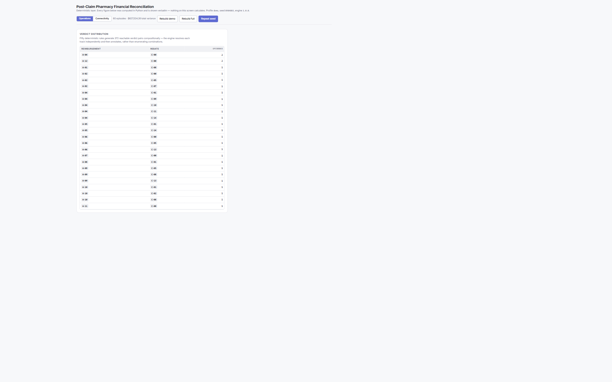

**Today.** The last panel on the landing page. Heading `Verdict distribution`, a two-line paragraph about 372 reachable pairs and 50 deterministic rules, then a three-column table: `Reimbursement` · `Rebate` · `Episodes`. Twenty-five rows of bare code pairs.

**Live content:** `A-04 / C-00 → 2`, `A-12 / C-00 → 2`, then **twenty-three consecutive rows with a count of 1.**

**Why it fails, bluntly.** It is the only table on the landing page with **no height cap** — it grows unbounded and can push the page to thousands of pixels. It carries **no money at all**, only episode counts. It is capped at 25 rows by the API (`LIMIT 25`), so its counts do not sum to the episode total and nothing on screen says so. And on the live demo profile, 23 of its 25 rows say "1". An executive reading it learns nothing, twice.

### Cost of this change — read before building

This is **the only change in this document that is not purely cosmetic.** The nav is a two-value `useState`, not a router. A third screen means: one more value in that state, one more button in the segmented control, one more branch in the body render. No new endpoint, no new route, no new fetch — the screen consumes `overview.verdict_pairs[]`, already fetched on every page load. **Scope: one state value, one button, one conditional. Do not let this grow into routing work.**

### Build this instead

- **Name it for the question it answers: `What kinds of problems are in the book?`**
- **Stop showing raw pairs as the primary object.** The pair table is a reference artefact; the executive view is the *families*. Group by what the operator does about it:
  - Underpaid or short-paid
  - Denied or rejected
  - Paid but no cash arrived
  - Rebate approved and unpaid
  - Reversed, clawed back, or duplicated
  - Compliance exposure (cross-track)
  - Settled, nothing to do
- **Each family gets an episode count and a plain-English sentence.** Counts come from `overview.reason_codes[]` — already returned, **no row limit**, ordered count-descending. A strictly better source than `verdict_pairs` for this purpose.
- **Keep the pair table below as a reference section** — both codes carrying their plain-English label, plus an explicit note: *"Top 25 pairs by frequency. Counts do not sum to the book total."*
- **State the D-code namespace on this screen.** This is the natural home for the sentence that resolves the confusion: *"A and B verdicts describe the insurance track. C verdicts describe the 340B rebate track. X flags mark a problem visible only when you look at both. D exceptions are a separate thing entirely — faults in the data we received, not facts about any claim."*
- Include the Part 4 dictionary here. It is a reference screen; a legend belongs on it.
- **Cap the table height** with the same `max-height` + `overflow-y` treatment the queue table already uses.

**Available fields.** `overview.verdict_pairs[]{reimbursement, rebate, episodes}` (LIMIT 25, no money) · `overview.reason_codes[]{reason_code, episodes}` (no limit, count-descending) · `overview.cross_track_flags[]{flag_code, episodes}` (alphabetical, not by size).

> **None of these carry dollars.** Money is aggregated by disposition only. A "top categories by dollars" view would have to be built client-side from queue rows — `absolute_variance_cents` plus `reason_codes[]` per row, three calls, a 1000-row cap, and no total count to tell you whether you got everything. That is an engineering decision, not a design one, and it is **out of scope under the freeze.**

---

## Screen 4 — Connectivity

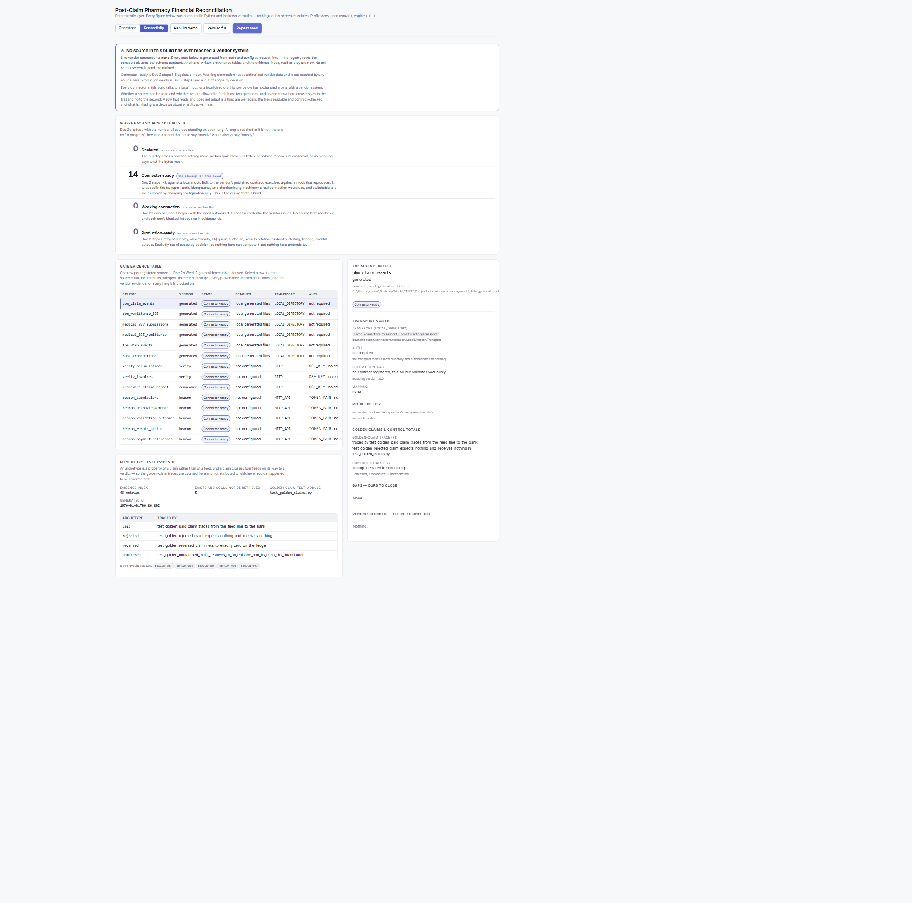
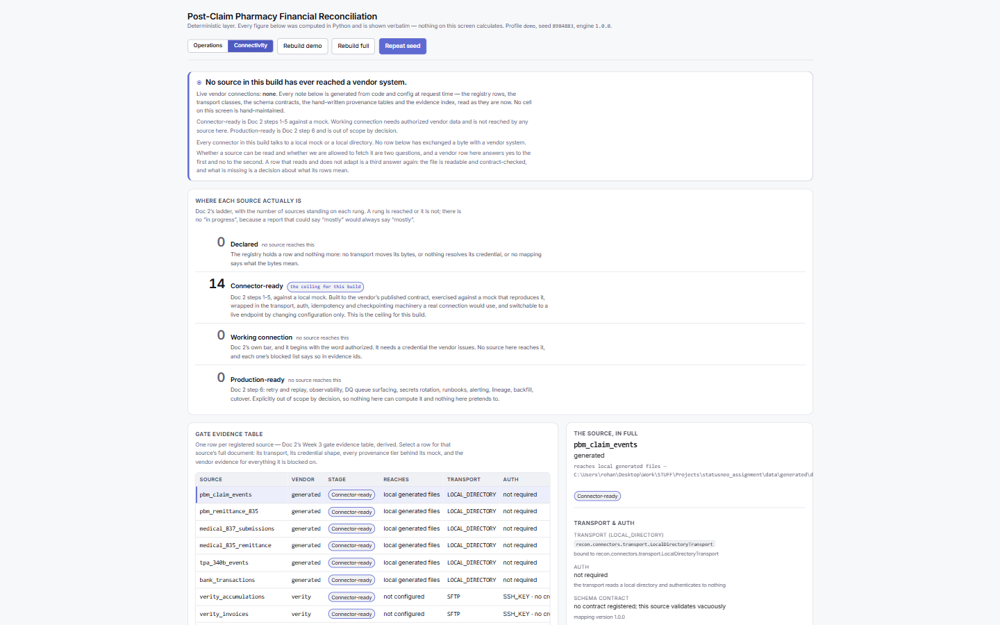

**Today, top to bottom.**
1. An honesty banner: `Live vendor connections: none.` plus a generated statement and notes.
2. **`Where each source actually is`** — a four-rung ladder with a count per rung: `Declared` · `Connector-ready` · `Working connection` · `Production-ready`. Chips read `the ceiling for this build` and `no source reaches this`.
3. A **12-column** gate evidence table: `Source` · `Vendor` · `Stage` · `Reaches` · `Transport` · `Auth` · `Schema` · `Mock fidelity` · `Golden` · `Control totals` · `Gaps` · `Blocked`.
4. A repository-level evidence panel and an archetype table.
5. A right-hand detail panel showing one selected source in full.

**What is good here and must survive.** This is the most product-mature screen in the build. It states what is *not* connected as loudly as what is. The banner sentence is generated from code at request time. The ladder refuses to say "in progress", with a stated reason: *"a report that could say 'mostly' would always say 'mostly'."* For an audience that evaluates delivery risk professionally, this is the most credible screen in the product. **Do not soften it.**

**Why it still fails an executive.**
- **Twelve columns.** Nine are engineering evidence: transport class, auth resolver, schema contract version, mock fidelity tiers, golden-claim traces, control totals.
- `SPEC` / `STANDARD` / `INVENTED` fidelity tiers are meaningful and completely unexplained on the face of the table.
- The rung labels are internal vocabulary. `Connector-ready` means *built and tested against a mock, switchable to live by config*. `Working connection` means *the vendor has issued us a credential*. Neither is self-evident.
- Row selection sits on the `<tr>` with no keyboard affordance and no visible button.
- `generated_at` prints as a raw unformatted timestamp.
- `gaps[]` and `blocked[]` collapse to integer counts; you must click a row to see any of them. There is **no aggregate** — no total gap count, no cross-source view of which credential would unblock the most sources, though all of it arrives in one response.

**Build this instead.**
- **Lead with the ladder, not the banner.** The four rungs with counts are the executive summary. Make them large.
- **Two columns by default** — `Source` and `Where it stands` (the rung plus one sentence) — expanding to the full evidence set behind a `Show evidence` toggle. Everything else moves to the detail panel, which already holds it all.
- Rename the rungs for a business reader, internal name as suffix: `Registered only` · `Built and tested, not yet authorised` · `Live connection` · `Production-hardened`.
- **Explain the fidelity bar inline.** It is already dual-encoded — colour plus text counts, so colour never carries meaning alone. Good. It needs one line: *"How much of this mock comes from the vendor's own documentation, versus an industry standard, versus our own invention."*
- **Add the cross-source rollup the data already supports** — one line above the table: *"14 sources registered · all connector-ready · 0 authorised · blocked on N vendor credentials."* Every number is in the one response.
- Format `generated_at` readably. Make row selection a real focusable control.

**Available fields.** `GET /api/connectivity` → `live_vendor_connections[]` · `live_vendor_connection_statement` · `notes[]` · `evidence_entries` · `unavailable_evidence[]` · `golden_test_module` · `generated_at` · `archetype_traces[]` · `sources[]{source_id, vendor, enabled, reaches, endpoint, stage, transport{}, auth{}, schema{}, mapping{}, fidelity{}, mock_modules[], golden{}, control_totals{}, gaps[], blocked[]}` · `active_tpa_source{source, datasets[], statement}` — which reports what was *read*, kept deliberately separate from what was *reached*.

---

# Part 4 — The plain-English dictionary

**This is the highest-value part of the redesign.** The screens are currently readable only by someone holding a 43-entry lookup table. Nobody in the room will be.

Two rules, repeated because they matter:

1. **The word is the primary text. The code is a muted monospace suffix.** Never delete the code — an operator cites it to a payer, and the AI layer grounds on it.
2. **Never rename a code string in the data.** Codes feed the AI layer's grounding tables and recorded evaluation fixtures. A rename silently breaks the AI layer at the next rebuild.

Short labels already exist in code at `src/recon/domain/verdicts.py:126` (`VERDICT_DESCRIPTIONS`), reachable via `describe()` at line 142. The frontend has never imported them.

---

## 4.1 The four namespaces — say this on Screen 3

There are **four** code families on screen and only two of them are tracks. This is the confusion to kill:

| Family | What it describes | Count |
|---|---|---|
| **A** and **B** | The **insurance track**. A = pharmacy benefit (PBM). B = medical benefit (insurer). **These are two halves of ONE track**, not two tracks — a claim travels one road or the other, never both. | 16 + 15 |
| **C** | The **340B rebate track**. An optional second track on the same claim. | 12 |
| **X** | **Cross-track flags.** A problem visible only when you look at both tracks together. Annotations, never prohibitions. | 7 |
| **D** | **Feed-level data exceptions.** A fault in the data we received — not a fact about any claim. **There is no track D.** | 7 |

Every claim always carries **exactly two verdicts**: one insurance, one rebate. `C-00` is the code for "this claim has no 340B rebate", so the rebate slot is never empty. That is why they are always shown as a pair.

---

## 4.2 Insurance track — pharmacy benefit (A codes)

| Code | Plain-English label | What the operator does |
|---|---|---|
| `A-01` | Refused at the counter | Nothing. The drug never went out. |
| `A-02` | Waiting for payment | Wait. |
| `A-04` | Paid in full and settled | Nothing. |
| `A-05` | Paperwork says paid, no money arrived | Chase the payer for cash it says it sent. |
| `A-06` | Money arrived, closing confirmation missing | Chase the confirmation, not the cash. |
| `A-07` | Underpaid, and the bank agrees with the short figure | Dispute the shortfall. |
| `A-08` | Underpaid **and** no money arrived | Two faults. Chase both. |
| `A-09` | Overpaid — we owe money back | Book a refund liability. |
| `A-10` | Cancelled, money returned | Nothing — but check no rebate still stands on it. |
| `A-11` | Cancelled, but we still hold the cash | Our books overstate revenue. Return it. |
| `A-12` | Clawed back after audit, and we traced it | Nothing. |
| `A-13` | Clawback we cannot tie to any bank movement | Investigate. The engine declines to decide. |
| `A-14` | Contract explains the whole gap | Nothing. Not a shortfall. |
| `A-15` | Contract explains part of the gap, not all | Chase the unexplained remainder. |
| `A-16` | Cancelled before any money moved | Nothing. |
| `A-17` | Paid twice for one claim | Refund one. |

## 4.3 Insurance track — medical benefit (B codes)

| Code | Plain-English label | What the operator does |
|---|---|---|
| `B-01` | Bounced by the clearinghouse | The insurer never saw it. Fix and resubmit. |
| `B-02` | Submitted, waiting on the insurer | Wait. |
| `B-04` | Paid in full, cash matched | Nothing. |
| `B-05` | Insurer says paid, no money arrived | Chase the money. |
| `B-06` | Paid short, no appeal filed | Decide: appeal, or write off. |
| `B-07` | Paid short, appeal in progress | Wait. |
| `B-08` | Appeal won, balance paid | Nothing. |
| `B-09` | Appeal lost | Make a write-off decision. |
| `B-10` | Denied, no appeal filed | Decide: appeal, or write off. |
| `B-11` | Denied, appeal in progress | Wait. |
| `B-12` | Denial overturned, paid | Nothing. |
| `B-13` | Denied, appeal lost | Total loss. Check upstream eligibility screening. |
| `B-14` | Appeal won, payment never arrived | **The highest-value chase in the system.** |
| `B-15` | Paid, then the insurer took it back | Investigate and dispute. |
| `B-16` | The same remittance arrived twice | De-duplicate before it reaches the ledger. |

## 4.4 340B rebate track (C codes)

| Code | Plain-English label | What the operator does |
|---|---|---|
| `C-00` | No 340B rebate on this claim | Nothing. Absence, not a problem. |
| `C-01` | Waiting on the eligibility ruling | Wait. |
| `C-02` | Ruled not eligible | Nothing. A correct answer, not a failure. |
| `C-03` | Eligible, rebate not yet requested | Wait, or push the submission. |
| `C-05` | Requested, manufacturer has not answered | Wait. |
| `C-07` | Manufacturer refused the rebate | Decide whether to correct and resubmit. |
| `C-08` | Approved, paid, cash matched | Nothing. |
| `C-09` | Administrator says paid, bank shows nothing | Chase the rebate cash. |
| `C-10` | Paid less rebate than expected | Dispute the shortfall — usually a unit or price dispute. |
| `C-11` | Approved, waiting on payment | Wait. |
| `C-13` | A rebate we received was reversed | Investigate — the original eligibility is now contested. |
| `C-14` | Two rebates paid for one dispense | Refund one. |

> **The numbering has deliberate holes.** `A-03`, `B-03`, `B-17`, `C-04`, `C-06`, `C-12` are retired and asserted absent in code. **Do not render a continuous range** — it would show codes that cannot exist.

---

## 4.5 Cross-track flags (X codes) — these are compliance, not diagnostics

**Give these a distinct visual treatment.** They are the reason a two-track view exists at all, and today they render identically to ordinary reason chips.

| Code | Plain-English label | Forces exception? |
|---|---|---|
| `X-1` | **Insurer refused to pay, but we kept the 340B rebate.** Net position negative; audit exposure. | Yes |
| `X-2` | **The sale was cancelled but a rebate was paid anyway.** The drug never reached the patient, so the rebate is invalid. | Yes |
| `X-3` | Money clawed back for ineligibility, and the rebate rests on the same now-wrong facts. | Yes |
| `X-4` | Insurance is clean; only the rebate was refused. **Deliberately not a compliance flag.** | No |
| `X-5` | Both tracks show "paid on paper, no money in the bank". Almost certainly one cause on our side, not two payers failing at once. | Yes |
| `X-6` | Every channel failed. Total loss on the drug. | Yes |
| `X-7` | An appeal was won after the rebate was clawed back — the reason for the clawback may no longer hold. **Recoverable money nobody is watching.** | Yes |

`X-4` exists and does nothing on purpose: the engine must recognise the shape in order to *not* escalate it.

---

## 4.6 Feed-level data exceptions (D codes) — the fourth namespace

**There is no track D.** These describe faults in the data we received, orthogonal to any claim's state.

| Code | Current UI title | Plain-English label |
|---|---|---|
| `D-1` | Duplicate deliveries | **The same file delivered twice.** An SFTP rerun or a retry. Counted once, never summed — summing would double-count real money. |
| `D-2` | *(no code shown; renders as an "Arrival lagged the event" chip)* | **A record arrived after the thing it explains.** Not an error — it becomes matchable later. |
| `D-3` | Orphan deposits | **Cash we received but cannot attribute.** Not a windfall — cash held without provenance is audit exposure. |
| `D-4` | Unmatched rebates | **Rebate money we cannot tie to any dispense** in any feed. |
| `D-5` | *(absent)* | Malformed record. **Deliberately never generated.** Correctly not on screen. |
| `D-6` | Parked records | **A document whose ID matched nothing.** Held, not discarded, and re-checked on every later arrival. *The claim is not missing — the mapping failed.* |
| `D-7` | Allocation residuals | **A deposit that did not fully allocate.** The deposit is right; our split of it is incomplete. |

> **One naming inconsistency to resolve in the design.** The UI files the "Parked records" panel under `D-6`, but the API docstring serving that endpoint names only D-1, D-3, D-4 and D-7. A *parked record* is the mechanism; `D-6` is the exception that mechanism surfaces. They are related, not synonyms. Pick one framing on screen and stay with it.

---

## 4.7 Why a document did not match (park reasons)

These are the narrative's *"four different problems with four different owners"*. Keep them distinct.

| Code | Plain-English label |
|---|---|
| `NO_KEY_MATCH` | The identifiers it carried matched nothing we hold |
| `AMBIGUOUS_KEY_MATCH` | It matched more than one claim — we will not guess which |
| `NO_KEYS_PRESENT` | It carried no usable identifier at all |
| `COVERED_ENTITY_MISMATCH` | It matched cleanly but names a different 340B entity |

## 4.8 Reason codes seen in the live demo data

The engine has 37. These are the ones on screen right now. **No authored label table exists for these anywhere in the repo** — their meaning is defined only by which verdict maps to them. The labels below are written for this brief and need one review pass by someone who knows the engine.

| Code | Plain-English label |
|---|---|
| `AWAITING_REMITTANCE` | Waiting for the insurer's payment decision |
| `UNDERPAID` | Paid less than the contract allows |
| `OVERPAID` | Paid more than the contract allows |
| `NO_CASH` | The paperwork says paid; no money arrived |
| `CASH_MISMATCH` | The money that arrived does not match the paperwork |
| `SETTLEMENT_MISSING` | Money arrived, closing confirmation did not |
| `DENIED` | The insurer refused to pay |
| `REJECTED_AT_POS` | Refused at the counter, before dispensing |
| `CLEARINGHOUSE_REJECTED` | Bounced before the insurer ever saw it |
| `APPEAL_LOST` | The appeal failed |
| `APPEAL_WON_NO_CASH` | The insurer agreed it owes us and still has not paid |
| `ADJUSTMENT_RESIDUAL` | The contractual discount explains part of the gap, not all |
| `DUPLICATE_PAYMENT` | Paid twice for one claim |
| `DUPLICATE_REMITTANCE` | The same remittance document arrived twice |
| `REVERSAL_CASH_NOT_RETURNED` | The sale was cancelled but we still hold the money |
| `RECOUPMENT_UNTRACEABLE` | A clawback we cannot tie to any bank movement |
| `TOTAL_LOSS` | Every collection path is exhausted |
| `INSUFFICIENT_DATA` | **The engine deterministically cannot decide.** Not an error — a first-class answer |
| `REBATE_AWAITING_QUALIFICATION` | Waiting on the 340B eligibility ruling |
| `REBATE_AWAITING_MANUFACTURER` | Requested; the manufacturer has not answered |
| `REBATE_AWAITING_PAYMENT` | Approved; the manufacturer has not paid |
| `REBATE_NOT_QUALIFIED` | Ruled not eligible for 340B |
| `REBATE_NO_CASH` | The administrator says paid; the bank shows nothing |
| `REBATE_UNDERPAID` | Less rebate paid than expected |
| `REBATE_CLAWED_BACK` | A rebate we received was reversed |
| `DUPLICATE_REBATE` | Two rebates paid for one dispense |
| `REBATE_ON_UNDISPENSED_CLAIM` | **A rebate stands on a claim where the drug never went out** |
| `DENIED_WITH_REBATE_PAID` | **The insurer refused, the manufacturer paid anyway** |
| `QUALIFICATION_UNDERMINED_BY_RECOUPMENT` | A clawback undercuts the facts the rebate was granted on |
| `REBATE_RE_REQUEST_AVAILABLE` | The rebate can be requested again |

## 4.9 The seven actions a human can commit

| Code | Plain-English label |
|---|---|
| `RESUBMIT` | Fix and send the claim again |
| `APPEAL` | Challenge the insurer's decision |
| `WRITE_OFF` | Accept the loss and close it |
| `ESCALATE` | Hand to someone with authority to chase a counterparty |
| `INVESTIGATE_CROSSWALK` | The money may be here — the ID match failed |
| `AWAIT_PAYER` | Nothing to do yet; the other side owes us a response |
| `ABSTAIN` | Not enough evidence to recommend anything |

## 4.10 Other raw strings currently on screen

| Where | Raw string | Suggested label |
|---|---|---|
| Queue table | `Reimb.` | `Insurance` |
| Dossier header | `EXCEPTION` / `PENDING` / `CLOSED` | `Needs work` / `Waiting` / `Settled` |
| Dossier header | `CLM01 ENC-519314-00015` | Hide behind a `Claim identifiers` disclosure |
| Timeline | `Tpa qualification` | `340B administrator ruled on eligibility` |
| Timeline | `CLP02 claim status code` | `Payer's status code` |
| Timeline | `STC12 free form` | `Clearinghouse note` |
| Timeline | `SVC01 composite` | `Procedure code` |
| Feed exceptions | `Caused by` | `From the deposit received on` |
| Feed exceptions | `Payload digest` | `File fingerprint` |
| Feed exceptions | `Bank row` | `Bank line` |
| To-do list | `work_item is append-only by schema trigger` | Remove entirely |
| Crosswalk keys | `NATURAL_340B_PHARMACY` etc. | `Pharmacy natural key` etc. |
| Agent log | `tool_call`, `llm_error`, `forced_tool_name_coerced` | Translate; keep raw behind a toggle |
| Connectivity | `SPEC` / `STANDARD` / `INVENTED` | `From vendor docs` / `From an industry standard` / `Our own invention` |
| Connectivity | `CONNECTOR_READY` | `Built and tested, not yet authorised` |

---

# Appendix A — Screenshot index

All images are in `docs/product/img/`, captured live at 1440×900 on the `demo` profile, seed `8984883`, cursor `2026-07-01`.

| File | What it shows |
|---|---|
| `01-dashboard-full.png` | Operations, entire page |
| `02-dashboard-fold.png` | Operations, what loads above the fold |
| `03-masthead.png` | Masthead |
| `04-replay-cursor.png` | Replay cursor panel |
| `05-queue-tiles.png` | The three disposition tiles |
| `06-queue-table.png` | Exception queue table |
| `07-portfolio-analyst.png` | Portfolio Analyst panel, idle |
| `08-feed-exceptions.png` | Feed-level exceptions, default state |
| `09-verdict-distribution.png` | Verdict distribution table, all 25 rows |
| `10-todo-panel.png` | To-do list, empty state |
| `11-episode-selected.png` | Queue plus episode panel together |
| `12-dossier-header.png` | Dossier header close-up |
| `13-dossier-money.png` | Money band close-up |
| `14-timeline-simple.png` | Timeline, Simple view |
| `17-timeline-detailed.png` | Timeline, Detailed view |
| `18-dossier-full.png` | Whole dossier panel |
| `19-feed-exceptions-expanded.png` | Feed exceptions, all five expanded |
| `20-evidence-accordion.png` | Verdict log and crosswalk keys |
| `21-connectivity-full.png` | Connectivity, entire page |
| `22-connectivity-fold.png` | Connectivity, above the fold |
| `23-episode-page-full.png` | Episode page, entire page |
| `24-episode-page-fold.png` | Episode page, above the fold |
| `25-explain-decide-idle.png` | Explain and Decide, idle |
| `26-episode-page-masthead.png` | Episode page masthead |
| `27-dashboard-full-expanded.png` | Operations with every accordion open |

---

# Appendix B — The demo claim

**E-000013** is the strongest single case in the dataset and every screen in this document uses it.

> BEVACIZUMAB 400 MG/16 ML · 400 units · medical benefit · Blue Harbor Health · dispensed 20 Aug 2025
> **Insurance: `B-10` — denied by the payer, no appeal filed. $0.00 received of $39,360.00 expected.**
> **340B rebate: `C-08` — approved, paid, cash matched. $15,000.00 received of $15,000.00 expected.**
> Flag `X-1`. Reopened from `PENDING`. 8 records · 2 cash movements · 4 verdict changes across 11 evaluations.

The insurer refused to pay for the drug. The manufacturer sent the 340B rebate anyway. The hospital is holding $15,000 it may owe back, on a claim that paid it nothing — and is still owed $39,360 it will probably never see.

**No single-track system can see this.** That is the product in one claim.

> **Do not use E-000042 or the A-07 / C-09 pair in any demo.** Both walkthrough documents open with a correction banner: those figures were hand-composed and never re-derived from a run, and that pair lands on no episode in the database. Episode ids are reassigned on every reseed, so any id quoted in prose is a snapshot of one dataset generation. The figures above were read off the running app on 22 September 2026 and carry the same caveat.
