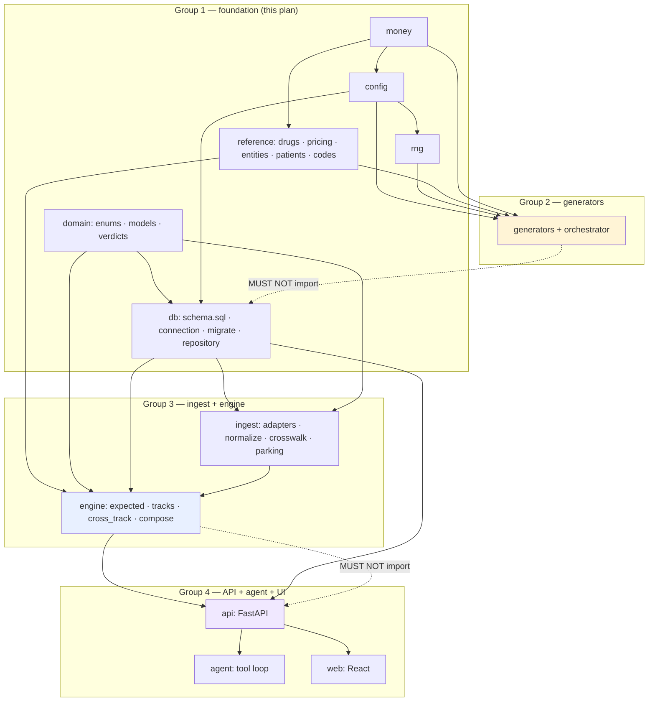
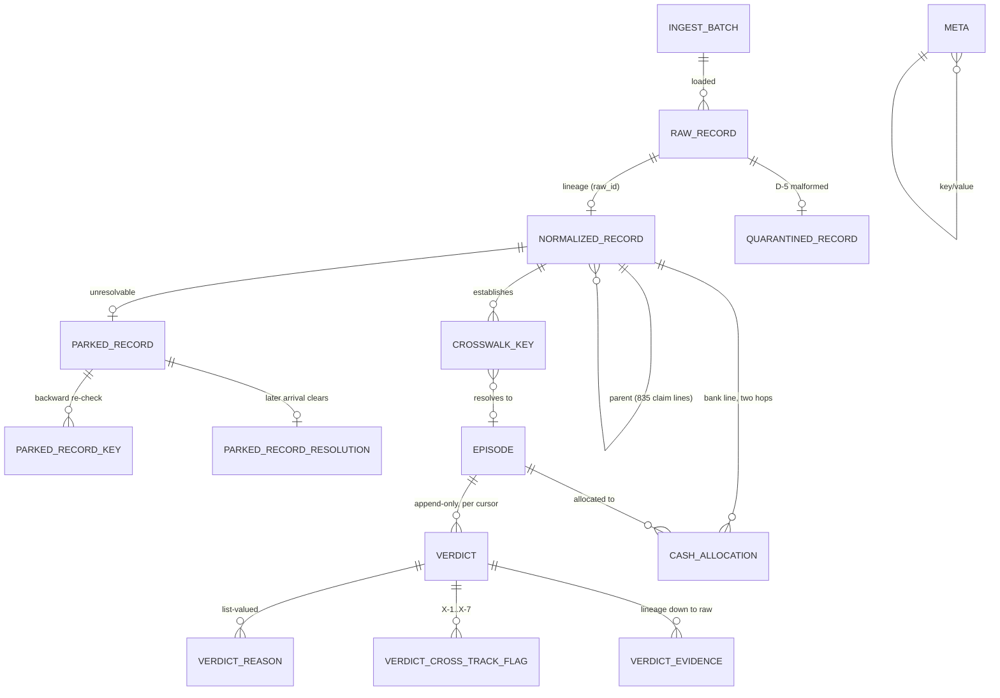
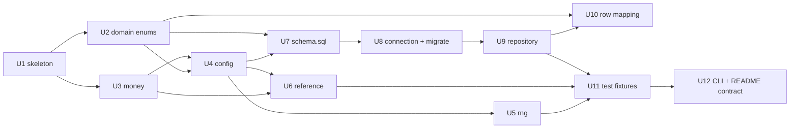

# G1 — Foundation and Persistence

> **This is a plan. No implementation code is produced here.** Pseudo-code, DDL and signatures
> below are *directional contract specification* — they exist so three other groups can plan in
> parallel against a fixed surface. The implementer treats them as the contract to satisfy, not
> as text to paste.

> **RECONCILED 2026-09-12** — see `plans/RECONCILIATION.md` and `architecture_decisions.md`
> Decisions 37–48. Deltas binding on this plan:
> - **A2 decided (Decision 38):** all payer/PBM/manufacturer names are fictional
>   (`MERIDIANRX`, `CASCADERX`, `BLUE HARBOR HEALTH`, `GRANITE PEAK HEALTH`, `VERION`,
>   `ALDEBARAN`, `CORVANE`, `TALVEX`, `SAGEPOINT`, `HALCYON`); `feed_formats.md` has been
>   corrected. A3 stands: real generic drug names and J-codes stay, all prices invented.
> - **A5 decided (Decision 45):** two covered entities (own + decoy) — and **two pharmacies**
>   (main + a satellite not registered with the covered entity, so `UNREGISTERED_LOCATION` is
>   generatable). U6's entity table is amended accordingly below.
> - **A8 decided (Decision 37):** `NATURAL_340B_MEDICAL` = `{provider_npi, ndc11, service_date}`,
>   with `rx_number` null on medical TPA records; `provider_npi` is the 837 billing provider NPI.
> - **A9 confirmed:** `demo` and `full` are independent episode sets (profile in the seed path).
> - **A16 confirmed:** `rebate_disposition IS NULL` iff `rebate_verdict_code = 'C-00'`.
> - **A17 confirmed:** reproduce the *shape* of the doc examples, not their exact cents.
> - **Layout (Decision 47):** feeds live in `data/generated/<profile>/feeds/`, ground truth in
>   `data/generated/<profile>/truth/`; the 340B feed file is `tpa_340b_events.jsonl`.
> - **Contract module (Decision 44):** `src/recon/generators/contracts.py` hosts the unified
>   slice/movement/cash-event contract. G2 owns its content; G1 owns only the file's place in
>   the tree and the layering guard around it.
> - **New G1 deliverables:** a banking-day calendar (`recon/reference/calendar.py` — weekends +
>   US federal holidays for the window) needed by G2's arrival model and G4's bank generator;
>   payer/manufacturer rows carry **both** `originating_company_id` (835-side) and bank-side
>   `company_id` + `ach_routing_prefix`, deliberately different values (G3 FLAG-8: TRN02 stays
>   the only intended 835→bank link).
> - **Oracle ownership confirmed (Decision 48):** U2's parity test against
>   `decision_tree/pairs.json` is the single live oracle; G2 asserts coverage against
>   `recon.domain.verdicts.REACHABLE_PAIRS`, not against `pairs.json` directly.

---

## Overview

Group 1 builds the floor everything else stands on: the package skeleton, the config module, the
seeding discipline that makes the dataset reproducible, the fixed entity universe with its price
table, the SQLite schema, and a thin stdlib DB layer.

Three other groups plan against this concurrently. That makes **the contract more important than
the code**. Section [Published Contract](#published-contract--what-other-groups-may-import) is the
load-bearing part of this document; everything else is how we get there.

Two things distinguish this foundation from generic scaffolding, and both come straight from the
binding decisions:

1. **The schema enforces the architecture instead of documenting it.** The pharmacy-XOR-medical
   rule (Decision 1) is a `CHECK` constraint, not a convention. Source-record immutability
   (Decision 23, state-space §0a) is a `BEFORE UPDATE` trigger that aborts, not a code review
   comment. "No SLA fields anywhere" (Decision 19) is a test that fails on the column name.
2. **Reproducibility is asserted, not claimed.** The assignment says *"A script that generates the
   data is preferred so the results can be reproduced."* We turn that into a manifest of SHA-256
   hashes per feed file and a test that regenerates into a temp directory and compares.

---

## Problem Frame

Four synthetic source feeds get ingested, crosswalked into claim-level episodes, reconciled by a
deterministic engine, and surfaced to an LLM agent layer that never computes a number. G1 owns
everything below the ingest layer: where code lives, where numbers come from, where rows land.

The failure modes G1 exists to prevent:

| Failure | How it shows up if G1 gets it wrong |
|---|---|
| Expected amounts drift between generator and engine | The generator writes an amount, the engine expects a different one, and every episode shows a phantom 1-cent variance. Nothing is reconcilable. |
| Float money | `47218.40` becomes `47218.399999999994`; variance arithmetic produces noise indistinguishable from real underpayment. |
| Reseeding shifts the dataset | Adding one episode to the `full` profile changes every other episode's identity. The demo walkthrough's traced claim stops existing. |
| The crosswalk leaks future knowledge | A key established by a record that arrived *after* the cursor still resolves, so replay silently reports answers we could not have known. The whole cursor story collapses. |
| Duplicate delivery (D-1) deduped in the wrong layer | A `UNIQUE(source_record_id)` on the raw table silently deletes the D-1 test case — and collapsing on a natural key instead silently merges A-17 (genuine duplicate *payment*) into one event. |
| A group imports across the layering boundary | The engine imports FastAPI, the CLI walkthrough stops working, and Decision 36 becomes a claim we cannot demonstrate. |

Every one of those gets a named mechanism below.

---

## Requirements Trace

Sourced from the binding documents. Each requirement is satisfied by a named unit.

| # | Requirement | Source | Unit |
|---|---|---|---|
| R1 | `src/` package hosting FastAPI and React later without restructuring | Decisions 34, 36 | U1 |
| R2 | Generators are a separate entry point that writes files and touches neither API nor DB | Decision 36 | U1, U12 |
| R3 | Engine is a library; FastAPI depends on it, never the reverse | Decision 36 | U1 (enforcement test), U12 (lazy CLI dispatch) |
| R4 | Config holds seed, window `2025-07-01 → 2026-07-01`, output paths, profile (`demo` ~60 / `full` ~1500) | Decision 14, prompt | U4 |
| R5 | Four independent generators, any order, byte-identical output across runs | Assignment §1 "reproduced", Decision 10 | U5 |
| R6 | Fixed entity universe, realistically formatted, all synthetic | Prompt; closes Open Question "Entity universe sizes" | U6 |
| R7 | Expected amounts derivable from the price table, never random | Prompt; closes Open Question "The drug price table" | U6 |
| R8 | Pharmacy-benefit vs medical-benefit drug split; a drug travels exactly one road | Decision 1, state-space §0 | U6 (`benefit_type` partition); U7 enforces the episode XOR separately as R12 |
| R9 | Raw source records immutable, one row per record, with `received_at` | Decisions 16, 23 | U7 |
| R10 | Normalized records with a lineage pointer back to the raw row | Decision 32 (lineage runs downward) | U7 |
| R11 | Crosswalk / resolved keys as first-class persisted state | Decision 8, feed-formats §5 | U7 |
| R12 | Episodes, claim-level, exactly one reimbursement track | Decision 1 | U7 |
| R13 | Append-only verdict log keyed `(episode, cursor)` with disposition, reason **list**, variance, evidence IDs, reopened flags | Decisions 23, 24, 25, 26, 32 | U7 |
| R14 | Parked records for inbound documents resolving to nothing, with a cheap backward re-check | Decision 22 | U7 |
| R15 | Indices making key resolution and "latest verdict per episode" fast | Decision 20, prompt | U7, U9 |
| R16 | Thin stdlib `sqlite3` DB layer, no ORM, importable without FastAPI | Decisions 34, 36 | U8, U9, U10 (row mapping), U11 (fixtures) |
| R17 | Exactly three dispositions; reason codes a separate list incl. `INSUFFICIENT_DATA` | Decisions 24, 25 | U2, U7 |
| R18 | No SLA fields anywhere; aging = `cursor − date_of_service`, computed at read time | Decision 19 | U4, U7, U9 |
| R19 | `received_at` is the single system-added field on every record | Decision 16 | U7 |
| R20 | Nothing ever written back to a source record | State-space §0a | U7 (triggers) |
| R21 | Reopened is a flag (`reopened_from`, `previously_closed_at`, `reopened_on`), not a fourth disposition | Decision 26 | U2, U7 |
| R22 | Source identifiers preserved so an investigator can trace a result to the synthetic source record | Assignment §1 (explicitly graded) | U7, U9 |

---

## Scope Boundaries

**G1 owns:** repo layout, `pyproject.toml`, config, RNG derivation, reference data + pricing
accessors, money primitives, the shared domain enums/dataclasses, `schema.sql`, connection
management, migration-as-schema-file, repository helpers, test fixtures for the other groups.

**G1 does not own:**

- Feed generation, defect injection, stratification, `ground_truth.json` — **G2**. G1 supplies the
  seeds, the reference data and the output paths; G2 decides what to write.
- Adapters, normalization semantics, crosswalk resolution logic, parking logic, the 50
  deterministic rules, expected-amount assembly at claim level — **G3**. G1 supplies the tables,
  the indices, the pricing primitives and the enums; G3 decides what goes in them.
- FastAPI routes, Pydantic models, React, the agent tool layer — **G4**.
- **Defect injection rates** — still an open question in `docs/architecture_decisions.md`, and it
  belongs to G2, not here.

**Explicit non-goals:** no ORM, no Alembic, no async DB layer, no connection pool, no
multi-tenancy (`tenant_id` is deliberately absent — Decision 33 §7 says it is a scoping predicate
added at scale, and adding it now is unused ceremony), no auth, no `.env` secrets.

---

## Key Technical Decisions

Twelve decisions. Each is a place another group could otherwise diverge.

### D1. Money is integer cents. Everywhere. No exceptions.

`INTEGER` columns, `int` in Python, never `float`, never `REAL`, never `Decimal` past the parser
boundary.

*Why:* this is a reconciliation engine; variance is the product. A float round-trip through
`47218.40` produces a residue indistinguishable from a real cash gap, and the engine would report
it as one. Integers make exactness structural.

*Consequence for the feed boundary:* feeds render decimals (`2840.00`), because a real NCPDP or
X12 feed does. So:

- **Writing (G2):** render from cents via one shared formatter. Never `str(float)`.
- **Reading (G3):** parse with `json.loads(line, parse_float=Decimal)`, then `Decimal → int cents`
  through one shared helper. Never `float(x) * 100`.

Both directions go through `recon.money`. A test asserts round-trip stability across the full
amount range in the dataset.

### D2. One rounding rule, defined once, used by generator and engine alike.

`round_half_up(numerator, denominator) -> int`, integer arithmetic only, in `recon.money`.

*Why:* if G2 rounds a contracted rate one way and G3 rounds it another, every claim carries a
1-cent variance and the engine cannot tell rounding from underpayment. This is the single most
likely source of a silent, systemic, hard-to-debug failure in the whole prototype.

### D3. The generator and the engine compute expected amounts from the *same* accessor.

`recon.reference.pricing.expected_reimbursement_cents(...)` and `expected_rebate_cents(...)` are
imported by G2 and G3 both.

*Why:* it makes underpayment a *deliberate delta* the generator subtracts, rather than a
coincidence of two independent calculations. It is also what satisfies "expected amounts must be
derivable consistently from this table — never random."

*Boundary:* reference owns everything derivable from **(drug, payer/plan, quantity)** — price,
contract rate, dispensing fee, and patient responsibility, because in this model patient
responsibility is a **plan parameter** (a flat copay per PBM plan, a coinsurance rate per medical
payer), not a claim fact. G3's `engine/expected.py` owns everything derivable only from **the
claim** — the adjustments actually present on the 835, reversals, appeals, recoupments, PLB
offsets. **Reference never takes a claim, a record, or a `norm_id` as an argument.** That is the
testable form of the boundary.

### D4. Seeds are *derived*, never shared. Four generators, any order, identical output.

A pure function `derive_seed(master_seed, *path) -> int` over a canonical string, hashed with
`hashlib.blake2b(digest_size=8)`.

*Why blake2b and not `hash()`:* Python's built-in `hash()` for strings is salted per-process by
`PYTHONHASHSEED`. Using it would make the dataset irreproducible across runs on the same machine —
the exact failure the assignment asks us to avoid. `blake2b` is stdlib, stable across versions and
platforms.

*Why derived and not one shared RNG:* with a single mutable RNG, output depends on *how many draws
every other generator made first*, so order matters and adding an episode reshuffles the dataset.
With derived per-stream seeds, each stream depends only on its own path. Order independence and
insertion independence both fall out.

### D5. The cursor is a UTC timestamp. A UI date `D` means `D`+`T23:59:59Z`.

Defined once as `config.cursor_from_date(d) -> str`.

*Why this needs deciding now:* the cursor is a date in the UI (Decision 35) and a timestamp in the
filter (`received_at <= cursor`). If G3 treats date `D` as start-of-day and G4's slider means
end-of-day, every claim is off by one day's worth of arrivals and nobody notices until the demo.

### D6. Derived state is cursor-filterable by the `received_at` of the record that caused it.

Every derived row (crosswalk entry, episode, parked record, park resolution, cash allocation)
carries the `received_at` of the record that produced it.

*Why:* without it, replay leaks future knowledge. A crosswalk key established on 18 March would
resolve a lookup performed at cursor 10 March, so "what did we believe on 10 March" returns an
answer built on evidence we did not have. This is a correctness trap, not an optimisation —
**every crosswalk and parked-pool lookup must carry the cursor predicate**, and the indices are
shaped so it is free.

*Named exception:* `verdict.cursor_at` is a genuine cursor, not a `received_at`. That is the
point of the verdict log.

*Column naming:* the D6 timestamp is named for **what caused the row**, not uniformly, because the
cause differs per table and a single generic name would hide it. The five are, exhaustively:
`crosswalk_key.first_seen_at` · `episode.created_from_received_at` · `parked_record.received_at` ·
`parked_record_resolution.resolved_by_received_at` · `cash_allocation.caused_by_received_at`.
**Any new derived table must add a sixth and add itself to this list** — a U7 test asserts every
derived table has at least one column whose value is a `received_at` copy.

### D7. Duplicate delivery is deduped on `source_record_id`, not on a natural key.

D-1 ("the same source event arrives twice") is literally defined in `feed_formats.md` as *"Same
`record_id` emitted twice in the file."* So `normalized_record.idempotency_key` = the source
`record_id` where one exists.

*Why it matters:* A-17 (*duplicate payment*) and B-16 (*duplicate 835*) are **genuine** duplicate
business events with **different** `record_id`s. A natural-key idempotency rule would collapse
them into one event and delete two of the state space's 43 track states. Raw rows are never
deduplicated at all — the raw layer stores exactly what arrived, twice if it arrived twice.

### D8. Reason codes live in a child table, not a JSON column.

`verdict_reason(verdict_id, ordinal, reason_code, track)`.

*Why:* reason codes are a **list** (Decision 25) and the exception queue is a **query** (Decision
23). "Show me every EXCEPTION carrying `CASH_MISMATCH`" must be an indexed lookup, not a JSON scan.
A JSON column *plus* a child table would be two sources of truth; we take the queryable one.

*Vocabulary:* validated in Python against `recon.domain.enums.ReasonCode`, **not** by a SQL
`CHECK`. G3 will add reason codes as it implements the 50 rules; a `CHECK` would make every
addition a schema migration.

### D9. Source-record immutability is enforced by triggers.

`BEFORE UPDATE` / `BEFORE DELETE` triggers that `RAISE(ABORT, ...)` on `raw_record`,
`normalized_record`, `episode`, `verdict`, `verdict_reason`, `verdict_evidence`,
`verdict_cross_track_flag`.

*Why:* "nothing is ever written back to a source record" is the load-bearing claim behind replay,
`reopened_from`, and the whole audit trail. A trigger turns it from a promise into a property the
database enforces. It is also a genuinely good thing to show in a 20-minute walkthrough — run an
`UPDATE`, watch it abort.

### D10. `STRICT` tables; minimum SQLite 3.37 / Python 3.11.

*Why:* SQLite's default type affinity will happily store `47218.4` in an `INTEGER` column. `STRICT`
rejects it. Given D1, that is exactly the guard we want, and it costs one keyword.

### D11. Schema evolution during the prototype is rebuild, not `ALTER`.

One `schema.sql` + `PRAGMA user_version`. If the file's version is behind, the DB is dropped and
rebuilt from the feeds.

*Why:* the DB is a gitignored derived artifact (`.gitignore` already excludes `*.sqlite`), fully
reconstructible by replay against immutable feeds. Writing migration scripts for a throwaway
artifact is ceremony. **Named production gap:** a real deployment needs versioned, reversible
migrations; state this in the design note alongside the Postgres gap.

### D12. Reference data is Python literals behind an accessor layer.

Frozen dataclasses in `src/recon/reference/`, reached only through accessor functions.

*Why literals:* typed, greppable, no parse step, no I/O, no file-not-found at import time, and the
generator can run with no database at all (Decision 36).

*Why an accessor layer anyway:* Decision 33 says scale is rows, not rules. When prices become a
config table, one module changes and no caller does. The accessor layer is what makes that claim
true rather than aspirational.

---

## High-Level Technical Design

> *Directional guidance for review, not implementation specification.*

### Module dependency — the layering rule, drawn



The two dotted edges are the enforced prohibitions (Decision 36). U1 ships the test that fails on
either.

### Data model — the six required tables plus what makes them work



### The two hot queries, sketched

> *Shape only — the implementer writes the real SQL against the real column names.*

```
-- HOT QUERY 1 — key resolution on inbound (Decision 20)
-- One indexed lookup per key the document carries. Note the cursor predicate (D6).
SELECT episode_id, remittance_norm_id
  FROM crosswalk_key
 WHERE key_type = ?  AND key_value = ?  AND first_seen_at <= :cursor
-- covered by ix_crosswalk_lookup (key_type, key_value, first_seen_at, episode_id, remittance_norm_id)

-- HOT QUERY 2 — latest verdict per episode at a cursor (Decisions 23, 35)
SELECT * FROM (
  SELECT v.*, ROW_NUMBER() OVER (
           PARTITION BY v.episode_id ORDER BY v.cursor_at DESC, v.verdict_id DESC) AS rn
    FROM verdict v
   WHERE v.cursor_at <= :cursor
) WHERE rn = 1
-- covered by ix_verdict_latest (episode_id, cursor_at DESC, verdict_id DESC)
```

Aging is computed here, at read time, never stored:
`CAST(julianday(:cursor) - julianday(episode.date_of_service) AS INTEGER) AS age_days`.

### Seed derivation, sketched

```
MASTER_SEED  (config, one integer)
     |
     +-- derive_seed(MASTER_SEED, "full", "pbm")              -> generator stream
     +-- derive_seed(MASTER_SEED, "full", "pbm", "EP-000417")  -> per-episode stream
     +-- derive_seed(MASTER_SEED, "full", "bank", "EP-000417")
     +-- derive_seed(MASTER_SEED, "demo", "tpa", "EP-000012")

canonical string = f"{master_seed}|{'/'.join(str(p) for p in path)}"
digest           = blake2b(canonical.encode("utf-8"), digest_size=8)
seed             = int.from_bytes(digest, "big")
rng              = random.Random(seed)      -- a FRESH Random per call
```

Properties this buys, each testable:

| Property | Test |
|---|---|
| Order independence | Run generators in all 24 orders → identical files |
| Insertion independence | Generate 60 then 61 episodes → the first 60 are unchanged |
| Cross-run stability | Regenerate → identical SHA-256 per file |
| Process-salt immunity | Run under three different `PYTHONHASHSEED` values → identical |

---

## Implementation Units

Twelve units. Dependency order below; U2/U3 can run parallel to each other, and U5/U6 can run
parallel once U4 lands.



---

- [ ] ### U1 — Repo skeleton, packaging, and the layering guard

**Goal:** the full tree exists, `pip install -e .` works, and the two forbidden import edges fail a
test.

**Requirements:** R1, R2, R3

**Dependencies:** none

**Files:**
- Create: `pyproject.toml`
- Create: `src/recon/__init__.py` and one `__init__.py` per subpackage listed below
- Create: `README.md` (skeleton; U12 fills the contract section)
- Modify: `.gitignore` (already excludes `data/generated/`, `*.sqlite` — add `web/node_modules/`, `web/dist/`)
- Test: `tests/test_layering.py`

**Proposed tree** (new paths marked `+`; existing paths untouched):

```
statusneo_assignment/
  CLAUDE.md
  README.md                          +
  pyproject.toml                     +
  .gitignore
  docs/                              (existing — authority)
  decision_tree/                     (existing — frozen oracle; U2 tests against pairs.json)
  plans/                             (this file)
  data/                              +
    generated/                       + gitignored
      demo/                          + (Decision 47 layout)
        feeds/ { pbm_claim_events.jsonl, pbm_remittance_835.jsonl,
                 medical_837_submissions.jsonl, medical_835_remittance.jsonl,
                 tpa_340b_events.jsonl, bank_transactions.csv }
        truth/ { ground_truth.json }   # ingestion/engine never read this directory
        manifest.json                  # reproducibility hashes
      full/  { same layout }
  src/                               +
    recon/
      __init__.py                    # exports __version__ only; NO side effects, NO heavy imports
      money.py                       # G1  U3
      config.py                      # G1  U4
      rng.py                         # G1  U5
      domain/                        # G1  U2, U10
        enums.py  models.py  verdicts.py
      reference/                     # G1  U6
        drugs.py  pricing.py  entities.py  patients.py  codes.py  calendar.py  fingerprint.py
      db/                            # G1  U7, U8, U9
        schema.sql  connection.py  migrate.py  repository.py
      generators/                    # G2/G3/G4 — writes files; imports config/rng/reference/money ONLY
        contracts.py                 # Decision 44 — unified slice/movement/cash-event contract (G2 owns content)
        orchestrator/                # G2 — stratify, timeline, money, batching, netting, realizer, truth
        pbm.py  medical.py  tpa.py  bank.py    # G3 (pbm, medical) and G4 (tpa, bank) generators
        ground_truth.py  manifest.py
      ingest/                        # G3
        adapters/{pbm.py, medical.py, tpa.py, bank.py}
        normalize.py  crosswalk.py  parking.py  loader.py
      engine/                        # G3 — library. Never imports recon.api
        expected.py  tracks/{pharmacy.py, medical.py, rebate.py}
        cross_track.py  compose.py  queues.py
      agent/                         # G4
        tools.py  loop.py  prompts.py
      api/                           # G4 — imports engine; engine never imports this
        main.py  schemas.py  routers/{episodes.py, queues.py, cursor.py, agent.py}
      cli.py                         # G1 skeleton (U12), G2/G3/G4 fill subcommands
  web/                               + G4 — React (Vite). Separate toolchain, own package.json
    package.json  index.html  src/
  tests/                             +
    conftest.py
    test_layering.py  test_money.py  test_config.py  test_rng.py
    test_reference.py  test_schema.py  test_repository.py
```

**Approach:**
- `src/` layout (not flat) so an accidental `import recon` from the repo root without installing
  fails loudly instead of silently shadowing.
- Package name `recon` — short, and the `src/` layout means it is only importable when installed.
  *(Assumption A1: rename freely if the parent prefers something less generic.)*
- `pyproject.toml`: `requires-python = ">=3.11"` (D10), `[project.optional-dependencies]` splitting
  `api = ["fastapi", "uvicorn", "pydantic"]`, `agent = [...]`, `dev = ["pytest"]`. **The base
  install has zero runtime dependencies** — that is what makes "dependency-light deterministic
  core" (Decision 34) a fact about the manifest rather than a claim in prose.
- **One** console script, `recon`, dispatching to subcommands (`recon generate`, `recon load`,
  `recon run`, `recon query`) via `recon.cli`. One binary, not four — four separate entry points
  would each need their own import graph and make the layering rule (R2/R3) four times harder to
  enforce. U12 defines the subcommand surface.
- `src/recon/__init__.py` must stay empty apart from `__version__`. A package `__init__` that
  imports submodules would drag `recon.db` into the generator's import graph and quietly break R2.

**Patterns to follow:** `decision_tree/` is the house style for this repo — plain stdlib Python,
module-per-concern, a `REPORT.md` stating what was verified. Mirror it.

**Test scenarios:**
- *Happy path:* `pip install -e .` succeeds with no third-party base dependencies resolved.
- *Happy path:* every listed subpackage is importable.
- *Error path (layering, the important one):* in a subprocess, `import recon.engine` then assert
  `"fastapi" not in sys.modules` and `"recon.api" not in sys.modules`.
- *Error path (layering):* in a subprocess, `import recon.generators` then assert
  `"recon.db" not in sys.modules` and `"sqlite3" not in sys.modules`.
- *Error path (static):* AST-walk every module under `src/recon/engine/` and
  `src/recon/generators/` and fail on any `Import`/`ImportFrom` naming `recon.api`, `fastapi`, or
  (for generators) `recon.db` / `sqlite3`. Catches lazy imports the runtime check misses.
- *Edge case:* `import recon` alone pulls in nothing but `recon.__version__`.

**Verification:** a fresh clone + `pip install -e ".[dev]"` + `pytest tests/test_layering.py` passes,
and the tree matches the listing above.

---

- [ ] ### U2 — Shared domain vocabulary: enums, verdict codes, oracle parity

**Goal:** one module defines every closed vocabulary all four groups share, and a test proves the
verdict codes match the decision-tree oracle exactly.

**Requirements:** R17, R21

**Dependencies:** U1

**Files:**
- Create: `src/recon/domain/enums.py`
- Create: `src/recon/domain/verdicts.py`
- Test: `tests/test_domain_vocabulary.py`

**Approach:**

`enums.py` — `StrEnum` throughout (3.11+), so values serialize to TEXT for SQLite and to JSON for
the API with no adapter:

| Enum | Members | Source |
|---|---|---|
| `Disposition` | `CLOSED`, `PENDING`, `EXCEPTION` — **exactly three, and a test asserts `len == 3`** | Decision 24 |
| `ReimbursementTrack` | `PHARMACY`, `MEDICAL` | Decision 1 |
| `TrackScope` | `REIMBURSEMENT`, `REBATE`, `CROSS_TRACK` | Decision 27 |
| `BenefitType` | `PHARMACY_BENEFIT`, `MEDICAL_BENEFIT` | Decision 1 / R8 |
| `SourceSystem` | `PBM_ADJUDICATION`, `PBM_REMITTANCE`, `TPA_PORTAL`, `MANUFACTURER_REBATE`, `CLEARINGHOUSE_837`, `MEDICAL_REMITTANCE`, `BANK` | `feed_formats.md` — verbatim |
| `RecordKind` | canonical normalized shapes, incl. parent/child split for 835 claim lines and rebate dispense lines | feed-formats §1–4 |
| `KeyType` | `NCPDP_TXN`, `NATURAL_340B`, `NATURAL_340B_MEDICAL`, `CLP01_PARSED`, `CLM01`, `CLP07`, `TRN02`, `ACH_TRACE`, `ALLOCATION_CODE`, `PBM_AUTH` | feed-formats §5 |
| `ParkReason` | `NO_KEY_MATCH`, `AMBIGUOUS_KEY_MATCH`, `NO_KEYS_PRESENT` | Decision 22 |
| `QuarantineReason` | `MISSING_REQUIRED_FIELD`, `BAD_TYPE`, `SCHEMA_VERSION_MISMATCH`, `UNKNOWN_EVENT_SEMANTICS` | D-5, Decision 33 §3 |
| `CrossTrackFlag` | `X_1` … `X_7`, `.code` property → `"X-1"` | state-space §4 |
| `EvidenceRole` | `ADJUDICATION`, `REVERSAL`, `REMITTANCE_CLAIM_LINE`, `PROVIDER_LEVEL_ADJUSTMENT`, `BANK_CREDIT`, `BANK_DEBIT`, `TPA_QUALIFICATION`, `REBATE_LINE`, `MEDICAL_SUBMISSION` | Decision 32 |
| `ReasonCode` | starter set below; **G3 owns the final list** | Decision 25 |
| `AllocationBasis` | `TRN02`, `ACH_TRACE`, `ALLOCATION_CODE`, `AMOUNT_DATE`, `RESIDUAL` | Decisions 21, D-7 |

`ReasonCode` starter set — enough to unblock G3's planning, explicitly extensible:

```
Reimbursement:  REJECTED_AT_POS · AWAITING_REMITTANCE · AWAITING_CASH · UNDERPAID · OVERPAID
                DUPLICATE_PAYMENT · CASH_MISMATCH · NO_CASH · SETTLEMENT_MISSING
                REVERSAL_CASH_NOT_RETURNED · RECOUPMENT_UNTRACEABLE · ADJUSTMENT_RESIDUAL
                CLEARINGHOUSE_REJECTED · DENIED · APPEAL_PENDING · APPEAL_LOST
                APPEAL_WON_NO_CASH · DUPLICATE_REMITTANCE
Rebate:         REBATE_AWAITING_QUALIFICATION · REBATE_NOT_QUALIFIED · REBATE_AWAITING_SUBMISSION
                REBATE_AWAITING_MANUFACTURER · REBATE_REJECTED · REBATE_AWAITING_PAYMENT
                REBATE_UNDERPAID · REBATE_NO_CASH · REBATE_CLAWED_BACK · DUPLICATE_REBATE
Cross-track:    REBATE_ON_UNDISPENSED_CLAIM · DENIED_WITH_REBATE_PAID
                QUALIFICATION_UNDERMINED_BY_RECOUPMENT · CORRELATED_CASH_GAP
                TOTAL_LOSS · REBATE_RE_REQUEST_AVAILABLE
Feed-level:     DUPLICATE_DELIVERY · ORPHAN_DEPOSIT · ORPHAN_REBATE · CROSSWALK_MISS
                MALFORMED_RECORD · ALLOCATION_RESIDUAL
Universal:      INSUFFICIENT_DATA
```

`verdicts.py` — the 31 reimbursement codes (`A-01`…`A-17` minus `A-03`; `B-01`…`B-16` minus
`B-03`) and the 12 rebate codes (`C-00`…`C-14` minus the retired ones), plus
`REACHABLE_PAIRS: frozenset[tuple[str, str]]`.

**The oracle-parity test is the interesting one here.** `decision_tree/pairs.json` already contains
the 372 pairs, generated exhaustively and independently verified. Loading it in a test and
asserting equality against `verdicts.py` wires the enumeration to the code: if anyone adds a
verdict code by hand, or the state space changes, the test fails immediately. That converts
`docs/reconciliation_state_space.md` from a design reference into a live test oracle — which is
what §5 of that document says it should be.

*Note:* `decision_tree/classify.py` emits an `UNMAPPED` sentinel. `verdicts.py` must **not**
include it; the parity test asserts `UNMAPPED` does not appear in `pairs.json`.

**Test scenarios:**
- *Happy path:* `len(Disposition) == 3` and members are exactly `{CLOSED, PENDING, EXCEPTION}`.
- *Happy path:* `INSUFFICIENT_DATA` is a member of `ReasonCode`.
- *Happy path (oracle parity):* the set of `(reimbursement, rebate)` pairs in
  `decision_tree/pairs.json` equals `verdicts.REACHABLE_PAIRS`; count is 372.
- *Happy path (oracle parity):* `len(REIMBURSEMENT_CODES) == 31`, `len(REBATE_CODES) == 12`, and
  `31 * 12 == 372` — asserting the exact-product independence result (REPORT §4).
- *Edge case:* retired codes `A-03`, `B-03`, `B-17`, `C-04`, `C-06`, `C-12`, `C-01a`, `C-11a` are
  absent from every collection.
- *Edge case:* `SourceSystem` members match the `source_system` literals in `feed_formats.md`
  character-for-character.
- *Edge case:* every `StrEnum` round-trips `Enum(str(member)) is member`.
- *Error path:* no enum member name or value matches `/sla|deadline|due_by|threshold/i` (R18,
  Decision 19).

**Verification:** the parity test passes against the unmodified `decision_tree/` artifacts, and
G3 can `from recon.domain.verdicts import REACHABLE_PAIRS` to build its coverage assertion.

---

- [ ] ### U3 — Money primitives

**Goal:** one module owns every conversion between the decimal text on the wire and the integer
cents in memory, plus the single rounding rule.

**Requirements:** R7 (precondition), D1, D2

**Dependencies:** U1

**Files:**
- Create: `src/recon/money.py`
- Test: `tests/test_money.py`

**Approach:**

Surface (the whole module is ~6 functions — resist growing it):

| Function | Purpose |
|---|---|
| `to_cents(value: str \| Decimal \| int) -> int` | Parse boundary. Rejects `float` with a `TypeError` — this is the guard that makes D1 enforceable rather than advisory. |
| `from_cents(cents: int) -> Decimal` | Exact `Decimal`, two places. |
| `format_amount(cents: int) -> str` | `"47218.40"` — fixed two decimals, used by every generator. |
| `round_half_up(numerator: int, denominator: int) -> int` | The one rounding rule (D2). Integer arithmetic; handles negatives symmetrically (PLB `L6` is negative). |
| `apply_bps(cents: int, bps: int) -> int` | `round_half_up(cents * bps, 10_000)`. Contract rates go through here and nowhere else. |
| `parse_json_money(obj) -> int` | Convenience over `json.loads(..., parse_float=Decimal)` output. |

**Execution note:** implement test-first. This module has no dependencies, a tiny surface, and the
entire correctness of the reconciliation output rests on it — it is the highest value-per-test
module in the project.

**Test scenarios:**
- *Happy path:* `to_cents("2840.00") == 284000`; `format_amount(284000) == "2840.00"`.
- *Happy path:* `format_amount(to_cents(x)) == x` for every money literal appearing in
  `docs/feed_formats.md` (`2840.00`, `1.75`, `50.00`, `2791.75`, `47218.40`, `47631.00`, `412.60`,
  `18420.00`, `612.40`, `598.10`, `8420.00`, `6100.00`, `5242.30`, `900.00`, `-42.30`, `1284302.11`,
  `-3150.00`, …). Uses the authority doc as the test corpus.
- *Edge case:* negative amounts (`-42.30` PLB `L6`, `-3150.00` ACH debit) round-trip and
  `round_half_up` is symmetric about zero.
- *Edge case:* `round_half_up(5, 10) == 1` and `round_half_up(-5, 10) == -1` — half-away-from-zero,
  documented explicitly so it cannot be mistaken for banker's rounding.
- *Edge case:* `apply_bps(284000, 1200)` matches a hand-computed value exactly.
- *Edge case:* a multi-million-dollar batch (feed-formats: "tens of thousands to several million")
  round-trips with zero drift.
- *Error path:* `to_cents(2840.00)` — a bare `float` — raises `TypeError`. **This is the test that
  keeps D1 true six weeks from now.**
- *Error path:* `to_cents("2840.005")` raises rather than silently rounding — three-decimal money
  is a feed defect, not a rounding opportunity.
- *Error path:* `round_half_up(1, 0)` raises `ZeroDivisionError`.

**Verification:** no module under `src/recon/` outside `money.py` contains a float literal in an
amount context; a grep-based test enforces it.

---

- [ ] ### U4 — Config module

**Goal:** every value that would otherwise be a literal lives here, immutably, with no wall-clock
and no SLA.

**Requirements:** R4, R18

**Dependencies:** U2, U3 (and U1 transitively)

**Files:**
- Create: `src/recon/config.py`
- Test: `tests/test_config.py`

**Approach:**

A frozen `Settings` dataclass plus `load_settings(profile, **overrides) -> Settings`. **No module-level
mutable singleton** — a mutable global is the classic way a test leaks state into a generator run
and silently changes the dataset.

Contents:

| Group | Members |
|---|---|
| Reproducibility | `master_seed: int = 20_250_701` (mnemonic: the window start). Overridable for tests; the default is the published one. |
| Window | `window_start = date(2025, 7, 1)`, `window_end = date(2026, 7, 1)` |
| Profile | `Profile` enum `{DEMO, FULL}`; `ProfileSpec(name, episode_count, selection, subdir)` — DEMO: 60, `CURATED`; FULL: 1500, `VERDICT_STRATIFIED` (Decision 15) |
| Paths | `repo_root` resolved from `__file__` (**never `cwd`** — the CLI, pytest and uvicorn all have different working directories); `data_dir`, `generated_dir(profile)`, `db_path(profile)` |
| Feed filenames | the six constants, single source of truth shared by G2's writer and G3's loader |
| Cursor | `cursor_from_date(d) -> str` (D5), `cursor_to_date(s) -> date`, `TIMESTAMP_FORMAT = "%Y-%m-%dT%H:%M:%SZ"` |
| Tolerances | `CASH_MATCH_TOLERANCE_CENTS`, `UNDERPAYMENT_TOLERANCE_CENTS`, `REBATE_TOLERANCE_CENTS`, reached via `tolerance_for(kind) -> int` |
| Schema | `SCHEMA_VERSION: int`, `ADAPTER_VERSION: str`, `ENGINE_VERSION: str` |

Two points worth defending in the walkthrough:

- **Tolerances are reached through an accessor even though there is one tenant.** Decision 19 and
  state-space §7 say config values must be looked up, never written as literals, *specifically so a
  second payer does not fork the rule*. `tolerance_for(kind)` today ignores tenant and pathway;
  the signature is what makes adding them a row rather than a rewrite. This is the cheapest
  possible demonstration of Decision 33's invariance claim.
- **`repo_root` from `__file__`.** The generator, the loader, pytest and uvicorn will each be
  launched from a different directory during the demo. A cwd-relative path works until the moment
  someone runs it from `web/`.

Env overrides: **paths only** (`RECON_DATA_DIR`, `RECON_DB_PATH`). Seed and window are not
env-overridable — they are what "reproducible" means, and letting the environment move them makes
the manifest hashes meaningless.

**Test scenarios:**
- *Happy path:* `load_settings(Profile.DEMO).episode_count == 60`; `FULL == 1500`.
- *Happy path:* window is exactly `2025-07-01` → `2026-07-01`; `window_end > window_start`.
- *Happy path:* `cursor_from_date(date(2026, 3, 17)) == "2026-03-17T23:59:59Z"` and
  `cursor_to_date` inverts it.
- *Happy path:* every feed filename constant matches the name used in `docs/feed_formats.md`.
- *Edge case:* `cursor_from_date(window_end)` includes every record in the dataset — the UI slider
  at max shows the terminal state.
- *Edge case:* `cursor_from_date(window_start - 1 day)` yields an empty result set rather than an
  error — the slider at min is a valid, empty state.
- *Edge case:* two `load_settings(...)` calls return equal, independent, frozen instances; mutating
  a field raises `FrozenInstanceError`.
- *Edge case:* `repo_root` resolves identically when pytest is invoked from the repo root and from
  a subdirectory.
- *Error path (R18, the binding one):* no field name on `Settings`, and no module-level constant in
  `config.py`, matches `/sla|deadline|due_by|breach|escalat|threshold_days|aging_bucket/i`.
- *Error path:* `config.py` contains no `datetime.now`, `date.today`, `time.time`, or `utcnow` —
  Decision 18, the generator has no concept of "now".
- *Error path:* an unknown profile name raises a clear `ValueError` naming the valid profiles.

**Verification:** G2 can compute every output path and the episode count from `Settings` alone,
with no literals of its own.

---

- [ ] ### U5 — Seeded RNG discipline

**Goal:** four generators, any order, byte-identical output across runs, machines and
`PYTHONHASHSEED` values.

**Requirements:** R5

**Dependencies:** U4

**Files:**
- Create: `src/recon/rng.py`
- Test: `tests/test_rng.py`

**Approach:**

Surface:

| Function | Purpose |
|---|---|
| `derive_seed(master_seed: int, *path: str \| int) -> int` | Pure. blake2b over the canonical string (D4). |
| `rng_for(settings, *path) -> random.Random` | Fresh `Random` per call, seeded by `derive_seed`. |
| `stable_choice(rng, seq)` / `stable_sample(rng, seq, k)` / `stable_shuffle(rng, seq)` | Thin wrappers that **reject `set` and `dict` inputs** and require an ordered sequence. |

The canonical string format must be written down in the module docstring and asserted by a test
with hardcoded expected seeds, so nobody "tidies" the separator and invalidates every previously
published hash.

**Four disciplines, each with an enforcing test rather than a comment:**

1. **No bare `random` module functions.** `random.choice(...)` uses a process-global Mersenne
   Twister that every other import can perturb. AST test over `src/recon/generators/` fails on any
   attribute access on the `random` module itself.
2. **No unordered-collection sampling.** Iterating a `set` gives an order that depends on insertion
   history and string hashing. `stable_*` raises `TypeError` on a `set`/`dict`/`frozenset`.
3. **No wall-clock.** Decision 18: the generator has no concept of "now". AST test over
   `src/recon/generators/` and `src/recon/engine/` fails on `datetime.now`, `date.today`,
   `time.time`, `utcnow`, `uuid.uuid4`.
4. **Manifest of hashes.** `manifest.json` beside each profile's feeds records `master_seed`,
   `profile`, `episode_count`, `window`, `reference_fingerprint` (U6), and `sha256` per output
   file. Regeneration into a temp directory must reproduce it exactly. *(G2 writes the manifest;
   G1 defines its shape and the comparison helper so the reproducibility test is shared.)*

Path convention, so all four generators agree without coordinating:
`rng_for(settings, profile_name, generator_name)` for generator-level draws and
`rng_for(settings, profile_name, generator_name, episode_id)` for per-episode draws. Including the
profile name means `demo` and `full` are independent datasets (**Assumption A9** — demo is *not* a
subset of full).

**Test scenarios:**
- *Happy path:* `derive_seed(20250701, "full", "pbm")` equals a hardcoded expected integer —
  pins the canonical string format permanently.
- *Happy path:* `derive_seed` is pure — 1,000 repeat calls return the same value.
- *Happy path:* distinct paths give distinct seeds across a 10k-path sample (no collisions).
- *Edge case (order independence):* shuffle the order of four generator invocations across all 24
  permutations; assert identical per-file SHA-256 each time.
- *Edge case (insertion independence):* derive per-episode streams for 60 episodes, then for 61;
  assert the first 60 streams' first 100 draws are unchanged. **This is the property that keeps the
  walkthrough's traced claim stable while G2 is still tuning the dataset.**
- *Edge case (process-salt immunity):* run the seed derivation in subprocesses under
  `PYTHONHASHSEED` of `0`, `1`, and `random`; assert identical output. Fails loudly if anyone
  reaches for the builtin `hash()`.
- *Edge case:* `rng_for` returns a fresh object each call — draining one does not affect another
  with the same path.
- *Error path:* `stable_choice(rng, {"a", "b"})` raises `TypeError` naming the ordering problem.
- *Error path:* `derive_seed` with a path element that is neither `str` nor `int` raises rather
  than stringifying an object whose `repr` contains a memory address.
- *Integration:* a full `demo` generation run into two separate temp directories produces identical
  `manifest.json` (deferred until G2 lands; the helper and the test skeleton ship here).

**Verification:** `recon generate --profile demo` twice into different directories yields identical
manifests.

---

- [ ] ### U6 — Reference data and pricing accessors

**Goal:** a fixed, realistically formatted, entirely synthetic entity universe, and the pricing
primitives both G2 and G3 import.

**Requirements:** R6, R7, R8

**Dependencies:** U3, U4

**Files:**
- Create: `src/recon/reference/drugs.py`, `pricing.py`, `entities.py`, `patients.py`, `codes.py`, `fingerprint.py`
- Test: `tests/test_reference.py`

**This unit closes two of the four Open Questions in `docs/architecture_decisions.md`:** "Entity
universe sizes" and "The drug price table."

#### Entity universe

This table is now **binding** per `architecture_decisions.md` Decision 45.

| Entity | Count | Format constraints |
|---|---|---|
| Specialty drugs | **12** — 7 pharmacy-benefit (oral / self-administered), 5 medical-benefit (infused, J-coded) | 11-digit NDC, no punctuation |
| Pharmacies | **2** — the operator's main site plus a satellite **not registered** with the covered entity (makes `UNREGISTERED_LOCATION` generatable) | 10-digit NPI, Luhn-valid |
| Billing provider (medical) | 1 | 10-digit NPI, Luhn-valid |
| Prescribers | 6 — at least one unaffiliated with either covered entity | 10-digit NPI, Luhn-valid |
| PBMs (`PbmPlan`) | 2 — `MERIDIANRX`, `CASCADERX` (Decision 38) | 6-digit BIN, PCN ≤10 alnum, Group ID, `originating_company_id` (835-side) **and** bank-side `company_id` — deliberately different values (FLAG-8) — `ach_routing_prefix` (A7), `copay_cents` |
| Medical payers (`MedicalPayer`) | 2 — `BLUE HARBOR HEALTH`, `GRANITE PEAK HEALTH` | name + 9-digit TIN (TRN03 renders as `"1" + TIN`), `originating_company_id` and bank-side `company_id` (different), `ach_routing_prefix` (A7), `coinsurance_bps` |
| Covered entities | **2** (Decision 45) — own `DSH…` + decoy `PED…`, each with affiliated-prescriber and registered-pharmacy sets | HRSA format + 9-char HIN |
| Manufacturers | 6 — `VERION`, `ALDEBARAN`, `CORVANE`, `TALVEX`, `SAGEPOINT`, `HALCYON` (Decision 38) | name + labeler-code mapping + `restricts_contract_pharmacy` |
| Patients | **40** | cardholder ID ≤20 alnum, `person_code` |

Also in this unit: `calendar.py` — a banking-day helper (weekends + US federal holidays over
2025-07-01..2026-07-01, `next_banking_day`, `add_banking_days`), consumed by G2's arrival model
and G4's bank generator. Pure data + pure functions, same discipline as the rest of reference.

#### The drug price table — shape

One row per NDC. **All money in integer cents, per dispensing unit.**

| Field | Meaning |
|---|---|
| `ndc11` | 11 digits, no punctuation |
| `name`, `strength`, `dosage_form` | descriptive |
| `benefit_type` | `PHARMACY_BENEFIT` \| `MEDICAL_BENEFIT` — **the XOR driver (R8)** |
| `hcpcs_j_code` | required iff `MEDICAL_BENEFIT`, else `None` |
| `labeler_code` | first 5 of the NDC; joins to the manufacturer table |
| `unit_basis` | `EACH` \| `ML` \| `MG` |
| `wac_cents_per_unit` | list price — the basis for `clp03_total_charge` / `svc02_charge_amount` |
| `acquisition_cost_cents_per_unit` | what the pharmacy actually paid, non-340B |
| `ceiling_340b_cents_per_unit` | HRSA ceiling |
| `ctp_units_per_billing_unit` | medical only — CTP04 quantity per one SVC05 J-code unit |

`ctp_units_per_billing_unit` exists so the **SVC05 vs CTP04 mismatch is produced consistently**.
`feed_formats.md` §3 is explicit that `svc05_units = 4` and `ctp04_quantity = 400` describe the
same vial on different bases and *must not* reconcile numerically. Putting the ratio in reference
data means G2 emits a consistent pair and G3 knows the pair is legitimate — rather than G2 emitting
a random mismatch and G3 flagging it as a defect.

**Invariant, asserted for every drug:** `ceiling_340b < acquisition_cost < wac`. If that ordering
ever breaks, `expected_rebate_cents` goes negative and the 340B track produces nonsense.

#### Contract terms — the "rows not rules" surface

Separate table keyed `(payer_id, ndc11)`:

| Field | Meaning |
|---|---|
| `payer_id` | a PBM id or a medical payer id |
| `ndc11` | drug |
| `basis` | `WAC_MINUS_BPS` (only member for now — a closed vocabulary, per Decision 33 §3) |
| `rate_bps` | e.g. `1200` = WAC − 12% |
| `dispensing_fee_cents` | pharmacy only |

Keeping contract terms out of the drug row is what makes Decision 33 demonstrable: adding a third
PBM adds rows to *this* table and changes no rule. Worth one sentence in the design note.

#### Derivations — the contract G2 and G3 share

> *Shape, not implementation. All integer arithmetic; all rounding via `money.round_half_up`.*

```
charge_cents(ndc, quantity_milli)
    = round_half_up(wac_cents_per_unit * quantity_milli, 1000)

contracted_allowed_cents(ndc, payer_id, quantity_milli)
    = apply_bps(charge_cents(...), 10_000 - rate_bps)
      + dispensing_fee_cents            # pharmacy only

patient_responsibility_cents(payer_id, allowed_cents)
    = PbmPlan.copay_cents                                   # pharmacy: flat, per plan
    | apply_bps(allowed_cents, MedicalPayer.coinsurance_bps) # medical: proportional, per payer

expected_reimbursement_cents(ndc, payer_id, quantity_milli)   # what the PAYER should pay
    = contracted_allowed_cents(...) - patient_responsibility_cents(payer_id, allowed)

expected_rebate_cents(ndc, quantity_milli)
    = max(0, round_half_up(
        (acquisition_cost_cents_per_unit - ceiling_340b_cents_per_unit) * quantity_milli, 1000))
```

`quantity_milli` is quantity × 1000, matching NCPDP field 442-E7's three implied decimals
(`"030000"` = 30.000). Carrying it as milli-units end to end means the implied-decimal format is
parsed once, at the adapter boundary, and never re-derived.

Patient responsibility is a **plan** attribute, not a drug attribute and not a claim fact — which
is why it stays inside reference (D3). Two carriers, both defined in `entities.py`:

- `PbmPlan` — one per PBM: `pbm_id`, `bin`, `pcn`, `group_id`, `payer_name`, `company_id`,
  `ach_routing_prefix` (A7), **`copay_cents`** (flat; `feed_formats.md` shows `50.00` and `45.00`).
  Reached via `reference.entities.pbm_plan(pbm_id)`.
- `MedicalPayer` — `payer_id`, `name`, `tin`, `company_id`, `ach_routing_prefix` (A7),
  **`coinsurance_bps`** (proportional; `PR-2`). Reached via `reference.entities.payer_by_id(id)`.

#### Code tables (`codes.py`) — Decision 33 made concrete

Mappings from **(source entity, wire code) → canonical semantics**, so PBM A's reject `70` and
PBM B's `A1` both resolve to the same canonical meaning and A-01 fires from one branch:

- NCPDP reject codes (`70`, `75`, `76`, `79`, `88`, `40`, `65`, `21`, `25`)
- CARC by group (`CO-45`, `CO-97`, `CO-16`, `CO-18`, `CO-50`, `CO-151`, `CO-197`, `PR-1`, `PR-2`,
  `PR-3`, `PR-204`)
- RARC (`N130`, `N362`, `N522`, `M15`, `N54`, `N56`)
- PLB (`WO`, `FB`, `L6`, `CS`, `72`, `RA`) with **sign convention** — `L6` is negative because it
  increases payment; getting this wrong inverts the PLB arithmetic in `feed_formats.md` §1 and §3
- TPA disqualification reasons (`NO_QUALIFYING_ENCOUNTER`, `PRESCRIBER_NOT_AFFILIATED`,
  `UNREGISTERED_LOCATION`, `MEDICAID_DUPLICATE_DISCOUNT`)
- Manufacturer rejection reasons (`CONTRACT_PHARMACY_RESTRICTED`, `NON_CONFORMING_45_DAY`)

#### `fingerprint.py`

`reference.fingerprint() -> str` — SHA-256 over a canonical, sorted serialization of every
reference table. Written into the generator manifest and the DB `meta` table, and stamped on every
verdict row.

*Why:* if someone edits a price, every downstream artifact's fingerprint stops matching and the
drift is **detectable** rather than silent. A verdict computed under one price table and compared
against a dataset generated under another is a genuinely confusing bug; this makes it a one-line
assertion instead.

#### Published accessor surface

```
reference.drugs      : all_drugs() · by_ndc(ndc) · pharmacy_benefit() · medical_benefit()
                       by_j_code(code)
reference.pricing    : charge_cents(...) · contracted_allowed_cents(...)
                       patient_responsibility_cents(...) · expected_reimbursement_cents(...)
                       expected_rebate_cents(...) · contract_terms(payer_id, ndc)
reference.entities   : pharmacy() · billing_provider() · prescribers() · pbms() · pbm_by_id(id)
                       pbm_by_bin(bin) · pbm_plan(pbm_id) · medical_payers() · payer_by_id(id)
                       covered_entities() · own_covered_entity()
                       manufacturers() · manufacturer_for_ndc(ndc)
reference.patients   : all_patients() · by_cardholder_id(cid) · for_benefit_type(bt)
reference.codes      : reject_semantics(pbm_id, code) · carc_semantics(payer_id, group, code)
                       rarc_semantics(code) · plb_semantics(code)
                       disqualification_reasons() · manufacturer_rejection_reasons()
reference.validate() · reference.fingerprint()
```

All pure. All frozen dataclasses. **Zero I/O, zero RNG, zero DB.** That is what lets the generator
run with no database and the engine run with no filesystem.

**Test scenarios:**
- *Happy path:* `len(all_drugs()) == 12`; `pharmacy_benefit()` and `medical_benefit()` partition it
  with no overlap (**R8 — a drug travels exactly one road**).
- *Happy path:* the four NDCs appearing in `docs/feed_formats.md` (`00071015523`, `00002143380`,
  `00074433902`, `50242007923`) are all present, with `50242007923` classified `MEDICAL_BENEFIT`
  and carrying `J9035`.
- *Happy path:* `len(all_patients()) == 40`; all cardholder IDs unique.
- *Happy path:* `expected_rebate_cents` for a known drug/quantity equals a hand-computed value.
- *Happy path:* `contracted_allowed_cents - patient_responsibility_cents == expected_reimbursement_cents`
  for every (drug, payer) pair — the three pricing functions compose exactly, with no rounding gap.
- *Happy path:* `pbm_plan(id).copay_cents` is flat per plan; `payer_by_id(id).coinsurance_bps`
  applied to an allowed amount reproduces a hand-computed `PR-2` figure.
- *Edge case:* every NPI is exactly 10 digits **and passes the NPPES Luhn check** (check digit over
  `"80840" + first 9 digits). Cheap, and it is the difference between "10 random digits" and a
  realistically formatted identifier.
- *Edge case:* every NDC is exactly 11 digits, no punctuation; every BIN exactly 6 digits; every
  TIN exactly 9; every HIN exactly 9 alphanumeric characters.
- *Edge case:* every `covered_entity_id` matches the HRSA prefix grammar
  (`DSH|CAH|CAN|PED|RRC|SCH|CH|FQHC|HM|RW*` + digits + optional trailing child-site letter).
- *Edge case:* `ceiling_340b < acquisition_cost < wac` for all 12 drugs.
- *Edge case:* every `MEDICAL_BENEFIT` drug has a J-code and a `ctp_units_per_billing_unit`; no
  `PHARMACY_BENEFIT` drug has either.
- *Edge case:* every drug's `labeler_code` resolves to exactly one manufacturer; at least one
  manufacturer has `restricts_contract_pharmacy = True` (otherwise `CONTRACT_PHARMACY_RESTRICTED`
  is unreachable and G2 cannot generate that defect).
- *Edge case:* every (payer, drug) pair a generator could bill has contract terms — no
  `KeyError` reachable from a legal combination.
- *Edge case:* `fingerprint()` is stable across processes and changes when any price changes.
- *Error path:* `by_ndc("99999999999")` raises a domain error naming the NDC, not `KeyError`.
- *Error path:* `expected_rebate_cents` never returns negative, even at quantity 0.
- *Error path (D3 boundary, testable form):* introspect every public function in
  `reference.pricing` and assert **no parameter is named** `claim`, `record`, `norm_id`, `raw_id`
  or `episode_id`. Reference never takes a claim.
- *Error path:* `validate()` fails loudly (with the offending row) if any invariant above breaks —
  called by a test, so bad reference data cannot reach a generator run.

**Verification:** `reference.validate()` passes; G2 can build a complete PBM claim event and a
complete 837 from reference data alone, with no literals.

---

- [ ] ### U7 — SQLite schema

**Goal:** the DDL, with the architecture enforced by constraints and triggers, and both hot queries
covered by indices.

**Requirements:** R9–R15, R17–R22

**Dependencies:** U2, U4

**Files:**
- Create: `src/recon/db/schema.sql`
- Test: `tests/test_schema.py`

**Approach:** one `schema.sql`, executed whole, `PRAGMA user_version` at the end (D11). `STRICT`
tables throughout (D10).

**Type discipline:** money → `INTEGER` cents · timestamps → `TEXT` fixed-width
`YYYY-MM-DDTHH:MM:SSZ` (so lexicographic order *is* chronological order, and the cursor filter is a
plain string comparison) · dates → `TEXT` `YYYY-MM-DD` · booleans → `INTEGER` 0/1 · enums → `TEXT`
with `CHECK` for closed vocabularies, Python-validated for open ones (D8) · payloads → `TEXT`.

#### The DDL

> *Directional. Column names are the contract; the implementer writes the file.*

```sql
PRAGMA foreign_keys = ON;

-- ═══ META ══════════════════════════════════════════════════════════════════
CREATE TABLE meta (
  key   TEXT PRIMARY KEY,
  value TEXT NOT NULL
) STRICT;
-- rows: schema_version · master_seed · profile · reference_fingerprint
--       window_start · window_end · adapter_version · engine_version

-- ═══ INGEST BATCH ══════════════════════════════════════════════════════════
CREATE TABLE ingest_batch (
  batch_id      INTEGER PRIMARY KEY,
  source_file   TEXT    NOT NULL,
  source_system TEXT    NOT NULL,
  file_sha256   TEXT    NOT NULL UNIQUE,   -- re-loading the same file is a no-op
  record_count  INTEGER NOT NULL,
  loaded_at     TEXT    NOT NULL           -- operational wall-clock; NOT a domain date
) STRICT;

-- ═══ RAW — immutable, exactly as received ══════════════════════════════════
CREATE TABLE raw_record (
  raw_id           INTEGER PRIMARY KEY,
  batch_id         INTEGER NOT NULL REFERENCES ingest_batch(batch_id),
  source_system    TEXT    NOT NULL CHECK (source_system IN (
                     'PBM_ADJUDICATION','PBM_REMITTANCE','TPA_PORTAL','MANUFACTURER_REBATE',
                     'CLEARINGHOUSE_837','MEDICAL_REMITTANCE','BANK')),
  source_record_id TEXT,                   -- record_id as given; NULL for bank CSV rows
  source_line_no   INTEGER NOT NULL,       -- 1-based position in the file
  payload          TEXT    NOT NULL,       -- verbatim JSONL line, or CSV row re-encoded as JSON
  payload_sha256   TEXT    NOT NULL,
  received_at      TEXT    NOT NULL,       -- THE single system-added field (Decision 16),
                                           -- lifted out of the payload for indexing only
  UNIQUE (batch_id, source_line_no)
) STRICT;
-- NO unique constraint on source_record_id: D-1 requires the same record_id to be STORABLE twice.

CREATE INDEX ix_raw_received_at   ON raw_record(received_at);
CREATE INDEX ix_raw_record_id     ON raw_record(source_system, source_record_id);
CREATE INDEX ix_raw_payload_sha   ON raw_record(payload_sha256);   -- D-1 detection is a query

CREATE TRIGGER trg_raw_no_update BEFORE UPDATE ON raw_record
  BEGIN SELECT RAISE(ABORT, 'raw_record is immutable'); END;
CREATE TRIGGER trg_raw_no_delete BEFORE DELETE ON raw_record
  BEGIN SELECT RAISE(ABORT, 'raw_record is immutable'); END;

-- ═══ QUARANTINE — D-5, malformed, cannot be normalized, lineage intact ═════
CREATE TABLE quarantined_record (
  quarantine_id INTEGER PRIMARY KEY,
  raw_id        INTEGER NOT NULL UNIQUE REFERENCES raw_record(raw_id),
  received_at   TEXT    NOT NULL,
  reason_code   TEXT    NOT NULL,
  detail        TEXT
) STRICT;

-- ═══ NORMALIZED — canonical shape, lineage back to raw ═════════════════════
CREATE TABLE normalized_record (
  norm_id          INTEGER PRIMARY KEY,
  raw_id           INTEGER NOT NULL REFERENCES raw_record(raw_id),           -- LINEAGE (R10)
  parent_norm_id   INTEGER REFERENCES normalized_record(norm_id),            -- 835 claim lines,
                                                                             -- rebate dispense lines
  -- record_kind IS a closed canonical vocabulary (Decision 33 §3: anything that does not map is
  -- quarantined, never coerced), so unlike reason_code it DOES carry a CHECK. The literal list
  -- must stay in lockstep with domain.enums.RecordKind; a U7 test asserts they match.
  record_kind      TEXT NOT NULL CHECK (record_kind IN (
                     'PHARMACY_CLAIM','PHARMACY_REVERSAL',
                     'REMITTANCE','REMITTANCE_CLAIM_LINE','PROVIDER_LEVEL_ADJUSTMENT',
                     'MEDICAL_SUBMISSION','MEDICAL_SUBMISSION_LINE',
                     'TPA_QUALIFICATION','TPA_REVERSAL',
                     'REBATE_BATCH','REBATE_DISPENSE_LINE','BANK_TRANSACTION')),
  source_system    TEXT NOT NULL,
  adapter_version  TEXT NOT NULL,
  received_at      TEXT NOT NULL,
  -- D7. = source record_id where the feed supplies one. Bank CSV rows have none, so they use
  -- ach_trace_number, which feed_formats.md §4 states is ALWAYS present ("the network can't move
  -- money without it"). Both forms still express "the same delivery arrived twice", which is D-1.
  idempotency_key  TEXT NOT NULL,

  -- canonical crosswalk-facing columns, nullable per kind
  pharmacy_npi         TEXT,
  rx_number            TEXT,   -- NORMALIZED: leading zeros stripped (identifier-drift defect)
  rx_number_as_given   TEXT,   -- what the feed literally said; lineage must survive normalization
  fill_number          TEXT,
  ndc11                TEXT,
  date_of_service      TEXT,   -- YYYY-MM-DD
  clm01                TEXT,
  clp07                TEXT,
  trn02                TEXT,
  ach_trace_number     TEXT,
  allocation_code      TEXT,
  authorization_number TEXT,
  payer_id             TEXT,   -- resolved reference id, NULL if unresolvable
  amount_cents         INTEGER,
  quantity_milli       INTEGER,
  status_code          TEXT,
  canonical            TEXT NOT NULL        -- kind-specific canonical JSON
) STRICT;

CREATE UNIQUE INDEX ux_norm_idempotency ON normalized_record(record_kind, idempotency_key);

CREATE INDEX ix_norm_raw           ON normalized_record(raw_id);
CREATE INDEX ix_norm_received      ON normalized_record(received_at);
CREATE INDEX ix_norm_kind_received ON normalized_record(record_kind, received_at);
CREATE INDEX ix_norm_ncpdp_key     ON normalized_record(pharmacy_npi, rx_number, fill_number, date_of_service);
CREATE INDEX ix_norm_340b_key      ON normalized_record(pharmacy_npi, rx_number, ndc11, date_of_service);
CREATE INDEX ix_norm_clm01         ON normalized_record(clm01);
CREATE INDEX ix_norm_clp07         ON normalized_record(clp07);
CREATE INDEX ix_norm_trn02         ON normalized_record(trn02);
CREATE INDEX ix_norm_ach_trace     ON normalized_record(ach_trace_number);
CREATE INDEX ix_norm_allocation    ON normalized_record(allocation_code);
CREATE INDEX ix_norm_parent        ON normalized_record(parent_norm_id);

CREATE TRIGGER trg_norm_no_update BEFORE UPDATE ON normalized_record
  BEGIN SELECT RAISE(ABORT, 'normalized_record is immutable; re-normalize by rebuild'); END;
CREATE TRIGGER trg_norm_no_delete BEFORE DELETE ON normalized_record
  BEGIN SELECT RAISE(ABORT, 'normalized_record is immutable; re-normalize by rebuild'); END;

-- ═══ CROSSWALK / RESOLVED KEYS ═════════════════════════════════════════════
CREATE TABLE crosswalk_key (
  crosswalk_id          INTEGER PRIMARY KEY,
  key_type              TEXT NOT NULL CHECK (key_type IN (
                          'NCPDP_TXN','NATURAL_340B','NATURAL_340B_MEDICAL','CLP01_PARSED',
                          'CLM01','CLP07','TRN02','ACH_TRACE','ALLOCATION_CODE','PBM_AUTH')),
  key_value             TEXT NOT NULL,     -- canonical normalized string form
  episode_id            TEXT REFERENCES episode(episode_id),
  remittance_norm_id    INTEGER REFERENCES normalized_record(norm_id),  -- bank hop 1 (Decision 21)
  resolved_from_norm_id INTEGER NOT NULL REFERENCES normalized_record(norm_id),
  first_seen_at         TEXT NOT NULL,     -- received_at of the establishing record (D6)
  CHECK (episode_id IS NOT NULL OR remittance_norm_id IS NOT NULL)
) STRICT;

CREATE UNIQUE INDEX ux_crosswalk ON crosswalk_key(key_type, key_value, resolved_from_norm_id);
-- HOT QUERY 1 — covering index, includes the cursor column and both payload columns
CREATE INDEX ix_crosswalk_lookup
  ON crosswalk_key(key_type, key_value, first_seen_at, episode_id, remittance_norm_id);
CREATE INDEX ix_crosswalk_episode ON crosswalk_key(episode_id);

-- ═══ EPISODE — claim-level; the XOR is a CHECK, not a convention ═══════════
CREATE TABLE episode (
  episode_id               TEXT PRIMARY KEY,                       -- 'EP-000001'
  reimbursement_track      TEXT    NOT NULL CHECK (reimbursement_track IN ('PHARMACY','MEDICAL')),
  anchor_norm_id           INTEGER NOT NULL REFERENCES normalized_record(norm_id),
  pharmacy_npi             TEXT    NOT NULL,
  ndc11                    TEXT    NOT NULL,
  date_of_service          TEXT    NOT NULL,
  quantity_milli           INTEGER NOT NULL,
  prescriber_npi           TEXT,
  -- pharmacy identity (NULL on medical)
  rx_number                TEXT,
  fill_number              TEXT,
  pbm_id                   TEXT,
  cardholder_id            TEXT,
  -- medical identity (NULL on pharmacy)
  clm01                    TEXT,
  medical_payer_id         TEXT,
  billing_provider_npi     TEXT,
  -- 340B
  is_340b_flagged          INTEGER NOT NULL DEFAULT 0 CHECK (is_340b_flagged IN (0,1)),
  covered_entity_id        TEXT,
  created_from_received_at TEXT    NOT NULL,                       -- D6
  CHECK (
    (reimbursement_track = 'PHARMACY' AND rx_number IS NOT NULL AND clm01 IS NULL)
    OR
    (reimbursement_track = 'MEDICAL'  AND clm01     IS NOT NULL AND rx_number IS NULL)
  )
) STRICT;

CREATE UNIQUE INDEX ux_episode_pharmacy
  ON episode(pharmacy_npi, rx_number, fill_number, date_of_service)
  WHERE reimbursement_track = 'PHARMACY';
CREATE UNIQUE INDEX ux_episode_medical ON episode(clm01) WHERE reimbursement_track = 'MEDICAL';
CREATE INDEX ix_episode_dos           ON episode(date_of_service);   -- aging sort at read time
CREATE INDEX ix_episode_created       ON episode(created_from_received_at);

CREATE TRIGGER trg_episode_no_update BEFORE UPDATE ON episode
  BEGIN SELECT RAISE(ABORT, 'episode identity is immutable'); END;

-- ═══ VERDICT — append-only, keyed (episode, cursor) ════════════════════════
CREATE TABLE verdict (
  verdict_id                   INTEGER PRIMARY KEY,
  episode_id                   TEXT NOT NULL REFERENCES episode(episode_id),
  cursor_at                    TEXT NOT NULL,      -- the (episode, cursor) pair (Decision 23)
  computed_at                  TEXT NOT NULL,      -- operational wall-clock only
  engine_version               TEXT NOT NULL,
  reference_fingerprint        TEXT NOT NULL,      -- U6 — detects price-table drift

  episode_disposition          TEXT NOT NULL CHECK (episode_disposition       IN ('CLOSED','PENDING','EXCEPTION')),
  reimbursement_disposition    TEXT NOT NULL CHECK (reimbursement_disposition IN ('CLOSED','PENDING','EXCEPTION')),
  rebate_disposition           TEXT          CHECK (rebate_disposition        IN ('CLOSED','PENDING','EXCEPTION')),
                                                   -- NULL iff rebate_verdict_code = 'C-00' (A16)

  -- 31 reimbursement codes: A-01..A-17 MINUS the retired A-03, plus B-01..B-16 MINUS the retired
  -- B-03 (B-17 never existed). 12 rebate codes: C-00..C-14 MINUS C-04, C-06, C-12. The ranges are
  -- NOT contiguous -- the authority is domain.verdicts, which U2 tests against decision_tree/pairs.json.
  reimbursement_verdict_code   TEXT NOT NULL,
  rebate_verdict_code          TEXT NOT NULL,      -- 'C-00' = track absent, not "track finished"

  expected_reimbursement_cents INTEGER NOT NULL DEFAULT 0,
  received_reimbursement_cents INTEGER NOT NULL DEFAULT 0,
  reimbursement_variance_cents INTEGER NOT NULL DEFAULT 0,
  expected_rebate_cents        INTEGER NOT NULL DEFAULT 0,
  received_rebate_cents        INTEGER NOT NULL DEFAULT 0,
  rebate_variance_cents        INTEGER NOT NULL DEFAULT 0,

  reopened_from                TEXT CHECK (reopened_from IN ('CLOSED','PENDING')),  -- Decision 26
  previously_closed_at         TEXT,
  reopened_on                  TEXT,

  UNIQUE (episode_id, cursor_at)
) STRICT;
-- NO age_days. NO sla_*. NO due_by. Aging is cursor - date_of_service, at read time (Decision 19).

-- HOT QUERY 2
CREATE INDEX ix_verdict_latest    ON verdict(episode_id, cursor_at DESC, verdict_id DESC);
CREATE INDEX ix_verdict_cursor    ON verdict(cursor_at);
CREATE INDEX ix_verdict_queue     ON verdict(episode_disposition, cursor_at DESC);
CREATE INDEX ix_verdict_reopened  ON verdict(reopened_from) WHERE reopened_from IS NOT NULL;

CREATE TRIGGER trg_verdict_no_update BEFORE UPDATE ON verdict
  BEGIN SELECT RAISE(ABORT, 'verdict log is append-only'); END;
CREATE TRIGGER trg_verdict_no_delete BEFORE DELETE ON verdict
  BEGIN SELECT RAISE(ABORT, 'verdict log is append-only'); END;

-- ═══ VERDICT CHILDREN — reasons are a LIST (Decision 25) ═══════════════════
CREATE TABLE verdict_reason (
  verdict_id  INTEGER NOT NULL REFERENCES verdict(verdict_id),
  ordinal     INTEGER NOT NULL,
  reason_code TEXT    NOT NULL,   -- validated against domain.enums.ReasonCode in Python (D8)
  track       TEXT    NOT NULL CHECK (track IN ('REIMBURSEMENT','REBATE','CROSS_TRACK')),
  PRIMARY KEY (verdict_id, ordinal)
) STRICT;
CREATE INDEX ix_verdict_reason_code ON verdict_reason(reason_code);

CREATE TABLE verdict_cross_track_flag (
  verdict_id INTEGER NOT NULL REFERENCES verdict(verdict_id),
  flag_code  TEXT    NOT NULL CHECK (flag_code IN ('X-1','X-2','X-3','X-4','X-5','X-6','X-7')),
  PRIMARY KEY (verdict_id, flag_code)
) STRICT;

-- Evidence: lineage DOWNWARD (Decision 32). raw_id carried alongside norm_id so
-- "trace this number to the synthetic source record" (R22, explicitly graded) is one join.
CREATE TABLE verdict_evidence (
  verdict_id INTEGER NOT NULL REFERENCES verdict(verdict_id),
  ordinal    INTEGER NOT NULL,
  norm_id    INTEGER NOT NULL REFERENCES normalized_record(norm_id),
  raw_id     INTEGER NOT NULL REFERENCES raw_record(raw_id),
  role       TEXT    NOT NULL,
  PRIMARY KEY (verdict_id, ordinal)
) STRICT;
CREATE INDEX ix_evidence_raw  ON verdict_evidence(raw_id);
CREATE INDEX ix_evidence_norm ON verdict_evidence(norm_id);

-- ═══ PARKED — Decision 22, and the backward re-check must be indexed ═══════
CREATE TABLE parked_record (
  parked_id   INTEGER PRIMARY KEY,
  norm_id     INTEGER NOT NULL UNIQUE REFERENCES normalized_record(norm_id),
  raw_id      INTEGER NOT NULL REFERENCES raw_record(raw_id),
  record_kind TEXT    NOT NULL,
  received_at TEXT    NOT NULL,                               -- D6
  park_reason TEXT    NOT NULL CHECK (park_reason IN (
                'NO_KEY_MATCH','AMBIGUOUS_KEY_MATCH','NO_KEYS_PRESENT'))
) STRICT;
CREATE INDEX ix_parked_received ON parked_record(received_at);

CREATE TABLE parked_record_key (
  parked_id INTEGER NOT NULL REFERENCES parked_record(parked_id),
  key_type  TEXT    NOT NULL,
  key_value TEXT    NOT NULL,
  PRIMARY KEY (parked_id, key_type, key_value)
) STRICT;
-- Without this index the backward re-check is a full scan of the parked pool on EVERY arrival.
CREATE INDEX ix_parked_key_lookup ON parked_record_key(key_type, key_value);

-- Unparking appends; it never deletes the park row (Decision 23).
CREATE TABLE parked_record_resolution (
  parked_id                      INTEGER PRIMARY KEY REFERENCES parked_record(parked_id),
  resolved_by_norm_id            INTEGER NOT NULL REFERENCES normalized_record(norm_id),
  resolved_by_received_at        TEXT    NOT NULL,            -- D6
  resolved_to_episode_id         TEXT    REFERENCES episode(episode_id),
  resolved_to_remittance_norm_id INTEGER REFERENCES normalized_record(norm_id)
) STRICT;
CREATE INDEX ix_parked_res_received ON parked_record_resolution(resolved_by_received_at);

-- ═══ CASH ALLOCATION — bank resolves in two hops (Decision 21); D-7 residual ═
-- Beyond the six required tables. Provided so G3 has a landing place; negotiable.
CREATE TABLE cash_allocation (
  allocation_id         INTEGER PRIMARY KEY,
  bank_norm_id          INTEGER NOT NULL REFERENCES normalized_record(norm_id),
  remittance_norm_id    INTEGER REFERENCES normalized_record(norm_id),
  episode_id            TEXT    REFERENCES episode(episode_id),
  allocated_cents       INTEGER NOT NULL,
  basis                 TEXT    NOT NULL CHECK (basis IN (
                          'TRN02','ACH_TRACE','ALLOCATION_CODE','AMOUNT_DATE','RESIDUAL')),
  caused_by_received_at TEXT    NOT NULL                      -- D6
) STRICT;
CREATE INDEX ix_alloc_bank    ON cash_allocation(bank_norm_id);
CREATE INDEX ix_alloc_episode ON cash_allocation(episode_id);
CREATE INDEX ix_alloc_remit   ON cash_allocation(remittance_norm_id);

-- ═══ WORK ITEM — the agent's ONLY write target (Decision 31) ═══════════════
-- Beyond the six required tables. Provided so G4's single write path exists; negotiable.
CREATE TABLE work_item (
  work_item_id     INTEGER PRIMARY KEY,
  episode_id       TEXT NOT NULL REFERENCES episode(episode_id),
  created_at       TEXT NOT NULL,
  created_by       TEXT NOT NULL,       -- agent role name
  at_cursor        TEXT NOT NULL,
  from_verdict_id  INTEGER NOT NULL REFERENCES verdict(verdict_id),
  summary          TEXT NOT NULL,
  recommended_action TEXT NOT NULL
) STRICT;
CREATE INDEX ix_work_item_episode ON work_item(episode_id);

PRAGMA user_version = 1;
```

**Test scenarios:**
- *Happy path:* `schema.sql` executes cleanly on a fresh in-memory DB; `PRAGMA user_version` = 1.
- *Happy path:* `PRAGMA integrity_check` returns `ok`; `PRAGMA foreign_key_check` returns empty.
- *Happy path:* every table declared above exists; every index named above exists.
- *Happy path (R18, binding):* query `pragma_table_info` across every table and assert **no column
  name anywhere** matches `/sla|age_days|deadline|due_by|breach|escalat/i`.
- *Edge case (R12, the XOR):* inserting an episode with both `rx_number` and `clm01` set raises
  `IntegrityError`; so does one with neither. **This proves duplicate billing is unrepresentable
  (Decision 1), not merely discouraged.**
- *Edge case (R17):* inserting `episode_disposition = 'ESCALATED'` raises `IntegrityError`.
- *Edge case (R13):* two verdicts for the same `(episode_id, cursor_at)` raise `IntegrityError`;
  two verdicts for the same episode at *different* cursors both insert.
- *Edge case:* a verdict with three `verdict_reason` rows reads back in `ordinal` order — reasons
  are a list, and the list is ordered.
- *Edge case (D7):* two `raw_record` rows with the same `source_record_id` both insert
  successfully — D-1 is storable.
- *Edge case (D7):* two `normalized_record` rows with the same `(record_kind, idempotency_key)`
  collide — D-1 collapses at normalization, not at raw.
- *Edge case (D7, bank):* a `BANK_TRANSACTION` normalized row uses `ach_trace_number` as its
  `idempotency_key` and inserts successfully despite `raw_record.source_record_id` being `NULL`.
- *Edge case (vocabulary parity):* the `record_kind` `CHECK` literal list, parsed out of
  `schema.sql`, equals the members of `domain.enums.RecordKind` exactly. Same assertion for
  `source_system` vs `SourceSystem`, `key_type` vs `KeyType`, `park_reason` vs `ParkReason`,
  `basis` vs `AllocationBasis`, `flag_code` vs `CrossTrackFlag`. Catches the one drift a `CHECK`
  in SQL cannot catch itself.
- *Edge case (D6):* every derived table (`crosswalk_key`, `episode`, `parked_record`,
  `parked_record_resolution`, `cash_allocation`) has a non-null timestamp column carrying its
  causing record's `received_at`.
- *Edge case (D10):* inserting `47218.4` (a float) into `amount_cents` raises — `STRICT` is on.
- *Edge case (D5/D6):* timestamps sort lexicographically in chronological order across a year
  boundary and a month boundary.
- *Error path (R20, D9 — the demo moment):* `UPDATE raw_record SET payload = 'x'` raises with the
  message `raw_record is immutable`. Same for `DELETE`. Same for `normalized_record`, `episode`,
  `verdict`.
- *Error path:* a `verdict_reason` row referencing a non-existent `verdict_id` raises with
  `foreign_keys = ON`.
- *Integration (R15):* `EXPLAIN QUERY PLAN` on hot query 1 shows `SEARCH ... USING COVERING INDEX
  ix_crosswalk_lookup` — not `SCAN`.
- *Integration (R15):* `EXPLAIN QUERY PLAN` on hot query 2 shows use of `ix_verdict_latest` — not
  `SCAN verdict`.
- *Integration (R14):* `EXPLAIN QUERY PLAN` on the backward parked-pool re-check shows
  `ix_parked_key_lookup` — not a scan of `parked_record_key`.
- *Integration:* insert 1,500 episodes × ~5 verdicts each (7,500 rows) and assert hot query 2
  returns in a sane time — guards against an accidental `SCAN` at `full` scale.

**Verification:** all three `EXPLAIN QUERY PLAN` assertions pass; the immutability triggers fire;
the XOR check rejects the fraud case.

---

- [ ] ### U8 — Connection management and migrate-as-schema-file

**Goal:** every connection is configured identically, transactions are explicit, and the DB layer
imports nothing but stdlib plus `recon.config` / `recon.domain`.

**Requirements:** R16, D11

**Dependencies:** U7

**Files:**
- Create: `src/recon/db/connection.py`, `src/recon/db/migrate.py`
- Test: `tests/test_connection.py`

**Approach:**

`connection.py`:
- `connect(path: Path | str) -> sqlite3.Connection` applying, on every connection:
  `PRAGMA foreign_keys=ON` · `journal_mode=WAL` · `synchronous=NORMAL` · `busy_timeout=5000` ·
  `row_factory = sqlite3.Row`.
  *Note:* `foreign_keys` is **per-connection and off by default** — forgetting it on one connection
  silently disables every FK in this schema. `journal_mode` is persisted in the file; the others
  are not.
- `isolation_level=None` — explicit transaction control. The stdlib's implicit-transaction mode
  begins and commits at surprising moments and makes an append-only log hard to reason about.
- `@contextmanager transaction(conn)` → `BEGIN IMMEDIATE` / `COMMIT` / `ROLLBACK` on exception.
  `IMMEDIATE` takes the write lock up front rather than failing to upgrade mid-transaction.
- `open_db(settings, profile)` convenience that resolves the path and runs `migrate.ensure_schema`.
- **No `detect_types`, no `register_adapter` for `date`/`datetime`/`Decimal`.** Dates are TEXT by
  our own convention (U7), money is `int` (D1). The stdlib's default date adapters are deprecated
  from Python 3.12, and we have no use for them.
- **Thread rule, documented at the top of the module:** one connection per unit of work; never
  share a connection across FastAPI requests. G4 gets a per-request dependency, not a module global.

`migrate.py`:
- `ensure_schema(conn) -> None`: read `PRAGMA user_version`; if 0, execute `schema.sql` and stamp
  the version; if it matches, no-op; if it is behind, **raise a clear error naming the rebuild
  command** (D11).
- `rebuild(path) -> None`: delete the file (and `-wal`/`-shm` siblings) and re-create.
- `stamp_meta(conn, settings, reference_fingerprint)`: write the `meta` rows.

**Test scenarios:**
- *Happy path:* `connect()` on a temp path applies all four pragmas; `PRAGMA foreign_keys` returns 1.
- *Happy path:* `ensure_schema` on a fresh DB creates every table; calling it twice is a no-op.
- *Happy path:* `transaction()` commits on clean exit.
- *Edge case:* `transaction()` rolls back on exception and the exception propagates unchanged.
- *Edge case:* nested `transaction()` raises a clear error rather than silently committing the
  outer scope — SQLite has no nested transactions without savepoints, and a silent partial commit
  in an append-only log is exactly the bug we cannot afford.
- *Edge case:* `ensure_schema` on a DB with a **lower** `user_version` raises and names `rebuild`.
- *Edge case:* `rebuild()` removes `-wal` and `-shm` siblings, not just the `.sqlite` file.
- *Edge case:* two connections to the same file — one reading, one writing — do not deadlock
  (WAL + `busy_timeout`).
- *Error path:* `connect()` to a path whose parent directory does not exist raises a clear message
  naming the path, not a bare `sqlite3.OperationalError: unable to open database file`.
- *Error path (R16):* in a subprocess, `import recon.db` then assert `sys.modules` contains no
  `fastapi`, no `pydantic`, and no third-party package.
- *Error path (D10):* `connect()` raises on `sqlite3.sqlite_version_info < (3, 37, 0)` with a
  message naming the required version — better than a confusing `STRICT` syntax error.

**Verification:** `recon load` can create and populate a DB from a clean checkout with no manual
setup step.

---

- [ ] ### U9 — Repository helpers

**Goal:** named, typed functions for every query the other groups need, with the two hot queries
first-class.

**Requirements:** R15, R16, R18, R22

**Dependencies:** U8

**Files:**
- Create: `src/recon/db/repository.py`
- Test: `tests/test_repository.py`

**Approach:** plain functions taking `conn` as the first argument. No repository *classes*, no
unit-of-work abstraction, no query builder. Sections in one file; split by table only if it passes
~400 lines.

Published surface, grouped by consumer:

| Group | Function | Notes |
|---|---|---|
| Write (G3) | `insert_ingest_batch` · `insert_raw_records` (`executemany`) · `insert_normalized_record` · `insert_crosswalk_keys` · `insert_episode` · `append_verdict(verdict, reasons, flags, evidence)` — **one transaction, all four tables** · `park_record` · `resolve_parked` · `quarantine_record` · `insert_cash_allocations` | |
| **Hot 1** (G3) | `resolve_keys(conn, keys, cursor) -> list[Resolution]` | Batched; one statement per `key_type`. Cursor predicate **mandatory** (D6). |
| **Hot 2** (G3, G4) | `latest_verdict(conn, episode_id, cursor)` · `latest_verdicts(conn, cursor, episode_ids=None)` | Window-function form; index-covered. |
| Backward check (G3) | `parked_matching(conn, keys, cursor) -> list[ParkedRow]` | Decision 22 step 2. |
| Queues (G4) | `exception_queue(conn, cursor, order_by)` · `pending_queue(conn, cursor, order_by)` | `age_days` computed **in SQL** as `CAST(julianday(:cursor) - julianday(e.date_of_service) AS INTEGER)` — R18. |
| Detail (G4, agent) | `episode_detail(conn, episode_id, cursor)` · `verdict_history(conn, episode_id)` | `verdict_history` is the audit trail across time (Decision 32). |
| Lineage (G4, agent) | `evidence_for_verdict(conn, verdict_id) -> list[EvidenceRow]` returning `raw_record.payload` | **This is the explicitly graded query (R22).** One join, because `verdict_evidence` carries `raw_id`. |
| Feed exceptions (G3, G4) | `orphan_deposits(conn, cursor)` · `orphan_rebates(conn, cursor)` · `allocation_residuals(conn, cursor)` · `duplicate_deliveries(conn)` · `quarantined(conn, cursor)` | D-1, D-3, D-4, D-5, D-7 as queries, not stored flags. |
| Agent write (G4) | `create_work_item(conn, episode_id, from_verdict_id, at_cursor, created_by, summary, recommended_action)` | The **only** write function published to G4 (Decision 31). Append-only; there is no update or close. |
| Meta | `read_meta` · `write_meta` | |

`append_verdict` must be a **single transaction** across `verdict` + `verdict_reason` +
`verdict_cross_track_flag` + `verdict_evidence`. A verdict row with no reasons because the child
insert failed is a defect with no explanation attached — precisely the drift Decision 28 exists to
prevent, reappearing at the persistence layer.

Every write function validates enum-valued arguments against `recon.domain.enums` before touching
SQL (D8) — that is where the reason-code vocabulary is enforced.

**Test scenarios:**
- *Happy path:* `append_verdict` with 2 reasons, 1 cross-track flag and 3 evidence rows writes all
  four tables; `latest_verdict` reads it back with the reason list in order.
- *Happy path:* `resolve_keys` with a `TRN02` returns the remittance `norm_id` and a `NULL`
  `episode_id` — the bank's **first hop** (Decision 21).
- *Happy path:* `evidence_for_verdict` returns the verbatim raw payload for each evidence row.
- *Happy path:* `exception_queue` returns only `episode_disposition = 'EXCEPTION'` at the cursor.
- *Edge case (D6, the correctness trap):* a crosswalk key with `first_seen_at` **after** the cursor
  is **not** returned by `resolve_keys`. Then advance the cursor past it and assert it now is.
- *Edge case (D6):* a parked record resolved on 18 March still reads as *parked* at cursor 10 March
  and as *resolved* at cursor 20 March — replay in both directions, same code path (Decision 18).
- *Edge case:* three verdicts at three cursors — `latest_verdict` at each cursor returns the
  correct one, and at a cursor before the first returns `None`.
- *Edge case:* two verdicts at the **same** `cursor_at` cannot both exist (`UNIQUE`); the tie-break
  on `verdict_id DESC` is therefore unreachable in practice but documented.
- *Edge case (R18):* `age_days` for `cursor = date_of_service` is 0; for the day after, 1. Never
  negative for a cursor at or after service.
- *Edge case:* `latest_verdicts(cursor)` over 1,500 episodes returns exactly 1,500 rows — one per
  episode, no duplicates from the window function.
- *Edge case:* `resolve_keys([])` returns `[]` without issuing SQL.
- *Edge case:* `insert_raw_records` with 10,000 rows uses `executemany` inside one transaction.
- *Error path:* `append_verdict` with a reason code not in `ReasonCode` raises **before** any
  insert — no partial write.
- *Error path:* `append_verdict` whose evidence insert fails rolls back the verdict row entirely —
  assert `verdict` is empty afterwards.
- *Error path:* `append_verdict` with `rebate_verdict_code = 'C-00'` and a non-`NULL`
  `rebate_disposition` raises (A16).
- *Error path:* any attempt to `UPDATE` through the repository is impossible — **there is no update
  function on the published surface.** Assert by introspection that no public name starts with
  `update_` or `delete_`.
- *Integration:* the two hot queries' `EXPLAIN QUERY PLAN` assertions from U7 re-run through the
  repository functions, so an index-defeating rewrite is caught at the call site.

**Verification:** G3 can run a complete ingest→verdict cycle and G4 can render a queue, using only
functions on this surface.

---

- [ ] ### U10 — Row-to-dataclass mapping

**Goal:** `sqlite3.Row` becomes typed frozen dataclasses at the repository boundary, so nothing
above the DB layer indexes into a row by string.

**Requirements:** R16

**Dependencies:** U2, U9

**Files:**
- Create: `src/recon/domain/models.py`
- Test: `tests/test_models.py`

**Approach:** frozen dataclasses mirroring the tables — `RawRecord`, `NormalizedRecord`,
`CrosswalkEntry`, `Episode`, `Verdict` (carrying `reasons: tuple[ReasonCode, ...]`,
`cross_track_flags`, `evidence`), `ParkedRecord`, `EvidenceRow`, `QueueRow` (the read-time shape
carrying `age_days`), `Resolution`.

`Verdict` composes its reason list at construction, so an unconstructable-without-reasons type
mirrors Decision 28's "decide and explain are the same rule" at the type level.

Keep mapping mechanical — a `from_row` classmethod per type, no `__post_init__` business logic. If
a mapping needs a decision, the decision belongs in the engine.

**Test scenarios:**
- *Happy path:* every dataclass round-trips insert → read → equality on every field.
- *Happy path:* `Verdict.reasons` is a `tuple[ReasonCode, ...]` in `ordinal` order, not `str`.
- *Edge case:* nullable columns map to `None`, not `""` or `0`.
- *Edge case:* `QueueRow.age_days` is an `int` and is not a field on `Verdict` — aging exists only
  in the read-time shape (R18).
- *Edge case:* all model classes are frozen; mutation raises `FrozenInstanceError`.
- *Error path:* a row missing a required column raises a clear error naming the column, not a
  `KeyError` on a bare string.

**Verification:** no module above `recon.db` performs `row["column_name"]`; a grep test enforces it.

---

- [ ] ### U11 — Test fixtures for the other three groups

**Goal:** G2, G3 and G4 each get a one-line fixture to test against, so none of them hand-rolls DB
setup.

**Requirements:** R16 (enabling)

**Dependencies:** U5, U6, U9

**Files:**
- Create: `tests/conftest.py`
- Create: `tests/factories.py`

**Approach:** published pytest fixtures — **this is part of the contract, not incidental test
scaffolding**:

| Fixture | Yields |
|---|---|
| `empty_db` | in-memory connection with schema applied and meta stamped |
| `settings_demo` / `settings_full` | frozen `Settings` |
| `seeded_rng` | `rng_for(settings, "test", <node id>)` — reproducible per test, independent across tests |
| `tmp_generated_dir` | temp directory shaped like `data/generated/<profile>/` |
| `sample_episode` | one pharmacy episode + its anchor normalized + raw rows, inserted |
| `sample_medical_episode` | the medical equivalent |

`factories.py` gives minimal valid builders — `make_raw_record(**overrides)`,
`make_normalized_record(...)`, `make_episode(...)`, `make_verdict(...)` — each defaulting every
required field so a test overrides only what it is about.

**Execution note:** these fixtures unblock three parallel groups. Ship them as soon as U9 lands,
before U12.

**Test scenarios:**
- *Happy path:* `empty_db` has every table and zero rows.
- *Happy path:* `sample_episode` satisfies every `CHECK` including the XOR.
- *Edge case:* `seeded_rng` gives identical draws across two runs of the same test and different
  draws in two different tests.
- *Edge case:* two tests using `empty_db` do not share state.
- *Edge case:* `make_verdict()` with no arguments produces an insertable row.
- *Error path:* `make_episode(rx_number=..., clm01=...)` fails the XOR check — proving the factory
  does not bypass constraints.

**Verification:** a trivial G3-shaped test (insert raw → normalized → episode → verdict → read back
latest) is under 20 lines using only fixtures.

---

- [ ] ### U12 — CLI skeleton and the README contract section

**Goal:** the four entry points exist as dispatch stubs, and the contract three groups depend on is
written down where they will look for it.

**Requirements:** R2, R3

**Dependencies:** U11

**Files:**
- Create: `src/recon/cli.py`
- Modify: `README.md`

**Approach:**

`cli.py` — `argparse`, four subcommands, each importing its implementation **lazily inside the
handler**:

| Command | Owner | Lazy import |
|---|---|---|
| `recon generate --profile {demo,full} [--out DIR]` | G2 | `recon.generators` |
| `recon load --profile {demo,full}` | G3 | `recon.ingest.loader` |
| `recon run --cursor YYYY-MM-DD --profile ...` | G3 | `recon.engine` |
| `recon query {queue,episode,evidence} ...` | G4 | `recon.db.repository` |

Lazy imports are load-bearing, not style: a top-level `import recon.generators` in `cli.py` would
put the generator in the API's import graph and vice versa, quietly breaking R2/R3 while every test
still passes. G1 ships the stubs so the shape is fixed before three groups start filling them.

The `generate` handler must never touch `recon.db`. A test asserts it.

README contract section: the published surface table, the layering rule, the money rule, the cursor
rule, and the assumptions list from this plan — the one page a group reads before importing
anything.

**Test expectation:** limited — this is dispatch scaffolding.
- *Happy path:* `recon --help` lists all four subcommands and exits 0.
- *Error path:* an unimplemented subcommand exits non-zero with `"not yet implemented (Group N)"`,
  not a traceback.
- *Error path (R2, the one that matters):* invoking the `generate` handler in a subprocess leaves
  `recon.db` and `sqlite3` out of `sys.modules`.

**Verification:** `recon --help` works from a clean install; the README contract table matches the
published surface.

---

## Published Contract — what other groups may import

**Anything not listed here is G1-internal and may change without notice.**

### Group 2 (generators) may import

```
recon.config    : load_settings · Settings · Profile · generated_dir · feed filename constants
                  Settings.window_start · Settings.window_end · Settings.master_seed
recon.rng       : derive_seed · rng_for · stable_choice · stable_sample · stable_shuffle
recon.money     : to_cents · from_cents · format_amount · round_half_up · apply_bps
recon.reference : ALL accessors (U6) · fingerprint()
recon.domain.enums    : SourceSystem · BenefitType · ReimbursementTrack
recon.domain.verdicts : REIMBURSEMENT_CODES · REBATE_CODES · REACHABLE_PAIRS
```

**G2 must NOT import `recon.db`, `sqlite3`, `recon.engine`, `recon.api`.** Decision 36; enforced by
U1's test.

### Group 3 (ingest + engine) may import

```
recon.config           : load_settings · cursor_from_date · cursor_to_date · tolerance_for
                         ADAPTER_VERSION · ENGINE_VERSION
recon.money            : all
recon.reference        : pricing.* (the SAME accessors G2 uses — D3) · codes.* · entities.* · drugs.*
recon.domain.enums     : all
recon.domain.verdicts  : all
recon.domain.models    : all
recon.db.connection    : connect · transaction · open_db
recon.db.migrate       : ensure_schema · rebuild · stamp_meta
recon.db.repository    : all published functions (U9)
```

**G3 must NOT import `recon.api`, `fastapi`, `pydantic`.** Decision 36.

**Five obligations G3 inherits from this plan:**

1. **Cursor predicate on every derived lookup (D6).** `resolve_keys` and `parked_matching` take
   `cursor` and it is not optional. Omitting it leaks future knowledge into replay.
2. **Idempotency key = source `record_id` (D7).** Do not dedupe on a natural key; A-17 and B-16 are
   genuine duplicate *events* with different record IDs.
3. **Expected amounts come from `reference.pricing` (D3).** Never recompute a price from a payload.
4. **`rebate_disposition IS NULL` when `rebate_verdict_code = 'C-00'`** (A16). `C-00` means the
   track is absent, which is not the same as the track being done.
5. **`append_verdict` is one transaction.** Do not write the verdict and its reasons separately.

### Group 4 (API + agent + UI) may import

```
recon.config          : load_settings · Settings.window_start · Settings.window_end
                        cursor_from_date · cursor_to_date · Profile
recon.domain.enums    : all (source for Pydantic response models)
recon.domain.models   : all
recon.db.connection   : connect · transaction · open_db     -- one connection per request
recon.db.repository   : latest_verdicts · latest_verdict · exception_queue · pending_queue
                        episode_detail · verdict_history · evidence_for_verdict
                        orphan_deposits · orphan_rebates · allocation_residuals
                        duplicate_deliveries · quarantined · create_work_item
recon.engine          : (G3's surface)
```

G4 gets the **read** surface only. No write function on the repository is published to G4 except
the single work-item creation path (Decision 31) — the agent flags a human, it never moves money.

**`recon.engine` and `recon.db` must never import `recon.api`.** Decision 36.

The React cursor control (Decision 35) bounds itself with `Settings.window_start` /
`Settings.window_end` (served by the API, not hardcoded in the front end) and sends a
date; the API converts with `cursor_from_date` (D5). The front end never constructs a timestamp.

### Shared invariants everyone honours

| # | Invariant |
|---|---|
| 1 | Money is integer cents. `float` never touches an amount. |
| 2 | Timestamps are `YYYY-MM-DDTHH:MM:SSZ`; dates are `YYYY-MM-DD`. Both TEXT, both sort correctly. |
| 3 | `received_at` is the only system-added field on a record. |
| 4 | Nothing updates or deletes `raw_record`, `normalized_record`, `episode`, or `verdict*`. Triggers enforce it. |
| 5 | Aging is `cursor − date_of_service`, computed at read time. No stored age, no SLA, anywhere. |
| 6 | Dispositions are exactly `CLOSED` / `PENDING` / `EXCEPTION`. Reopened is a flag. |
| 7 | Reason codes are a list, and `INSUFFICIENT_DATA` is one of them. |
| 8 | No `datetime.now()` in `generators/` or `engine/`. |
| 9 | Derived rows carry the `received_at` of the record that caused them. |

---

## System-Wide Impact

- **Interaction graph.** `recon.domain.enums`, `recon.reference.pricing` and `recon.db.repository`
  are imported by all three other groups. A change to any of them is a cross-group change and needs
  announcing, not merging quietly.
- **Error propagation.** The DB layer raises `sqlite3.IntegrityError` / `OperationalError` as-is —
  no custom exception hierarchy. Constraint names in the schema are chosen to be readable in the
  raised message, because the constraint message *is* the error message. `reference` raises domain
  errors (`UnknownNdcError`, `NoContractTermsError`) rather than `KeyError`, since those cross a
  package boundary into G2 and G3.
- **State lifecycle.** Everything derived (crosswalk, episode, verdict, parked, allocation) is
  reconstructible by replay against immutable raw records. A partial ingest leaves raw rows
  committed per batch and derived rows absent — re-running the same file is a no-op via
  `ingest_batch.file_sha256`.
- **API surface parity.** Every read G4's API exposes must exist as a repository function first.
  The API layer must not contain SQL — otherwise the CLI walkthrough path (Decision 36) and the
  HTTP path diverge and one of them stops being tested.
- **Integration coverage unit tests will not prove.** Cursor-correctness across the three-way
  interaction of `crosswalk_key.first_seen_at`, `parked_record_resolution.resolved_by_received_at`
  and `verdict.cursor_at` needs an integration test that advances a cursor forward *and backward*
  over the same dataset and asserts the answers match the ground truth at each point. Flagged for
  G3; the fixtures for it ship in U11.
- **Unchanged invariants.** `decision_tree/` is **frozen** — U2 reads `pairs.json` as a test oracle
  and changes nothing in that directory. `docs/` is authority and is not edited by G1 (see A2/A5,
  which would require parent sign-off before touching `feed_formats.md`).

---

## Assumptions and Open Questions

Flagged rather than silently decided. **A2, A5 and A8 want a parent answer before U6 lands.**

| # | Assumption | Risk if wrong | Recommendation |
|---|---|---|---|
| **A1** | Package name `recon`, `src/` layout | Cosmetic | Rename freely before U1 |
| **A2** | ~~needs a parent decision~~ **DECIDED — Decision 38.** `feed_formats.md` has been corrected to fictional names; U6 uses the Decision 38 universe | — | Closed |
| **A3** | Real generic drug names + real HCPCS J-codes are public clinical reference data, acceptable to keep; only **prices** are invented | Low. The confidentiality clause targets patient data and client names | Keep names/J-codes; invent all prices. Falls out of A2 either way |
| **A4** | 12 drugs split 7 pharmacy / 5 medical | G2 may want more medical drugs for coverage of the 15 medical states | Easy to change in U6; tell me before U6 lands |
| **A5** | ~~Confirm~~ **DECIDED — Decision 45.** Two covered entities (one `is_own_entity=True`, one decoy) **and two pharmacies** (main + unregistered satellite) | — | Closed |
| **A6** | **A manufacturer table is added** — the rebate feed carries a `manufacturer` field and the restricting wave is needed for `CONTRACT_PHARMACY_RESTRICTED`. Names are the Decision 38 fictional set (`VERION`, `ALDEBARAN`, `CORVANE`, `TALVEX`, `SAGEPOINT`, `HALCYON`), modelled on the real 2020 wave | Without it, that defect is ungeneratable | Confirmed; 6 rows keyed by NDC labeler code |
| **A7** | **Bank routing prefixes added** per payer and manufacturer | The 15-digit ACH trace is 8 routing digits + 7 sequence; without a per-originator prefix, traces are structureless | Add an 8-digit `ach_routing_prefix` to payer/manufacturer rows |
| **A8** | ~~Needs parent + G2 confirmation~~ **DECIDED — Decision 37.** `NATURAL_340B_MEDICAL` = `{provider_npi, ndc11, service_date}` — the 837 **billing provider NPI**, not a pharmacy NPI (no prescription exists for a clinic-administered drug, so no Rx number); `feed_formats.md` §2 now specifies the medical TPA record shape | — | Closed. U2's `KeyType.NATURAL_340B_MEDICAL` canonical string form is `provider_npi\|ndc11\|service_date` |
| **A9** | `demo` and `full` are **different** episode sets (profile is in the seed path); demo is not a subset of full | If the parent wants demo ⊂ full, U5's seed path changes | Confirm before U5 |
| **A10** | `contracted_rate` lives in a `(payer_id, ndc)` contract-terms table, not on the drug row | None — strictly better for Decision 33's "rows not rules" claim | Proceed |
| **A11** | **The DB file is not byte-reproducible** (it carries load wall-clocks). The **feed files** are. The reproducibility assertion is on `manifest.json`'s SHA-256 per feed | Only if someone expects a diffable DB | Say so explicitly in the README |
| **A12** | `STRICT` tables ⇒ SQLite ≥ 3.37, Python ≥ 3.11 | Fails on an older interpreter | `connect()` raises a clear version error (U8) |
| **A13** | Schema evolution = drop and rebuild, no `ALTER` migrations | None in the prototype | Name the production gap in the design note |
| **A14** | Reason codes validated in Python, not by SQL `CHECK` | A typo'd code reaches the DB if a caller bypasses the repository — mitigated because the repository is the only write path | Proceed; U9 validates before insert |
| **A15** | Patients carry no demographics — **no feed carries any** | None; it is also the correct PHI posture | Proceed |
| **A16** | `rebate_disposition IS NULL` when `rebate_verdict_code = 'C-00'` | G3 could reasonably have chosen `CLOSED` | NULL = "no track"; `CLOSED` = "track done". Different things. Confirm with G3 |
| **A17** | The exact cent amounts in `feed_formats.md`'s worked examples were hand-written. A parameterised price table reproduces their **shape**, not necessarily their exact cents | If the parent wants the doc examples reproduced byte-for-byte, U6 must back-solve `rate_bps` from `2891.75 → 2791.75` etc. | Reproduce shape. Say so in the README. Confirm if byte-fidelity is wanted |
| **A18** | `cash_allocation` and `work_item` are included though beyond the six required tables | G3/G4 may reshape them | Included so the two-hop bank path (Decision 21) and the agent's single write target (Decision 31) have a landing place. Negotiable |

---

## Risks and Mitigations

| Risk | Likelihood | Impact | Mitigation |
|---|---|---|---|
| G2 and G3 compute expected amounts differently → every claim shows phantom variance | Medium | **Critical** — reconciliation output is meaningless | D3 (one shared accessor) + D2 (one rounding rule) + a cross-group test asserting generator amount == engine expected on a clean episode |
| Float money enters through the JSON parser | Medium | **Critical** | `to_cents` raises `TypeError` on `float`; `parse_float=Decimal` mandated at the adapter boundary; grep test for float literals in amount contexts |
| Cursor predicate omitted on a crosswalk or parked lookup → replay leaks future knowledge | **High** (easy to forget) | **Critical** — invalidates the whole replay story | `cursor` is a required positional on `resolve_keys` / `parked_matching`; explicit test at U9; called out as G3 obligation #1 |
| `UNIQUE(source_record_id)` added to `raw_record` "for safety" → D-1 silently deleted | Medium | High | Comment in the DDL explaining why it is absent, plus a test asserting two rows with the same `source_record_id` both insert |
| Natural-key idempotency collapses A-17 / B-16 into one event | Medium | High | D7; test asserts two different `record_id`s for the same claim both normalize |
| Contract drift while three groups plan in parallel | **High** | High | The Published Contract section is the single source; any change to it is announced, not merged |
| An SLA field creeps back in under a different name | Low | Medium | Regex tests over `Settings` fields, enum members, **and every column name in every table** |
| Layering violated by a lazy import inside a function | Medium | Medium | Both a runtime `sys.modules` check *and* an AST scan — the AST scan catches what the runtime check cannot |
| Reference data drifts from the dataset it generated | Low | Medium | `reference.fingerprint()` in the manifest, the `meta` table, and on every verdict row |
| ~~A8 (340B-on-medical) stays unresolved~~ Resolved — Decision 37 | — | — | Closed at reconciliation |
| Window functions or `STRICT` unavailable on the reviewer's SQLite | Low | Medium | `connect()` raises a clear version error naming 3.37; README states Python ≥ 3.11 |

---

## Ordered Implementation Sequence

| Step | Unit | Why here | Parallelisable with |
|---|---|---|---|
| 1 | U1 skeleton + layering guard | Everything needs the tree; the guard must exist before anyone can violate it | — |
| 2 | U2 domain vocabulary | Fixes the shared vocabulary before three groups start naming things differently | U3 |
| 3 | U3 money | Zero dependencies, highest value per test | U2 |
| 4 | U4 config | Needs money (tolerances) and enums (profiles) | — |
| 5 | U5 rng | Needs config's `master_seed` | U6 |
| 6 | U6 reference + pricing | Needs money and config. **Unblocks G2 entirely** | U5 |
| 7 | U7 `schema.sql` | Needs the enums for `CHECK` lists and config for `SCHEMA_VERSION` | — |
| 8 | U8 connection + migrate | Needs the schema | — |
| 9 | U9 repository | Needs connections. **Unblocks G3 and G4** | — |
| 10 | U10 row mapping | Needs the repository queries to map | — |
| 11 | U11 fixtures | Needs reference, rng and repository. **Unblocks all three groups' tests** | — |
| 12 | U12 CLI + README contract | Last; documents what the previous eleven built | — |

**Critical-path note for the parent:** G2 unblocks at step 6, G3 and G4 at step 9, and every
group's *tests* at step 11. If the groups are running concurrently, prioritise
**U1 → U2/U3 → U4 → U5 (module only) → U6 → U7 → U8 → U9 → U11**, then come back for U5's
exhaustive reproducibility suite (the 24-permutation order-independence run, the
`PYTHONHASHSEED` subprocess matrix, the insertion-independence check) and U12.

U5's *module* is on the critical path — G2 cannot draw a random number without `rng_for`, and U11's
`seeded_rng` fixture depends on it. Only U5's slow proof-of-reproducibility tests are deferrable,
and they should not be dropped: they are what turn the assignment's "so the results can be
reproduced" from a claim into an assertion.

---

## Documentation and Production Gaps

To carry into the design note (the assignment asks for production gaps to be named):

- **SQLite → Postgres** once there is more than one writer. WAL gives us concurrent readers with a
  single writer, which is exactly the prototype's shape and exactly not production's.
- **Rebuild-not-migrate → versioned, reversible migrations.** Acceptable only because the DB is a
  derived artifact reconstructible from immutable feeds.
- **Reference data as Python literals → a versioned, tenant-scoped configuration table**, with the
  accessor layer (D12) as the seam that makes the swap a one-module change.
- **No `tenant_id`.** Decision 33 §7 says it is a scoping predicate plus one isolation rule at the
  query layer, not new rules. The one case that *would* add a rule — a shared lockbox receiving a
  deposit spanning two tenants — is foreclosed by tenant-scoped bank accounts. Worth naming, since
  it is the single place a scale dimension nearly becomes a reconciliation input.
- **Tolerances hardcoded as single values.** The `tolerance_for(kind)` signature is the seam; it
  must grow `(tenant, source, pathway)` before a second payer arrives, per Decision 19 and
  state-space §7.
- **No auth, no tenant isolation, no rate limiting** on the DB layer. G4 owns the API-level gap;
  G1 names the persistence-level one.
- **`manifest.json` is the reproducibility contract.** Keep it; it is what makes "a script that
  generates the data so the results can be reproduced" an assertion rather than a claim.

---

## Sources

- `docs/architecture_decisions.md` — Decisions 1, 10, 14, 15, 16, 18–28, 31–36, and the Open
  Questions closed by U6
- `docs/feed_formats.md` — §1–5; field formats, identifiers, the money literals used as U3's test
  corpus, and the A5/A8 gaps
- `docs/reconciliation_state_space.md` — §0, §0a, §4–§7
- `decision_tree/REPORT.md` and `decision_tree/pairs.json` — the 372-pair oracle U2 tests against
- `decision_tree/spec.py`, `classify.py` — verdict code strings, cross-track flag format,
  `UNMAPPED` sentinel
- `docs/Assignment_doc.pdf` — §1 (reproducible generator, ≥50 episodes, ≥6 edge cases, preserve
  source identifiers), §2 (data foundation), §5 (rubric), confidentiality box
- `.gitignore` — pre-existing `data/generated/`, `*.sqlite` conventions honoured by U1
- `docs/solutions/*.md` — three institutional learnings, all consistent with this plan
