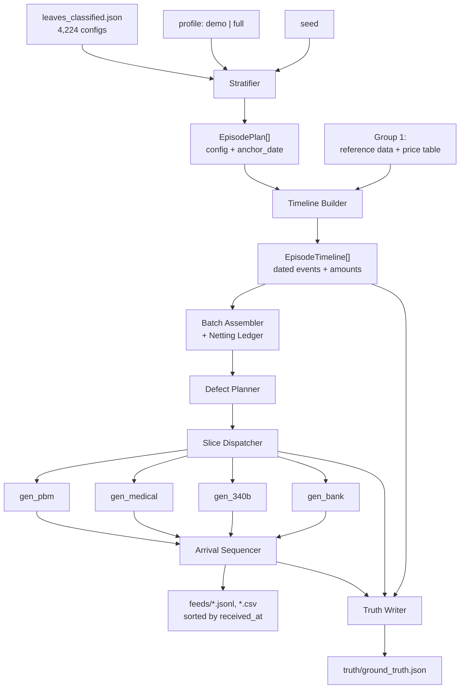
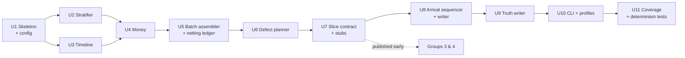

# G2: Orchestrator and Ground Truth

> **RECONCILED 2026-09-12** — see `plans/RECONCILIATION.md` and `architecture_decisions.md`
> Decisions 37–48. Deltas binding on this plan:
> - **Contract module location:** the slice contract lives at `src/recon/generators/contracts.py`
>   (G1's canonical tree); all module paths in this plan read as `src/recon/generators/...` and
>   tests as `tests/generators/...`. G2 owns the contract's content (Decision 44).
> - **Two-level interface confirmed** (Decision 44) — with one amendment: batch slices carry
>   **no precomputed net total**. The generator computes `BPR = Σ(CLP04) − Σ(PLB, signed)`
>   (and the rebate batch total from its lines) and returns it in a declared `MoneyMovement`.
>   The orchestrator composes batches and attaches PLB entries (the netting ledger stays here);
>   the wire arithmetic happens exactly once, in the generator that formats it. The orchestrator
>   *asserts* the declared amount against its own expectation at realize time — verification,
>   not duplication.
> - **Declare → realize → format** (Decision 44, from G4): payer-side generators return
>   `MoneyMovement[]`; a new orchestrator component, the **settlement realizer**, turns them into
>   `CashEvent[]` applying the episode's `cash_*` values (`MATCHED`/`PARTIAL`/`ABSENT`), injects
>   D-3 orphans and true-reversal debits, and decides TRN02/addenda presence (the ~20% drop) so
>   `expected_links` resolvability is knowable. `BankRowSlice` is **replaced by `CashEvent`**
>   (G4's Contract 3 shape, keyed by `originator_key` into reference data); `gen_bank` formats
>   bank-native fields itself (truncation, entry description, posting date, trace numbers,
>   running balance).
> - **Medical 340B** (Decision 37): `TpaDispenseSlice` gains the medical variant — `rx_number`
>   and `pharmacy_npi` nullable, `provider_npi` (the 837 billing provider NPI) populated instead;
>   join key `{provider_npi, ndc11, service_date}`. The crossing matrix gains that row.
> - **New TPA events** (Decision 43): `TpaDispenseSlice` carries `request` (with submission
>   date) and `manufacturer_decision` sub-objects so `REBATE_REQUEST` and `MANUFACTURER_DECISION`
>   records can be emitted; C-03/C-05/C-07/C-11 are wire-distinguishable.
> - **277CA** (Decision 39): `MedicalSubmissionSlice` gains `clearinghouse_status`
>   (`ACCEPTED`/`REJECTED`) plus a reject code, so gen_medical can emit the acknowledgment.
> - **`allocation_code` reaches the bank** (Decision 42): it rides the `trn02` column of rebate
>   deposits when addenda survive — the note below saying the bank CSV never carries it is
>   **superseded**; the CSV schema is unchanged (no new column), the code travels as the
>   `payer_reference` on the rebate `MoneyMovement`.
> - **Entity universe** (Decision 45): 2 pharmacies / 2 PBMs / 2 payers / 6 manufacturers /
>   2 covered entities / 6 prescribers / 40 patients / 12 drugs — this plan's 6/4/5/6/3 proposal
>   is superseded.
> - **Defect rates** (Decision 46): this plan's rate table is adopted as binding, in config.
> - **Identifiers minted by generators** (`authorization_number`, `clp07`, `ach_trace_number`,
>   `record_id`) reach ground truth through the returned `Record` payloads — the omniscient
>   orchestrator may parse its own generators' returns; there are **no manifest files**
>   (Decision 44 kills `data/generated/_internal/`).
> - The REPORT.md corrections this plan requested have been applied (REPORT §5 and headline).

The orchestrator is the keystone of the synthetic data layer. It holds the only complete picture of each
episode, decides every fact and every date, hands each of the four generators a narrow slice of that picture,
choreographs arrival order, injects feed-level defects, and writes `ground_truth.json` so the crosswalk can be
*scored* rather than assumed.

It produces two profiles (`demo` ~60 episodes, `full` ~1,500 episodes) from one generator and one seed, with
`full` guaranteed to cover all 372 reachable verdict pairs.

This plan defines the episode timeline model, the stratification algorithm, the profile definitions, the
`ground_truth.json` schema, the **generator interface contract** (the critical output — two other planning
groups build against it in parallel), the defect injection design, and an ordered implementation sequence.

---

## Problem Frame

Four independent source feeds must look like they came from four systems that have never heard of each other,
while still describing the same underlying financial reality. If any generator can see the whole picture, it
will leak a shared key across feeds and reduce the connector under test to a no-op join
(architecture_decisions.md D-10, D-11).

The orchestrator is the only component permitted to know everything. Its job is to be simultaneously
omniscient and disciplined about what it hands out.

Three things make this harder than "generate 1,500 rows":

1. **Verdict skew.** The 4,224 valid configurations collapse onto 372 verdict pairs with a **252x spread**
   (min 1 configuration, max 252; 99 pairs have exactly one configuration behind them). Uniform sampling over
   configurations would miss the highest-value compliance cases entirely.
2. **Batching is inherently cross-episode.** A rebate payment covers many dispenses. A remittance covers many
   claims. A PLB `WO` line nets a clawback from episode X into a payment for episode Y. No purely per-episode
   generator interface can express this.
3. **Arrival order is not event order.** Records must be emitted in `received_at` order, so the files
   themselves contain the out-of-order arrivals the pipeline has to survive.

---

## Requirements Trace

| ID | Requirement | Source |
|---|---|---|
| R1 | Episode timeline model with concrete dated events across 1 Jul 2025 – 1 Jul 2026 | Task item 1; D-18 |
| R2 | Stratified sampling over **verdicts**, never configurations | Task item 2; D-15; REPORT.md §5 |
| R3 | Two profiles, one generator, one seed: `demo` ~60, `full` ~1,500 | Task item 3; D-14 |
| R4 | `full` hits all 372 verdict pairs (coverage test asserts it) | state_space §5 |
| R5 | ≥ 50 episodes, ≥ 4 feeds, ≥ 6 of the 8 named edge cases | Assignment §1 |
| R6 | Exactly one system-added field, `received_at`; records emitted in arrival order | Task item 4; D-16 |
| R7 | `ground_truth.json` written by orchestrator; ingestion/reconciliation forbidden to read it | Task item 5; D-11 |
| R8 | Generator interface contract: each generator sees only what its real source system would know | Task item 6; D-10 |
| R9 | Defect injection: identifier drift, dropped TRN ~20%, duplicates, late arrival, PLB netting | Task item 7; feed_formats |
| R10 | No universal claim ID; no shared surrogate key handed to two generators | D-7; binding constraint |
| R11 | Reimbursement is pharmacy XOR medical; 340B optional and batched | D-1, D-2, D-5 |
| R12 | No SLA anywhere; orchestrator has no concept of "now" | D-18, D-19 |
| R13 | Source identifiers preserved so a result traces back to a synthetic source record | Assignment §1 (graded) |

---

## Scope Boundaries

**In scope for Group 2:** episode timeline construction, verdict-pair stratification, profile definition,
arrival-order choreography, defect planning, the generator slice contract, `ground_truth.json`, the generator
CLI entry point, and coverage/determinism tests over the orchestrator's own output.

**Explicitly not in scope:**
- Writing any of the four feed generators (Groups 3 and 4 build those against this contract).
- Reference data and entity universes, config loading, the seeded RNG utility, money/date helpers, the DB
  layer — all Group 1. This plan states exactly what it needs from them.
- Ingestion, crosswalk, reconciliation engine, API, front end.
- The mock workflow / Epic feed (the fifth box in the assignment diagram). Left as an open question in
  architecture_decisions; if it lands, it is an additive slice type, not a change to this contract.
- Re-deriving the state space. `decision_tree/leaves_classified.json` is consumed as input, not recomputed.

---

## Context & Research

### The decision tree is an input, not a thing to rebuild

This is the single most important structural decision in this plan. `decision_tree/leaves_classified.json`
already contains all 4,224 valid configurations, each with:

```
case_id, depth, coherence, cross_track_flags,
reimbursement_track {reimb_type, ph_* | md_*},
rebate_track {r_*},
cash_verification {cash_reimb_in, cash_reimb_out, cash_rebate_in, cash_rebate_out},
decision_path [...],
curated_reimbursement_state,   # "A-07"
curated_rebate_state           # "C-09"
```

The orchestrator **samples a leaf and treats its field assignments as the episode skeleton**. It does not
re-derive verdicts. `curated_reimbursement_state` / `curated_rebate_state` become the intended verdict pair in
ground truth, for free, with zero risk of the generator and the state space drifting apart.

### Measured properties of the state space (computed from the artifacts, not assumed)

| Property | Value |
|---|---|
| Verdict pairs | 372 (31 reimbursement x 12 rebate, exactly saturated) |
| Configurations | 4,224 (3,860 coherent, 364 anomalous) |
| Configurations per pair | min 1, max 252 — **252x spread** |
| Pairs with exactly 1 configuration | 99 of 372 |
| Coherence partition | **Clean at pair level**: 36 pairs are 100% anomalous, 336 are 100% coherent, none mixed |
| The 36 anomalous pairs | {A-01, A-10, A-11, A-16} x {C-01, C-03, C-05, C-07, C-08, C-09, C-10, C-11, C-14} = 4 x 9 |
| Cash slot arity | 0–4 slots (63 / 564 / 1473 / 1440 / 684 configurations) |
| Decision depth | 3–14 |

Cross-track flag reachability (configurations, distinct pairs):

| Flag | Configs | Pairs |
|---|---|---|
| `X-1:denied_with_rebate_paid` | 36 | 16 |
| `X-2:reversed_dispense_with_live_rebate` | 260 | 20 |
| `X-3:recoupment_undermines_qualification` | 912 | 18 |
| `X-4:rebate_only_failure_no_escalation` | **9** | 6 |
| `X-5:correlated_cash_gap` | 305 | 64 |
| `X-6:total_loss` | **8** | 8 |
| `X-7:appeal_won_after_clawback` | 108 | 4 |

> **Correction to carry forward.** `decision_tree/REPORT.md` states the X-1 compliance case is "1 config" and
> quotes a "~60x" frequency spread. Both figures are **pre-SLA-removal** and stale. Current values are X-1 = 36
> configs / 16 pairs, and the spread is 252x at pair level. The rarest flags are now **X-6 (8 configs)** and
> **X-4 (9 configs)**, not X-1. The stratifier must target flags by measured rarity, not by the REPORT.md
> narrative. Worth a one-line correction note in REPORT.md itself.

### Institutional learnings that bind this design

- `docs/solutions/best-practices/generate-source-feeds-as-independent-systems-2026-09-12.md` — source-first,
  never canonical-first; the rejected approach is explicitly "stamp a shared `claim_id` onto every feed."
- `docs/solutions/best-practices/exhaustive-generation-beats-hand-enumeration-2026-09-12.md` — "stratify over
  outcome/verdict, not over raw configuration count, or rare-but-critical cases vanish."
- `docs/solutions/best-practices/cursor-replay-and-event-driven-ingestion-2026-09-12.md` — one added field
  (`received_at`); no `if age_days >` anywhere; status is a read-time query.

### Relevant code and artifacts

- `decision_tree/leaves_classified.json` — 4,224 classified configurations (primary input)
- `decision_tree/pairs.json` — 372 pairs with `configurations` counts (stratification weights)
- `decision_tree/spec.py` — `VARIABLES`, `coherence()`, `cross_track_flags()`, `dispense_did_not_happen()`
- `decision_tree/classify.py` — `classify_pharmacy()`, `classify_medical()`, `classify_rebate()` (the
  authoritative config → verdict mapping; the orchestrator must never reimplement it)
- `docs/feed_formats.md` — field-level truth for all four feeds
- `docs/reconciliation_state_space.md` — verdicts, dispositions, D-1..D-7 feed-level exceptions

---

## Key Technical Decisions

| # | Decision | Rationale |
|---|---|---|
| G2-1 | Sample configurations from `leaves_classified.json`; never re-derive verdicts | Eliminates drift between generator and state space; verdict pair comes free and pre-validated |
| G2-2 | Stratify in two stages: uniform over **pairs**, then uniform over configs **within** a pair | Directly implements D-15; neutralizes the 252x skew by construction |
| G2-3 | A **tempered** weight `w ∝ configurations^α` (α ≈ 0.4) for the realism-fill stratum only | α=0 is uniform-over-pairs, α=1 is uniform-over-configs; one tunable knob buys a plausible-looking corpus without sacrificing coverage |
| G2-4 | Coverage is guaranteed by a **spine** of 372 episodes with anchor dates constrained to complete in-window | Makes the coverage test an assertion, not a probability |
| G2-5 | Orchestrator owns **all facts and all dates**; generators own **format and their own identifier namespace** | Clean, testable division; generators become pure deterministic formatters |
| G2-6 | Generator interface is **two-level**: per-episode event slices + cross-episode batch slices | Batching (rebate batches, remittance batches, PLB netting) is irreducibly cross-episode |
| G2-7 | Shared identifiers are permitted **only where the identifier genuinely crosses those two systems in reality** | D-7 forbids inventing a *surrogate* key, not modelling a real shared one (TRN02, allocation_code, natural key) |
| G2-8 | Structural defects come from the sampled config; only the **seven feed-level overlays** (D-1..D-7) are injected | Verdict-changing "defects" are the state space, not injection. Keeps the two concepts from bleeding together |
| G2-9 | Truncation is a first-class cohort, not an accident | Guarantees some episodes are mid-flight at cursor = window end |
| G2-10 | `received_at` = `event_date` + feed-specific arrival lag; files sorted by `received_at` | The out-of-order arrivals live in the files themselves (R6) |
| G2-11 | Ground truth separated by directory (`truth/` vs `feeds/`) plus a lint test | Makes "forbidden to read" mechanically enforced, not a convention |
| G2-12 | Per-episode RNG substreams derived via `blake2b(seed ‖ episode_id)` | Changing one stratum's size must not reshuffle every other episode |

---

## High-Level Technical Design

> *This illustrates the intended approach and is directional guidance for review, not implementation
> specification. The implementing agent should treat it as context, not code to reproduce.*

### Pipeline shape



### The information barrier

```
                   ORCHESTRATOR  (knows everything)
                          |
   +--------------+-------+-------+--------------+
   |              |               |              |
 gen_pbm      gen_medical      gen_340b       gen_bank
   |              |               |              |
 knows:        knows:          knows:         knows:
 pharmacy      provider        dispense       money moved,
 + PBM         + payer         + TPA          when, by whom,
 facts         facts           + mfr facts    and a trace number

 NEVER sees: episode_id | verdict codes | config field values |
             another feed's native identifiers | ground truth
```

---

## Data Model

### 1. Episode timeline model (R1)

An episode is built in three layers.

**Layer 1 — Skeleton (sampled).** The chosen configuration's field assignments:
`reimb_type`, `ph_*` or `md_*`, `r_*`, `cash_*`. These are categorical facts: *what happened*.

**Layer 2 — Money.** The orchestrator computes every amount. Nothing downstream invents a number.

| Quantity | Derivation |
|---|---|
| `expected_reimbursement` | NDC unit price (Group 1 price table) x quantity + dispensing fee (pharmacy), or fee-schedule allowed amount (medical) |
| `actual_reimbursement` | Function of `ph_payment` / `md_remittance`: `FULL` → expected; `PARTIAL` → expected x U(0.35, 0.85); `OVER` → expected x U(1.05, 1.30); `NONE` → 0; `DUPLICATE` → expected, paid twice |
| `expected_rebate` | expected_reimbursement x rebate_pct (manufacturer-specific, Group 1) |
| `actual_rebate` | Function of `r_payment`, same pattern |
| `cash_received` | Function of `cash_*` slot: `MATCHED` → equals the movement; `PARTIAL` → x U(0.4, 0.9); `ABSENT` → no bank row emitted at all |
| `adjustment_amount` | When `ph_post_event == "ADJUSTMENT"`, a CO-45 contractual write-down |
| `variance` | expected − actual, recorded in ground truth for scoring |

All money is integer cents internally, formatted to 2dp at the feed boundary (Group 1 money helper).

**Layer 3 — Timeline.** Each configuration field maps to zero or more `TimelineEvent`s through an
**event template table**. Templates carry a day-offset range from the episode anchor, sampled with the
episode's RNG substream.

Representative templates (illustrative; full table is Unit 3's deliverable):

| Config condition | Event | Offset from anchor (days) |
|---|---|---|
| always (pharmacy) | `DISPENSE` | 0 |
| `ph_adjudication=ACCEPTED` | `PBM_ADJUDICATION_ACCEPTED` | 0 |
| `ph_adjudication=REJECTED` | `PBM_ADJUDICATION_REJECTED` | 0 |
| `ph_payment != NONE` | `PBM_REMITTANCE` | +14 .. +45 |
| `ph_post_event=REVERSAL_PRE_PAY` | `PBM_REVERSAL` | +1 .. +10 |
| `ph_post_event=REVERSAL_POST_PAY` | `PBM_REVERSAL` | payment +5 .. +30 |
| `ph_post_event=RECOUPMENT` | `PBM_RECOUPMENT` (queued to netting ledger) | payment +60 .. +150 |
| `ph_settlement=CONFIRMED` | `PBM_SETTLEMENT` | payment +3 .. +15 |
| always (medical) | `ADMINISTRATION` | 0 |
| medical | `CLAIM_837_SUBMITTED` | +2 .. +10 |
| `md_clearinghouse=REJECTED` | `CLEARINGHOUSE_REJECT` | submit +1 .. +3 |
| `md_remittance != NONE` | `MEDICAL_835` | submit +20 .. +45 |
| `md_appeal != NOT_FILED` | `APPEAL_FILED` | 835 +10 .. +40 |
| `md_appeal in (WON, LOST)` | `APPEAL_DECIDED` | filed +45 .. +120 |
| `md_appeal=WON` | `MEDICAL_835_CORRECTED` | decided +10 .. +25 |
| `md_post_event=RECOUPMENT` | `MEDICAL_TAKEBACK` (queued to netting ledger) | last payment +60 .. +150 |
| `r_present=PRESENT` | `TPA_SUBMITTED` | fill +3 .. +20 |
| `r_qualification != PENDING` | `TPA_QUALIFICATION_DECISION` | submitted +5 .. +30 |
| `r_request=SUBMITTED` | `REBATE_REQUESTED` | qualified +5 .. +20 |
| `r_manufacturer != PENDING` | `MFR_DECISION` | requested +15 .. +60 |
| `r_payment != NONE` | `REBATE_BATCH` (assigned to a batch) | decision +10 .. +45 |
| `r_payment=CLAWED_BACK` | `REBATE_CLAWBACK` | rebate paid +40 .. +120 |
| any positive/negative money movement with a `cash_*` slot ≠ ABSENT | `BANK_ROW` | movement effective date +0 .. +2 banking days |

**Chain length** is the span from anchor to last event. The longest realistic chain — medical claim denied,
appealed, won, paid, later recouped — computes to roughly **220 days** under these templates, which matches the
figure in the task brief and is used as the truncation planning bound.

**Anchor placement (R1, G2-4, G2-9).** Window is 1 Jul 2025 – 1 Jul 2026 (365 days).

- **Spine + guaranteed cohorts:** `anchor ~ U(0, 365 − chain_length)`. Every event lands in-window; the
  episode reaches its terminal verdict before the cursor can run out. This is what makes the 372-pair coverage
  test deterministic.
- **Fill cohort:** `anchor ~ U(0, 365)`. Events falling past 1 Jul 2026 are simply **not emitted**. With mean
  chain length around 70 days this naturally truncates roughly 15–20% of the fill cohort — no special-casing
  needed, and it is exactly what a real dataset looks like.

A truncated episode never reaches its terminal verdict inside the window. Ground truth therefore records
**two** verdict facts per episode: `terminal_verdict_pair` (the config's classification, what it would become
if all records arrived) and `truncated: true` plus `records_suppressed`. **The coverage assertion runs over
non-truncated episodes only.** This distinction is load-bearing — conflating the two would make the coverage
test flaky and would make ground truth lie about episodes that are legitimately still in flight.

### 2. Stratification algorithm (R2, R4)

Two-stage sampling, executed as an allocation across named strata. Strata are filled in priority order;
later strata are credited for coverage already achieved by earlier ones, so totals do not double-count.

```
STAGE 1  choose a verdict pair            <- stratified, never weighted by configuration count
STAGE 2  choose a configuration within it <- uniform over that pair's configurations
STAGE 3  choose an anchor date            <- cohort-dependent (constrained vs free)
STAGE 4  choose defect overlays           <- independent Bernoulli draws, or hand-placed in demo
```

Strata for the `full` profile:

| # | Stratum | Rule | Episodes |
|---|---|---|---|
| S1 | **Coverage spine** | Exactly one episode per pair, all 372 pairs, constrained anchors | 372 |
| S2 | **Anomaly amplification** | +3 per anomalous pair (36 pairs) — these are the highest-value exceptions | 108 |
| S3 | **Cross-track flag floor** | Top up until every `X-1..X-7` flag has ≥ 25 episodes. X-6 (8 configs) and X-4 (9 configs) drive this | ~110 |
| S4 | **Named edge-case floor** | Top up until each of the 8 assignment-named edge cases has ≥ 20 episodes | ~90 |
| S5 | **Feed-level overlay floor** | Top up until each of D-1..D-7 has ≥ 20 instances | ~60 |
| S6 | **Realism fill** | Sample pairs with tempered weight `w ∝ configurations^0.4`, free anchors (truncation emerges) | ~760 |
| | **Total** | | **~1,500** |

Two properties worth stating explicitly:

- **Why tempering, not pure uniform-over-pairs, for S6.** A corpus where A-01 (POS rejection, 1 config) is as
  common as B-15 (medical takeback, 924 configs) does not look like a pharmacy's book of business, and the Ops
  Analyst agent's aggregate answers would be nonsense. `α = 0.4` compresses the 252x spread to roughly 9x —
  plausible-looking, while coverage stays guaranteed by S1. `α` is config, not a literal.
- **Why coverage is a spine and not an outcome.** With 372 pairs and ~1,500 episodes, pure weighted sampling
  would miss single-configuration pairs with high probability. S1 makes coverage structural.

Verification: after allocation and before generation, assert `set(pairs_in_plan) == set(372 pairs from pairs.json)`.
Fail loudly at plan time, not after writing 1,500 episodes of files.

### 3. Profile definitions (R3, R5)

Both profiles run the **same code path with the same seed**; the profile selects the stratum allocation table
and the defect placement mode (stochastic vs hand-placed).

**`demo` — ~60 episodes, hand-stratified, readable end to end.**

The debrief makes the candidate trace ONE claim end to end. `demo` is composed so that every required story is
present exactly once or twice, and the whole file is small enough to read.

| Slot group | Contents | Count |
|---|---|---|
| Happy paths | A-04/C-00, B-04/C-00, A-04/C-08, B-04/C-08 | 4 |
| Assignment edge cases (all 8, superset of the required 6) | fully reconciled (A-04/B-04); partial payment (B-06); underpayment (A-07, A-08); reversal/recoupment (A-10, A-12, A-13, B-15); unmatched cash (A-05, B-05) and unmatched rebate (C-09, D-4 orphan); denial (B-10, B-13); duplicate event (A-17, B-16, C-14, D-1); late-arriving status (D-2) | ~18 |
| Cross-track flags | one each of X-1 .. X-7 | 7 |
| Compliance anomalies | one per no-dispense pharmacy verdict with a live rebate (A-01, A-10, A-11, A-16) | 4 |
| 340B lifecycle | C-01, C-02, C-03, C-05, C-07, C-10, C-11, C-13 | 8 |
| Feed-level overlays | one each of D-1 .. D-7 | 7 |
| Mid-flight at demo cursor | A-02, B-02, B-07, B-11 | 4 |
| Allocation set pieces | one rebate batch spanning 5 episodes; one remittance spanning 8 claims; one PLB-netted recoupment | (overlaps above) |
| Realistic clean filler | plain A-04 / B-04 with no defects, so the corpus is not 100% pathological | ~8 |
| **Total** | | **~60** |

The demo hand-stratification is a **declarative table in config** (pair + optional defect list per slot), not
imperative code — so it is reviewable and a reader can see the whole demo design at a glance.

**`full` — ~1,500 episodes.** The S1–S6 allocation above. What the test suite asserts against.

Assignment compliance: `demo` alone satisfies "at least 50 episodes" and covers all 8 named edge cases (the
assignment's wording — "at least six edge cases: fully reconciled, partial payment, underpayment,
reversal/recoupment, unmatched cash or rebate, denial, duplicate event, or late-arriving status" — names eight
and asks for six; covering all eight is the safe superset).

---

## The Generator Interface Contract (R8, R10 — the critical interface)

> *Field lists below are the interface specification Groups 3 and 4 build against. They are contract
> definitions, not implementation.*

### Governing rules

1. **No generator receives `episode_id`, a verdict code, a case ID, a coherence tag, or a cross-track flag.**
   Slices carry facts and dates only — including behavioural facts its real source system would know
   (an adjudication outcome, whether a reversal happened, a claim line's status code). A generator
   cannot know it is producing an "A-07."
2. **Orchestrator owns facts and time. Generator owns format and its own identifier namespace.**
   Every date and every amount is supplied. The generator invents `record_id`, `authorization_number`,
   `clp07_payer_claim_control_number`, `ach_trace_number` — and returns them so ground truth can record lineage.
3. **A value may be handed to two generators only if that value genuinely crosses those two systems in
   reality.** This is the precise reading of D-7: the prohibition is on inventing a *surrogate* key, not on
   modelling a real shared identifier.
4. **Generators are pure and deterministic.** Signature-level: slice in, records out. No file I/O, no clock, no
   global RNG. Each slice carries an `rng_seed` for the generator's own identifier minting.
5. **Generators never read another generator's output** and never read `ground_truth.json`.

### Identifier crossing matrix

| Identifier | Minted by | Given to | Never given to |
|---|---|---|---|
| `{pharmacy_npi, rx_number, fill_number, date_of_service, ndc11}` (NCPDP natural key) | Orchestrator | `gen_pbm`, `gen_340b` | `gen_bank`, `gen_medical` |
| `{billing_provider_npi, ndc11, date_of_service}` (medical 340B natural key, Decision 37) | Orchestrator | `gen_medical`, `gen_340b` (as `provider_npi`) | `gen_bank`, `gen_pbm` |
| `trn02` (reassociation trace number) | Orchestrator (acting as payer) | `gen_pbm`, `gen_medical`; reaches `gen_bank` only as `CashEvent.payer_reference` via the realizer | `gen_340b` |
| `allocation_code` (rebate batch) | Orchestrator | `gen_340b`; reaches `gen_bank` only as `CashEvent.payer_reference` (Decision 42) | `gen_pbm`, `gen_medical` |
| `clm01_patient_control_number` | Orchestrator (acting as provider) | `gen_medical` only | all others |
| `authorization_number` (503-F3) | `gen_pbm` | nobody | all others |
| `clp07_payer_claim_control_number` | `gen_medical` | nobody | all others |
| `ach_trace_number` | `gen_bank` | nobody | all others |
| `covered_entity_id`, `hin` | Orchestrator (from reference data) | `gen_340b` only | all others |
| `record_id` | each generator, in its own style | nobody | — returned to orchestrator for lineage |
| `episode_id` | Orchestrator | **nobody** | all four |

Rationale for the three permitted crossings: the TPA genuinely sees the dispense record (natural key); TRN02 is
payer-assigned and genuinely appears on both the 835 and the ACH addenda per CAQH CORE Rule 370;
`allocation_code` is the vendor batch code that genuinely appears on both the rebate file and the deposit.
Each is a documented real-world bridge with a documented failure mode (D-8).

### Shared envelope

```
Record                       # what every generator returns
  record_id:    str          # generator-minted, native style
  feed:         str          # "pbm_claim_events" | "pbm_remittance_835" |
                             # "medical_837_submissions" | "medical_835_remittance" |
                             # "tpa_340b_events" | "bank_transactions"
  received_at:  datetime     # copied verbatim from the slice; generator must NOT compute it
  payload:      dict         # the native-format record as it will be serialized
  slice_ref:    str          # opaque orchestrator-supplied token, echoed back for lineage stitching
```

`slice_ref` is the lineage mechanism. It is an opaque token (e.g. a random hex string) with no episode
semantics — the generator cannot decode it. The orchestrator maps `slice_ref → episode_id` privately.

### Slice types

Two levels, per G2-6: **per-episode event slices** and **cross-episode batch slices**.

#### gen_pbm

```
PbmClaimSlice                              # per-episode; produces B1 and optional B2 records
  slice_ref: str
  rng_seed: int
  # pharmacy-known facts
  pharmacy_npi: str
  rx_number: str
  fill_number: str                         # "00", "01", ...
  date_of_service: date
  ndc11: str
  quantity_dispensed: Decimal
  days_supply: int
  prescriber_npi: str
  # plan-known facts (from the card)
  bin: str
  pcn: str
  group_id: str
  cardholder_id: str
  person_code: str
  is_340b_tagged: bool                     # -> submission_clarification_code "20"
  # adjudication outcome
  adjudication: Literal["ACCEPTED", "REJECTED"]
  reject_reason: str | None                # closed vocabulary; generator maps to NCPDP code
  ingredient_cost_paid: Decimal | None
  dispensing_fee_paid: Decimal | None
  patient_pay_amount: Decimal | None
  total_amount_paid: Decimal | None
  # reversal, if any
  reversal: PbmReversal | None
  # arrival
  received_at: datetime                    # for the B1 record
  # defect directives (formatting-level only)
  rx_number_rendering: Literal["BARE", "ZERO_PADDED", "TRUNCATED"]

PbmReversal
  reversal_date: date
  reversal_reason: str
  received_at: datetime

PbmRemittanceSlice                         # cross-episode batch; produces ONE 835 record
  slice_ref: str
  rng_seed: int
  payer_name: str
  payee_npi: str
  trn02: str                               # orchestrator-minted; reaches gen_bank via MoneyMovement.payer_reference
  originating_company_id: str
  payment_effective_date: date
  claim_lines: list[PbmClaimLine]
  plb_lines: list[PlbLine]
  received_at: datetime
  # NO precomputed net total (Decision 44): the generator computes
  # bpr.total_actual_provider_payment = Σ(clp04) − Σ(PLB, signed) and declares it
  # as a MoneyMovement. The orchestrator asserts the declaration matches its own
  # expectation — verification, not a second computation on the wire.

PbmClaimLine
  line_ref: str                            # opaque, per-line lineage token
  rx_number: str
  fill_number: str
  claim_status_code: str
  total_charge: Decimal
  payment_amount: Decimal
  patient_responsibility: Decimal
  ndc11: str
  quantity: Decimal
  date_of_service: date
  adjustments: list[Adjustment]            # {group_code, reason_code, amount}
  rx_number_rendering: Literal["BARE", "ZERO_PADDED", "TRUNCATED"]

PlbLine
  reason_code: Literal["WO","FB","L6","CS","72","RA"]
  reference_id: str | None                 # None => untraceable offset (drives A-13 / A-15)
  amount: Decimal                          # sign convention per feed_formats (L6 negative)
```

#### gen_medical

```
MedicalSubmissionSlice                     # per-episode; produces one 837 record + one 277CA acknowledgment
  slice_ref: str
  rng_seed: int
  clm01_patient_control_number: str
  clearinghouse_status: Literal["ACCEPTED","REJECTED"]   # Decision 39 — drives the 277CA record
  clearinghouse_reject_code: str | None    # "A3:21" | "A3:33" | "A3:187"; None when accepted
  ack_received_at: datetime                # 277CA arrival, 0–2 days after the 837
  frequency_code: Literal["1","7","8"]
  original_icn: str | None                 # REF*F8; orchestrator echoes back a prior clp07
  billing_provider_npi: str
  rendering_provider_npi: str
  date_of_service: date
  service_lines: list[MedicalServiceLine]  # {line_number, hcpcs, modifiers, charge_amount, units}
  ndc11: str
  ctp04_quantity: Decimal
  ctp05_uom_qualifier: str
  dropped_line_numbers: list[int]          # silent-replacement defect on frequency "7"
  received_at: datetime

MedicalRemittanceSlice                     # cross-episode batch; produces ONE 835 record
  slice_ref: str
  rng_seed: int
  payer_name: str
  payer_tin: str
  trn02: str
  payment_method: Literal["ACH","CHK","NON"]
  eft_effective_date: date
  claim_lines: list[MedicalClaimLine]
  plb_lines: list[PlbLine]
  received_at: datetime
  # NO precomputed net total — same rule as PbmRemittanceSlice (Decision 44).

MedicalClaimLine
  line_ref: str
  clm01_patient_control_number: str
  status_code: str                         # CLP02
  reuse_prior_icn: str | None              # None => generator mints a NEW clp07 (reprocess discontinuity)
  total_charge: Decimal
  payment_amount: Decimal
  patient_responsibility: Decimal
  hcpcs: str
  modifiers: list[str]
  charge: Decimal
  paid: Decimal
  units: Decimal
  adjustments: list[Adjustment]            # {group_code, reason_code, amount, rarc?}
```

#### gen_340b

```
TpaDispenseSlice                           # per-episode; produces qualification / request / decision / reversal records
  slice_ref: str
  rng_seed: int
  # identity — pharmacy XOR medical (Decision 37):
  #   pharmacy dispense: rx_number + pharmacy_npi populated, provider_npi None
  #   medical dispense:  rx_number None, pharmacy_npi None, provider_npi = 837 billing NPI,
  #                      fill_date = the 837 date_of_service
  rx_number: str | None
  pharmacy_npi: str | None
  provider_npi: str | None
  ndc11: str
  fill_date: date
  prescriber_npi: str
  covered_entity_id: str
  hin: str
  wholesaler_invoice_number: str
  qualification: TpaQualification | None
  request: TpaRebateRequest | None         # Decision 43 — separates C-03 from C-05
  manufacturer_decision: TpaMfrDecision | None   # Decision 43 — carries C-07 rejections, C-11 approvals
  reversal: TpaReversal | None
  rx_number_rendering: Literal["BARE", "ZERO_PADDED", "TRUNCATED"]

TpaQualification
  status: Literal["QUALIFIED", "NOT_QUALIFIED"]
  disqualification_reason: str | None      # closed vocabulary from feed_formats
  received_at: datetime

TpaRebateRequest
  submission_date: date                    # >45 days after fill_date drives NON_CONFORMING_45_DAY
  manufacturer: str
  received_at: datetime

TpaMfrDecision
  status: Literal["APPROVED", "REJECTED"]
  rejection_reason: str | None
  received_at: datetime

TpaReversal
  quantity_dispensed: Decimal              # negative
  reversal_reason: str
  received_at: datetime

RebateBatchSlice                           # cross-episode batch; produces ONE batch record
  slice_ref: str
  rng_seed: int
  manufacturer: str
  allocation_code: str                     # reaches gen_bank as MoneyMovement.payer_reference (Decision 42)
  payment_effective_date: date
  dispenses: list[RebateDispenseLine]
  received_at: datetime
  # NO precomputed total_rebate_amount (Decision 44): the generator sums its lines
  # and declares the total as a MoneyMovement.

RebateDispenseLine
  line_ref: str
  rx_number: str | None                    # None on medical dispenses (Decision 37)
  ndc11: str
  fill_date: date
  pharmacy_npi: str | None                 # None on medical dispenses
  provider_npi: str | None                 # populated on medical dispenses
  covered_entity_id: str
  manufacturer_status: Literal["APPROVED", "REJECTED"]
  rebate_amount: Decimal
  rejection_reason: str | None
  rx_number_rendering: Literal["BARE", "ZERO_PADDED", "TRUNCATED"]
```

#### gen_bank — declare → realize → format (Decision 44)

The bank generator is the strictest expression of the barrier. It receives **no claim identity of any kind** —
banks have no concept of a claim (D-21) — and it is a **pure formatter**: it is told about deposits that exist
and never about deposits that don't, so it cannot report a shortfall it never saw an expected figure for.

Payer-side generators return `MoneyMovement[]`; the orchestrator's **settlement realizer** turns them into
`CashEvent[]`; `gen_bank` takes the whole `CashEvent[]` in one call and prints the CSV.

```
MoneyMovement                              # payer-side generator -> orchestrator (return value, never a file)
  movement_id: str                         # opaque lineage; never emitted to any feed
  direction: Literal["CREDIT", "DEBIT"]
  amount_cents: int                        # NET as originated — PLB already applied by the declaring generator
  channel: Literal["PBM", "MEDICAL", "REBATE"]
  originator_key: str                      # key into reference originator registry (name, EIN, ODFI routing)
  payer_reference: str | None              # 835 trn02, or allocation_code for rebates (Decision 42)
  file_creation_date: date
  effective_entry_date: date               # 1–2 banking days after creation
  reverses_movement_id: str | None         # set only for a true ACH reversal

CashEvent                                  # orchestrator realizer -> gen_bank
  # = a realized MoneyMovement: suppressed when cash_* = ABSENT, amount reduced when PARTIAL,
  #   plus synthesized orphans (D-3) and true-reversal debits. Carries NO claim key, NDC, NPI,
  #   or episode id — only money, dates, originator identity, and an opaque payer reference.
  event_id: str
  rng_seed: int
  direction, amount_cents, channel, originator_key, effective_entry_date   # as realized
  payer_reference: str | None              # None = the ~20% dropped-addenda defect — DECIDED BY THE REALIZER,
                                           # so ground truth knows each link's resolvability
  reverses_event_id: str | None
  posting_lag_days: int                    # 0 or 1 banking days past effective date
  arrival_lag_hours: int                   # large values = the D-2 late-delivery defect
  duplicate_row: bool                      # statement re-export (D-1); must not advance running_balance
```

`gen_bank` owns every bank-native decision: `company_name` truncation to 16 chars, `company_id`,
`company_entry_description` (`HCCLAIMPMT` for PBM/MEDICAL, `CCD` for REBATE), `posting_date` on the banking
calendar, 15-digit ACH trace minting (ODFI prefix + monotone sequence in posting order), `received_at` at the
bank's evening cutoff, and `running_balance` — computed in posting order over the whole file, then rows
re-sorted by `received_at` for emission. Movements are sorted by
`(effective_entry_date, channel, originator_key, movement_id)` before realization so bank output is
independent of generator invocation order.

**Superseded note (Decision 42):** an earlier draft said the bank CSV deliberately never carries
`allocation_code`. Ruled otherwise: the rebate deposit's `trn02` column carries the `allocation_code` when the
CCD+ addenda survive — same column, same ~20% loss rate as claim payments, no new CSV column. The ~20% that
lose it *and* fail amount+date matching are exactly D-4, emerging from the mechanism.

### Contract tests (owned by Group 2, run against Groups 3/4)

These are the enforcement mechanism for R8/R10 and should exist before the generators do:

- No slice dataclass has a field named `episode_id`, `verdict`, `case_id`, or any `A-`/`B-`/`C-`/`X-` code.
- Serialize every emitted record; assert `episode_id` string never appears in any feed file.
- For each pair of feeds, compute the set of shared field *values*; assert it is a subset of the three
  permitted crossings in the matrix above.
- Call each generator twice with the same slice; assert byte-identical output (purity + determinism).

---

## `ground_truth.json` Schema (R7, R13)

Written by the orchestrator to `data/generated/<profile>/truth/ground_truth.json`. The ingestion and reconciliation
layers are forbidden to read it. It exists so the crosswalk can be **scored**.

```
{
  "run": {
    "generator_version": "1.0.0",
    "seed": 20260912,
    "profile": "full",
    "window_start": "2025-07-01",
    "window_end": "2026-07-01",
    "generated_at": "<wall clock, metadata only, never an input>",
    "reference_data_digest": "<sha256 of the frozen reference data snapshot>",
    "state_space_digest": "<sha256 of leaves_classified.json>",
    "counts": { "episodes": 1500, "records": 0, "truncated": 0, "pairs_covered": 372 }
  },

  "episodes": [
    {
      "episode_id": "EP-000001",
      "profile_stratum": "S1_coverage_spine",

      "intended": {
        "reimbursement_verdict": "A-07",
        "rebate_verdict": "C-09",
        "verdict_pair": "A-07|C-09",
        "coherence": "COHERENT",
        "cross_track_flags": ["X-5:correlated_cash_gap"],
        "expected_disposition": "EXCEPTION",
        "expected_reasons": ["UNDERPAID", "CASH_MISMATCH"]
      },

      "source_configuration": {
        "case_id": "CASE-01783",
        "decision_path": [ {"variable": "...", "value": "..."} ],
        "reimbursement_track": { "...": "..." },
        "rebate_track": { "...": "..." },
        "cash_verification": { "...": "..." }
      },

      "entities": {
        "reimbursement_track": "PHARMACY",
        "pharmacy_npi": "1234567890",
        "prescriber_npi": "...",
        "payer_or_pbm": "MERIDIANRX",
        "manufacturer": "VERION",
        "covered_entity_id": "DSH310074",
        "ndc11": "00002143380"
      },

      "natural_keys": {
        "ncpdp_transaction_key": {
          "pharmacy_npi": "1234567890", "rx_number": "7845102",
          "fill_number": "00", "date_of_service": "2025-09-14"
        },
        "clm01": null,
        "trn02_values": ["8873020123"],
        "allocation_codes": ["ALLOC-2025-Q4-0031"]
      },

      "money": {
        "expected_reimbursement": "4820.00",
        "actual_reimbursement": "3110.00",
        "reimbursement_variance": "1710.00",
        "expected_rebate": "1446.00",
        "actual_rebate": "1446.00",
        "rebate_cash_received": "0.00",
        "rebate_variance": "1446.00",
        "adjustments": [ {"group_code": "CO", "reason_code": "45", "amount": "0.00"} ]
      },

      "timeline": [
        { "seq": 1, "event": "DISPENSE",                  "event_date": "2025-09-14",
          "received_at": null,                            "records": [] },
        { "seq": 2, "event": "PBM_ADJUDICATION_ACCEPTED", "event_date": "2025-09-14",
          "received_at": "2025-09-14T14:03:11Z",          "records": ["PBM-CE-0004412"] },
        { "seq": 3, "event": "PBM_REMITTANCE",            "event_date": "2025-10-08",
          "received_at": "2025-10-10T06:00:00Z",          "records": ["PBM-RA-000188"] }
      ],

      "records": [
        { "record_id": "PBM-CE-0004412", "feed": "pbm_claim_events",
          "file": "pbm_claim_events.jsonl", "line": 412,
          "received_at": "2025-09-14T14:03:11Z", "role": "adjudication",
          "is_duplicate_of": null },
        { "record_id": "PBM-RA-000188", "feed": "pbm_remittance_835",
          "file": "pbm_remittance_835.jsonl", "line": 22,
          "received_at": "2025-10-10T06:00:00Z", "role": "remittance",
          "shared_with_episodes": ["EP-000014","EP-000203"] }
      ],

      "expected_links": [
        { "from_record": "PBM-RA-000188", "to_record": "PBM-CE-0004412",
          "join_basis": "clp01 -> {rx, fill} + payee_npi",
          "expected_resolvable": true,  "difficulty": "clean" },
        { "from_record": "BANK-000731",   "to_record": "PBM-RA-000188",
          "join_basis": "trn02",
          "expected_resolvable": false, "difficulty": "trn_dropped",
          "fallback_basis": "amount+date", "fallback_ambiguous": true }
      ],

      "defects": [
        { "code": "D-2", "name": "late_arriving_record",
          "applied_to": ["PBM-RA-000188"], "detail": {"lag_days": 21} },
        { "code": "D-6", "name": "crosswalk_miss",
          "applied_to": ["BANK-000731"], "detail": {"cause": "trn02_dropped"} }
      ],

      "window": {
        "anchor_date": "2025-09-14",
        "chain_length_days": 96,
        "last_event_date": "2025-12-19",
        "truncated": false,
        "records_suppressed": 0
      }
    }
  ],

  "indexes": {
    "episodes_by_pair":    { "A-07|C-09": ["EP-000001", "..."] },
    "episodes_by_flag":    { "X-5:correlated_cash_gap": ["EP-000001"] },
    "episodes_by_defect":  { "D-2": ["EP-000001"] },
    "episodes_by_verdict": { "A-07": ["EP-000001"] },
    "record_to_episode":   { "PBM-CE-0004412": "EP-000001" },
    "batch_membership":    { "PBM-RA-000188": ["EP-000001","EP-000014","EP-000203"] },
    "pairs_missing":       []
  }
}
```

Design notes:

- **`expected_links` with `expected_resolvable`** is what turns the crosswalk from "did it run" into "did it
  get the right answer." When TRN02 was deliberately dropped and amount+date is ambiguous, a *miss* is correct
  behavior — the scorer must know that, or it will penalize the engine for being right.
- **`expected_disposition` and `expected_reasons`** let the reconciliation test suite assert the engine's
  verdict against intent without the engine reading this file.
- **`indexes`** exist so tests query ground truth directly rather than re-deriving aggregates.
- **Size.** At ~1,500 episodes with full timelines this is a multi-MB file. Acceptable for a prototype; if it
  becomes unwieldy, split into `ground_truth.json` (episodes) + `ground_truth_index.json`. Flagged as a
  deferred call.

### Enforcing "forbidden to read" (G2-11)

Three layers, cheapest first:

1. **Directory separation.** `data/generated/<profile>/feeds/` vs `data/generated/<profile>/truth/`. Ingestion takes a *feeds
   directory* as its only data argument and cannot reach the sibling.
2. **Lint test.** A test asserts no module under `recon/ingest/` or `recon/engine/` contains the string
   `ground_truth`. Cheap, catches the accident.
3. **Import discipline.** `recon/generator/` is a separate entry point; `recon/engine/` must not import from it
   (mirrors D-36's layering rule).

---

## Defect Injection Design (R9)

### The distinction that must not blur (G2-8)

**Structural defects are not injected.** `cash_reimb_in = ABSENT` *is* verdict A-05. It comes from the sampled
configuration and is already in ground truth as the intended verdict. Injecting it separately would double-count
and could contradict the intended verdict.

**Only the seven feed-level overlays are injected.** These are episode-independent, do not change the verdict,
and are explicitly "not multiplied in" per state_space §6.

### Overlay catalogue, rates, and mechanism

| Code | Overlay | Proposed rate (`full`) | Applied by | Mechanism |
|---|---|---|---|---|
| D-1 | Duplicate source record delivered | 3% of records | Orchestrator (post-generation) | Emit the same `Record` twice with two different `received_at` (2nd = 1st + 1..7 days). Identical `record_id` |
| D-2 | Late-arriving / out-of-order record | 8% of episodes, 1 record each | Orchestrator (arrival sequencer) | Add 7–45 days to that record's `received_at` only. Event dates untouched |
| D-3 | Orphan bank deposit | ~2% of bank rows | Orchestrator | Emit a `BankRowSlice` with no owning episode. Recorded in ground truth under a synthetic `EP-ORPHAN-*` |
| D-4 | Orphan / unmatched rebate | ~2% of rebate dispense lines | Orchestrator | Add a `RebateDispenseLine` whose natural key matches no PBM claim |
| D-5 | Malformed / unparseable record | 0.5%, **`full` only, never `demo`** | Orchestrator (post-serialization) | Corrupt one emitted line (truncate JSON, bad date). Needs an explicit quarantine expectation in ground truth |
| D-6 | Crosswalk miss | **Emergent, not injected** | — | Arises from dropped TRN02 + identifier drift. Recorded in `expected_links` when it occurs |
| D-7 | Lump-deposit allocation residual | 100% of remittances carrying an unreferenced PLB line | Orchestrator (netting ledger) | See below |

Identifier and format defects (orthogonal to D-1..D-7, passed as slice directives):

| Defect | Proposed rate | Mechanism |
|---|---|---|
| Dropped TRN02 on bank credit rows | **20%** (fixed by feed_formats) | `BankRowSlice.trn02 = None` |
| Rx number leading-zero drift | 6% of 340B-bearing episodes | `rx_number_rendering = "ZERO_PADDED"` on **one** feed only, `"BARE"` on the other |
| Rx number truncation | 2% of episodes | `rx_number_rendering = "TRUNCATED"` |
| `company_name` truncation | **Always on** | Orchestrator truncates to 16 chars before passing — it is a NACHA field limit, not a defect |
| CLP07 reassignment on reprocess | **Always on** for frequency-7 replacements | `reuse_prior_icn = None` forces a new ICN |
| J-code / NDC unit mismatch | **Always on** for medical drug claims | SVC units and CTP04 quantity are on different bases — realistic, not a defect |

> **Assumption flag.** Every rate above except the 20% TRN drop is proposed by this plan, not sourced from a
> binding document (architecture_decisions lists "defect injection rates" as an open question). All rates live
> in config as named constants with a one-line rationale each, so they are a review conversation rather than a
> magic number.

### The netting ledger (PLB, D-7)

This is the only genuinely cross-episode defect mechanism and it needs a named component.

When an episode's configuration says `ph_post_event = RECOUPMENT` or `md_post_event = RECOUPMENT`, the
clawback does **not** get its own bank row. Instead:

1. The clawback amount and its originating claim reference are pushed onto the **netting ledger** with an
   eligible-from date.
2. When the orchestrator later assembles a remittance batch for *unrelated* episodes whose
   `payment_effective_date` is after that date, it pops the entry and attaches a `PlbLine` to that batch.
3. `total_actual_provider_payment = sum(claim_lines.payment_amount) − sum(WO) + sum(L6 credits)`.
4. `gen_bank` receives **only the net total**. The bank feed is structurally blind to the clawback.

Traceability is the `reference_id` on the `PlbLine`, and it is what separates two verdicts:

- `reference_id` present → the offset is traceable → **A-12** (recouped, netted and matched)
- `reference_id` absent (`FB` / `CS` style) → untraceable residual → **A-13** / **A-15**, reason
  `INSUFFICIENT_DATA`

So the PLB reference is not decoration — it is the mechanism that realizes a verdict distinction that already
exists in the state space. The orchestrator sets it from the configuration, never at random.

Additionally: 5% of otherwise-clean remittances receive an unreferenced `FB` line, so the pipeline sees
unexplained residuals that are not tied to any recoupment. This is D-7 proper.

### Arrival order and `received_at` (R6, G2-10)

1. Build the full event timeline with `event_date` per record.
2. `received_at = event_date + arrival_lag(feed)`:

| Feed | Typical lag |
|---|---|
| `pbm_claim_events` | seconds (same business day) |
| `pbm_remittance_835` | +1 .. +3 days after `payment_effective_date` |
| `medical_837_submissions` | same day |
| `medical_835_remittance` | +1 .. +3 days after `eft_effective_date` |
| `tpa_340b_events` | +0 .. +2 days |
| `bank_transactions` | same day, evening |

3. Apply D-2 late-arrival shifts.
4. Apply D-1 duplicates (second copy gets its own `received_at`).
5. Sort **each file** by `received_at` ascending. Tie-break deterministically on
   `(received_at, feed, record_id)`.

**The bank-before-remittance scenario emerges naturally.** Bank rows land on the posting date evening;
remittances land 1–3 days after the effective date. So a deposit routinely beats the 835 that explains it, with
no special-casing. The demo profile additionally *forces* one such episode with an exaggerated 12-day gap so
the walkthrough can point at it. This is exactly the parked-record + backward-recheck case (D-22).

**No "now" anywhere (R12).** The orchestrator takes no run-date parameter. `generated_at` appears in ground
truth as metadata only and is never read back as an input. A test asserts the generator produces byte-identical
output when the system clock is changed.

---

## Implementation Units



> **Sequencing note:** Unit 7 (the slice contract) is on the critical path for two other planning groups.
> Its dataclass definitions should be landed as stubs **first**, ahead of U2–U6, so Groups 3 and 4 are unblocked
> while the orchestrator internals are still being built. The plan below keeps its logical dependency order,
> but U7's *type definitions* should be extracted and merged early.

---

- [ ] **Unit 1: Orchestrator skeleton, config surface, and state-space loader**

**Goal:** Establish the package, load the decision tree artifacts, and define the config surface the rest of
the orchestrator reads from.

**Requirements:** R3, R12

**Dependencies:** Group 1 config loader and seeded RNG utility.

**Files:**
- Create: `recon/generator/orchestrator/__init__.py`
- Create: `recon/generator/orchestrator/statespace.py` — load and index `leaves_classified.json`, `pairs.json`
- Create: `recon/generator/orchestrator/config.py` — profile tables, defect rates, window, α
- Test: `tests/generator/test_statespace_loader.py`

**Approach:**
- Load once, index by pair and by verdict. Assert on load: 4,224 leaves, 372 pairs, sum of `configurations`
  equals 4,224, and the `state_space_digest` matches.
- Every defect rate, window bound, and profile size is a **named config constant**, never a literal at a call
  site (D-33's parameterization rule applied to the generator).
- **Determinism requirement:** the RNG substream helper must use a stable hash
  (`blake2b(seed_bytes ‖ key)`), never Python's builtin `hash()` on strings — it is salted per process by
  `PYTHONHASHSEED` and would make runs non-reproducible across invocations. This is the single most likely
  determinism bug in the whole group.

**Test scenarios:**
- Happy path: loader returns 4,224 configurations and 372 distinct pairs.
- Happy path: `configs_for_pair("A-01","C-00")` returns exactly 1; `configs_for_pair` for the max pair returns 252.
- Edge case: digest mismatch against a mutated `leaves_classified.json` raises rather than proceeding silently.
- Error path: missing `leaves_classified.json` produces an actionable error naming the expected path.
- Integration: `rng_for("EP-000007")` returns identical draws across two separate Python processes launched
  with different `PYTHONHASHSEED` values.

**Verification:** Loader is importable, counts assert, and cross-process RNG reproducibility holds.

---

- [ ] **Unit 2: Verdict-pair stratifier**

**Goal:** Turn (profile, seed) into an allocation of episodes across verdict pairs and configurations, with
coverage guaranteed by construction.

**Requirements:** R2, R4, R5

**Dependencies:** Unit 1

**Files:**
- Create: `recon/generator/orchestrator/stratify.py`
- Create: `recon/generator/orchestrator/profiles.py` — the declarative `demo` slot table, `full` S1–S6 table
- Test: `tests/generator/test_stratify.py`

**Approach:**
- Implement the S1–S6 strata in priority order, crediting earlier strata toward later floors so totals do not
  double-count.
- Two-stage sampling: uniform over pairs (S1–S5), tempered `w ∝ configurations^α` over pairs (S6); then
  uniform over configurations within the chosen pair, always.
- Emit an `EpisodePlan` list (config + stratum label + cohort flag), and a **plan-time coverage assertion**
  before any generation work happens.
- `demo` reads its hand-stratified slot table from `profiles.py` — declarative rows, not imperative code.

**Test scenarios:**
- Happy path: `full` plan contains all 372 pairs; `set(plan_pairs) == set(pairs.json pairs)`.
- Happy path: `demo` plan contains all 8 assignment-named edge cases, all 7 X-flags, and ≥ 50 episodes.
- Edge case: each of X-1..X-7 reaches its floor of 25 in `full`, including X-6 (only 8 configurations exist —
  confirm the stratifier reuses configurations rather than failing when the floor exceeds available configs).
- Edge case: all 36 anomalous pairs are present and receive their S2 amplification.
- Edge case: a pair with exactly 1 configuration is selected without error and its single config is reused.
- Error path: a profile requesting fewer episodes than 372 fails at plan time with a message naming the
  conflict, rather than producing silent partial coverage.
- Integration: same seed + same profile → identical `EpisodePlan` list across runs; changing only S6's size
  leaves S1–S5 episode identities unchanged.

**Verification:** Coverage assertion passes for `full`; `demo` slot table fully realized; plans are stable
under seed.

---

- [ ] **Unit 3: Episode timeline builder and event template table**

**Goal:** Turn a configuration plus an anchor date into a concrete, dated sequence of events.

**Requirements:** R1, R11, R12

**Dependencies:** Unit 1; Group 1 date utilities (business-day arithmetic for ACH settlement).

**Files:**
- Create: `recon/generator/orchestrator/timeline.py`
- Create: `recon/generator/orchestrator/templates.py` — the config-field → event template table
- Test: `tests/generator/test_timeline.py`

**Approach:**
- One template entry per (config field, value) pair, carrying event name, offset range, and the anchor it is
  relative to (episode anchor, or a prior event).
- Compute `chain_length` per episode; use it to constrain anchors for guaranteed cohorts
  (`anchor ~ U(0, 365 − chain_length)`) and leave fill-cohort anchors free.
- Suppress events past `window_end`; record `truncated` and `records_suppressed`.
- **No SLA logic and no "now."** Assert by test.

**Test scenarios:**
- Happy path: an A-04 pharmacy episode yields DISPENSE → ADJUDICATION → REMITTANCE → BANK_ROW → SETTLEMENT
  in strictly non-decreasing date order.
- Happy path: the longest medical chain (denied → appeal filed → won → corrected 835 → cash → recoupment)
  computes a chain length in the 190–250 day band.
- Edge case: `ph_adjudication = REJECTED` produces no payment, no settlement, and no bank row.
- Edge case: `ph_post_event = REVERSAL_PRE_PAY` suppresses the settlement event.
- Edge case: a guaranteed-cohort episode anchored at the latest permissible date still has its last event on
  or before 2026-07-01.
- Edge case: a fill-cohort episode anchored at 2026-06-01 with a 120-day chain is marked `truncated: true` with
  `records_suppressed > 0`.
- Error path: a template referencing a prior event that the configuration did not produce raises at build time
  rather than emitting a null date.
- Integration: grep the module tree for `age_days`, `sla`, `datetime.now`, `date.today` — zero hits under
  `recon/generator/`.

**Verification:** All 4,224 configurations build a timeline without error (exhaustive sweep, not a sample).

---

- [ ] **Unit 4: Money model**

**Goal:** Compute every amount in the dataset. Nothing downstream invents a number.

**Requirements:** R1, R13

**Dependencies:** Units 1, 3; **Group 1 NDC price table and fee schedule** (currently an open question in
architecture_decisions).

**Files:**
- Create: `recon/generator/orchestrator/money.py`
- Test: `tests/generator/test_money.py`

**Approach:**
- Integer cents internally; format to 2dp only at the feed boundary.
- Derive actual amounts from configuration fields per the Layer 2 table above.
- Maintain the PLB identity: `sum(claim payments) − WO + L6 = bank total`, asserted at batch assembly.
- Rebate amount = expected reimbursement x manufacturer rebate percentage.

**Test scenarios:**
- Happy path: `ph_payment = FULL` with `cash_reimb_in = MATCHED` → variance is exactly zero.
- Happy path: `ph_payment = PARTIAL` → `0 < actual < expected` and variance equals the difference exactly.
- Edge case: `OVER` produces a negative variance and is never clamped to zero.
- Edge case: rounding — an odd-cent rebate percentage never produces a batch total that differs from the sum
  of its dispense lines by even one cent.
- Edge case: `cash_reimb_in = PARTIAL` on a `FULL` payment (the A-07 "payer said full, bank shows less" path)
  produces a shortfall, not a negative balance.
- Error path: a missing NDC in the price table raises with the NDC named, rather than defaulting to zero.
- Integration: across a full run, `sum(claim payment amounts) − PLB debits + PLB credits` equals the bank row
  total for every remittance batch.

**Verification:** Exhaustive sweep over all 4,224 configurations produces internally consistent money with
no rounding drift.

---

- [ ] **Unit 5: Batch assembler and netting ledger**

**Goal:** Group per-episode money movements into cross-episode remittance batches and rebate batches, and
choreograph PLB netting.

**Requirements:** R9, R11 (340B batching)

**Dependencies:** Units 3, 4

**Files:**
- Create: `recon/generator/orchestrator/batching.py`
- Create: `recon/generator/orchestrator/netting.py`
- Test: `tests/generator/test_batching.py`, `tests/generator/test_netting.py`

**Approach:**
- **Remittance batches:** group pharmacy claim payments by (PBM, effective date bucket) and medical by
  (payer, effective date bucket). Target 5–50 claims per batch so the many-to-one allocation problem is real.
- **Rebate batches:** group by (manufacturer, effective date bucket), 3–30 dispenses per batch, one
  `allocation_code` each.
- **Netting ledger:** a queue of pending clawbacks (amount, originating claim reference, eligible-from date,
  whether `reference_id` should be emitted). Drained into later unrelated batches as `PlbLine`s.
- Mint `trn02` per batch; mint `allocation_code` per rebate batch.

**Test scenarios:**
- Happy path: a rebate batch's `total_rebate_amount` equals the sum of its `dispenses[].rebate_amount`.
- Happy path: one bank row maps to one remittance which maps to many claims (assert a batch with ≥ 10 claims
  exists in `full`).
- Edge case: a clawback from episode X appears as a `PlbLine` on a batch containing only unrelated episodes,
  and episode X has **no** bank row of its own.
- Edge case: an `L6` interest credit carries a negative amount and *increases* the bank total.
- Edge case: a netting ledger entry whose eligible-from date falls after the window end is dropped and its
  episode is marked truncated, not silently lost.
- Edge case: an `FB` line with `reference_id = None` produces an unexplained residual.
- Error path: assembling a batch whose PLB math does not reconcile to the declared bank total raises.
- Integration: every `A-12` episode has a referenced `WO`; every `A-13` episode has an unreferenced offset.

**Verification:** PLB identity holds for every batch; A-12/A-13 distinction is realized structurally.

---

- [ ] **Unit 6: Defect planner**

**Goal:** Decide which feed-level overlays apply to which episode and which record, deterministically.

**Requirements:** R9

**Dependencies:** Units 2, 5

**Files:**
- Create: `recon/generator/orchestrator/defects.py`
- Test: `tests/generator/test_defects.py`

**Approach:**
- Per-episode independent Bernoulli draws from the episode's RNG substream, against the rate table.
- `demo` uses **hand-placed** defects from the profile slot table, not draws — so every D-code appears exactly
  once and the walkthrough is predictable.
- Produce a `DefectPlan` that is folded into slices (for formatting-level defects like `rx_number_rendering`)
  or applied post-generation (duplicates, late arrival, malformed).
- Guard: structural defects must never appear here. A test asserts the defect vocabulary is exactly
  D-1..D-7 plus the identifier/format list, with no verdict codes.

**Test scenarios:**
- Happy path: over a `full` run, dropped-TRN rate on bank credit rows falls in 18–22%.
- Happy path: `demo` contains exactly one instance of each of D-1..D-7.
- Edge case: identifier drift is applied to **one** feed only — assert the 340B feed shows a zero-padded Rx
  while the PBM feed shows it bare for the same episode.
- Edge case: a duplicate record shares `record_id` with its original but has a strictly later `received_at`.
- Edge case: D-5 malformed records appear in `full` and are entirely absent from `demo`.
- Edge case: an episode selected for late arrival has its `received_at` shifted but its `event_date` unchanged.
- Error path: a defect targeting a record the episode does not have raises rather than being silently skipped.
- Integration: same seed → identical defect assignment; changing the S6 stratum size does not change which
  S1 episodes carry defects.

**Verification:** Rates land in tolerance; `demo` defect placement is exact; no structural defect leaks in.

---

- [ ] **Unit 7: The generator slice contract**

**Goal:** Define the dataclasses/TypedDicts that Groups 3 and 4 build against, plus the contract tests that
enforce the information barrier.

**Requirements:** R8, R10 — **this is the critical interface**

**Dependencies:** Units 3–6 conceptually; **type definitions should land first**, ahead of them.

**Files:**
- Create: `recon/generator/contracts/slices.py` — all slice types from the contract section above
- Create: `recon/generator/contracts/records.py` — the `Record` envelope
- Create: `recon/generator/contracts/protocols.py` — the four generator protocols
- Test: `tests/generator/test_contract_barrier.py`

**Execution note:** Land the type definitions and the barrier tests **before** the generator implementations
exist, so Groups 3 and 4 code against a fixed, test-enforced surface. The barrier tests should fail loudly
against a deliberately non-compliant stub generator committed as a fixture.

**Approach:**
- Frozen dataclasses, no defaults on semantic fields (a missing date should be a construction error, not a
  silent `None`).
- The four protocols define exactly the seven entry points listed in the contract section.
- Every slice carries `slice_ref` and `rng_seed`; none carries `episode_id`.

**Test scenarios:**
- Happy path: every generator protocol is satisfiable by a trivial stub returning `[]`.
- Edge case: introspect every slice dataclass; assert no field name matches
  `episode|verdict|case_id|disposition` and no field *value* type is a verdict enum.
- Edge case: a fixture generator that echoes `slice_ref` into its payload is caught by the barrier test.
- Error path: constructing a slice with a missing required date raises at construction.
- Integration: serialize a full `demo` run; assert no `episode_id` string appears in any feed file.
- Integration: for each of the 6 feed pairs, compute shared field values; assert the shared set is a subset of
  {natural key fields, `trn02`, `allocation_code`} per the crossing matrix.
- Integration: call each generator twice with an identical slice; assert byte-identical output.

**Verification:** Barrier tests pass against compliant stubs and fail against the non-compliant fixture.

---

- [ ] **Unit 8: Arrival sequencer and feed writer**

**Goal:** Assign `received_at`, apply arrival-order defects, and write each feed file sorted by arrival.

**Requirements:** R6, R12

**Dependencies:** Units 6, 7

**Files:**
- Create: `recon/generator/orchestrator/arrival.py`
- Create: `recon/generator/orchestrator/writer.py`
- Test: `tests/generator/test_arrival.py`

**Approach:**
- Apply the feed-specific lag table, then D-2 shifts, then D-1 duplicates.
- Sort each file by `(received_at, feed, record_id)`.
- `running_balance` is computed by `gen_bank` itself over its whole-dataset `CashEvent[]` call (Decision 44) —
  in posting order, before re-sorting rows by `received_at` for emission. The arrival sequencer only orders the
  five JSONL feeds; the bank file's internal ordering is the bank generator's job.
- Write `data/generated/<profile>/feeds/`: five JSONL files and one CSV.

**Test scenarios:**
- Happy path: every feed file is non-decreasing in `received_at`.
- Happy path: across a `full` run, at least one bank row has a `received_at` earlier than the remittance whose
  `trn02` it carries.
- Edge case: a duplicated record appears twice, non-adjacently, with the same `record_id`.
- Edge case: a late-arriving record sorts after records whose event dates are later than its own — the file
  genuinely contains out-of-order arrivals.
- Edge case: `running_balance` is monotonically consistent with the signed `amount` column down the CSV.
- Edge case: a record whose `received_at` falls after `window_end` is not written.
- Error path: two distinct records colliding on `(received_at, feed, record_id)` raises rather than producing
  a nondeterministic order.
- Integration: run the generator twice with the system clock changed between runs; assert byte-identical files.

**Verification:** Files are arrival-sorted, contain genuine out-of-order arrivals, and are clock-independent.

---

- [ ] **Unit 9: Ground truth writer**

**Goal:** Emit `ground_truth.json` with the schema above, including `expected_links` and the indexes.

**Requirements:** R7, R13

**Dependencies:** Unit 8 (needs final file/line positions)

**Files:**
- Create: `recon/generator/orchestrator/truth.py`
- Test: `tests/generator/test_ground_truth.py`

**Approach:**
- Assemble after writing feeds, so `file` and `line` are accurate.
- Derive `expected_links` from the crossing matrix plus the applied defect plan: a link is
  `expected_resolvable: false` when its join basis was destroyed (TRN dropped with ambiguous amount+date, Rx
  drift across feeds, CLP07 reassignment used as sole key).
- Build all six indexes.
- Write to `data/generated/<profile>/truth/`, never to `feeds/`.

**Test scenarios:**
- Happy path: every `record_id` in every feed file appears exactly once in `record_to_episode` (excluding
  intentional duplicates, which map to the same episode).
- Happy path: `indexes.pairs_missing` is empty for `full`.
- Edge case: an episode with a dropped TRN has a link with `expected_resolvable: false` and a named cause.
- Edge case: a truncated episode carries `truncated: true`, `records_suppressed > 0`, and is **excluded** from
  the coverage count.
- Edge case: a batch record appears in `batch_membership` with all its member episodes listed.
- Edge case: an orphan bank deposit (D-3) is recorded under a synthetic orphan episode, not omitted.
- Error path: a `record_id` present in ground truth but absent from the feeds raises.
- Integration: lint test asserts no module under `recon/ingest/` or `recon/engine/` references `ground_truth`.

**Verification:** Ground truth round-trips against the feeds with zero orphaned or missing record references.

---

- [ ] **Unit 10: CLI entry point and profile wiring**

**Goal:** One command produces a complete profile.

**Requirements:** R3

**Dependencies:** Units 1–9

**Files:**
- Create: `recon/generator/run.py`
- Modify: project README run instructions
- Test: `tests/generator/test_cli.py`

**Approach:**
- Arguments: `--profile {demo,full}`, `--seed`, `--out`. **No `--as-of` or `--run-date` argument exists**, by
  design (R12).
- Print a summary: episode count, record count per feed, pairs covered, defect tallies, truncated count.
- `recon/generator/` must not import `recon/engine/` or `recon/api/` (D-36).

**Test scenarios:**
- Happy path: `--profile demo` writes 6 feed files plus ground truth and exits zero.
- Happy path: summary reports 372/372 pairs covered for `full`.
- Edge case: an existing output directory is overwritten cleanly, not merged.
- Error path: an unknown profile name fails with the valid names listed.
- Integration: import-graph test asserts no engine/API imports from the generator package.

**Verification:** Both profiles generate end to end from a clean checkout.

---

- [ ] **Unit 11: Coverage, determinism, and assignment-compliance test suite**

**Goal:** Make every claim in this plan an assertion.

**Requirements:** R2, R3, R4, R5, R6, R7, R10, R12

**Dependencies:** Unit 10

**Files:**
- Create: `tests/generator/test_coverage.py`
- Create: `tests/generator/test_determinism.py`
- Create: `tests/generator/test_assignment_compliance.py`

**Approach:** Run both profiles once per session (fixture-scoped) and assert against the outputs and ground truth.

**Test scenarios:**
- Happy path (coverage): `full` produces all 372 verdict pairs among non-truncated episodes.
- Happy path (compliance): `demo` has ≥ 50 episodes across 4 feeds and contains all 8 named edge cases.
- Edge case: all 36 anomalous pairs present in `full`.
- Edge case: each of X-1..X-7 present in `full`; each of D-1..D-7 present in both profiles (except D-5, `full`
  only).
- Edge case: at least one episode is mid-flight (has unarrived records) at cursor = 2026-07-01.
- Edge case: at least one episode is fully settled before 2025-10-01, so early cursor positions are non-empty.
- Determinism: two runs, same seed → byte-identical feeds and ground truth.
- Determinism: two runs, same seed, different `PYTHONHASHSEED` → byte-identical.
- Determinism: two runs, same seed, system clock changed → byte-identical.
- Determinism: different seed → different output, but coverage still 372/372 (coverage is structural, not lucky).
- Barrier: no `episode_id` or verdict code string appears in any feed file.
- Barrier: lint — no `age_days`/`sla`/`datetime.now` under `recon/generator/`.

**Verification:** Full suite green on both profiles; coverage holds across at least three distinct seeds.

---

## What Group 2 Needs From Group 1

Stated precisely, because these are hard blockers.

| Need | Detail | Blocks |
|---|---|---|
| **Seeded RNG utility** | `rng_for(seed, key) -> Random`, using `blake2b`, **not** builtin `hash()`. Per-episode substreams. | U1, everything |
| **Reference data: entities** | Pharmacies (NPI + name), prescribers (NPI), PBMs (name, BIN, PCN, company_id/EIN), medical payers (name, TIN), manufacturers (name, rebate %), covered entities (HRSA ID, HIN), wholesalers. Frozen and digestible (sha256). | U3, U5 |
| **Entity universe sizes** | **DECIDED — Decision 45:** 2 pharmacies (main + unregistered satellite), 2 PBMs, 2 payers, 6 manufacturers, 2 covered entities, 6 prescribers, 40 patients, 12 drugs. This plan's 6/4/5/6/3 proposal is superseded; batching realism comes from claim volume per (payer, cycle), which two payers per channel provide. | U3 |
| **NDC price table** | Open question in architecture_decisions. Need NDC → (unit price, dispensing fee basis, HCPCS J-code for medical, route → pharmacy vs medical). ~30 specialty drugs is sufficient. Determines which reimbursement track an episode can take. | U4 — **hard blocker** |
| **Medical fee schedule** | Allowed amount per HCPCS, or a percentage-of-charge rule. | U4 |
| **Money helper** | Integer-cents arithmetic, 2dp formatting, banker's-rounding policy decision. | U4 |
| **Date helper** | Business-day arithmetic (ACH settlement lands on banking days), window bounds. | U3, U8 |
| **Config loader** | Profile tables, defect rates, α, window, seed — as named constants. | U1 |
| **DB layer** | **Not needed.** The generator writes files only and must not import the DB layer (D-36). Stated here so Group 1 does not build a dependency Group 2 will refuse. | — |

---

## Open Questions

### Resolved during planning

- **Does sampling configurations violate "stratify over verdicts"?** No — the two-stage design (uniform over
  pairs, then uniform *within* a pair) is precisely stratification over verdicts. Configuration is only the
  within-stratum draw.
- **Can the orchestrator hand `trn02` to two generators given D-7?** Yes. D-7 forbids a *surrogate* shared key.
  TRN02, `allocation_code`, and the NCPDP natural key are real-world bridges with documented failure modes
  (D-8). Codified as the crossing matrix, enforced by a contract test.
- **How do batched rebates and PLB netting fit a per-episode generator interface?** They don't — hence the
  two-level interface (G2-6) and the netting ledger.
- **What happens to episodes whose chain runs past the window?** They truncate. Ground truth records
  `terminal_verdict_pair` separately from truncation status, and coverage is asserted over non-truncated
  episodes only.
- **Do the REPORT.md frequency figures still hold?** No. "1 config for X-1" and "~60x spread" are
  pre-SLA-removal. Current: X-1 = 36 configs, spread = 252x at pair level, rarest flags are X-6 and X-4.
- **Who computes `running_balance`?** `gen_bank`, over its whole-dataset call — superseding an earlier draft that gave it to the orchestrator. It is a whole-file property, and the bank generator is the only component that sees the whole bank file.

### Deferred to implementation

- **Exact day-offset ranges in the event template table.** The table's *shape* is fixed here; the specific
  ranges need one calibration pass against the resulting chain-length distribution to confirm the 220-day
  maximum and a sensible mean.
- **Value of α for the S6 tempered weight.** 0.4 is the starting point; tune once by eyeballing the resulting
  verdict histogram for plausibility.
- **Whether `ground_truth.json` needs splitting.** Depends on measured size at 1,500 episodes.
- **Exact composition of `demo`'s ~8 filler episodes.** Fill to taste once the other 52 slots are built.
- **Mock workflow / Epic feed.** Still an open question in architecture_decisions. If it lands, it is an
  additive slice type; nothing in this contract changes.
- **Duplicate `record_id` semantics for D-1** — DECIDED (Decision 46 / G3 FLAG-10): identical payload, same
  `record_id`, strictly later `received_at` on the second copy. The ingestion idempotency key is the source
  `record_id` (G1 D7), so the pair is storable at raw and collapses at normalization.

---

## System-Wide Impact

- **Interaction graph.** The slice contract (U7) is consumed by Groups 3 and 4 in parallel. `ground_truth.json`
  is consumed by the test harness and the crosswalk scorer, never by ingestion or the engine. The generator is
  a standalone entry point importing only `recon/common/`.
- **Error propagation.** The orchestrator fails **at plan time** wherever possible — coverage gaps, PLB
  imbalance, and missing price-table entries all raise before any file is written. A half-written dataset is
  worse than no dataset.
- **State lifecycle risks.** The netting ledger is the one piece of cross-episode mutable state. If it is
  drained non-deterministically, runs diverge. Drain order must be a deterministic sort, not iteration over a
  set or dict insertion order.
- **API surface parity.** None — the generator has no API surface.
- **Integration coverage.** Barrier tests, PLB identity, arrival ordering, and ground-truth round-tripping all
  require a full generated run; unit tests with mocked slices cannot prove them.
- **Unchanged invariants.** The decision tree (`decision_tree/`) is read-only input. This plan does not modify
  `spec.py`, `classify.py`, or any generated artifact. The only proposed edit is a correction note in
  `REPORT.md` about the stale frequency figures.

---

## Risks & Dependencies

| Risk | Likelihood | Impact | Mitigation |
|---|---|---|---|
| A generator leaks a cross-feed identifier, silently making the crosswalk trivial | Med | **High** — invalidates the whole exercise | Crossing matrix + automated barrier tests (U7), landed before generators exist |
| Non-deterministic output from `hash()`, set iteration, or dict ordering | **High** | High | `blake2b` substreams; deterministic sorts everywhere; cross-process and clock-change determinism tests (U11) |
| Coverage test flaky because truncated episodes never reach terminal verdict | Med | High | Constrained-anchor spine (G2-4); coverage asserted over non-truncated only |
| Missing NDC price table blocks U4 | **High** | High | Escalate to Group 1 now; interim stub of 30 hand-written NDCs so U4 is not blocked |
| Template offset ranges produce implausible chain lengths | Med | Med | Calibration pass in U3; assert the 220-day maximum by test |
| `ground_truth.json` too large to be useful | Low | Low | Split into episodes + index if measured size warrants |
| Groups 3/4 diverge from the contract while building in parallel | Med | High | Publish U7 type stubs first; non-compliant fixture generator proves the tests bite |
| Stale REPORT.md figures mislead the stratifier | Med | Med | Correction noted in this plan; stratifier targets measured rarity, not narrative |
| Netting ledger entries stranded past window end | Med | Low | Explicitly dropped + episode marked truncated; asserted by test (U5) |

---

## Assumptions (all flagged, none load-bearing without review)

1. **Defect rates** — DECIDED: this plan's table was adopted as binding at reconciliation (`architecture_decisions.md` Decision 46). All live in config with a rationale. TRN/addenda presence is decided by the realizer, not the bank generator.
2. **Entity universe sizes** — DECIDED otherwise at reconciliation (Decision 45): 2 pharmacies / 2 PBMs / 2 payers / 6 manufacturers / 2 covered entities / 6 prescribers / 40 patients / 12 drugs.
3. **α = 0.4** for the tempered realism fill is a starting value, not a derived constant.
4. **Chain length of ~220 days** for the longest medical appeal-and-recoup path is taken from the task brief
   and must be confirmed by the calibration pass in U3.
5. **`demo` cursor for the walkthrough** is assumed to be a date the front end picks, not a generator input.
   The generator writes the whole timeline (R12).
6. **The assignment's "at least six edge cases"** is read as "six of the eight named"; this plan covers all
   eight as the safe superset.
7. **One generator emits two files** for PBM and for medical (D-12 mandates two files; D-10 mandates four
   generators). Assumed compatible: four generators, six files.
8. **`record_id` is generator-minted** and returned via the `Record` envelope. The alternative
   (orchestrator-minted) is simpler but weakens the "generator owns its identifier namespace" property.
9. **Truncated episodes are excluded from coverage counting** — if a reviewer prefers coverage over all
   episodes, the spine must grow and the fill cohort must shrink.

---

## Sources & References

- `docs/architecture_decisions.md` — decisions 1, 2, 4, 5, 7, 8, 9, 10, 11, 12, 13, 14, 15, 16, 18, 19, 21, 22, 33, 36
- `docs/feed_formats.md` — all four feed specifications, field-level
- `docs/reconciliation_state_space.md` — verdicts, dispositions, reason codes, D-1..D-7, X-1..X-7
- `decision_tree/REPORT.md` — verdict model, pair enumeration (frequency figures stale, see correction above)
- `decision_tree/spec.py`, `decision_tree/classify.py` — configuration dimensions and the authoritative
  config → verdict mapping
- `decision_tree/leaves_classified.json`, `decision_tree/pairs.json` — primary orchestrator input
- `docs/Assignment_doc.pdf` — §1 synthetic data requirements, §5 rubric
- `docs/solutions/best-practices/generate-source-feeds-as-independent-systems-2026-09-12.md`
- `docs/solutions/best-practices/exhaustive-generation-beats-hand-enumeration-2026-09-12.md`
- `docs/solutions/best-practices/cursor-replay-and-event-driven-ingestion-2026-09-12.md`
