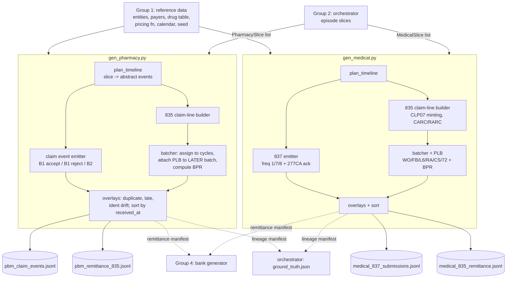
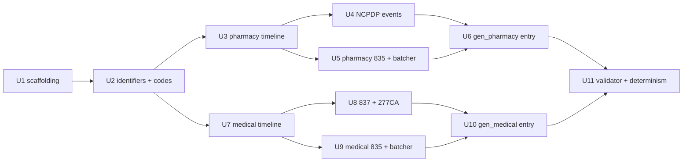

# G3 — The two reimbursement generators

> **RECONCILED 2026-09-12** — see `plans/RECONCILIATION.md` and `architecture_decisions.md`
> Decisions 37–48. Every FLAG below is now ruled; statuses are updated in the flag table itself.
> Structural deltas binding on this plan:
> - **Slice contract (Decision 44):** the assumed `PharmacySlice`/`MedicalSlice` shapes are
>   superseded by the unified contract in `src/recon/generators/contracts.py` (content owned by
>   G2): per-episode `PbmClaimSlice` / `MedicalSubmissionSlice` plus cross-episode batch slices
>   `PbmRemittanceSlice` / `MedicalRemittanceSlice`. Slices carry payer-visible **facts and all
>   dates, `received_at` included** — the orchestrator owns time. Raw config dimension values do
>   not cross the boundary; the dimension→wire-artifact tables below remain valid as the
>   *emission spec*, driven by slice contents (adjudication outcome, reversal sub-object, claim
>   lines present in batches, PLB entries attached).
> - **Batching re-scoped:** the orchestrator composes remittance batches and attaches each PLB
>   entry to its later batch (its netting ledger owns the cross-episode choreography, including
>   the trailing-batch case). D-DECISION-1's two-pass grouping logic moves there. The generators
>   keep the **wire arithmetic**: build claim lines, compute
>   `BPR = Σ(CLP04) − Σ(PLB, signed)` — the batch slice carries no precomputed net — enforce the
>   balance identities (R5, FLAG-4), and **declare one `MoneyMovement` per batch, amount = the
>   net they computed** (this is "G3 declares net of PLB"). `remittance_isolation` remains a
>   slice-level fact the orchestrator sets when composing batches.
> - **No manifest files (Decision 44):** `data/generated/_internal/` and both manifest families
>   are dropped. Generators return `(records, movements)`; the orchestrator — which invoked
>   them — takes lineage (clp07, auth numbers, record ids) from the returned `Record` payloads
>   and cash facts from `MoneyMovement[]`. Bank debits for A-10 (money returned) are produced by
>   the orchestrator's realizer from the episode's `cash_reimb_out` value, so
>   `requires_bank_debit` is unnecessary.
> - **`trn02` is orchestrator-minted** (crossing matrix, G2 plan) and arrives on the batch
>   slice; the generator emits it verbatim. `clp07`, `authorization_number` and `record_id`
>   stay generator-minted.
> - **`required_tail_days` is superseded:** window fitting is the orchestrator's job — its event
>   template table constrains anchor dates by chain length. G3's arrival-lag table below is
>   contributed to that template table as the calibration source; generators draw no lags.
> - **Paths and shared code:** module root is `src/recon/generators/` (G1's tree). The Unit 1
>   `common/rng.py` and `common/money.py` duplicates are dropped — import `recon.rng` and
>   `recon.money` from G1. The deterministic JSONL/CSV writer lives once in
>   `recon/generators/common/emit.py`, shared with G4.
> - **OQ-6 ruled (Decision 46):** D-5 malformed records are injected centrally by the
>   orchestrator, post-write. Generators stay provably well-formed.
> - **Fictional names (Decision 38):** payer/PBM/manufacturer names come from G1's reference
>   data and are fictional throughout.

Two seeded, standard-library Python generators that turn an orchestrator-supplied **episode slice** into four synthetic source files:

| Generator | Output file | Standard | Cardinality |
|---|---|---|---|
| `gen_pharmacy.py` | `pbm_claim_events.jsonl` | NCPDP Telecommunication D.0 | one line = one transaction (B1/B2) |
| `gen_pharmacy.py` | `pbm_remittance_835.jsonl` | X12 835 per NCPDP *Pharmacy Reference Guide to the 835* | one line = one whole remittance file, many claims |
| `gen_medical.py` | `medical_837_submissions.jsonl` | X12 837 (+ 277CA acknowledgment — see FLAG-1) | one line = one submission or one acknowledgment |
| `gen_medical.py` | `medical_835_remittance.jsonl` | X12 835 | one line = one whole remittance file, many claims |

Neither generator knows about episodes, verdicts, the 340B feed, or the bank. Each receives only the slice a real PBM or medical payer would hold, and emits records in **arrival order** (`received_at` ascending), not event order. Same seed → identical bytes.

The single most important structural fact in this plan: **the claim-event file is per-claim but the remittance file is per-batch.** Both generators are therefore *two-pass over the whole population*, not one-pass per episode. Everything about PLB netting, out-of-order arrival and cash isolation falls out of that.

---

## Problem Frame

The connector under test has to solve three crosswalks it is given no shortcuts for (`docs/architecture_decisions.md` Decision 7, 8). Our job is to build the two channels that make those crosswalks real:

1. **Pharmacy transaction key → remittance.** The 835 does not carry the NCPDP transaction key. It carries `clp01_patient_control_number = "7845102FILL00"`, a string the connector must split back into `{rx, fill}`. A B2 reversal carries no identity at all — only the repeated composite key.
2. **CLM01 → CLP01 → CLP07.** CLP01 is stable for the life of a claim; CLP07 is reassigned on every reprocess. A connector that keys on CLP07 forks a claim's history.
3. **Remittance → cash.** `sum(CLP04) − Σ(PLB, signed) = BPR02`. The bank only sees BPR02. A `WO` line referencing an *earlier* claim silently shortens today's deposit and appears nowhere on the bank feed at all.

If the generators leak a shared key, invent a universal claim ID, or emit a remittance that pre-attaches itself to a claim, all three problems evaporate and the prototype tests nothing.

---

## Requirements Trace

Numbered so downstream units can cite them.

**Format fidelity (from `docs/feed_formats.md`, binding):**
- R1. NCPDP field set and formats exactly as §1's field-reference table: `402-D2`, `403-D3`, `401-D1` (CCYYMMDD), `201-B1`, `407-D7` (11-digit NDC), `442-E7` (3 implied decimals), `101-A1` (6 digits), `104-A4`, `302-C2`, `420-DK` (`20` = 340B-related), `503-F3`, `511-FB`.
- R2. Reject codes drawn only from `70, 75, 76, 79, 88, 40, 65, 21, 25`.
- R3. `clp01_patient_control_number` = Rx number + literal `FILL` + 2-digit fill number.
- R4. B2 reversal repeats `{service_provider_id, prescription_ref_number, fill_number, date_of_service}` and carries no new identity.
- R5. `sum(clp04) − Σ(PLB signed) = bpr.total_actual_provider_payment` on every pharmacy 835; `= bpr02_total_payment` on every medical 835.
- R6. Medical CLM01 provider-assigned; CLP01 echoes it; CLP07 payer-assigned and **new on every reprocess**.
- R7. CLM05-3 ∈ `{1, 7, 8}`; `7` and `8` carry `ref_f8_original_icn`; `7` is a full replacement, not a patch.
- R8. CLP02 ∈ `{1, 2, 3, 4, 19, 20, 21, 22, 25}`; BPR04 ∈ `{ACH, CHK, NON}`; TRN01 = `1`, TRN03 = `1` + 9-digit TIN.
- R9. SVC composite `HC:<Jcode>:<modifiers>`; loop 2410 `LIN02=N4` + 11-digit NDC + `CTP04` quantity + `CTP05` UOM ∈ `{F2, GR, ME, ML, UN}`; J-code units and NDC units deliberately do not reconcile numerically.
- R10. CARC/RARC drawn only from the documented sets; group codes ∈ `{CO, PR, OA, PI, CR}`; PLB codes ∈ `{WO, FB, L6, CS, 72, RA}`, PLB outside every claim loop.

**Behavioural coverage (from `docs/reconciliation_state_space.md` / `decision_tree/`):**
- R11. `gen_pharmacy` must be able to realize every pharmacy dimension value in `decision_tree/spec.py`: `ph_adjudication`, `ph_payment`, `ph_post_event`, `ph_settlement` — sufficient for all 16 reachable A-verdicts (A-01, A-02, A-04..A-17).
- R12. `gen_medical` must realize `md_clearinghouse`, `md_remittance`, `md_appeal`, `md_post_event` — sufficient for all 15 reachable B-verdicts (B-01, B-02, B-04..B-16).
- R13. Feed-level defects D-1 (duplicate delivery), D-2 (late/out-of-order arrival), D-6 (crosswalk miss / identifier drift), D-7 (allocation residual via PLB netting) must be injectable as overlays orthogonal to the episode's target verdict. D-5 (malformed) optional — see OQ-6.
- R14. Assignment edge cases must be present in the pharmacy and medical channels: fully reconciled, partial payment, underpayment, reversal/recoupment, denial, duplicate event, late-arriving status (`docs/Assignment_doc.pdf` p.2).

**Discipline (from `docs/architecture_decisions.md`):**
- R15. `received_at` is the ONLY non-native field either generator adds (Decision 16).
- R16. No run date, no concept of "now", no SLA field, no age field, no future dates (Decisions 17, 18, 19).
- R17. No episode ID, no verdict name, no 340B status, no cross-feed identifier, no bank knowledge in any emitted record (Decisions 10, 11).
- R18. Deterministic and seeded; same seed → byte-identical output (Decision 14, rubric "reproducible data").
- R19. Two profiles, `demo` (~60 episodes) and `full` (~1,500), from one seed (Decision 14).
- R20. All dates inside 2025-07-01 .. 2026-07-01.
- R21. Generators are a separate entry point; they import the reference/reference-data library and nothing from the engine or the API (Decision 36).

---

## Scope Boundaries

**In scope:** the four files above; the PBM's and the medical payer's view only; identifier minting for payer-assigned identifiers; batching, PLB arithmetic and BPR totals; arrival scheduling; the four named defect classes; internal manifests published back to the orchestrator.

**Explicitly not in scope for G3:**
- The 340B/TPA feed and the bank/CSV feed (Groups 4/other). We publish the manifests they need and stop.
- `ground_truth.json` — the orchestrator writes it (Decision 11). We publish lineage manifests it can consume.
- Episode construction, verdict targeting, stratification over the 372 pairs, DOS sampling — Group 2 / the orchestrator.
- Reference data (entities, drug table, payer table, calendar) — Group 1.
- The reconciliation engine's reading of any of this. We must not import it and must not shape output around its internals.
- Replenishment-model 340B, the no-claim dispense, the insurer behind the PBM (Decisions 3, 4, 6).
- Any drug appearing on both channels. `gen_pharmacy` accepts only `ORAL_SELF_ADMIN` NDCs; `gen_medical` accepts only `INFUSED_CLINICIAN_ADMIN` NDCs. Each generator **asserts** this on its input and fails loudly rather than silently emitting duplicate billing.

---

## Context & Research

### Relevant specification anchors

| Concern | Source |
|---|---|
| Every field name, format and worked JSON example | `docs/feed_formats.md` §1, §3 |
| Which dimension values are legal in combination | `decision_tree/spec.py` — `dom_ph_*`, `dom_md_*` domain functions |
| Which dimension combination lands on which verdict | `decision_tree/classify.py` — `classify_pharmacy`, `classify_medical` |
| Verdict definitions and evidence | `docs/reconciliation_state_space.md` Tracks A and B |
| Non-negotiable design constraints | `docs/architecture_decisions.md` Decisions 7, 8, 10, 11, 12, 13, 16, 18, 19, 36 |
| Output location | `.gitignore` already excludes `data/generated/` — that is the output root |

### The dimension domains we must realize (verbatim from `decision_tree/spec.py`)

```
ph_adjudication : REJECTED | ACCEPTED
ph_payment      : NONE | PARTIAL | FULL | OVER | DUPLICATE          (only if ACCEPTED)
ph_post_event   : NONE | REVERSAL_PRE_PAY | ADJUSTMENT              (if ph_payment == NONE)
                : NONE | REVERSAL_POST_PAY | RECOUPMENT | ADJUSTMENT (if money moved)
ph_settlement   : CONFIRMED | MISSING    (absent if unpaid or REVERSAL_POST_PAY)

md_clearinghouse: REJECTED | ACCEPTED
md_remittance   : NONE | PAID_FULL | PARTIAL | DENIED | DUPLICATE_835 (only if ACCEPTED)
md_appeal       : NOT_FILED | PENDING | WON | LOST   (only if md_remittance in {PARTIAL, DENIED})
md_post_event   : NONE | RECOUPMENT                  (only if money was received)

ph_timing / md_timing : retired stubs, always empty — never appear, never emit for them
```

### Verified arithmetic in the spec's own examples

Checked every worked example in `docs/feed_formats.md`:

- Medical 835 example balances exactly: `6100 + (1820 + 200 + 300) = 8420 = clp03`; `clp05 300 = Σ PR`. PLB: `6100 − 900 − (−42.30) = 5242.30 = bpr02`. ✔
- Pharmacy 835 example **claim 2** balances: `1275 + (45 + 100) = 1420 = clp03`. ✔
- Pharmacy 835 example **claim 1 does not balance**: `2791.75 + 50.00 (PR-3) = 2841.75`, but `clp03 = 2891.75`. Off by exactly 50.00 — a `CO-45` of 50.00 is missing (or `clp03` should read 2841.75). See FLAG-4.
- The PLB `reference_id` in the pharmacy example is `20260588210033` — month `88`. ICNs are **opaque**, not dates, even though they look date-prefixed. This is a deliberate trap and the generator must reproduce it (see D-DECISION-7).

---

## Key Technical Decisions

- **D-DECISION-1 — Two-pass, population-scoped emission.** Both generators take the *whole list* of slices for their channel, not one slice at a time. Pass 1 builds each slice's abstract event timeline. Pass 2 assigns claim payments to remittance batches, attaches PLB lines to *later* batches than the claim they reference, computes BPR totals, then flattens and sorts by `received_at`. Rationale: a `WO` must reference an earlier claim (R5, feed_formats §1), and one 835 must cover many claims (Decision 12) — neither is expressible per-episode.

- **D-DECISION-2 — Timeline planning is separated from wire formatting.** A pure `plan_timeline(slice) -> tuple[Event, ...]` layer decides *what happens and when*, in channel-neutral terms. A separate emitter layer turns each `Event` into NCPDP/X12 JSON. Rationale: all the state-space logic (R11, R12) becomes testable without asserting on field names, and the format spec can be corrected without touching behaviour.

- **D-DECISION-3 — Expected amount is intra-channel and self-evidencing on the pharmacy side.** The B1 response's `total_amount_paid` (the PBM's adjudicated promise) **is** the expected amount E. The 835's `clp04_payment_amount` is the actual. The variance the engine computes therefore never depends on the drug price table being right — the price table only makes the numbers look plausible. Rationale: removes a hard dependency on Group 1 pricing correctness from the correctness of the verdict.

- **D-DECISION-4 — Medical expected amount is the allowed amount, derived from the 835's own balance identity.** `allowed = clp03 − Σ(CO-45)`. `md_remittance=PAID_FULL` means the identity holds and the only reductions are `CO-45` + `PR-*`. `md_remittance=PARTIAL` means an *additional* disputable reduction (`CO-197`, `CO-151`, `CO-97`) sits on top — the identity still holds, but the reduction is contestable, which is exactly what opens the appeal branch in `dom_md_appeal`. Rationale: real 835s always balance; the medical dispute is about *reason*, not arithmetic.

- **D-DECISION-5 — Pharmacy underpayment deliberately breaks the balance identity.** Per `docs/feed_formats.md` §1 defect table: "`clp04_payment_amount` < expected, with a `CO-45` adjustment that does not explain the whole gap." So on the pharmacy channel only, `ph_payment=PARTIAL` emits a residual: `clp03 − clp04 − Σ(adjustments) > 0`. Rationale: the two channels break differently because they *are* different — pharmacy has an adjudicated promise to compare against, medical does not.

- **D-DECISION-6 — Reversal and recoupment are distinguished by actor, on the wire.** `REVERSAL_*` is pharmacy-initiated → a **B2 transaction** in `pbm_claim_events.jsonl`. `RECOUPMENT` is PBM-initiated → a **PLB `WO` line** in a later 835, with no B2 anywhere. Rationale: `docs/reconciliation_state_space.md` Track A states these are numerically identical and differ only by actor; the wire format already encodes actor for free.

- **D-DECISION-7 — Payer control numbers are opaque 14-character strings with a date-lookalike prefix that is not a valid date.** Minted as `<4-digit payer epoch><2-digit non-month 13..99><8 digits>`, reproducing the spec's own `20260588210033`. Rationale: the doc's example proves ICNs are not parseable dates, and a connector that tries to parse one must fail visibly.

- **D-DECISION-8 — Cash isolation is passed as a batching hint, never as the cash dimension.** Group 2 passes `remittance_isolation: bool`. When true the claim gets its own single-claim remittance file, so the bank generator can withhold, shorten or duplicate exactly that deposit without collateral damage to 46 other claims. The generator never learns whether cash arrived. Rationale: preserves Decision 10's isolation while making per-claim cash outcomes representable against a per-batch bank line.

- **D-DECISION-9 — Both appeal conventions are used, split deterministically, with one hard constraint.** `md_appeal=WON` resolves either as (R) a frequency-`7` replacement plus a new 835 with a new CLP07, or (P) a PLB `RA` credit with no new claim. Convention P is **forbidden** when `remittance_isolation` is true, because a PLB credit rides inside a batch total and cannot be individually withheld by the bank. Rationale: `docs/feed_formats.md` §3 mandates both conventions; the isolation constraint is a consequence of D-DECISION-8.

- **D-DECISION-10 — Money is integer cents end to end.** Never float in arithmetic. Serialized through a `Decimal` subclass rendered at exactly 2 decimal places so output reads `2840.00`, matching the spec's examples byte for byte. Rationale: R18 byte-identity plus R5 arithmetic identity.

- **D-DECISION-11 — Files are written with explicit `newline="\n"`, UTF-8, no BOM.** The project is developed on Windows; the default text-mode translation to `\r\n` would break byte-identity across platforms. Rationale: R18.

- **D-DECISION-12 — Per-slice RNG streams are derived, never shared.** `derive_rng(master_seed, channel, slice_id)` via BLAKE2b, not Python's `hash()` (which is `PYTHONHASHSEED`-dependent for strings). Every iteration over a mapping is over `sorted(keys)`. Rationale: adding or removing one episode must not shift any other episode's draws — otherwise the `demo` and `full` profiles diverge for no reason and byte-identity becomes fragile.

---

## Open Questions

### Resolved during planning

- **How does the engine tell A-01 (POS rejection) from A-02 (awaiting payment)?** The rejected B1 carries `response_status: "R"` and a populated `reject_codes` array; the accepted one carries `"P"` and `[]`. Both are native NCPDP. No extra field needed.
- **How is `ph_settlement` encoded when neither NCPDP nor the 835 has a settlement transaction?** Via **CLP02** on the paying claim line: `"1"` (processed as primary — final) for `CONFIRMED`; `"19"` (processed as primary, forwarded to additional payer — money moved but the receivable is not closed) for `MISSING`, with `"25"` (predetermination) as a rarer second variant. Native, per-claim, needs no invented record and no fifth file. Rejected alternatives: absence of `trn.reassociation_trace_number` (collides with the bank feed's own missing-TRN defect and is file-level, not claim-level); `bpr04 = NON` (file-level, would wrongly de-settle every claim in the batch); a zero-dollar closing 835 line (invented, and it would confuse duplicate-835 detection). **See FLAG-3 — the engine must agree on this read.**
- **Where does expected-vs-actual come from on the pharmacy side?** D-DECISION-3. Verified against the spec's own example: claim event `total_amount_paid = 2791.75` equals 835 `clp04_payment_amount = 2791.75`.
- **Can a medical claim carry multiple service lines without moving `loop_2410` out of the claim level?** Yes. Model an infusion claim as one J-code drug line (which owns the claim-level `loop_2410`) plus one or two CPT administration lines (`96413` initial infusion hour, `96415` each additional hour) that legitimately carry no NDC. The "silent replacement" defect then drops the `96415` line on the frequency-`7` replacement. Zero divergence from the spec's example shape.
- **Does the PLB `FB` line get a counterpart in the next cycle?** No. `docs/feed_formats.md` §3 explicitly frames `FB` and unreferenced `CS` as residuals that "must be tracked as unexplained rather than silently absorbed." Emit with `reference_icn: null` and no counterpart. Carried as a documented simplification.
- **Do the pharmacy and medical PLB objects share a field name?** No, and deliberately not. Pharmacy uses `reference_id`; medical uses `reference_icn`. `docs/feed_formats.md` shows them differently because they are different source systems. Do not harmonize.
- **Is passing `ph_payment="PARTIAL"` into the generator a violation of R17?** No. R17 forbids episode IDs, verdict names, cross-feed identifiers and knowledge of other channels. A behaviour dimension describing what *this payer did* is exactly what a payer knows. The line is: dimension values in, verdict codes never.

### Deferred to implementation

- Exact reject-code weighting per payer and exact CARC/RARC co-occurrence weights. Needs a first run to look plausible; will be tuned against emitted distributions, not guessed up front.
- Exact remittance batch-size cap (starting point ~40 shared claims per file). Depends on how many slices Group 2 marks `remittance_isolation`.
- Whether the `demo` profile needs hand-pinned slices for the rarest shapes (A-13, B-14, X-1/X-2 halves) or whether Group 2's stratification already guarantees them. Resolve once Group 2's sampler exists.
- Whether `record_id` sequences restart per profile or are globally unique across `demo` and `full`. Cosmetic; decide when the writer exists.

---

## FLAGGED ASSUMPTIONS AND SPEC CONFLICTS

Every one of these needs sign-off. Four are extensions to or corrections of the binding spec.

| # | Item | Status | Recommendation |
|---|---|---|---|
| **FLAG-1** | **`medical_837_submissions.jsonl` must also carry 277CA acknowledgment records.** `md_clearinghouse=REJECTED` (verdict B-01, "837 rejected before reaching the payer; no claim on file with payer") is otherwise **indistinguishable on the wire from B-02** (accepted, awaiting 835) — in both cases there is an 837 and no 835. `docs/feed_formats.md` §3 gives no acknowledgment record. | **RULED — ACCEPTED (Decision 39).** `feed_formats.md` §3 now specifies the 277CA record type with worked examples. | Add a second record type to the same file, `record_type: "277CA"`, carrying `clm01_patient_control_number`, `stc01_composite` (`"A1:19"` accepted / `"A3:21"`, `"A3:33"`, `"A3:187"` rejected), `stc12_free_form`, and `payer_claim_control_number` (populated only on accept). The 277CA is the real, standard clearinghouse acknowledgment on the same rail — this is realism, not invention. Rejected alternative: a non-native `clearinghouse_status` field on the 837 (violates R15). |
| **FLAG-2** | **PLB `RA` sign.** `docs/feed_formats.md` §3 says appeal-via-PLB-credit uses "`RA` reason code, **positive** amount". Under the same document's stated identity `BPR02 = Σ(CLP04) − Σ(PLB)`, a positive PLB **reduces** the payment — the opposite of a won appeal. The document's own `L6` note confirms this ("carried as a negative amount specifically because it increases what's paid"). | **RULED — NEGATIVE (Decision 41).** `feed_formats.md` §3 corrected: appeal-credit `RA` is negative, same direction as `L6`. Convention P stands. | Emit `RA` with a **negative** `amount` when it represents an appeal credit, same direction as `L6`, so the arithmetic identity holds and money increases. Recommend `docs/feed_formats.md` §3's wording be corrected to "credit, carried negative". If the positive reading is upheld instead, `RA` cannot encode B-08/B-12 and convention P must be dropped entirely. |
| **FLAG-3** | **`ph_settlement` has no native encoding.** Resolved above as CLP02 `"1"` vs `"19"`/`"25"`. | **RULED — ACCEPTED (Decision 40).** The CLP02 encoding is now binding in `feed_formats.md` §1; the engine's A-06 rule must mirror it. | The reconciliation engine must read A-06 as "money moved, `cash_reimb_in=MATCHED`, and the covering claim line's CLP02 is `19`/`25` with no later CLP02=`1` line for that CLP01." If the engine team picks a different encoding, this plan changes in one place (`pharmacy/remittance.py`). |
| **FLAG-4** | **Pharmacy 835 worked example 1 does not balance.** `clp04 (2791.75) + Σ adjustments (PR-3 50.00) = 2841.75 ≠ clp03 (2891.75)`. | **RULED — FIXED.** `feed_formats.md` §1 example 1 gained its missing `CO-45` of 50.00; the balance identities are documented as binding, with the pharmacy-underpayment defect as the sole deliberate exception. | Generator enforces `clp03 = clp04 + Σ(all adjustments)` and `clp05 = Σ(PR adjustments)` on every claim line except where D-DECISION-5 deliberately breaks it. Recommend the doc's example gain a `CO-45` of 50.00, or `clp03` be corrected to 2841.75. |
| **FLAG-5** | **Medical 835 `service_line` is singular in the spec but must be an array** to report a claim with a drug line plus administration lines. | **RULED — ACCEPTED.** `feed_formats.md` §3's worked example now shows `service_lines: [...]`; pharmacy 835 keeps singular `service_line`. | Emit `service_lines: [...]` on the medical 835; the spec's single-line example is the degenerate 1-element case. Pharmacy 835 keeps `service_line` singular — pharmacy claims genuinely are one line. |
| **FLAG-6** | **Frequency-`8` void has no home in the state space.** `docs/feed_formats.md` §3 requires it; `decision_tree/spec.py` has no medical reversal dimension. | **RULED — ACCEPTED as overlay.** `MD_VOID` is an orchestrator-assigned overlay on a small deterministic subset; no state-space change. | Treat `MD_VOID` as an orthogonal overlay requested explicitly by Group 2 on a small deterministic subset of `md_remittance ∈ {DENIED, NONE}` slices, present for format realism. It does not change the B-verdict. Alternative: add an `md_post_event=VOID` value to `spec.py` — a state-space change, out of G3's authority. |
| **FLAG-7** | **File names.** The G3 brief says `medical_837.jsonl` / `medical_835.jsonl`; `docs/feed_formats.md` §3 says `medical_837_submissions.jsonl` / `medical_835_remittance.jsonl`. | **RULED (Decision 47).** `feed_formats.md` names win: `medical_837_submissions.jsonl` / `medical_835_remittance.jsonl`. | Use the `docs/feed_formats.md` names — it is the designated primary specification. Trivially reversible. |
| **FLAG-8** | **`trn03_payer_tin` / `originating_company_id` vs the bank's `company_id`.** The spec's examples show them **different** for the same payer (`1043251982` on the 835 vs `1911234567` on the bank row for the same PBM). In reality they usually coincide. | **RULED — KEEP DIFFERENT.** G1's payer rows carry both `originating_company_id` (835-side) and bank-side `company_id`, different values. TRN02 stays the only intended 835→bank link. | Keep them **different**, per the worked examples and per Decision 7 (generators must not hand the connector an extra free join key). TRN02 stays the only intended 835→bank link. Needs Group 1/Group 4 agreement since Group 1 owns the payer table that holds both. |
| **FLAG-9** | **Identifier drift ownership.** `docs/feed_formats.md` §1 defines drift as "zero-padded in one feed, bare in another." | **RULED (Decision 46).** The orchestrator assigns `rx_number_rendering` directives to exactly one feed per episode; no generator drifts independently. Pharmacy-835 zero-padding is the canonical case. | G3 applies drift **only** to `clp01_patient_control_number` on the pharmacy 835 (`"07845102FILL00"` while the claim event carries `"7845102"`). Group 2 must ensure the 340B generator does not independently drift the same slice in a conflicting direction. |
| **FLAG-10** | **D-1 duplicate delivery: are the two copies byte-identical?** | **RULED — ACCEPTED (Decision 46).** | Emit the payload identically but with a **later `received_at`** on the second copy. An SFTP rerun replays the same file; the pipeline stamps a fresh arrival time. `record_id` is the idempotency key and is identical. |
| **FLAG-11** | **Degenerate configuration: `ph_payment=NONE` + `ph_post_event=ADJUSTMENT`** is legal in `spec.py` but has no wire encoding — with no payment there is no 835 claim line to hang an adjustment on. | **RULED — ACCEPTED as documented.** | Emit nothing extra. `classify_pharmacy` maps both this and `ph_post_event=NONE` to **A-02**, so verdict fidelity is preserved; only the dimension is unobservable. |
| **FLAG-12** | **A-12 vs A-13 is decided inside our file, not by the bank.** A netted recoupment "never appears as its own bank line at all" (`docs/feed_formats.md` §4), yet the state space frames the split as `cash_reimb_out MATCHED/ABSENT`. | **RULED — ACCEPTED.** For `RECOUPMENT`, `cash_reimb_out` MATCHED/ABSENT is realized as PLB traceability, no bank line either way; `REVERSAL_POST_PAY` with money returned gets a realizer-produced bank debit. | A-12 = the `WO` carries a `reference_id` that resolves to a claim control number present in our own 835 population **and** the batch arithmetic closes. A-13 = `reference_id` is `null` or points at a control number that exists nowhere. No bank line is requested from Group 4 for either. Contrast: `REVERSAL_POST_PAY` (A-10/A-11) *does* need a bank debit — see the Group 4 contract below. |

---

## High-Level Technical Design

> *This illustrates the intended approach and is directional guidance for review, not implementation specification. The implementing agent should treat it as context, not code to reproduce.*

### Data flow



### PLB arithmetic and sign convention

```
bpr_total_cents = sum(clp04 for every claim line in the batch)
                - sum(plb.amount for every PLB line in the batch)     # signed

WO  amount > 0   overpayment recovery        -> reduces the deposit
FB  amount > 0   forward balance, no ref     -> reduces the deposit, unexplained residual
CS  amount > 0   adjustment                  -> reduces the deposit
72  amount > 0   authorized return           -> reduces the deposit
L6  amount < 0   interest owed to provider   -> increases the deposit
RA  amount < 0   appeal credit (see FLAG-2)  -> increases the deposit

A negative CLP04 (clp02 = "22", reversal of previous payment) reduces the batch
total through the sum(clp04) term, not through PLB. The two mechanisms must never
both be applied to the same reversal.
```

### Pharmacy: dimension value → wire artifact

| Dimension value | `pbm_claim_events.jsonl` | `pbm_remittance_835.jsonl` | A-verdict enabled |
|---|---|---|---|
| `ph_adjudication=REJECTED` | 1× B1, `response_status:"R"`, `reject_codes:["75"]` etc., `authorization_number:null`, all amounts `null` | nothing, ever | A-01 |
| `ph_adjudication=ACCEPTED` | 1× B1, `response_status:"P"`, auth number minted, `ingredient_cost_paid`/`dispensing_fee_paid`/`patient_pay_amount`/`total_amount_paid` populated | see `ph_payment` | — |
| `ph_payment=NONE` | — | no claim line in any 835 | A-02 |
| `ph_payment=FULL` | — | 1 line, `clp04 == B1.total_amount_paid`, balance identity holds | A-04 / A-05 / A-06 |
| `ph_payment=PARTIAL` | — | 1 line, `clp04 < B1.total_amount_paid`; a `CO-45` covers part of the gap; residual left unexplained (D-DECISION-5) | A-07 / A-08 |
| `ph_payment=OVER` | — | 1 line, `clp04 > B1.total_amount_paid` by 3–12%, nothing explains the excess | A-09 |
| `ph_payment=DUPLICATE` | — | 2 lines, same `clp01`, same `clp04`, in **two different 835 files** — different `record_id`, `trn02`, `clp07` | A-17 |
| `ph_post_event=REVERSAL_PRE_PAY` | 1× B2, `received_at` before the cycle that would have paid it | claim never enters a batch | A-16 |
| `ph_post_event=REVERSAL_POST_PAY` | 1× B2, `received_at` after the paying 835 | later 835 carries a negative line: same `clp01`, `clp02:"22"`, `clp04 = −original`, **new** `clp07` | A-10 (bank debit) / A-11 (none) |
| `ph_post_event=RECOUPMENT` | **no B2** — PBM-initiated | later 835 carries `provider_level_adjustments: [{reason_code:"WO", reference_id: <earlier clp07> \| null, amount: +X}]` | A-12 (resolvable) / A-13 (null or dangling) |
| `ph_post_event=ADJUSTMENT` | — | paying line gains an extra `CO` reduction (`CO-45`/`CO-97`/`CO-151`) lowering allowed to E′ | A-14 (`clp04 == E′`) / A-15 (residual) |
| `ph_settlement=CONFIRMED` | — | paying line `clp02:"1"` | A-04 |
| `ph_settlement=MISSING` | — | paying line `clp02:"19"` (or `"25"`), and no later `clp02:"1"` line for that `clp01` | A-06 |

### Medical: dimension value → wire artifact

| Dimension value | `medical_837_submissions.jsonl` | `medical_835_remittance.jsonl` | B-verdict enabled |
|---|---|---|---|
| `md_clearinghouse=REJECTED` | 1× 837 freq `"1"` + 1× 277CA `stc01:"A3:21"`, no payer ICN | nothing, ever | B-01 |
| `md_clearinghouse=ACCEPTED` | 1× 837 freq `"1"` + 1× 277CA `stc01:"A1:19"` carrying the payer ICN | — | — |
| `md_remittance=NONE` | — | nothing | B-02 |
| `md_remittance=PAID_FULL` | — | 1 CLP, `clp02:"1"`, reductions are `CO-45` + `PR-1/2/3` only, identity holds | B-04 / B-05 |
| `md_remittance=PARTIAL` | — | 1 CLP, `clp02:"1"`, additional disputable reduction — `CO-197`+`N522`, `CO-151`+`N362`, or `CO-97` — identity still holds (D-DECISION-4) | B-06..B-09, B-14 |
| `md_remittance=DENIED` | — | 1 CLP, `clp02:"4"`, `clp04: 0.00`, whole charge adjusted under `CO-197`/`CO-50`/`CO-16`+`N130`/`PR-204` | B-10..B-14 |
| `md_remittance=DUPLICATE_835` | — | same `clp01`, same `clp04`, in two 835 files; second carries a **new** `clp07` | B-16 |
| `md_appeal=PENDING` | 1× 837 freq `"7"`, `ref_f8_original_icn` = first `clp07` | no further 835 | B-07 / B-11 |
| `md_appeal=WON`, convention **R** | 1× 837 freq `"7"`, `ref_f8_original_icn` = first `clp07` | later 835: same `clp01`, **new** `clp07`, `clp02:"1"`, full allowed paid | B-08 / B-12 / B-14 |
| `md_appeal=WON`, convention **P** | nothing | later 835: no CLP for this claim; `provider_level_adjustments: [{reason_code:"RA", reference_icn: <original clp07>, amount: −X}]` (FLAG-2). Forbidden when `remittance_isolation` (D-DECISION-9) | B-08 / B-12 |
| `md_appeal=LOST` | 1× 837 freq `"7"`, `ref_f8_original_icn` set | later 835: same `clp01`, new `clp07`, `clp02:"4"`, `clp04: 0.00`, **the same CARC as the original denial** | B-09 / B-13 |
| `md_post_event=RECOUPMENT` | — | later 835 `provider_level_adjustments: [{reason_code:"WO", reference_icn: <paying clp07>, amount:+X}]` | B-15 |

Note the CLP07 discontinuity is generated everywhere it should be: every reprocess mints a fresh `clp07` while `clp01` never moves (R6).

### Assumed input contract from Group 2 — RECONCILED: superseded by the unified contract

**Superseded (Decision 44).** The binding shapes are `PbmClaimSlice`, `PbmRemittanceSlice`,
`MedicalSubmissionSlice` and `MedicalRemittanceSlice` in `plans/G2-orchestrator.md` /
`src/recon/generators/contracts.py`. Everything G3 needed from the shape below is present there:
the natural-key fields, plan fields, 340B flag, reversal sub-object, `remittance_isolation`,
overlay directives, and — new — all dates and `received_at` supplied by the orchestrator.
Raw dimension values do not cross; the slice carries the payer-visible facts they imply.
The original assumed shape is kept below for the diff record only.

```
PharmacySlice (frozen):
  slice_id, seed_token                          # opaque; never written to any output
  payer_key                                     # -> Group 1 payer row: bin, pcn, name, cycle, company id
  pharmacy_npi, prescriber_npi                  # orchestrator-minted; SHARED with the 340B feed
  rx_number, fill_number, date_of_service       # orchestrator-minted; SHARED with the 340B feed
  ndc_11                                        # must be route == ORAL_SELF_ADMIN, asserted
  quantity_dispensed, days_supply
  group_id, cardholder_id, person_code
  is_340b_flagged: bool                         # -> submission_clarification_code "20"
  ph_adjudication, ph_payment, ph_post_event, ph_settlement    # dimension values, never verdict codes
  remittance_isolation: bool                    # batching hint only (D-DECISION-8)
  overlays: frozenset[str]                      # {DUP_DELIVERY, LATE_ARRIVAL, IDENT_DRIFT, ...}

MedicalSlice (frozen):
  slice_id, seed_token
  payer_key                                     # -> payer name, TIN, clp07 prefix, adjudication lag
  clm01_patient_control_number                  # PROVIDER-assigned -> orchestrator mints it
  billing_provider_npi, rendering_provider_npi
  date_of_service
  service_lines: tuple of (hcpcs_j_code, modifiers, units, ndc_11, ctp04_quantity, ctp05_uom)
                                                # exactly one drug line; 0-2 CPT admin lines
  md_clearinghouse, md_remittance, md_appeal, md_post_event
  remittance_isolation: bool
  overlays: frozenset[str]                      # {DUP_DELIVERY, LATE_ARRIVAL, SILENT_REPLACEMENT, MD_VOID, ...}
```

**Who mints what — the single most important table in the contract.**

| Identifier | Minted by | Why |
|---|---|---|
| `rx_number`, `fill_number`, `date_of_service`, `ndc_11`, `pharmacy_npi`, `prescriber_npi` | **Orchestrator** | These four-plus form the PBM↔340B natural key (Decision 8). Both generators must emit byte-identical values. |
| `bin`, `pcn`, `group_id`, payer names, company IDs, TINs | **Group 1 payer table**, selected by `payer_key` | The bank feed needs the same strings. |
| `cardholder_id` | **Orchestrator** | Must be stable per patient across fills. |
| `clm01_patient_control_number` | **Orchestrator** | Provider-assigned; keeps provider identity coherent across the medical channel. |
| `authorization_number` (503-F3) | **gen_pharmacy** | PBM-assigned, opaque, lives only in the PBM channel (claim event + 835 `ref_authorization_number`). Must never reach the TPA. |
| `clp07` / payer ICN, both channels | **the generator** | Payer-assigned; new on every reprocess (R6). |
| `trn02` / reassociation trace number | **Orchestrator** (crossing matrix, Decision 44) — arrives on the batch slice; generator emits it verbatim and echoes it as `MoneyMovement.payer_reference` | Reaches the bank only through the realizer's `CashEvent`, which also decides the ~20% drop. |
| `ref_f8_original_icn` | **gen_medical** | Copies back a `clp07` it minted. |
| `record_id` | **the generator** | Per-file sequence. |

### Published output contract — what G3 owes downstream

**Superseded (Decision 44 / conflict C7).** There are no manifest files and no
`data/generated/_internal/`. Each remittance generator returns `(records, movements)`:
the `MoneyMovement[]` carries what the remittance manifest would have (net BPR total in cents,
the orchestrator-minted `trn02` as `payer_reference`, effective date, channel), and the
orchestrator takes lineage identifiers (`clp07`, `authorization_number`, `record_id`, `clp01`)
from the returned `Record` payloads when writing `ground_truth.json`. Bank debits for A-10 are
produced by the orchestrator's realizer from `cash_reimb_out`, not requested via a manifest
flag. The paragraphs below describe the superseded file-based design:

- `pbm_remittance_manifest.jsonl` / `medical_remittance_manifest.jsonl` — one row per emitted 835 file: `{record_id, trn02, payer_key, bpr_total_cents, payment_effective_date, received_at, channel, claim_control_numbers: [...], slice_ids: [...], requires_bank_debit: bool}`. **Group 4 needs this to produce matching, short, absent, duplicate or true-reversal bank lines.** `requires_bank_debit` is true only for `REVERSAL_POST_PAY` with a returned-money outcome (FLAG-12).
- `pbm_lineage_manifest.jsonl` / `medical_lineage_manifest.jsonl` — one row per slice: every `record_id`, `clp07`, `trn02`, `authorization_number` and `clp01` value G3 emitted for it. **The orchestrator needs this to write `ground_truth.json` with real source-record citations** (Assignment: "Preserve source identifiers so an investigator can trace a result back to the synthetic source record").

### Arrival scheduling model — now the orchestrator's calibration table

**Re-scoped (Decision 44):** the orchestrator owns all dates and `received_at`; generators draw
no lags. This table is contributed to G2's event template table as the per-record calibration
source. No clock is ever read anywhere.

| Record | `received_at` |
|---|---|
| B1 (accept or reject) | `date_of_service` + 0–3 minutes, within a 10:00–19:00 local dispensing window |
| B2 reversal, pre-pay | `date_of_service` + 1–10 days, strictly before the cycle that would have paid it |
| B2 reversal, post-pay | strictly after the paying 835's `received_at`, + 1–21 days |
| Pharmacy 835 | first payer cycle date ≥ `date_of_service` + 7–21 days; `received_at` = cycle date 06:00Z + jitter −2..+3 days |
| `bpr.payment_effective_date` | the cycle's settlement banking day |
| 837 (freq 1) | `date_of_service` + 1–5 days |
| 277CA | 837 `received_at` + 0–2 days |
| Medical 835 | 837 `received_at` + 14–45 days, snapped to the payer's cycle |
| 837 replacement (freq 7) | first 835 `received_at` + 7–30 days |
| Appeal-outcome 835 | replacement `received_at` + 21–60 days |

`required_tail_days` is superseded: the orchestrator's template table computes chain length and constrains anchors itself (G2 Unit 3). The generator's residual obligation is to **raise** if any supplied date falls outside 2025-07-01 .. 2026-07-01 — a silently truncated timeline is a silently wrong verdict, and deliberate truncation is the orchestrator suppressing records, never the generator.

### Defect injection

| Defect | Mechanism | Owner |
|---|---|---|
| **Duplicate delivery (D-1)** | Same `record_id`, identical payload, second copy with a later `received_at` (FLAG-10). Applies to any record type in either channel. | G3, on `overlays` |
| **Late arrival (D-2)** | Force the 835's `received_at` jitter positive by 5–20 days, so it lands after the bank deposit. The manifest carries the true `received_at`, so Group 4 can place the deposit earlier. | G3 + Group 4 |
| **Identifier drift (D-6)** | Zero-pad `clp01_patient_control_number` on the pharmacy 835 (`"07845102FILL00"`) while the claim event stays bare. ~8% of pharmacy slices, deterministically chosen (FLAG-9). | G3 |
| **PLB netting / allocation residual (D-7)** | `WO` referencing an earlier claim, netted out of a later batch. The bank sees only the net. `FB`/unreferenced `CS` produce untraceable residuals. | G3 |
| **Underpayment** | D-DECISION-5 (pharmacy, identity broken) / D-DECISION-4 (medical, disputable CARC). | G3 |
| **Silent replacement** | Frequency-`7` 837 that omits the `96415` administration line present on the original. | G3, on `overlays` |
| **CLP07 discontinuity** | Emitted by construction on every reprocess — not an overlay. | G3 |
| **Untraceable provider offset** | `FB` or `CS` PLB line with `reference_icn: null`. | G3 |
| **J-code / NDC unit mismatch** | Emitted by construction: `svc05_units` from the J-code descriptor, `ctp04_quantity` from the package volume. They will not match. | G3 |
| **Remittance with no cash, orphan deposit, missing TRN, channel misclassification** | Bank-side. G3 only guarantees the manifest is accurate enough for Group 4 to withhold or misattribute a deposit. | Group 4 |
| **Malformed record (D-5)** | See OQ-6 below — recommend central injection, not per-generator. | Undecided |

---

## Implementation Units

Eleven units in four phases. More than the usual ceiling because this is two complete generators sharing a substrate; the phase grouping is what keeps it legible.



---

### Phase 0 — Shared substrate

- [ ] **Unit 1: Generator scaffolding — RNG, money, arrival, writer**

**Goal:** The deterministic foundation both generators stand on, with no domain knowledge in it.

**Requirements:** R15, R16, R18, R20, R21

**Dependencies:** Group 1's reference module must at least exist as an importable stub with the master seed constant and the window constants. If Group 1 has not landed, G3 owns these temporarily behind the same import path and hands them over.

**Files:**
- Create: `src/generators/common/rng.py`
- Create: `src/generators/common/money.py`
- Create: `src/generators/common/arrival.py`
- Create: `src/generators/common/jsonl.py`
- Test: `tests/generators/test_common_rng.py`
- Test: `tests/generators/test_common_money.py`
- Test: `tests/generators/test_common_jsonl.py`

**Approach:**
- `derive_rng(master_seed, *parts) -> random.Random` via BLAKE2b over `"|".join(parts)`; never `hash()` (D-DECISION-12).
- Money as `int` cents throughout; a `Cents` helper and a JSON encoder rendering exactly two decimal places so `284000` serializes as `2840.00` (D-DECISION-10).
- `arrival.py` holds the lag table from the design section as data, plus a banking-day helper that defers to Group 1's calendar if present.
- `jsonl.py` writes UTF-8, `newline="\n"`, no BOM, no `sort_keys` (field order must follow the spec's presentation order), one object per line (D-DECISION-11).

**Execution note:** Test-first. Determinism is the one property that is expensive to retrofit and cheap to pin now.

**Patterns to follow:** `decision_tree/spec.py` — pure functions, no I/O, no global state, module docstring explaining the *why*. Match that voice.

**Test scenarios:**
- Happy path: `derive_rng(seed, "pharmacy", "S-001")` returns the same first 20 draws across two separate interpreter processes launched with different `PYTHONHASHSEED` values.
- Happy path: `derive_rng(seed, "pharmacy", "S-001")` and `derive_rng(seed, "pharmacy", "S-002")` produce disjoint-looking streams; removing `S-001` from a population does not change `S-002`'s draws.
- Happy path: `284000` cents → `2840.00` in JSON output; `100` → `1.00`; `5` → `0.05`; `-4230` → `-42.30`.
- Edge case: `0` cents → `0.00`, not `0` and not `-0.00`.
- Edge case: writing a record containing a non-ASCII payer name produces UTF-8 bytes with no BOM.
- Edge case: writing on Windows produces `\n` line endings, verified by reading the file in binary mode and asserting no `\r`.
- Error path: money arithmetic given a `float` raises rather than silently coercing.
- Integration: writing the same 100-record list twice to two paths produces byte-identical files.

**Verification:** Two runs of a throwaway 100-record fixture produce identical SHA-256 digests, on Windows and on a POSIX shell.

---

- [ ] **Unit 2: Identifier minting and code vocabularies**

**Goal:** Every payer-assigned identifier and every code list, in one place, correct by format.

**Requirements:** R1, R2, R3, R8, R10, D-DECISION-7

**Dependencies:** Unit 1

**Files:**
- Create: `src/generators/common/ids.py`
- Create: `src/generators/common/codes.py`
- Test: `tests/generators/test_ids.py`
- Test: `tests/generators/test_codes.py`

**Approach:**
- `ids.py`: NPI validity (Luhn with the `80840` prefix) as a *validator* over Group 1's entity table, not a minter; `mint_authorization_number(rng, payer)` → opaque `AUTH` + 7 alphanumerics; `mint_icn(rng, payer)` → the 14-character date-lookalike-but-invalid-date string (D-DECISION-7); `mint_trace_number(rng, payer)` → 10 digits; `build_clp01(rx, fill, drift: bool)` and its inverse `parse_clp01` (the inverse exists for tests only — the connector must write its own).
- `codes.py`: the reject-code set, CARC set, RARC set, PLB set, CLP02 set, group codes, STC codes, all as frozen tuples with weighted pickers. **Any code not in `docs/feed_formats.md` is a bug** — assert membership at emission time.

**Patterns to follow:** `decision_tree/spec.py`'s domain-function style — data and the constraint on that data living side by side.

**Test scenarios:**
- Happy path: `build_clp01("7845102", "00", drift=False) == "7845102FILL00"` — the exact string from `docs/feed_formats.md` §1.
- Happy path: `build_clp01("7845102", "00", drift=True) == "07845102FILL00"`.
- Happy path: `parse_clp01(build_clp01(rx, fill, d))` round-trips for every rx length 1..12 and every fill `00`..`99`, with and without drift.
- Edge case: an Rx number containing the literal substring `FILL` is rejected at mint time (it would make the composite ambiguous).
- Edge case: `mint_icn` output is 14 characters, all digits, and `int(s[4:6])` is never in `1..12` — asserting the date-lookalike is never a parseable date.
- Edge case: two `mint_icn` calls on the same RNG never collide across a 10,000-call population.
- Error path: `pick_reject_code` asked for a code outside `{70,75,76,79,88,40,65,21,25}` raises.
- Error path: emitting a PLB reason code outside `{WO,FB,L6,CS,72,RA}` raises.

**Verification:** Every identifier the generators later emit passes its own format assertion; a property test over 10,000 mints finds no collision and no format violation.

---

### Phase 1 — `gen_pharmacy.py`

- [ ] **Unit 3: Pharmacy timeline planner**

**Goal:** Turn one `PharmacySlice` into an ordered tuple of abstract events. All state-space logic lives here and nowhere else.

**Requirements:** R11, R14, R16, R20

**Dependencies:** Unit 2; the Group 2 slice contract (assumed shape above)

**Files:**
- Create: `src/generators/pharmacy/timeline.py`
- Test: `tests/generators/test_pharmacy_timeline.py`

**Approach:**
- Pure `plan_timeline(slice, rng) -> tuple[PharmacyEvent, ...]` where `PharmacyEvent` is a small frozen dataclass tagged `B1_ACCEPT | B1_REJECT | B2_REVERSAL | CLAIM_PAYMENT | CLAIM_REVERSAL_LINE | PLB_WO`, each carrying its `received_at`, its amounts in cents, and the codes it needs. No JSON, no field names.
- Implements the pharmacy half of the dimension→artifact table verbatim, including D-DECISION-6 (B2 for reversals, PLB for recoupments) and FLAG-3 (CLP02 for settlement).
- Exposes `required_tail_days(slice) -> int` for Group 2.
- Rejects any slice whose `ndc_11` is not `ORAL_SELF_ADMIN` per Group 1's drug table.

**Execution note:** Test-first, driven directly from `decision_tree/classify.py`. Each test names the A-verdict it is proving reachable.

**Patterns to follow:** `decision_tree/spec.py`'s legality gating — a dimension that is not part of a path is absent, not `None`-with-meaning.

**Test scenarios:**
- Happy path (A-04): `ACCEPTED / FULL / NONE / CONFIRMED` → exactly one `B1_ACCEPT` and one `CLAIM_PAYMENT` with `clp04 == B1.total_amount_paid` and CLP02 `"1"`.
- Happy path (A-01): `REJECTED` → exactly one `B1_REJECT`, zero payment events, zero PLB events, and `required_tail_days == 0`.
- Happy path (A-02): `ACCEPTED / NONE / NONE` → one `B1_ACCEPT`, no `CLAIM_PAYMENT` ever.
- Happy path (A-06): `ACCEPTED / FULL / NONE / MISSING` → payment present, CLP02 `"19"`, and no later CLP02 `"1"` line for the same claim.
- Happy path (A-07): `ACCEPTED / PARTIAL / NONE / CONFIRMED` → `clp04 < total_amount_paid` and `clp03 − clp04 − Σ adjustments > 0` (the deliberate residual).
- Happy path (A-09): `OVER` → `clp04 > total_amount_paid` and no adjustment accounts for the excess.
- Happy path (A-17): `DUPLICATE` → two `CLAIM_PAYMENT` events, equal `clp04`, later marked for two distinct batches.
- Happy path (A-16): `REVERSAL_PRE_PAY` → a `B2_REVERSAL` and zero `CLAIM_PAYMENT`.
- Happy path (A-10/A-11): `REVERSAL_POST_PAY` → `B2_REVERSAL.received_at > CLAIM_PAYMENT.received_at`, plus one `CLAIM_REVERSAL_LINE` with negative `clp04` and CLP02 `"22"`.
- Happy path (A-12/A-13): `RECOUPMENT` → **no** `B2_REVERSAL`, exactly one `PLB_WO`, and its `reference_id` is populated (A-12) or `None` (A-13).
- Happy path (A-14/A-15): `ADJUSTMENT` → an extra `CO` reduction; `clp04 == E′` for A-14 and a residual for A-15.
- Edge case: `is_340b_flagged` → `submission_clarification_code` is carried on the `B1_ACCEPT` event and on nothing else.
- Edge case (FLAG-11): `ph_payment=NONE` + `ph_post_event=ADJUSTMENT` produces the same event tuple as `ph_post_event=NONE`, documented in the test name.
- Edge case: every emitted `received_at` falls inside 2025-07-01 .. 2026-07-01 for a slice placed at `window_end − required_tail_days`.
- Edge case: `fill_number = "99"` and a 12-digit `rx_number` plan without error.
- Error path: a slice whose NDC is `INFUSED_CLINICIAN_ADMIN` raises `WrongBillingRoad` rather than emitting.
- Error path: a slice whose `date_of_service` leaves insufficient tail raises `TimelineOverflow` rather than truncating.
- Error path: an illegal dimension combination per `spec.py` (`ph_settlement` set while `ph_payment=NONE`) raises.
- Integration: for all 16 reachable A-verdicts, feeding the planned timeline's dimension values through `decision_tree.classify.classify_pharmacy` returns the intended verdict.

**Verification:** A parametrized test enumerates the 16 reachable A-verdicts and each one plans without error and round-trips through `classify_pharmacy`.

---

- [ ] **Unit 4: NCPDP D.0 claim-event emitter**

**Goal:** `pbm_claim_events.jsonl` record construction — B1 accepted, B1 rejected, B2 reversal.

**Requirements:** R1, R2, R4, R15, R17

**Dependencies:** Unit 3

**Files:**
- Create: `src/generators/pharmacy/claim_events.py`
- Test: `tests/generators/test_pharmacy_claim_events.py`

**Approach:** One builder per transaction type, each producing a dict whose key order matches `docs/feed_formats.md` §1's worked examples exactly. `quantity_dispensed` formatted as 6 characters with 3 implied decimals (`30.000` → `"030000"`). Rejected claims null out `authorization_number` and all four amounts. The B2 carries only the transaction key plus `product_service_id`, `bin`, `pcn`, `response_status`, `authorization_number`, `reversal_reason` — and **no new identity of its own** (R4).

**Patterns to follow:** The three worked JSON examples in `docs/feed_formats.md` §1 are the acceptance fixtures. Match them field for field.

**Test scenarios:**
- Happy path: the accepted-claim builder, fed the spec example's inputs, reproduces the spec's example object exactly (modulo `record_id` and `received_at`).
- Happy path: the rejected-claim builder reproduces the spec's rejected example, `reject_codes: ["75"]`, all amounts `null`.
- Happy path: the B2 builder reproduces the spec's reversal example.
- Edge case (R4): the B2's key set contains no field that could serve as a unique reference to the original — asserted against an explicit allowlist.
- Edge case: `quantity_dispensed` for `30.000` is `"030000"`; for `0.5` is `"000500"`; for `999.999` is `"999999"`.
- Edge case: `bin` is always exactly 6 digits; `fill_number` always exactly 2; `date_of_service` always CCYYMMDD.
- Edge case: `submission_clarification_code` is present and `"20"` only when the slice is 340B-flagged, and absent (not `null`) otherwise.
- Error path (R17): a builder handed a slice carrying an episode ID or verdict code raises — enforced by an emitted-key allowlist test that fails on any unexpected key.
- Error path: a quantity exceeding 6 digits after scaling raises.

**Verification:** Every emitted record validates against a hand-written JSON-shape assertion derived from `docs/feed_formats.md` §1's field-reference table, including the NCPDP field-number comment mapping.

---

- [ ] **Unit 5: Pharmacy 835 claim lines, batching, PLB and BPR**

**Goal:** `pbm_remittance_835.jsonl` — the whole-file record, including the arithmetic that makes the bank deposit short.

**Requirements:** R3, R5, R10, FLAG-3, FLAG-4, D-DECISION-1, D-DECISION-8

**Dependencies:** Unit 3, Unit 4

**Files:**
- Create: `src/generators/pharmacy/remittance.py`
- Create: `src/generators/pharmacy/batching.py`
- Test: `tests/generators/test_pharmacy_remittance.py`
- Test: `tests/generators/test_pharmacy_batching.py`

**Approach:**
- `remittance.py` builds one `claim_payments[]` entry: `clp01` via `build_clp01`, `clp02` per FLAG-3, `clp03/04/05` satisfying `clp03 = clp04 + Σ adjustments` and `clp05 = Σ PR` (FLAG-4) **except** where D-DECISION-5 deliberately leaves a residual, `clp07` minted, `ref_authorization_number` copied from the B1, plus the single `service_line`.
- `batching.py` is the two-pass core (D-DECISION-1): group shareable claims by `(payer_key, cycle_date)` capped at ~40; give every `remittance_isolation` claim its own file; then attach each `PLB_WO` to the earliest batch strictly *later* than the batch holding its referenced claim; then compute `bpr.total_actual_provider_payment = Σ clp04 − Σ PLB`.
- Emits the remittance manifest row for Group 4.

**Execution note:** Test-first on the arithmetic identity. It is the highest-value invariant in the dataset and the easiest to get subtly wrong.

**Patterns to follow:** The `docs/feed_formats.md` §1 worked 835 example and its explicit `47,631.00 − 412.60 = 47,218.40` walkthrough.

**Test scenarios:**
- Happy path: a 2-claim batch with one `PR-3` adjustment each reproduces the spec's example structure, with `bpr` and `trn` populated and `payee_npi` set.
- Happy path (R5): for every generated batch, `Σ clp04 − Σ PLB.amount == bpr.total_actual_provider_payment`, to the cent.
- Happy path (R3): every `clp01_patient_control_number` matches `^0?\d{1,12}FILL\d{2}$`.
- Happy path (FLAG-4): every claim line satisfies `clp03 == clp04 + Σ adjustments` and `clp05 == Σ PR adjustments`, except lines explicitly marked as the pharmacy underpayment defect.
- Happy path: a `WO` of 412.60 on a batch whose claims total 47,631.00 yields a `bpr` total of 47,218.40 — the spec's own worked numbers.
- Edge case (D-DECISION-1): a `WO` referencing claim X is never placed in the same batch as X, and always in a batch with a strictly later `received_at`.
- Edge case: a `WO` whose referenced claim sits in the final cycle finds no later batch — the generator creates a trailing batch rather than dropping the PLB.
- Edge case (A-13): a `WO` with `reference_id: null` still nets correctly against the BPR total.
- Edge case (D-DECISION-8): every `remittance_isolation` claim lands in a file whose `claim_payments` has length 1.
- Edge case: a batch containing only a negative `clp02:"22"` line produces a negative `bpr` total with `credit_debit_flag` set accordingly.
- Edge case (A-17): the two duplicate payments land in two different files with different `record_id`, `trn02` and `clp07`.
- Edge case (FLAG-9): drifted `clp01` values are zero-padded on the 835 while the corresponding claim event stays bare, and the pair is still resolvable after normalization.
- Error path: a batch whose PLB references a control number absent from the whole population raises unless the slice explicitly requested the A-13 dangling case.
- Integration: across the full `full`-profile population, no `trn02` is reused and no `clp07` is reused.

**Verification:** An invariant test sweeps every emitted 835 in the `full` profile and asserts R5 and FLAG-4 hold on all of them.

---

- [ ] **Unit 6: `gen_pharmacy.py` entry point, overlays, ordering**

**Goal:** The runnable generator: overlays applied, everything sorted into arrival order, files and manifests written.

**Requirements:** R13, R14, R18, R19, R21

**Dependencies:** Units 4, 5

**Files:**
- Create: `src/generators/gen_pharmacy.py`
- Create: `src/generators/common/overlays.py`
- Test: `tests/generators/test_gen_pharmacy.py`

**Approach:**
- `generate(slices, reference, master_seed, profile, out_dir) -> GeneratorResult`. A thin `if __name__ == "__main__"` CLI over it, taking `--profile` and `--out`, and **no run-date argument of any kind** (R16).
- Overlays applied last, over already-built records: duplicate delivery (FLAG-10), forced late arrival, identifier drift.
- Final step: stable sort by `(received_at, record_id)` and write. Arrival order, not event order.
- Writes `pbm_claim_events.jsonl`, `pbm_remittance_835.jsonl`, and the two manifests under `data/generated/`.

**Patterns to follow:** Decision 36 — the generator entry point imports the reference library only. A test asserts `src.engine` and `fastapi` are not reachable from this module's import graph.

**Test scenarios:**
- Happy path: a 60-slice `demo` run writes four files and exits zero.
- Happy path (R18): two runs with the same seed produce byte-identical `pbm_claim_events.jsonl` and `pbm_remittance_835.jsonl` (SHA-256 compared).
- Happy path: a different seed produces different bytes but the same record *count* per slice.
- Happy path (arrival order): `received_at` is non-decreasing down every output file.
- Happy path (D-1): a slice with the duplicate overlay emits two lines sharing a `record_id`, with the second `received_at` strictly later and every other field identical.
- Happy path (D-2): a slice with the late-arrival overlay has its 835 `received_at` after its `bpr.payment_effective_date` by the forced margin, and the manifest reports the true value.
- Edge case (R20): no `received_at`, `date_of_service` or `payment_effective_date` in any output falls outside 2025-07-01 .. 2026-07-01.
- Edge case (R16): no emitted record contains any field named like `age`, `sla`, `due`, `deadline` or `expected_*` — asserted by a key-name denylist sweep.
- Edge case (R17): no emitted record contains `episode_id`, any `A-`/`B-`/`C-` verdict string, `is_340b`, or any medical/bank identifier — asserted by a value and key sweep.
- Edge case: an empty slice list writes four empty files rather than crashing.
- Edge case (R19): the `demo` and `full` profiles from the same master seed produce records whose per-slice content is identical for slices present in both.
- Error path: an output directory that already contains files from a previous run is overwritten cleanly, not appended to.
- Integration: the emitted manifests reference only `record_id` values that actually appear in the emitted files, and every emitted 835 has exactly one manifest row.

**Verification:** `python -m src.generators.gen_pharmacy --profile demo --out data/generated` twice yields identical digests; the arrival-order, window, and forbidden-key sweeps all pass.

---

### Phase 2 — `gen_medical.py`

- [ ] **Unit 7: Medical timeline planner**

**Goal:** One `MedicalSlice` → an ordered tuple of abstract events, covering all 15 B-verdicts.

**Requirements:** R6, R7, R12, R14, FLAG-1, FLAG-6, D-DECISION-9

**Dependencies:** Unit 2

**Files:**
- Create: `src/generators/medical/timeline.py`
- Test: `tests/generators/test_medical_timeline.py`

**Approach:**
- `plan_timeline(slice, rng) -> tuple[MedicalEvent, ...]`, event tags `SUBMISSION_837 | ACK_277CA | CLAIM_PAYMENT | PLB_WO | PLB_RA | PLB_FB | PLB_L6 | PLB_CS`.
- Implements the medical dimension→artifact table, including the two appeal conventions and D-DECISION-9's isolation constraint on convention P.
- Every reprocess mints a fresh `clp07` while `clp01` is held constant (R6) — the CLP07-discontinuity defect is generated by construction, not by overlay.
- `required_tail_days` for Group 2. Rejects any `ndc_11` that is not `INFUSED_CLINICIAN_ADMIN`.

**Execution note:** Test-first, driven from `decision_tree/classify.py`'s `classify_medical` ordering — note that `md_post_event=RECOUPMENT` short-circuits to B-15 ahead of every remittance check, so the planner must still emit the underlying payment events beneath it.

**Test scenarios:**
- Happy path (B-04): `ACCEPTED / PAID_FULL` → 837, 277CA `A1`, one `CLAIM_PAYMENT` with CLP02 `"1"`.
- Happy path (B-01, FLAG-1): `REJECTED` → 837 plus a 277CA with `stc01` starting `A3`, and zero `CLAIM_PAYMENT` events, ever.
- Happy path (B-02): `ACCEPTED / NONE` → 837, 277CA `A1`, nothing further.
- Happy path (B-10): `DENIED / NOT_FILED` → one `CLAIM_PAYMENT` with CLP02 `"4"`, `clp04 == 0`, whole charge adjusted.
- Happy path (B-11): `DENIED / PENDING` → a freq-`7` 837 with `ref_f8_original_icn` equal to the first `clp07`, and no second `CLAIM_PAYMENT`.
- Happy path (B-12, convention R): `DENIED / WON` → freq-`7` 837, then a second `CLAIM_PAYMENT` with the **same** `clp01` and a **different** `clp07`.
- Happy path (B-12, convention P): `DENIED / WON` with isolation false → **no** second 837, one `PLB_RA` with a negative amount referencing the original `clp07` (FLAG-2).
- Happy path (B-13): `DENIED / LOST` → second `CLAIM_PAYMENT`, new `clp07`, CLP02 `"4"`, carrying the same CARC as the first denial.
- Happy path (B-06/B-07/B-08/B-09): the `PARTIAL` branch across all four appeal values.
- Happy path (B-15): `md_post_event=RECOUPMENT` → the underlying payment events plus one `PLB_WO` referencing the paying `clp07`.
- Happy path (B-16): `DUPLICATE_835` → two `CLAIM_PAYMENT` events, same `clp01`, same `clp04`, different `clp07`, destined for different files.
- Edge case (D-DECISION-9): a `WON` slice with `remittance_isolation=True` always selects convention R, never P — asserted over 500 seeds.
- Edge case (R6): across every reprocessing path, `clp01` is constant and every `clp07` in the slice is distinct.
- Edge case (R7): every freq-`7` and freq-`8` event carries a non-null `ref_f8_original_icn`; every freq-`1` carries `null`.
- Edge case (FLAG-6): the `MD_VOID` overlay emits a freq-`8` submission and does not change which B-verdict the dimensions classify to.
- Edge case: the silent-replacement overlay produces a freq-`7` whose `service_lines` is a strict subset of the original's.
- Error path: an `ORAL_SELF_ADMIN` NDC raises `WrongBillingRoad`.
- Error path: `md_appeal` set while `md_remittance` is `PAID_FULL` raises — `spec.py` forbids it.
- Integration: all 15 reachable B-verdicts round-trip through `decision_tree.classify.classify_medical`.

**Verification:** A parametrized test enumerates the 15 reachable B-verdicts and each plans and round-trips.

---

- [ ] **Unit 8: 837 submission and 277CA acknowledgment emitter**

**Goal:** `medical_837_submissions.jsonl` record construction.

**Requirements:** R7, R9, FLAG-1, FLAG-5's sibling on the 837 side

**Dependencies:** Unit 7

**Files:**
- Create: `src/generators/medical/submissions.py`
- Test: `tests/generators/test_medical_submissions.py`

**Approach:**
- Builders for frequency `1`, `7`, `8`, matching the three worked examples in `docs/feed_formats.md` §3 field for field and key-order for key-order.
- The claim is one J-code drug line owning the claim-level `loop_2410`, plus zero to two CPT administration lines (`96413`, `96415`) carrying no NDC — this is what lets multi-line claims exist without moving `loop_2410` (resolved in Open Questions).
- `svc01_composite` built as `HC:<Jcode>:<modifiers joined>`; `units` from the J-code descriptor; `ctp04_quantity` from the package volume. **They will not match numerically and that is correct** (R9).
- The 277CA builder (FLAG-1), a distinct `record_type` in the same file.

**Patterns to follow:** The three 837 examples in `docs/feed_formats.md` §3 are the acceptance fixtures.

**Test scenarios:**
- Happy path: the freq-`1` builder reproduces the spec's original-submission example, including `svc01_composite: "HC:J9035:JW"` and `loop_2410` with `lin02_qualifier: "N4"`, `ndc11: "50242007923"`, `ctp04_quantity: "400"`, `ctp05_uom_qualifier: "ML"`.
- Happy path: the freq-`7` builder reproduces the spec's replacement example with `ref_f8_original_icn` populated.
- Happy path: the freq-`8` builder reproduces the spec's void example — `clm01`, frequency, `ref_f8` and nothing else.
- Happy path (R9): for every emitted drug line, `units != int(ctp04_quantity)` — the mismatch is asserted as intended behaviour, with a comment citing `docs/feed_formats.md` §3.
- Happy path (FLAG-1): the 277CA builder emits `stc01_composite` from the documented set and populates `payer_claim_control_number` only on `A1`.
- Edge case: `ctp05_uom_qualifier` is always drawn from `{F2, GR, ME, ML, UN}`.
- Edge case: a claim with a drug line plus a `96415` line puts `loop_2410` at claim level exactly once, and the `96415` line carries no NDC field at all.
- Edge case: `clm01_patient_control_number` never exceeds 20 characters.
- Edge case: modifiers list empty → `svc01_composite` is `HC:J9035` with no trailing colon.
- Error path (R7): building a freq-`7` without `ref_f8_original_icn` raises.
- Error path: an HCPCS code not starting with `J` on the drug line raises.

**Verification:** Each of the three spec examples is reproduced byte-for-byte after substituting `record_id` and `received_at`.

---

- [ ] **Unit 9: Medical 835 claim lines, batching, PLB and BPR**

**Goal:** `medical_835_remittance.jsonl` — the payer's whole-file remittance.

**Requirements:** R5, R6, R8, R10, FLAG-2, FLAG-5, D-DECISION-4, D-DECISION-8

**Dependencies:** Unit 7, Unit 8

**Files:**
- Create: `src/generators/medical/remittance.py`
- Create: `src/generators/medical/batching.py`
- Test: `tests/generators/test_medical_remittance.py`
- Test: `tests/generators/test_medical_batching.py`

**Approach:**
- Claim line: `clp01` echoes `clm01` unchanged; `clp02` from the documented set; `clp07` freshly minted every time; `service_lines[]` as an array (FLAG-5); adjustments as `{group_code, reason_code, amount}` plus an optional `rarc`.
- `bpr`: `bpr02_total_payment`, `bpr04_payment_method` ∈ `{ACH, CHK, NON}`, `bpr16_eft_effective_date` populated only when the method is `ACH`. `trn`: `trn01: "1"`, `trn02_trace_number` minted, `trn03_payer_tin` = `1` + the payer's 9-digit TIN from Group 1.
- PLB block with the full sign convention from the design section, including `RA` negative per FLAG-2 and `FB`/`CS` with `reference_icn: null`.
- Batching mirrors the pharmacy batcher, grouped by `(payer_key, cycle_date)`, isolation honoured, PLB attached to a strictly later batch.

**Execution note:** Test-first on the arithmetic identity and the `RA` sign, which is the plan's most contested point.

**Patterns to follow:** The `docs/feed_formats.md` §3 worked 835 example, whose numbers (`6100 − 900 − (−42.30) = 5242.30`) are the canonical fixture.

**Test scenarios:**
- Happy path: the spec's worked example is reproduced — three adjustments, two PLB lines, `bpr02_total_payment: 5242.30`.
- Happy path (R5): every emitted batch satisfies `Σ clp04 − Σ PLB.amount == bpr02_total_payment`.
- Happy path (balance): every claim line satisfies `clp03 == clp04 + Σ adjustments` and `clp05 == Σ PR adjustments` — with no pharmacy-style residual exemption on this channel (D-DECISION-4).
- Happy path (FLAG-2): an `RA` appeal credit has a negative `amount` and **increases** `bpr02_total_payment` relative to `Σ clp04`.
- Happy path: `L6` is negative and increases the total; `WO`, `FB`, `CS`, `72` are positive and decrease it.
- Happy path (R8): `bpr16_eft_effective_date` is present when `bpr04_payment_method == "ACH"` and absent when it is `CHK` or `NON`.
- Happy path (R8): `trn03_payer_tin` always matches `^1\d{9}$`; `trn01` is always `"1"`.
- Edge case (R6): two remittances covering the same `clp01` carry different `clp07` values — the CLP07-discontinuity case, asserted positively.
- Edge case: an unreferenced `FB` line has `reference_icn: null` and its amount is left unexplained by any claim in the batch.
- Edge case (D-DECISION-8): isolated claims produce single-claim files.
- Edge case (FLAG-5): a claim with a drug line and an administration line emits `service_lines` of length 2 with per-line `svc03_paid` summing to `clp04`.
- Edge case (CO-197): a paid claim carrying `CO-197` + `N522` alongside a positive `clp04` — the specialty-J-code case `docs/feed_formats.md` §3 calls out explicitly.
- Edge case: a `PLB_WO` referencing a `clp07` from an earlier batch is never co-located with it.
- Error path: a `bpr04_payment_method` outside `{ACH, CHK, NON}` raises.
- Error path: an `RA` emitted with a positive amount raises, with the error text citing FLAG-2 — so that if the spec is later corrected the failure is loud.
- Integration: over the `full` profile, no `trn02_trace_number` and no `clp07` is reused anywhere.

**Verification:** The R5 and balance-identity sweeps pass over every emitted medical 835; the spec's worked example reproduces exactly.

---

- [ ] **Unit 10: `gen_medical.py` entry point, overlays, ordering**

**Goal:** The runnable medical generator.

**Requirements:** R13, R14, R18, R19, R21

**Dependencies:** Units 8, 9

**Files:**
- Create: `src/generators/gen_medical.py`
- Modify: `src/generators/common/overlays.py`
- Test: `tests/generators/test_gen_medical.py`

**Approach:** Mirrors Unit 6. Same `generate(...)` signature shape, same no-run-date CLI, same final stable sort by `(received_at, record_id)`, same manifest emission. The medical-specific overlays are silent replacement and `MD_VOID` (FLAG-6).

**Patterns to follow:** `src/generators/gen_pharmacy.py` from Unit 6 — the two entry points should read as siblings, with the channel-specific parts obviously localized.

**Test scenarios:**
- Happy path: a 60-slice `demo` run writes both feed files plus both manifests.
- Happy path (R18): same seed → byte-identical output on repeat runs.
- Happy path (arrival order): `received_at` non-decreasing in both files; a 277CA never precedes its own 837.
- Happy path (D-1): the duplicate overlay on an 835 emits two lines with the same `record_id` and a later second `received_at`.
- Happy path (D-2): the late-arrival overlay pushes an 835 `received_at` past its `bpr16_eft_effective_date`, and the manifest reports the true value for Group 4.
- Edge case (R20): all dates inside the window.
- Edge case (R17): the forbidden key/value sweep — no episode IDs, no verdict codes, no NCPDP identifiers, no bank fields, no 340B fields anywhere in the medical output.
- Edge case: a medical slice and a pharmacy slice never share an `ndc_11` across the two channels' outputs — the one-billing-road invariant, asserted across both generators' files.
- Edge case (R19): `demo` and `full` agree on shared slices.
- Error path: overlapping `record_id` values between the 837 file and the 835 file raise — the two files use disjoint prefixes.
- Integration: every `ref_f8_original_icn` in the 837 file resolves to a `clp07_payer_claim_control_number` actually present in the 835 file, except where an overlay deliberately dangles it.

**Verification:** Repeat-run digests match; all sweeps pass; the `ref_f8` → `clp07` resolution check passes for every non-dangling case.

---

### Phase 3 — Assurance

- [ ] **Unit 11: Cross-file consistency validator and coverage harness**

**Goal:** A single executable check that the four files are mutually consistent, deterministic, and cover every A- and B-verdict. This is the artifact that makes coverage an assertion rather than a hope (Decision 14).

**Requirements:** R5, R11, R12, R13, R14, R18, R20

**Dependencies:** Units 6, 10

**Files:**
- Create: `src/generators/validate.py`
- Test: `tests/generators/test_validate.py`
- Test: `tests/generators/test_determinism.py`
- Test: `tests/generators/test_verdict_coverage.py`

**Approach:**
- `validate.py` reads the four emitted files plus the manifests and asserts every cross-file invariant listed below. It reads *only* emitted files — never the slices — so it validates what a connector would actually receive.
- The coverage harness joins the lineage manifest to `decision_tree.classify` and asserts all 16 A-verdicts and all 15 B-verdicts appear in the `full` profile.

**Execution note:** This unit is the acceptance gate for G3. It should be runnable standalone (`python -m src.generators.validate data/generated`) so Groups 1, 2 and 4 can check integration without reading G3's tests.

**Test scenarios:**
- Happy path (R5): every 835 in both files satisfies the PLB arithmetic identity.
- Happy path: every `clp01_patient_control_number` in `pbm_remittance_835.jsonl`, after de-drifting, resolves to exactly one accepted B1 in `pbm_claim_events.jsonl`.
- Happy path: every B2 in `pbm_claim_events.jsonl` matches exactly one accepted B1 on the composite key `{service_provider_id, prescription_ref_number, fill_number, date_of_service}` — proving R4's matching path is actually walkable.
- Happy path: every `clp01_patient_control_number` in `medical_835_remittance.jsonl` equals a `clm01_patient_control_number` in `medical_837_submissions.jsonl`.
- Happy path (R11/R12): the `full` profile contains at least one instance of each of the 16 A-verdicts and each of the 15 B-verdicts.
- Happy path (R14): the assignment's named edge cases are each present at least once and are individually locatable — fully reconciled, partial payment, underpayment, reversal, recoupment, denial, duplicate event, late-arriving status.
- Happy path (R18): a full regenerate produces identical SHA-256 digests for all four files.
- Edge case: no rejected B1 has any corresponding 835 claim line anywhere.
- Edge case: no `pbm_claim_events` record contains a `clp07`, `clm01`, `trn02` or any medical or bank identifier.
- Edge case (one billing road): the NDC sets of the pharmacy and medical outputs are disjoint.
- Edge case: every `PLB` `reference_id`/`reference_icn` either resolves within the same file set or is `null`/explicitly dangling per its slice's A-13 or untraceable-offset intent — and the count of dangling references matches what was requested.
- Edge case (R20): min and max of every date field across all four files fall inside the window.
- Error path: the validator fails loudly with a per-invariant diff when any one invariant is violated, rather than reporting a single boolean.
- Error path: a deliberately corrupted fixture (a `WO` amount nudged by one cent) is caught by the R5 sweep.
- Integration: the remittance manifests reconcile exactly with the emitted 835s — same count, same trace numbers, same BPR totals.

**Verification:** `python -m src.generators.validate data/generated` exits zero on a clean `full` run and non-zero with a named invariant on any corrupted fixture.

---

## System-Wide Impact

- **Interaction graph.** G3 sits between Group 1 (reference data, seeding, calendar) and Groups 2/4. It consumes slices, it publishes two manifest families. The remittance manifest is a **hard dependency for Group 4** — the bank generator cannot produce a matching deposit without the BPR total, the trace number and the effective date, and it cannot produce a *netted* deposit correctly unless our BPR total is already net of PLB. Build order should put the pharmacy remittance manifest in front of Group 4's first spike.
- **Error propagation.** Both generators fail fast and loudly. A slice that cannot be realized raises rather than emitting a plausible-looking wrong record — a silently wrong feed is worse than no feed, because the downstream verdict test will pass for the wrong reason.
- **State lifecycle risks.** The two-pass batcher holds the whole population in memory. At 1,500 episodes that is trivially fine; at 100,000 it would not be, and the streaming rewrite would have to buffer only the PLB-pending set. Noted, not solved.
- **API surface parity.** `gen_pharmacy.generate` and `gen_medical.generate` must keep the same signature shape so the orchestrator drives them identically, and so a future `gen_340b`/`gen_bank` slots in without a special case.
- **Unchanged invariants.** G3 does not touch `decision_tree/` — it imports `classify.py` in tests only, as an oracle, never at generation time. G3 does not define, read or write `ground_truth.json`. G3 adds no field to any record beyond `received_at` (R15). The 372-pair state space is not modified; FLAG-6 identifies a place where it arguably should be, and explicitly declines to do it unilaterally.

---

## Risks & Dependencies

| Risk | Likelihood | Impact | Mitigation |
|---|---|---|---|
| Group 2's slice contract lands materially different from the assumed shape | High | Medium | All state-space logic is confined to the two `timeline.py` modules. A contract change is an adapter at the top of those two functions, not a rewrite. The assumed contract is documented above specifically so the diff is cheap to compute. |
| FLAG-1 (277CA) is rejected | Medium | **High** — B-01 becomes unreachable | Raise it before Unit 7 starts. If rejected, the only alternatives are a non-native 837 field (violates R15) or dropping B-01 from coverage (violates R12). There is no third option; get the decision early. |
| FLAG-2 (`RA` sign) is resolved the other way | Medium | Medium | Convention P is dropped and all `WON` cases use convention R. Localized to `medical/timeline.py` and `medical/remittance.py`. Unit 9 already has a test that fails loudly on a positive `RA`, so the change surfaces immediately. |
| FLAG-3 (settlement via CLP02) diverges from what the engine team implements | Medium | Medium | A-06 becomes unreachable or misclassified. Mitigation is a single shared constant and an explicit note in the engine's rule for A-06. Confirm before Unit 5. |
| Group 1's drug table lacks the `route` field | Medium | **High** — the one-billing-road invariant becomes unenforceable | Requested explicitly below. Until it lands, G3 hardcodes a small NDC→route map in a clearly-marked temporary module and the Unit 11 disjointness test guards it. |
| Byte-identity breaks silently across Windows and CI | Medium | Medium | D-DECISION-11 plus the Unit 1 binary-mode line-ending test plus the Unit 11 digest test. Three layers because this failure is invisible until someone else runs it. |
| Cash isolation inflates the remittance file count so far that "one 835 covers 47 claims" stops being demonstrable | Medium | Low | Cap the isolation rate with Group 2; ensure the `demo` profile contains at least one genuinely large shared batch, hand-pinned if necessary. |
| A `WO` in the final payment cycle has no later batch to attach to | Low | Low | Unit 5 creates a trailing batch. Tested explicitly. |
| Group 2 places `date_of_service` too late and long timelines overflow the window | Medium | Low | `required_tail_days(slice)` is exposed for exactly this, and the generator raises rather than truncating. |

### What G3 needs from Group 1 — precise ask

1. **Payer table**, keyed by `payer_key`. Pharmacy rows: `name`, `bin` (6 digits), `pcn`, `group_ids[]`, `originating_company_id` (`1`+9 digits), `payment_cycle` (weekly or biweekly, plus the weekday), `bank_company_name` (≤16 chars), `bank_company_id`. Medical rows: `name`, `payer_tin` (9 digits), `clp07_prefix`, `adjudication_lag_days` range, `bank_company_name`, `bank_company_id`. See FLAG-8 — Group 1 owns whether `originating_company_id` equals `bank_company_id`.
2. **Entity tables**: pharmacies and prescribers with **Luhn-valid** NPIs; billing and rendering providers for the medical side.
3. **Drug table**, keyed by 11-digit NDC. Required: `label_name`, **`route` ∈ {ORAL_SELF_ADMIN, INFUSED_CLINICIAN_ADMIN}** — this field is what makes the one-billing-road rule enforceable rather than aspirational — `package_size`, `uom` ∈ `{F2, GR, ME, ML, UN}`, `awp_cents`, `wac_cents`, `unit_cents`, `dispensing_fee_cents`, `is_specialty`, `manufacturer`. For `INFUSED_CLINICIAN_ADMIN` rows additionally: `hcpcs_j_code`, `j_code_unit_description`, `j_code_units_per_package`, `common_modifiers[]`.
4. **Pricing functions**, shared with the orchestrator so the feeds and `ground_truth.json` agree by construction rather than by coincidence: `pharmacy_adjudicated_amounts(ndc, qty, days_supply, payer_key) -> (ingredient_cents, dispensing_fee_cents, patient_pay_cents)` and `medical_charge_and_allowed(j_code, units, payer_key) -> (charge_cents, allowed_cents)`.
5. **Seeding**: the master seed constant and, ideally, the `derive_rng` helper itself, so all four generators derive sub-streams identically. If Group 1 does not own it, G3's Unit 1 does and Group 1 imports it.
6. **Calendar**: `WINDOW_START = 2025-07-01`, `WINDOW_END = 2026-07-01`, and a banking-day helper (weekends plus US federal holidays) for payment cycles and effective dates.
7. **Output path conventions** — SETTLED (Decision 47): feeds under `data/generated/<profile>/feeds/`, ground truth under `data/generated/<profile>/truth/`. There is no manifest root; manifests were removed at reconciliation.

### What G3 needs from Group 2 — precise ask

1. The two slice dataclasses, at minimum carrying every field in the assumed contract above.
2. Confirmation that **dimension values** (not verdict codes) are what crosses the boundary, per the resolved Open Question.
3. `remittance_isolation: bool` derived from the episode's cash dimension, per D-DECISION-8 — or an explicit decision to pass `cash_reimb_in` instead.
4. Use of `required_tail_days(slice)` when placing `date_of_service`, so timelines fit the window in one pass.
5. Ownership of overlay assignment: which slices carry `DUP_DELIVERY`, `LATE_ARRIVAL`, `IDENT_DRIFT`, `SILENT_REPLACEMENT`, `MD_VOID`.
6. Coordination on FLAG-9 so the 340B generator does not independently drift the same slice's Rx number.
7. A decision on OQ-6 below.

### Open question for the group as a whole

- **OQ-6 — RULED (Decision 46): central injection, exactly as recommended.** The orchestrator corrupts N emitted lines post-write; generators stay provably well-formed. Original argument: **not the feed generators.** A malformed record is a transport-layer accident, not something a payer emits. Injecting it centrally — a post-processing pass that corrupts N lines across all four feeds after they are written — keeps each generator's output provably well-formed, keeps the corruption reproducible from the same seed, and means the quarantine path is tested against corruption that could come from any feed rather than only the two G3 owns. If the group prefers per-generator injection instead, it is a small addition to `common/overlays.py`.

---

## Documentation / Operational Notes

- The design note must carry, as named assumptions: the 277CA extension (FLAG-1), the `RA` sign resolution (FLAG-2), the CLP02 encoding of settlement (FLAG-3), the two appeal conventions and why X12 forces a convention choice at all, and the deliberate non-reconciliation of J-code units against NDC units.
- The README's reproduce-the-data section is two commands with no date argument, which is itself the point (Decision 18) and worth one sentence of explanation.
- `.gitignore` already excludes `data/generated/`. (The `_internal/` manifest directory was removed at reconciliation — generators return values instead of writing manifests.)
- Recommend a one-page `docs/feed_formats_errata.md` (or inline corrections to `docs/feed_formats.md`) capturing FLAG-2, FLAG-4, FLAG-5 and FLAG-7 once the group rules on them, so the binding spec and the code do not silently diverge.

---

## Sources & References

- Primary specification: `docs/feed_formats.md` §1 (PBM), §3 (medical), §5 (ingestion model)
- Decision record: `docs/architecture_decisions.md` — Decisions 7, 8, 10, 11, 12, 13, 14, 16, 17, 18, 19, 36
- Verdict definitions: `docs/reconciliation_state_space.md` — Track A (16 states), Track B (15 states), D-1..D-7
- Dimension domains and legality: `decision_tree/spec.py`
- Verdict classification oracle (test-time only): `decision_tree/classify.py`
- Coverage methodology: `decision_tree/REPORT.md`
- Assignment brief: `docs/Assignment_doc.pdf` — synthetic data requirement (p.2), deliverables (p.5), rubric (p.6)
