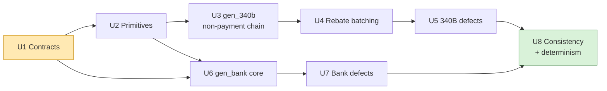

# G4: 340B/TPA and Bank Feed Generators

> **RECONCILED 2026-09-12** — see `plans/RECONCILIATION.md` and `architecture_decisions.md`
> Decisions 37–48. Deltas binding on this plan:
> - **G4-D1 RULED — JSONL upheld** (Decision 13 reaffirmed): the feed is `tpa_340b_events.jsonl`.
>   The CSV framing in the task brief is descriptive prose about structural poverty, not envelope.
> - **G4-D2 RULED — ACCEPTED** (Decision 42): `allocation_code` rides the bank `trn02` column
>   when addenda survive; `feed_formats.md` §2/§4 now state it.
> - **G4-D3 RULED — ACCEPTED** (Decision 43): `REBATE_REQUEST` and `MANUFACTURER_DECISION` are
>   now specified in `feed_formats.md` §2 with worked examples.
> - **Declare → realize → format ADOPTED PROJECT-WIDE** (Decision 44): `MoneyMovement` and
>   `CashEvent` are contracts in the unified module `src/recon/generators/contracts.py` (content
>   owned by G2 — contribute these shapes there, per this plan's own Unit 1 fallback). G3's
>   remittance generators declare net-of-PLB movements; G2 owns the settlement realizer and the
>   cross-episode netting pool.
> - **Medical 340B dispenses exist** (Decision 37 — new scope for `gen_340b`): the unified
>   `TpaDispenseSlice` (absorbing this plan's `Dispense340BSlice`) makes `rx_number` and
>   `pharmacy_npi` nullable and adds `provider_npi` (the 837 billing NPI). Medical dispenses
>   emit `rx_number: null` records keyed on `{provider_npi, ndc_11, fill_date}`; rebate batch
>   lines follow the same shape. Assumption A14's uniqueness claim applies per key type — and
>   the medical key is *deliberately* ambiguity-prone (same drug, same site, same day); the
>   orchestrator controls when that ambiguity is exercised.
> - **Orchestrator owns facts, dates and batch composition** (Decision 44): `allocation_code`
>   is orchestrator-minted and arrives on `RebateBatchSlice`; rebate batch *membership* and all
>   event `received_at` values come from slices (per-event sub-objects carry them). `gen_340b`
>   keeps the arithmetic — it sums its lines, asserts `total == Σ(lines)`, emits the batch
>   record, and declares exactly one movement per batch — and Unit 4's cadence/grouping logic
>   becomes orchestrator input (contribute it to G2's batch assembler).
> - **TRN02/addenda presence is decided by the realizer, not `gen_bank`** (Decision 46):
>   `CashEvent.payer_reference` arrives already `None` for the ~20% — ground truth must know
>   each link's resolvability. Unit 6's rng-keyed presence draw moves to G2's realizer;
>   `gen_bank` formats what it is given. Everything else in G4-D4's ownership list stands,
>   including `running_balance`.
> - **Paths:** module root `src/recon/generators/`; shared primitives come from G1
>   (`recon.rng`, `recon.money`, `recon.reference.calendar` — the banking-day calendar is now a
>   confirmed G1 deliverable); the deterministic writers live in
>   `recon/generators/common/emit.py`, shared with G3.
> - **Fictional names** (Decision 38) and **entity universe** (Decision 45: 2 pharmacies,
>   2 PBMs, 2 payers, 6 manufacturers, 2 covered entities) are binding on reference data.

## Overview

Two of the four synthetic source generators:

| Generator | Feed | Models | Structural character |
|---|---|---|---|
| `gen_340b.py` | 340B / TPA | TPA qualification, rebate request, manufacturer decision, batched rebate payment, dispense reversal | **Structurally poorest.** No X12, no 835, no trace number, no standards body. Vendor export. Only join is a natural key. |
| `gen_bank.py` | Bank / cash | ACH credits and debits against one operating account | **Thinnest.** Date, description, amount, type, running balance, trace. Zero business content beyond the NACHA batch header. |

They are planned together because they share one hard problem: **the bank generator must emit deposits whose amounts agree with money the PBM, medical and TPA generators declared, while never seeing a single record any of them wrote.** Section "The Cross-Generator Amount Consistency Mechanism" is the load-bearing part of this document and is the input Group 2 needs.

---

## Problem Frame

The prototype reconciles what money *should* have arrived against what *did*. That comparison is only a real test if the four feeds are generated in mutual ignorance — otherwise the connector is handed a pre-joined dataset and the crosswalk layer (Decision 8) has nothing to do.

Group 4 owns the two feeds at the extremes of that problem:

- The **340B feed** is where identity is weakest. There is no authorization number, no trace number, no shared identifier space at all. The only bridge to the pharmacy feed is `{pharmacy_npi, rx_number, ndc_11, fill_date}`. This is why "unmatched rebate" (D-4) is one of the assignment's own named exceptions — the feed is structurally prone to losing the thread, and that fragility is the point being tested.
- The **bank feed** is where money is verified but meaning is absent. A bank has no concept of a claim; a deposit resolves to a *remittance*, never a claim (Decision 21). One deposit can cover forty-seven claims.

Both must nonetheless produce a dataset whose arithmetic closes.

---

## Requirements Trace

Derived from `docs/feed_formats.md` §2 and §4, `docs/architecture_decisions.md`, `docs/reconciliation_state_space.md` Track C / Section 6, and the assignment PDF §1.

**340B / TPA (`gen_340b.py`)**

- **R1** — Rebate model, not replenishment. Manufacturer pays cash that lands in the bank (Decision 4). Replenishment is a documented, stated simplification.
- **R2** — Rebates arrive batched: one payment covers many dispenses, tied by `allocation_code` (Decision 5).
- **R3** — Records carry only identifiers a TPA actually holds: `rx_number`, `ndc_11`, `fill_date`, `pharmacy_npi`, `prescriber_npi`, `covered_entity_id` (HRSA format, optional child-site suffix), `hin` (9-char), `wholesaler_invoice_number`. **Never** the PBM `authorization_number`.
- **R4** — Two independent decision points, modelled as separate statuses: `qualification_status` (TPA) and `manufacturer_status` (manufacturer). "Qualified but never paid" must be representable.
- **R5** — Reversals are the same claim resubmitted with negative unit quantity, never a delete.
- **R6** — Realizable failure modes: `NO_QUALIFYING_ENCOUNTER`, `PRESCRIBER_NOT_AFFILIATED`, `UNREGISTERED_LOCATION`, `MEDICAID_DUPLICATE_DISCOUNT`, `CONTRACT_PHARMACY_RESTRICTED` (fictional restricting wave per Decision 38 — `VERION`, `ALDEBARAN`, `CORVANE`, `TALVEX`, `SAGEPOINT`, `HALCYON` — modelled on the real 2020 wave), `NON_CONFORMING_45_DAY`.
- **R7** — The feed must be able to realize every Track C state: C-00, C-01, C-02, C-03, C-05, C-07, C-08, C-09, C-10, C-11, C-13, C-14 (12 states), plus D-4 orphan rebate.

**Bank (`gen_bank.py`)**

- **R8** — Columns exactly as `docs/feed_formats.md` §4 worked example: `posting_date, description, ach_trace_number, trn02, company_name, company_id, company_entry_description, amount, type, running_balance, received_at`.
- **R9** — Two independent identifiers: 15-digit ACH trace (8-digit ODFI routing prefix + 7-digit sequence, **always present**, zero business content) and `trn02` (payer-assigned, business-meaningful, **~80% present / ~20% missing**).
- **R10** — `company_name` ≤16 chars (often truncated), `company_id` 10 chars (`1` + 9-digit EIN), `company_entry_description` = literal `HCCLAIMPMT` for claim payments only; a manufacturer rebate is not a claim payment and carries an ordinary description.
- **R11** — NACHA CCD+ Effective Entry Date modelled precisely: 1–2 banking days after file creation; `posting_date >= effective_entry_date`, never before (Decision 17).
- **R12** — Deposits are never combined. Pharmacy, medical and rebate deposits are three separate lines, always. One sender, one company, one wire, one row.
- **R13** — One deposit covers many claims. Individual specialty claims: hundreds to tens of thousands of dollars. Payer batch: tens of thousands to several million.
- **R14** — True ACH reversal = a debit within 5 banking days of the original credit, same amount, carrying the original's `trn02`. Netted recoupment = **no bank line at all**; only the smaller net deposit is visible, and the explanation lives solely in the 835 PLB. Bank totals must be consistent with that netting.
- **R15** — Realizable feed-level defects: missing TRN, netted recoupment, orphan deposit (D-3), channel misclassification, true-reversal-vs-netting distinction, duplicate delivery (D-1), late arrival (D-2).

**Both**

- **R16** — Each generator receives only the slice its real-world source system would know. No episode IDs, no verdict names, no cross-feed identifiers. The bank generator knows about money and trace numbers, never about claims (Decision 10).
- **R17** — Every record carries `received_at`, the single system-added field (Decision 16). No generator takes a run date; there is no concept of "now" (Decision 18).
- **R18** — Records are emitted in **arrival order**, not event order. A bank deposit landing before the remittance that explains it is a first-class scenario (D-2), not an edge case.
- **R19** — Deterministic and seeded. Same seed → byte-identical output.
- **R20** — Window: 1 July 2025 to 1 July 2026 inclusive.
- **R21** — Python, standard library only (Decision 34). Generators are a separate entry point that imports neither the engine nor FastAPI (Decision 36).

---

## Scope Boundaries

**In scope:** `gen_340b.py`, `gen_bank.py`, the rebate batching module they share, their test suites, and the *specification* of the two input contracts and the money-movement declaration protocol.

**Out of scope, explicitly:**

- The orchestrator, the episode plan, `ground_truth.json` — **Group 2**.
- `gen_pbm.py`, `gen_medical.py` and the PLB/`WO` netting arithmetic inside the 835s — **Group 3**. Group 4 consumes the *net* those generators declare and never recomputes it.
- Reference data (NDC catalogue, price table, NPI/entity/manufacturer registries, banking-holiday calendar) — **Group 1**.
- The connector, the reconciliation engine, the fan-out of a batch back to individual dispenses — **Group 5+**. Group 4 produces the lump; splitting it is the connector's job and the assignment's point.
- Replenishment-model 340B (Decision 4, stated simplification).
- The mock workflow / Epic feed (open question in `docs/architecture_decisions.md`).
- The insurer behind the PBM (Decision 6).

---

## Key Technical Decisions

### G4-D1 — The 340B feed emits JSONL, not CSV **[RULED — UPHELD, Decision 13 reaffirmed]**

**Resolved at reconciliation: JSONL, exactly as argued below.** `feed_formats.md` §2 now names the file `tpa_340b_events.jsonl` and records the envelope ruling.

- `docs/architecture_decisions.md` Decision 13: *"All generators emit JSON (JSONL, one record per line) except the bank feed, which is CSV."*
- `docs/feed_formats.md` §2 gives four **JSON** worked examples, including a `REBATE_PAYMENT_BATCH` with a nested `dispenses[]` array.
- The Group 4 task brief heads the section *"`gen_340b.py` — vendor CSV export."*

**Resolution: emit `tpa_340b_events.jsonl` (JSONL).** Reasons, in order of weight:

1. The binding docs win over the brief heading, and the brief itself names `docs/feed_formats.md` as "your primary specification."
2. The worked examples are exact field-level specifications the connector will be written against. Changing their shape changes the connector.
3. `REBATE_PAYMENT_BATCH` is irreducibly nested — one total, N dispense lines. Flattening it to CSV requires either a parent/child two-file split or a repeated-header hack, both of which invent structure the spec does not have.

The brief's intent — *"no X12, no 835, no trace number, no standards body at all; a TPA vendor CSV or portal export"* — is about the feed's **structural poverty**, not its serialization. That intent is preserved in full: vendor-invented event names, vendor-invented field names, no standards body, no trace number, no shared identifier space, a natural key as the only bridge. JSONL is simply the envelope.

**Alternative considered and rejected:** additionally emit a flat `tpa_340b_dispenses.csv` mirror. Rejected as gold-plating — it doubles the surface the connector must handle for zero reconciliation value, and two representations of one feed invites them to drift.

**Flag for Group 2 / project owner:** if the CSV framing is a hard requirement rather than descriptive prose, the fallback is a two-file split (`tpa_340b_events.csv` + `tpa_340b_rebate_lines.csv` joined on `allocation_code`). Cost: ~1 extra implementation unit, and Decision 13 must be amended.

### G4-D2 — `allocation_code` rides in the bank `trn02` column for rebate deposits **[RULED — ACCEPTED, Decision 42]**

Two sections of the binding doc are in tension:

- §2: *"`allocation_code` … The bank deposit for this rebate (Section 4) carries the same code, because it's the only thing tying one lump payment back to N dispenses."*
- §4: the worked CSV row for the rebate deposit (`VERION PHARMA`) has an **empty** `trn02`, and the schema has no `allocation_code` column.

**Resolution:** `trn02` is semantically *"the payer-assigned business reference carried in the CCD+ addenda, when the addenda survived."* For a claim payment the payer is the PBM/health plan and the reference is the 835 `reassociation_trace_number`. For a rebate the payer is the manufacturer and the reference is the `allocation_code`. Same column, same semantics, different issuer. The §4 example row is simply one of the ~20% where the addenda dropped.

Consequences, all of them desirable:

- Rebate deposits are subject to the same 80/20 TRN presence rule as claim payments.
- The ~20% of rebate deposits that lose their `allocation_code` **and** cannot be resolved by amount+date are exactly D-4 "orphan / unmatched rebate" — the assignment's own named exception, emerging from the mechanism rather than being hand-placed.
- The bank generator needs no rebate-specific column, so `docs/feed_formats.md` §4's schema stands unchanged.

**RULED — ACCEPTED (Decision 42).** This reading is now stated in `feed_formats.md` §2 and §4; no longer an inference.

### G4-D3 — Two events the spec implies but does not define **[RULED — ACCEPTED, Decision 43; both now specified in `feed_formats.md` §2]**

Track C requires distinctions `docs/feed_formats.md` §2 has no record type for. Both are additive; neither contradicts anything.

**(a) `REBATE_REQUEST` event.** C-03 ("qualified, request not yet submitted") and C-05 ("request submitted, manufacturer pending") are distinct states. With only `QUALIFICATION_DECISION` and `REBATE_PAYMENT_BATCH`, both look identical on the wire — a qualification with no batch. A `REBATE_REQUEST` event carrying `submission_date` separates them, and is needed anyway: `NON_CONFORMING_45_DAY` is defined as *submitted more than 45 days after `fill_date`*, which is unrepresentable without a submission date.

**(b) `MANUFACTURER_DECISION` event.** §2 puts `manufacturer_status` inside `REBATE_PAYMENT_BATCH.dispenses[]`, but a **rejected** dispense cannot ride in a payment batch — there is no payment. C-07 needs its own record.

*Alternative considered:* allow `REBATE_PAYMENT_BATCH` to carry `REJECTED` lines at `rebate_amount: 0.00`, remittance-advice style. Rejected: a batch of all rejections would total zero and must not originate a bank movement, forcing a special case into the money-declaration path. A rejection is not a payment; it gets its own record.

### G4-D4 — The bank generator is a pure formatter of cash events it is told about

The bank generator does **not** decide whether a deposit is missing, short, or duplicated. It receives a list of cash events that already reflect every fault, and prints them. Anything else leaks: a bank generator that knows a deposit "should have been" $47,631 knows the remittance total, and knowing the remittance total is knowing a claim.

The realization step — turning declared money movements into actual cash events, applying `MATCHED` / `PARTIAL` / `ABSENT` — belongs to the **orchestrator** (Group 2). See "The Cross-Generator Amount Consistency Mechanism".

What the bank generator *does* own, exclusively:

- ACH trace number assignment (ODFI prefix + monotone sequence).
- `trn02` presence/absence injection (bank-side addenda loss).
- `company_name` truncation, `company_id`, `company_entry_description` selection.
- `posting_date` from effective entry date, on a banking-day calendar.
- `running_balance` accumulation.
- `received_at` and emission ordering.
- Bank-native defects: duplicate statement row, late-delivered row.

### G4-D5 — Netted recoupments produce no bank line, by construction

`WO` netting is handled entirely inside Group 3's 835 generator: it emits `bpr.total_actual_provider_payment = sum(clp04) − PLB` and declares a money movement for *that net*. The bank generator receives one number and prints it. There is no netting logic in `gen_bank.py` at all, and no possibility of the bank total disagreeing with the 835 — the 835 is the only place the arithmetic happens.

This is also why the "structurally blind" property is real rather than asserted: the bank layer cannot report the recoupment because the number never reached it.

**Contrast with a true ACH reversal (R14):** that *is* its own bank line — a `DEBIT`, within 5 banking days of the credit, same amount, carrying the credit's `trn02`. It arrives as a distinct declared movement with `reverses_movement_id` set. The two mechanisms must never be conflated; the test suite asserts both exist in the `full` profile.

### G4-D6 — Money is integer cents end to end

All internal arithmetic is `int` cents. Floats appear only at the moment of formatting to two decimal places. Batch totals are summed in cents and formatted once, so `total_rebate_amount == sum(dispenses[].rebate_amount)` exactly, always. A batch-level rounding residual would be an arithmetic bug masquerading as D-7; D-7 must arise from *cash* falling short of the batch, never from the batch failing to sum to itself.

### G4-D7 — The 45-day window is a generator fact, never an engine threshold

Decision 19 removed SLA thresholds from the engine. The 45-day non-conforming rule does not reintroduce one: the **generator** dates a submission past 45 days and the **manufacturer** rejects it with an explicit `NON_CONFORMING_45_DAY` reason code in the data. The engine reads a reason code. It never computes elapsed days to reach a verdict. Same for the manufacturer's payment cadence — it shapes dates in the data, never a branch in a rule.

### G4-D8 — Per-record RNG derivation, not a shared sequential stream

A single `random.Random` threaded through the generator makes output order-dependent: change one episode and every downstream draw shifts. Instead, each decision draws from an RNG seeded by a stable hash of `(master_seed, generator_name, purpose, stable_key)` — where `stable_key` is a natural key like `{pharmacy_npi}|{rx}|{ndc}|{fill_date}` or a movement id.

Consequences: byte-stability under episode reordering, per-episode reproducibility in tests, and no cross-generator RNG coupling. Cost: hashing per draw, irrelevant at 1,500 episodes.

Byte-identical output additionally requires: fixed JSON key order (insertion order, `sort_keys=False`, explicit `separators`), `\n` newlines written explicitly (`newline=''` on the CSV writer), two-decimal formatting via cents, and no iteration over `set` or unordered `dict` anywhere in the emit path.

---

## High-Level Technical Design

> *This illustrates the intended approach and is directional guidance for review, not implementation specification. The implementing agent should treat it as context, not code to reproduce.*

### Pipeline shape

```mermaid
flowchart TD
    RD["Group 1: reference data<br/>NDC/price, NPIs, entities,<br/>manufacturers, banks, holidays"]
    EP["Group 2: orchestrator<br/>episode plan (from decision_tree config vocabulary)"]

    EP -->|Dispense340BSlice per 340B episode| G4A["gen_340b.py"]
    EP -->|PBM slice| G3A["gen_pbm.py (Group 3)"]
    EP -->|Medical slice| G3B["gen_medical.py (Group 3)"]

    G4A -->|tpa_340b_events.jsonl| OUT1[("data/generated/&lt;profile&gt;/")]
    G3A --> OUT1
    G3B --> OUT1

    G4A -.->|declares MoneyMovement[]| POOL[["Money movement pool<br/>(orchestrator-held)"]]
    G3A -.->|declares MoneyMovement[]| POOL
    G3B -.->|declares MoneyMovement[]| POOL

    POOL --> REAL["Group 2: settlement realizer<br/>MATCHED / PARTIAL / ABSENT<br/>+ orphan injection"]
    REAL -->|CashEvent[] only| G4B["gen_bank.py"]
    G4B -->|bank_transactions.csv| OUT1
    G4B -.->|movement_id → ach_trace_number| GT[("ground_truth.json")]
    G4A -.->|allocation_code → dispense keys| GT

    RD --> G4A
    RD --> G4B

    style G4A fill:#ffe9b3,stroke:#c98a00
    style G4B fill:#ffe9b3,stroke:#c98a00
    style REAL fill:#d9e8ff,stroke:#2d6cdf
```

Dotted arrows are declarations and lineage, never records. **No generator reads another generator's output file.**

### A 340B episode timeline → TPA rows

Realizing all twelve Track C states from `docs/reconciliation_state_space.md` §3. Absence is as meaningful as presence — C-01 is "no qualification record has arrived yet", which is a record the generator simply does not write.

| Track C state | `QUALIFICATION_DECISION` | `REBATE_REQUEST` | `MANUFACTURER_DECISION` | `REBATE_PAYMENT_BATCH` line | Money movement |
|---|---|---|---|---|---|
| C-00 absent | — | — | — | — | — |
| C-01 qualification pending | — | — | — | — | — |
| C-02 not qualified | `NOT_QUALIFIED` + reason | — | — | — | — |
| C-03 qualified, not submitted | `QUALIFIED` | — | — | — | — |
| C-05 submitted, mfr pending | `QUALIFIED` | ✓ | — | — | — |
| C-07 manufacturer rejected | `QUALIFIED` | ✓ | `REJECTED` + reason | — | — |
| C-08 paid, cash matched | `QUALIFIED` | ✓ | (implied by batch) | `APPROVED`, amount = R | batch credit, realized MATCHED |
| C-09 paid per TPA, no cash | `QUALIFIED` | ✓ | — | `APPROVED`, amount = R | batch credit, realized **ABSENT** |
| C-10 partial rebate | `QUALIFIED` | ✓ | — | `APPROVED`, amount = P < R | batch credit, MATCHED to P |
| C-11 approved, awaiting payment | `QUALIFIED` | ✓ | `APPROVED` | — | — |
| C-13 clawed back | `QUALIFIED` | ✓ | — | positive line, then negative adjustment line in a later batch | credit, then **debit** |
| C-14 duplicate rebate | `QUALIFIED` | ✓ | — | same dispense in two batches, two `allocation_code`s | two credits |

C-01/C-03/C-05/C-11 are distinguished purely by **how far down the event chain the records stop**. That is the correct modelling: a pending state is the absence of the next record, not a record saying "pending."

C-01 and C-00 are indistinguishable *in the TPA feed* — both write nothing. They are distinguished by the PBM claim's `submission_clarification_code = 20` flag (`docs/feed_formats.md` §1), which is a flag on someone else's record. **This is the correct behaviour and must be preserved**: it is precisely the structural poverty the feed exists to demonstrate.

### Rebate batching → one deposit

```
group approved dispenses by (manufacturer, covered_entity_id)
  → close a batch on the manufacturer's cadence (config, per manufacturer)
  → allocation_code = "RBT-" + <close_date CCYYMMDD> + "-" + <2-digit per-day seq>
  → total_rebate_amount_cents = sum(line.rebate_amount_cents)      # exact, integer
  → payment_effective_date    = close_date + settlement_lag banking days
  → emit ONE REBATE_PAYMENT_BATCH record
  → declare ONE MoneyMovement:
        channel        = REBATE
        amount_cents   = total_rebate_amount_cents
        payer_reference= allocation_code            # becomes trn02 (G4-D2)
        originator_key = manufacturer's bank identity
        effective_entry_date = payment_effective_date
```

**Invariant, asserted in tests:** exactly one movement per batch, `movement.amount_cents == batch.total_rebate_amount_cents`, and `batch.total == sum(lines)`. Never a partial batch, never two batches on one wire (R12), never one batch split across two wires.

Batch size is drawn from a configured distribution so the `full` profile contains singleton batches (allocation is trivial), typical batches of 5–40 dispenses, and at least one large batch (>100) — the last exists so the connector's fan-out is exercised at a size where a naive implementation is visibly wrong.

### A cash event → a bank line

```
posting_date       = first banking day >= effective_entry_date, + posting_lag (0 or 1)
ach_trace_number   = originator.routing[:8] + zero-padded 7-digit per-ODFI sequence
                     (sequence assigned in posting order, monotone, never reused)
trn02              = cash_event.payer_reference IF addenda survived ELSE ""
company_name       = originator.display_name truncated to 16 chars, uppercased
company_id         = originator.company_id            # "1" + 9-digit EIN
company_entry_description
                   = "HCCLAIMPMT" if channel in (PBM, MEDICAL) else "CCD"
amount             = +cents/100 for CREDIT, -cents/100 for DEBIT
type               = "CREDIT" | "DEBIT"
description        = "ACH CREDIT" | "ACH DEBIT"
running_balance    = accumulated in (posting_date, intraday_seq) order
received_at        = posting_date at the bank's evening cutoff + deterministic jitter
                     (+ late-delivery offset when the D-2 defect is applied)
```

Then: **compute `running_balance` in posting order, emit rows in `received_at` order.** These are different orderings and the difference is deliberate (R18). A row whose delivery was delayed appears later in the file with an out-of-sequence balance — which is exactly what a re-delivered statement line looks like, and is a live D-2 test case rather than a bug.

---

## The Cross-Generator Amount Consistency Mechanism

**This is the interface Group 2 asked for and the hardest problem in the project.**

### The problem, stated precisely

`gen_bank.py` must emit a deposit of `$47,218.40` on `2026-03-17` because Group 3's PBM 835 generator wrote a remittance whose `bpr.total_actual_provider_payment` is `$47,218.40` — a figure that is itself `sum(clp04_payment_amount) − PLB(WO)`, arithmetic that happens inside a generator `gen_bank.py` is forbidden to see. Meanwhile `gen_340b.py` must produce rebate batch totals that appear in the bank as their own separate lines (R12), and none of the three may learn anything about the others.

Three tempting solutions, all wrong:

1. *Bank reads the other feeds.* Directly violates Decision 10 and destroys the crosswalk test.
2. *The orchestrator computes every amount centrally and hands the same number to both sides.* Forces the orchestrator to replicate PLB netting, adjustment arithmetic and rebate summation — the logic then lives in two places and will drift. Group 3's generator becomes a renderer of numbers it did not compute, which is worse than the disease.
3. *A shared "expected amount" table both read.* A shared identifier space by another name.

### The mechanism: declare, realize, format

The correct channel is the one that exists in reality. A payer's remittance system does two things: it builds an 835 **and** it originates an ACH entry. The bank never sees the 835; it sees the ACH entry. So the interface object is the modelled **ACH entry detail record + CCD+ addenda** — nothing more.

**Phase 1 — Declare.** Each payer-side generator, having produced its own records with its own arithmetic, returns a list of `MoneyMovement` alongside them. The amount is whatever that generator computed and wrote. Group 3's PBM generator declares the *net after PLB*. `gen_340b.py` declares the batch total. Neither knows a bank exists; each is simply reporting "I instructed money to move."

**Phase 2 — Realize.** The **orchestrator** (Group 2) turns declared movements into actual cash events. This is the only place the fault lives:

| Episode plan `cash_*` value | Realizer action |
|---|---|
| `MATCHED` | emit `CashEvent` with the declared amount |
| `PARTIAL` | emit `CashEvent` with a reduced amount |
| `ABSENT` | emit nothing — the deposit never happened |
| *(netted recoupment)* | no movement was ever declared; the net is already inside a later batch's declared amount |
| *(orphan, D-3)* | synthesize a `CashEvent` with no upstream movement and no resolvable `payer_reference` |

**Phase 3 — Format.** `gen_bank.py` receives `CashEvent[]` and prints them. It is told about deposits that exist; it is never told about deposits that don't. It cannot report a shortfall because it has never seen the expected figure.

### Why this satisfies the isolation constraint

| Constraint | How it holds |
|---|---|
| No generator sees another's output | True. `MoneyMovement` is a return value, not a file. The bank generator never opens a `.jsonl`. |
| Bank knows money, never claims | True. `CashEvent` carries no claim key, no episode id, no NDC, no NPI — only amount, dates, originator identity and an opaque payer reference string. |
| Bank amounts agree with the 835s | True by construction. There is exactly one place each amount is computed — the generator that wrote the remittance — and the bank prints that number verbatim. |
| PLB netting invisible to the bank | True by construction. The PLB is subtracted before the movement is declared. The bank receives one number and cannot decompose it. |
| Determinism | True. Movements are sorted by `(effective_entry_date, channel, originator_key, movement_id)` before realization, so bank output does not depend on generator invocation order. |

### The one ordering constraint, and why it is not a violation

`gen_bank.py` must run **after** the three payer-side generators. This does not breach Decision 10: a real bank cannot post a deposit before the payer originates it either. The bank is downstream in reality and downstream here. What matters is that the bank sees a *declaration*, never a *record* — the same distinction as an ACH file versus an 835.

### Contract 1 — `Dispense340BSlice` (orchestrator → `gen_340b.py`) **[merged into the unified `TpaDispenseSlice`, Decision 44]**

One per 340B-present episode. Field names align with the `r_*` configuration vocabulary already in `decision_tree/spec.py`, so the episode plan maps to it mechanically. **Amendments from reconciliation:** `rx_number` and `pharmacy_npi` are nullable and a `provider_npi` field is added — medical-benefit dispenses (Decision 37) carry `rx_number: null`, `pharmacy_npi: null`, `provider_npi` = the 837 billing NPI, `fill_date` = service date. Per-event sub-objects (qualification, request, manufacturer decision, reversal) each carry their own orchestrator-supplied `received_at`; lag parameters are gone. The canonical field list is `plans/G2-orchestrator.md`'s `TpaDispenseSlice`.

| Field | Type | Notes |
|---|---|---|
| `slice_id` | str | Opaque, orchestrator-side lineage only. **Never emitted.** |
| `rx_number` | str | ≤12 digits |
| `ndc_11` | str | 11 digits, no punctuation |
| `fill_date` | date | |
| `pharmacy_npi` | str | 10 digits |
| `prescriber_npi` | str | 10 digits |
| `quantity_dispensed` | int | positive; negated on reversal |
| `covered_entity_id` | str | HRSA format, optional child-site suffix |
| `hin` | str | 9-char alphanumeric |
| `wholesaler_invoice_number` | str | vendor format |
| `qualification` | enum | `PENDING` / `NOT_QUALIFIED` / `QUALIFIED` |
| `disqualification_reason` | enum \| None | R6 patient-definition + Medicaid codes |
| `request` | enum \| None | `NOT_SUBMITTED` / `SUBMITTED` |
| `submission_lag_days` | int \| None | days after `fill_date`; >45 drives `NON_CONFORMING_45_DAY` |
| `manufacturer_decision` | enum \| None | `PENDING` / `APPROVED` / `REJECTED` |
| `rejection_reason` | enum \| None | R6 manufacturer codes |
| `rebate_outcome` | enum \| None | `NONE` / `PARTIAL` / `FULL` / `DUPLICATE` / `CLAWED_BACK` |
| `paid_rebate_cents` | int \| None | the amount the manufacturer actually pays |
| `reversal` | obj \| None | `{reason, lag_days}` |
| `defects` | list[str] | `DUPLICATE_DELIVERY`, `LATE_ARRIVAL`, `ORPHAN_REBATE` |
| `arrival` | obj | lag/jitter parameters for `received_at` |

**Deliberately absent, and this is load-bearing:** no `episode_id`, no verdict name (`C-08` etc.), no PBM `authorization_number`, no `bin`/`pcn`/`cardholder_id`, no bank reference, no expected-rebate figure.

**On the expected rebate `R`:** the slice carries only `paid_rebate_cents` (what the manufacturer pays), never `R`. The engine must derive `R` independently from Group 1's published reference price table (`R = rebate_rate(ndc) × quantity`), which is exactly how C-10 "partial rebate" becomes detectable. The orchestrator uses the same published table to compute `paid_rebate_cents = R` for `FULL` and `< R` for `PARTIAL`. Agreement comes from a *published* shared table, not a hidden channel. **Assumption:** Group 1 ships the price table as reviewable reference data.

### Contract 2 — `MoneyMovement` (any payer-side generator → orchestrator)

| Field | Type | Notes |
|---|---|---|
| `movement_id` | str | Opaque. Lineage only; never emitted to any feed. |
| `direction` | enum | `CREDIT` / `DEBIT` |
| `amount_cents` | int | **Net as originated.** PLB already applied. |
| `channel` | enum | `PBM` / `MEDICAL` / `REBATE` |
| `originator_key` | str | Key into Group 1's originator registry → display name, EIN, ODFI routing |
| `payer_reference` | str \| None | 835 `reassociation_trace_number`, or `allocation_code` for rebates |
| `file_creation_date` | date | |
| `effective_entry_date` | date | 1–2 banking days after creation (R11) |
| `reverses_movement_id` | str \| None | Set only for a true ACH reversal (R14) |

### Contract 3 — `CashEvent` (orchestrator realizer → `gen_bank.py`)

`MoneyMovement` minus the suppressed ones, with amounts already adjusted, plus:

| Added field | Type | Notes |
|---|---|---|
| `posting_lag_days` | int | 0 or 1 banking days past effective date |
| `arrival_lag_hours` | int | 0 for same-evening delivery; large for the D-2 defect |
| `duplicate_row` | bool | statement re-export (D-1) |

**Deliberately absent:** any indication that the event was reduced, delayed, duplicated *because* of a defect. The bank generator sees a normal cash event with unremarkable values.

### What Group 4 returns for lineage

- `gen_340b.py` → `{allocation_code: [natural keys of dispenses in the batch]}` and `{slice_id: [record_ids emitted]}`.
- `gen_bank.py` → `{movement_id: ach_trace_number}` and `{cash_event_id: csv_row_index}`.

The orchestrator writes these into `ground_truth.json` (Decision 11). The connector never reads that file, so lineage costs the feeds nothing — no generator emits a field it would not naturally have.

### Open interface risks for Group 2

1. **Netted-recoupment pooling is cross-episode.** A `WO` in episode X's batch claws back money from episode Y. The pool that matches recoupments to future batches lives in the orchestrator or in Group 3's generator, not in Group 4. Bank consistency is unaffected either way, but somebody must own it.
2. **Batch membership crosses episodes.** A rebate batch spans many episodes by definition, so `gen_340b.py` must receive *all* 340B slices in one call, not one at a time. Same for `gen_bank.py` and cash events (running balance is global). **Both Group 4 generators take a whole-dataset call, never a per-episode call.**
3. **Movement ordering must be stable.** If the orchestrator hands movements in a different order between runs, ACH trace sequences shift and byte-stability breaks. The sort key is specified above; Group 2 should apply it.

---

## Implementation Units

- [ ] **Unit 1: Contracts and assumed interfaces**

**Goal:** Freeze the three contracts above as importable dataclasses so Group 2 and Group 4 can build in parallel against the same shapes.

**Requirements:** R16, R19, and the whole consistency mechanism.

**Dependencies:** None. This unit exists to unblock everything.

**Files:**
- Create: `src/generators/contracts.py`
- Create: `docs/interfaces/generator_contracts.md` (one page, the three tables above)
- Test: `tests/generators/test_contracts.py`

**Approach:**
- Frozen `@dataclass` with explicit enums; no defaults on identity fields so a missing field fails loudly.
- A single `validate()` per contract asserting the isolation invariants — most importantly that `CashEvent` exposes no claim-bearing attribute.
- If Group 2 has already published a contracts module, adopt theirs and contribute the `MoneyMovement` / `CashEvent` shapes into it rather than forking.

**Test scenarios:**
- Happy path: a fully-populated `Dispense340BSlice` round-trips through construction and validation.
- Edge case: `qualification=PENDING` with `request` set → validation error (a request cannot precede qualification, mirroring `dom_r_request` in `decision_tree/spec.py`).
- Edge case: `manufacturer_decision=REJECTED` with `paid_rebate_cents` set → validation error (rejection and payment are mutually exclusive, per Track C constraints).
- Error path: `CashEvent` constructed with any attribute whose name matches the claim-identifier denylist (`rx`, `ndc`, `npi`, `claim`, `episode`, `auth`) → validation error. This is the isolation guard, enforced mechanically rather than by discipline.
- Happy path: `MoneyMovement` with `reverses_movement_id` set and `direction=CREDIT` → validation error (a reversal is a debit).

**Verification:** Group 2 can import the contracts and construct all three objects without reference to Group 4 internals.

---

- [ ] **Unit 2: Shared generator primitives**

**Goal:** The stdlib helpers both generators need, behind interfaces Group 1's versions can substitute for.

**Requirements:** R11, R19, R20, R21.

**Dependencies:** Unit 1.

**Files:**
- Create: `src/generators/common/seeding.py`
- Create: `src/generators/common/money.py`
- Create: `src/generators/common/banking_calendar.py`
- Create: `src/generators/common/identifiers.py`
- Create: `src/generators/common/emit.py`
- Test: `tests/generators/common/test_seeding.py`
- Test: `tests/generators/common/test_banking_calendar.py`
- Test: `tests/generators/common/test_identifiers.py`

**Approach:**
- `seeding.derive_rng(master_seed, *parts)` — stable hash (`hashlib.blake2b` over a canonical joined string) → `random.Random`. Never a module-level global RNG (G4-D8).
- `money` — cents arithmetic, `format_amount(cents) -> "1234.56"`, and an exact-split helper used by rebate batching.
- `banking_calendar` — weekends plus a static US federal holiday list covering 2025-07-01..2026-07-01. `next_banking_day`, `add_banking_days`. **Group 1 dependency:** if they ship the holiday list, consume theirs.
- `identifiers` — formatters and validators for NPI (10 digits, Luhn-with-prefix check digit), NDC-11, HRSA covered-entity ID, HIN, `company_id` (`1` + 9 digits), 15-digit ACH trace, `allocation_code`.
- `emit` — deterministic JSONL and CSV writers: explicit field order, `newline=''`, `\n` line terminator, no trailing whitespace, UTF-8 without BOM.

**Patterns to follow:** module docstring style and section-comment banners from `decision_tree/spec.py`; stdlib-only, no third-party imports (Decision 34).

**Test scenarios:**
- Happy path: `derive_rng(42, "bank", "trace", "mv-001")` returns the same sequence across processes and across Python invocations.
- Edge case: reordering the input episode list does not change any per-key RNG stream.
- Happy path: `add_banking_days(Fri, 1)` → the following Monday; `add_banking_days` across Thanksgiving and 4 July skips the holiday.
- Edge case: an effective entry date landing on a Saturday posts on the following Monday, never earlier (R11).
- Happy path: `format_amount(4721840)` → `"47218.40"`; `format_amount(-315000)` → `"-3150.00"`.
- Edge case: an exact-split of 100 cents across 3 lines sums to exactly 100 with no lost cent.
- Happy path: a generated ACH trace is exactly 15 chars, first 8 match the ODFI routing prefix, last 7 are zero-padded.
- Error path: `emit` writing to a path whose parent does not exist creates it rather than raising.

**Verification:** running the primitives twice produces byte-identical bytes; the calendar never returns a weekend or holiday.

---

- [ ] **Unit 3: `gen_340b.py` — the non-payment event chain**

**Goal:** Qualification, request and manufacturer-decision events. Every Track C state that involves no money: C-00, C-01, C-02, C-03, C-05, C-07, C-11.

**Requirements:** R1, R3, R4, R6, R7, R17, R18, G4-D3.

**Dependencies:** Units 1, 2.

**Files:**
- Create: `src/generators/gen_340b.py`
- Create: `src/generators/tpa_vocabulary.py` (event names, status enums, reason codes)
- Test: `tests/generators/test_gen_340b_qualification.py`

**Approach:**
- Whole-dataset entry point: `generate(slices, reference, config, master_seed) -> (records, movements, lineage)`.
- One emitter function per event type; each returns a dict in the exact field order of the `docs/feed_formats.md` §2 worked examples.
- `record_id` format `TPA-EVT-NNNNNN`, assigned in a stable pass ordered by `(received_at, natural_key)` so ids do not shuffle between runs.
- **Absence is the mechanism** for pending states: C-01 writes nothing at all, C-03 stops after the qualification, C-05 stops after the request, C-11 stops after the approval.
- `manufacturer` is derived from the NDC labeler code via Group 1's map — never chosen independently, so a `VERION` rejection always concerns a Verion-labelled NDC.
- `received_at`: qualification lands `fill_date + 1..5` days at TPA business hours; request `+ submission_lag_days`; manufacturer decision on the manufacturer's review cadence.

**Test scenarios:**
- Happy path: a `QUALIFIED` slice with `request=SUBMITTED`, `manufacturer_decision=APPROVED`, no payment → exactly three records, in that order by `received_at`, no movement declared (C-11).
- Happy path: `NOT_QUALIFIED` + `PRESCRIBER_NOT_AFFILIATED` → exactly one record, `disqualification_reason` populated, no downstream records (C-02).
- Edge case: `qualification=PENDING` → zero records emitted for that slice, and the slice still appears in the lineage map with an empty record list.
- Edge case: `submission_lag_days=46` with `rejection_reason=NON_CONFORMING_45_DAY` → `REBATE_REQUEST.submission_date` is 46 days after `fill_date` and the `MANUFACTURER_DECISION` carries the reason (R6, G4-D7).
- Edge case: a `covered_entity_id` with a child-site suffix (`DSH310074A`) round-trips unmodified into the record.
- Error path: a `CONTRACT_PHARMACY_RESTRICTED` rejection whose NDC labeler maps to a non-restricting manufacturer → generator raises rather than emitting incoherent data.
- Error path: **no emitted record contains an `authorization_number`, `bin`, `pcn`, `cardholder_id` or episode id.** Asserted by scanning every emitted key against a denylist (R3, R16).
- Integration: every one of the seven non-payment Track C states is produced at least once from a fixture slice set, and each produces the record count the table above specifies.

**Verification:** the seven non-payment Track C states are each reachable from a slice, and the emitted JSON matches the §2 worked examples field-for-field.

---

- [ ] **Unit 4: Rebate batching and payment batch emission**

**Goal:** Fold approved dispenses into manufacturer batches, emit `REBATE_PAYMENT_BATCH`, declare exactly one `MoneyMovement` per batch. Realizes C-08, C-09, C-10.

**Requirements:** R2, R7, R12, R13, G4-D6, and the consistency mechanism.

**Dependencies:** Unit 3.

**Files:**
- Create: `src/generators/batching.py`
- Modify: `src/generators/gen_340b.py`
- Test: `tests/generators/test_rebate_batching.py`

**Approach:**
- **Re-scoped (Decision 44):** batch membership and the orchestrator-minted `allocation_code` (format `RBT-<CCYYMMDD>-<NN>`) arrive on `RebateBatchSlice`; the grouping-by-cadence logic described here is contributed to G2's batch assembler. The generator validates membership coherence (one manufacturer, approved lines only), sums, emits, declares.
- Sum in cents; format once. `total_rebate_amount == sum(dispenses[].rebate_amount)` is an invariant, not an aspiration.
- Declare one movement with `payer_reference = allocation_code` (G4-D2), `originator_key` = the manufacturer's bank identity, `effective_entry_date = close_date + settlement_lag` banking days.
- Batch-size distribution drawn from config so the `full` profile contains a singleton, a typical 5–40 batch, and at least one >100 batch.
- `received_at` for the batch record is drawn so that it sometimes **follows** the bank deposit that pays it (R18/D-2). This is a deliberate, configured share of batches, not an accident.

**Test scenarios:**
- Happy path: 12 approved dispenses across one manufacturer/entity close into one batch; `total_rebate_amount` equals the sum of the 12 line amounts to the cent.
- Happy path: exactly one `MoneyMovement` per batch, with `amount_cents == batch total` and `payer_reference == allocation_code`.
- Edge case: a single approved dispense produces a valid one-line batch (allocation is trivial but must still work).
- Edge case: two manufacturers approving on the same day produce two batches, two `allocation_code`s, two movements, never one combined (R12).
- Edge case: >100 dispenses in one batch — total still exact, no float drift.
- Edge case: `paid_rebate_cents < R` (C-10) → the line carries the reduced amount and the batch total reflects it; the generator does **not** emit `R` anywhere.
- Error path: a dispense whose `manufacturer_decision` is not `APPROVED` reaching the batcher → raises.
- Integration: `allocation_code` values are unique across the whole dataset and each maps to a disjoint set of dispense natural keys in the lineage output.

**Verification:** for every batch, `total == sum(lines) == declared movement amount`. Asserted over the whole `full` profile, not a sample.

---

- [ ] **Unit 5: Reversals, clawbacks, duplicates, orphans, and the 340B defect registry**

**Goal:** Complete Track C (C-13, C-14) and the 340B feed's share of D-1/D-2/D-4. Realizes R5 and cross-track X-2.

**Requirements:** R5, R6, R7, R15, R18.

**Dependencies:** Unit 4.

**Files:**
- Modify: `src/generators/gen_340b.py`
- Create: `src/generators/defects_340b.py`
- Test: `tests/generators/test_gen_340b_defects.py`

**Approach:**
- `DISPENSE_REVERSAL` — negative `quantity_dispensed`, same natural key, never a delete (R5). Its `received_at` may fall *after* a `REBATE_PAYMENT_BATCH` that already paid the dispense; that is the cross-track cleanup case and feeds X-2.
- Clawback (C-13) — a later batch carrying a **negative** line for the same dispense, with its own `allocation_code` and `original_allocation_code` pointing back. Declares a `DEBIT` movement. *(Extension beyond the §2 examples; consistent with the feed's "negative, not delete" philosophy — flagged as an assumption.)*
- Duplicate rebate (C-14) — the same dispense appears in two batches with two `allocation_code`s. Distinct from D-1 duplicate *delivery*, which is the identical `record_id` emitted twice.
- Orphan rebate (D-4) — a batch line whose natural key resolves against no PBM claim, because the orchestrator supplied a slice with a fabricated `rx_number`.
- Defect registry: `{token: injector}`. **Episode-shaping defects come only from `slice.defects`** so coverage is assertable (Decision 15). Channel noise with a rate lives in config, not in the plan.

**Test scenarios:**
- Happy path: a reversal emits one record with `quantity_dispensed` negative and equal in magnitude to the original; no original record is modified or removed.
- Edge case: reversal `received_at` after the paying batch's `received_at` → both records present, ordering preserved in the file (X-2 material).
- Edge case: clawback batch total is negative and equals the negated sum of its lines; it declares a `DEBIT` movement.
- Edge case: C-14 — one dispense in two batches → two movements, two deposits, distinct `allocation_code`s.
- Edge case: D-1 — the same `record_id` appears exactly twice, byte-identical apart from nothing.
- Error path: an `ORPHAN_REBATE` slice produces a normal-looking batch line; nothing in the record flags it as orphaned (the orphan-ness is only discoverable by failing to resolve the key).
- Integration: all twelve Track C states are produced at least once across a fixture slice set — asserted as a coverage test, mirroring the `full`-profile guarantee in `docs/reconciliation_state_space.md` §5.

**Verification:** Track C coverage test passes; no record carries a field that reveals its own defect.

---

- [ ] **Unit 6: `gen_bank.py` — the core line model and CSV emission**

**Goal:** Turn `CashEvent[]` into `bank_transactions.csv`. Credits, trace numbers, TRN presence, company identity, posting dates, running balance, arrival ordering.

**Requirements:** R8, R9, R10, R11, R12, R13, R17, R18, G4-D4.

**Dependencies:** Units 1, 2. Independent of Units 3–5 (it consumes contracts, not 340B output).

**Files:**
- Create: `src/generators/gen_bank.py`
- Test: `tests/generators/test_gen_bank.py`

**Approach:**
- Whole-dataset entry point: `generate(cash_events, reference, config, master_seed) -> (rows, lineage)`.
- Column order fixed to the §4 worked example. Header row always written.
- ACH trace: per-ODFI monotone sequence assigned in `(posting_date, intraday_seq)` order, seeded from a configured starting sequence per bank so numbers look plausible rather than starting at 1.
- `trn02` presence: **decided upstream by the orchestrator's realizer (Decision 46)** — `CashEvent.payer_reference` arrives `None` for the ~20% addenda-loss cases, so ground truth knows each link's resolvability. `gen_bank` renders the column verbatim (blank when `None`); it makes no presence draw of its own.
- `company_entry_description`: `HCCLAIMPMT` for `PBM`/`MEDICAL`, the configured non-claim literal (`CCD`) for `REBATE` (R10). This is what makes "channel misclassification" a live defect: a naive `HCCLAIMPMT`-only filter silently drops every rebate.
- `company_name`: uppercase, truncated to 16 chars. Truncation must be *visible* for at least one long originator name in the dataset, since truncation is a real matching hazard.
- `running_balance`: computed over rows sorted by `(posting_date, intraday_seq)` starting from a configured opening balance; then rows re-sorted by `received_at` for emission (R18).
- Amounts formatted from cents; `DEBIT` rows negative (per the §4 example).

**Test scenarios:**
- Happy path: one PBM cash event of 4,721,840 cents on effective date 2026-03-17 → one row, `amount == "47218.40"`, `type == "CREDIT"`, `company_entry_description == "HCCLAIMPMT"`.
- Happy path: a rebate cash event → `company_entry_description != "HCCLAIMPMT"`, `company_name` identifies the manufacturer channel.
- Happy path: three cash events from three channels on the same date → three separate rows, never summed (R12).
- Edge case: effective entry date on a Saturday → `posting_date` is the following Monday; `posting_date >= effective_entry_date` holds for every row in the dataset (R11).
- Edge case: `trn02` is blank for approximately 20% of rows (assert the count falls in a tolerance band over the `full` profile, not exactly 20%).
- Edge case: `ach_trace_number` is present and 15 digits on **100%** of rows, including those with blank `trn02` (R9).
- Edge case: an originator whose display name exceeds 16 chars is truncated to exactly 16.
- Edge case: `running_balance` recomputed independently from the opening balance and the posting-ordered amounts matches every emitted value.
- Edge case: rows are emitted in non-decreasing `received_at` order, with `(received_at, ach_trace_number)` as the tiebreak.
- Error path: a `CashEvent` with `amount_cents == 0` → raises. A zero-dollar ACH entry is not a thing the bank would show.
- Integration: amounts across the `full` profile span the R13 range — at least one deposit under $10k and at least one over $1M.

**Verification:** the emitted CSV parses with `csv.DictReader`, has the exact §4 header, and every invariant above holds across the whole `full` profile.

---

- [ ] **Unit 7: Debits, orphan deposits, and bank-native defects**

**Goal:** True ACH reversals, orphan deposits, duplicate statement rows, late-delivered rows. Realizes R14, R15, D-1, D-2, D-3.

**Requirements:** R14, R15.

**Dependencies:** Unit 6.

**Files:**
- Modify: `src/generators/gen_bank.py`
- Create: `src/generators/defects_bank.py`
- Test: `tests/generators/test_gen_bank_defects.py`

**Approach:**
- **True ACH reversal:** a `CashEvent` with `reverses_movement_id` set → `DEBIT`, negative amount equal in magnitude to the original, `posting_date` within 5 banking days of the original's, carrying the original's `payer_reference` in `trn02` (per the §4 example line 4). The generator asserts the 5-banking-day window rather than trusting the input.
- **Netting produces nothing here.** There is deliberately no code path in `gen_bank.py` for a netted recoupment (G4-D5). A test asserts that the total of all bank credits for a channel equals the sum of declared movement amounts for that channel — i.e. the recoupment is invisible on the bank side and the arithmetic still closes.
- **Orphan deposit (D-3):** a synthesized `CashEvent` with an originator not tied to any remittance. Indistinguishable from a normal credit on the wire — its orphan-ness is only discoverable by failing to resolve it.
- **Duplicate row (D-1):** the same line emitted twice, same `ach_trace_number`. Realistic (statement re-export). The second row must not advance `running_balance` — a duplicated *statement line* is not a duplicated *transaction*, and getting this wrong would make the balance column silently lie.
- **Late delivery (D-2):** `received_at` pushed days past `posting_date`. The row moves in the file and its `running_balance` reads out of order — a deliberate, documented artifact.

**Test scenarios:**
- Happy path: a reversal event → one `DEBIT` row, amount negative, magnitude equal to the original, `trn02` matching the original's.
- Edge case: reversal `posting_date` is within 5 banking days of the original; an input violating that raises.
- Edge case: a netted-recoupment scenario produces **zero** debit rows, and the channel's credit total still equals the declared movement total (R14, G4-D5).
- Edge case: a duplicate row shares its `ach_trace_number` with exactly one other row and does not double-count in `running_balance`.
- Edge case: a late-delivered row has `received_at` strictly after rows with later `posting_date`, and the file remains sorted by `received_at`.
- Edge case: an orphan deposit carries a valid `ach_trace_number` and a `payer_reference` that resolves to no remittance in any feed.
- Integration: the `full` profile contains at least one true reversal **and** at least one netted recoupment, and a test asserts they are structurally distinguishable (one has a debit row, the other has none).

**Verification:** all five bank-side defects from `docs/feed_formats.md` §4 are present in `full`, each with a positive count.

---

- [ ] **Unit 8: Cross-generator consistency harness and determinism suite**

**Goal:** Prove the interface works. This unit is the evidence for the hardest claim in the project.

**Requirements:** R19, and the consistency mechanism end to end.

**Dependencies:** Units 3–7; needs Group 2's orchestrator and Group 3's generators to exist for the full assertion, and runs against 340B-only fixtures until then.

**Files:**
- Create: `tests/generators/test_cash_consistency.py`
- Create: `tests/generators/test_determinism.py`
- Create: `tests/generators/fixtures/slices_340b.py`

**Approach:**
- **Consistency assertion:** for every declared `MoneyMovement` not suppressed by the realizer, exactly one bank row exists whose amount equals the declared amount; and for every bank row that is not an orphan or a duplicate, exactly one declared movement exists. Stated as a bijection with two named exception sets, so a failure names which side broke.
- **Rebate assertion:** for every `REBATE_PAYMENT_BATCH`, `total_rebate_amount == sum(dispenses[].rebate_amount)` and equals the matching bank row's amount when the movement was realized.
- **PLB assertion** (once Group 3 lands): for every PBM/medical 835, `bpr total == sum(clp04) − PLB`, and the bank row equals the `bpr` total, not the `clp04` sum. This is the trap in `docs/feed_formats.md` §1 made into a test.
- **Determinism:** generate twice into separate directories with the same seed and compare file bytes. Then shuffle the input slice order and assert the output is still byte-identical (G4-D8). Then change the seed and assert the output differs.
- **Isolation:** scan the emitted bank CSV for any value that also appears as an identifier in the TPA or PBM feeds (NPI, Rx, NDC, auth number). Zero matches expected. This turns "the bank never sees claims" from a claim into a test.

**Execution note:** write the consistency and isolation assertions **first**, against fixtures, before Units 6–7 are complete. They are the specification of the interface and are cheap to state before the code exists.

**Test scenarios:**
- Happy path: over the `demo` profile, declared-movement ↔ bank-row bijection holds modulo the orphan and suppressed sets.
- Happy path: two runs with seed 42 produce byte-identical `tpa_340b_events.jsonl` and `bank_transactions.csv`.
- Edge case: shuffling the input slice list changes nothing in the output bytes.
- Edge case: seed 42 and seed 43 produce different bytes (the seed is actually wired through).
- Edge case: every `received_at` in both feeds falls within 2025-07-01..2026-07-01 (R20).
- Error path: deliberately corrupting one batch total in a fixture makes the consistency test fail with a message naming the `allocation_code` — the test must be diagnostic, not merely red.
- Integration: the isolation scan finds zero claim identifiers in the bank CSV.

**Verification:** the whole `full` profile regenerates byte-identically and every consistency assertion passes.

---

## Dependency Graph



Units 3–5 (340B) and Units 6–7 (bank) are independent after Unit 2 and can be built in parallel.

---

## What Group 4 Needs From Other Groups

### From Group 1 — reference data and seeding

| Need | Used by | Blocking? |
|---|---|---|
| NDC catalogue with **labeler code → manufacturer** map, including all six fictional restricting manufacturers (Decision 38) | `gen_340b` — a `VERION` batch must contain only Verion-labelled NDCs | **Yes**, Unit 3 |
| **Rebate price table**: `ndc → rebate_rate`, published as reviewable reference data the engine also reads | The orchestrator derives `paid_rebate_cents`; the engine independently derives `R`. C-10 is undetectable without it | **Yes**, Unit 4 |
| Covered-entity registry: HRSA-format IDs across prefixes (`DSH`/`CAH`/`CAN`/`PED`/`RRC`/`SCH`/`CH`/`FQHC`/`HM`/`RW*`), some with child-site suffixes, each with a `hin` and a set of affiliated prescriber NPIs | `gen_340b` — makes `PRESCRIBER_NOT_AFFILIATED` coherent rather than arbitrary | **Yes**, Unit 3 |
| Pharmacy and prescriber NPI pools (valid check digits) | Both | Yes |
| **Originator registry**: per payer/manufacturer — display name (at least one >16 chars so truncation is exercised), 9-digit EIN → `company_id`, 9-digit ODFI routing number → 8-digit ACH trace prefix, starting trace sequence | `gen_bank` | **Yes**, Unit 6 |
| **US banking-holiday list** covering 2025-07-01..2026-07-01 | `gen_bank`, and rebate settlement lags | **Yes**, Unit 2 (a local list is the fallback) |
| Master seed plumbing convention and profile definitions (`demo` ~60, `full` ~1,500) | Both | Yes |
| Config module for rates: `trn_presence_rate` (0.80), posting-lag distribution, batch-size distribution, manufacturer cadences, opening balance | Both | Yes |

### From Group 2 — the episode slice contract and the realizer

| Need | Why it matters |
|---|---|
| **Adopt or amend Contracts 1–3** above | The whole interface. Group 4 will build against these shapes; divergence is rework. |
| **Own the settlement realizer** — the `MATCHED`/`PARTIAL`/`ABSENT` decision and orphan injection | This is the only place the cash fault may live. If it drifts into `gen_bank.py`, the isolation property is gone. |
| **Whole-dataset calls, not per-episode calls**, for both Group 4 generators | Rebate batches span episodes; running balance is global. |
| **Stable movement ordering** — sort by `(effective_entry_date, channel, originator_key, movement_id)` before realization | Otherwise ACH trace sequences shift between runs and byte-determinism breaks. |
| **Own the cross-episode netted-recoupment pool** — RESOLVED: the orchestrator's netting ledger owns it (Decision 44); G3's generators compute each batch's net from the PLB entries the ledger attaches | Owner named at reconciliation. |
| ~~Resolution on **G4-D1**~~ Resolved — JSONL upheld | Closed at reconciliation. |
| ~~Resolution on **G4-D2**~~ Resolved — accepted (Decision 42) | Closed; D-4 emerges from the mechanism. |
| ~~Acceptance of **G4-D3**~~ Resolved — accepted (Decision 43) | Closed; specified in `feed_formats.md` §2. |
| Slice-level `defects` tokens driven by the stratified plan, not by generator RNG | Decision 15 coverage guarantee. |

### From Group 3 — coordination only, no deliverable to Group 4

- Group 3's generators must declare `MoneyMovement` with the amount **already net of PLB**. Group 4 will not recompute it and has no way to detect if they don't — this is the one place the contract is enforced by discipline rather than by a test Group 4 can write alone.
- Unit 8's PLB assertion is written by Group 4 but only becomes meaningful once Group 3's 835s exist.

---

## Assumptions — every one flagged

| # | Assumption | Risk if wrong | Where it bites |
|---|---|---|---|
| A1 | ~~needs an explicit ruling~~ **RULED — JSONL upheld** (Decision 13 reaffirmed) | — | Closed |
| A2 | **RULED — ACCEPTED** (Decision 42); now stated in `feed_formats.md` | — | Closed |
| A3 | **RULED — ACCEPTED** (Decision 43); both specified in `feed_formats.md` §2 | — | Closed |
| A4 | C-13 clawback is a negative line in a later batch with `original_allocation_code` | Extension beyond the §2 examples | Unit 5 |
| A5 | Rebate deposits use `CCD` as the non-claim entry description | Cosmetic; any non-`HCCLAIMPMT` literal preserves the misclassification defect | Unit 6 |
| A6 | Expected rebate `R` is derivable by the engine from a published price table | C-10 partial-rebate becomes undetectable without it | Unit 4 |
| A7 | One operating bank account; the CSV is a claim-receipts view with no payroll/rent/other activity | Simplification, stated in the design note | Unit 6 |
| A8 | `received_at` for a bank line is the evening of `posting_date` (bank cutoff) plus jitter | Affects arrival ordering realism only | Unit 6 |
| A9 | Batch cadence per manufacturer is configured (e.g. fortnightly), not drawn from real contracts | Affects date realism only | Unit 4 |
| A10 | `posting_date` is 0 or 1 banking days after `effective_entry_date`, never before | Directly from R11/Decision 17 | Unit 6 |
| A11 | A duplicate statement row does not advance `running_balance` | If wrong, the balance column lies and D-1 becomes undetectable | Unit 7 |
| A12 | Group 1 ships the banking-holiday list; otherwise Group 4 hardcodes a static list | Minor duplication | Unit 2 |
| A13 | The 45-day window shapes generated data only and never enters an engine rule (G4-D7) | Would contradict Decision 19 if violated | Unit 3 |
| A14 | Natural-key uniqueness holds per key type: `{pharmacy_npi, rx_number, ndc_11, fill_date}` for pharmacy dispenses, `{provider_npi, ndc_11, fill_date}` for medical dispenses (Decision 37). The medical key is deliberately ambiguity-prone; unintended collisions are asserted absent in Unit 8, intended ones are orchestrator-placed | Collisions would create phantom matches | Unit 8 |

---

## Risks and Mitigations

| Risk | Likelihood | Impact | Mitigation |
|---|---|---|---|
| Contract drift between Group 2's realizer and Group 4's `CashEvent` | High | High | Unit 1 lands first and is shared; Unit 8's bijection test fails loudly on drift |
| Group 3 declares gross rather than PLB-net movements | Medium | High | Documented explicitly above; Unit 8's PLB assertion catches it as soon as Group 3 lands |
| Byte-determinism silently broken by a `set` iteration or float format | Medium | Medium | Unit 8 regenerates twice and diffs bytes; the shuffle test catches order dependence |
| Isolation leak — a claim identifier appearing in the bank CSV | Low | **Critical** (destroys the crosswalk test) | Denylist validation in Unit 1 plus the cross-feed identifier scan in Unit 8 |
| `full` profile misses a Track C state | Medium | Medium | Track C coverage test in Unit 5, mirroring the 372-pair guarantee in `docs/reconciliation_state_space.md` §5 |
| G4-D1 reversed late (CSV mandated after Unit 3 ships) | Low | Medium | The event builders return dicts; only the emitter changes. Cost is bounded to a two-file split |
| Rebate batching accumulates a rounding residual | Low | Medium | Integer cents throughout (G4-D6); exactness asserted per batch over the whole profile |
| Bank running balance and emission order confused | Medium | Low | Two explicit sorts, independently recomputed in the Unit 6 test |

---

## System-Wide Impact

- **Interaction graph:** `gen_bank.py` is downstream of all three payer-side generators through the orchestrator's realizer. It is the only generator with a hard ordering constraint.
- **Error propagation:** contract violations raise at construction. Generators never emit a record they know to be incoherent — an incoherent *dataset* (the 364 compliance anomalies) is intentional; an incoherent *record* is a bug.
- **State lifecycle risks:** rebate batches and the ACH trace sequence are the only cross-episode mutable state in Group 4. Both are built in one deterministic pass over a sorted input, never incrementally across calls.
- **API surface parity:** both generators expose the same shape — `generate(inputs, reference, config, master_seed) -> (records, declarations, lineage)`. Group 3 should match it.
- **Integration coverage:** Unit 8 is the only place the bijection between declared money and printed money is provable. Unit tests on either generator alone cannot establish it.
- **Unchanged invariants:** `docs/feed_formats.md` §4's bank CSV schema is unchanged. §2's four worked examples are unchanged field-for-field; G4-D3 adds two record types and does not alter the four. Decisions 4, 5, 9, 10, 13 (with the G4-D1 caveat), 16, 17, 18, 19, 21 and 34 all hold.

---

## Deferred to Implementation

- Exact function and module member names inside `gen_340b.py` and `gen_bank.py`.
- Whether `batching.py` stays a separate module or folds into `gen_340b.py` — decide once the batching code exists and its size is known.
- Precise manufacturer batch cadences and posting-lag distributions; tune against the `full` profile until amounts and dates look plausible.
- Whether the TPA feed needs a per-vendor field-naming variation (two TPAs with different column names) to make the "no standardization between vendors" point harder. Attractive, but it is a scale demonstration, not a reconciliation requirement — defer until the core is green.
- Exact tolerance band for the ~20% TRN-missing assertion; set it once the `full` profile size is fixed.

---

## Sources and References

- `docs/feed_formats.md` — §2 (340B/TPA) and §4 (bank/cash) are the primary specification; §1 supplies the PLB netting trap the bank must be consistent with; §5 supplies the two-hop resolution model.
- `docs/architecture_decisions.md` — Decisions 4, 5, 9, 10, 11, 13, 15, 16, 17, 18, 19, 21, 34, 36.
- `docs/reconciliation_state_space.md` — Track C (12 states), cross-track X-1/X-2/X-5, feed-level D-1..D-7.
- `decision_tree/spec.py` — the `r_*` and `cash_*` configuration vocabulary the slice contracts align to; also the reference for code style (stdlib-only, heavy module docstrings, section banners).
- `docs/Assignment_doc.pdf` — §1 synthetic data requirement (≥50 episodes, ≥6 edge cases, preserved source identifiers), §2 source connectivity (duplicate delivery, late-arriving data).
